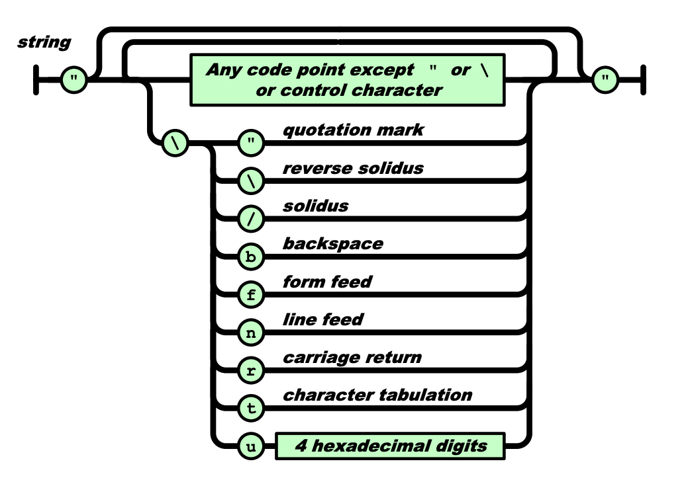

# JavaScript 中字符串字面量的计算

## 背景

在 JavaScript 中，字符串字面量是由单引号或双引号括起来的字符序列。单引号括起来的字符串字面量内可以包含双引号，但不能包含单引号；双引号括起来的字符串字面量内可以包含单引号，但不能包含双引号。

那么，如果我们想要在单引号括起来的字符串字面量内包含单引号，或者双引号括起来的字符串字面量内包含双引号，应该怎么做呢？

比如，我们想定义这样一个字符串，`' is a single quote, and " is a double quote.`，该字符串字面量无论是用单引号括起来还是用双引号括起来，都会有语法问题。

```js
const strA = "' is a single quote, and " is a double quote."
const strB = '' is a single quote, and " is a double quote.'
```

## 特殊字符及转义序列

针对像单引号和双引号这些特殊用途的字符，或者像换行符这种非打印字符，JavaScript 允许其在字符串字面量里通过以反斜线`\`开头的转义序列的形式来代表单个字符，比如`\'`代表单个字符`'`，`\n`代表换行符，且转义序列可以放在字符串字面量内的任意位置。

如下是一些常见的转义序列。

| 转义序列                 | 所表示的字符                                   |
| ------------------------ | ---------------------------------------------- |
| `\0`                     | 空字符（注意，不是空字符串，空字符的长度是 1） |
| `\'`                     | 单引号`'`                                      |
| `\"`                     | 双引号`"`                                      |
| `\\`                     | 反斜线`\`                                      |
| `\n`                     | 换行符                                         |
| `\r`                     | 回车符                                         |
| `\v`                     | 垂直制表符                                     |
| `\t`                     | 水平制表符                                     |
| `\b`                     | 退格符                                         |
| `\f`                     | 换页符                                         |
| `\xXX`                   | Latin-1 字符                                   |
| `\uXXXX`                 | Unicode 基本多文种平面里的字符                 |
| `\u{X}` ... `\u{XXXXXX}` | Unicode 所有 Code Point（实验性）              |

`\xXX`是指在`\x`后紧跟着两个十六进制数`XX`，代表一个字符，`XX`是字符的 Unicode 码位，取值范围是`00`~`FF`，因此能输出 256 种字符，即[Latin-1 字符](https://zh.wikipedia.org/wiki/ISO/IEC_8859-1)。

`\uXXXX`是指在`\u`后紧跟着四个十六进制数`XXXX`，代表一个字符，`XXXX`是字符的 Unicode 码位，取值范围`0000`~`FFFF`，能输出[Unicode 基本多文种平面](https://zh.wikipedia.org/wiki/Unicode%E5%AD%97%E7%AC%A6%E5%B9%B3%E9%9D%A2%E6%98%A0%E5%B0%84#%E5%9F%BA%E6%9C%AC%E5%A4%9A%E6%96%87%E7%A7%8D%E5%B9%B3%E9%9D%A2)里的字符。

因此，借助转义序列，我们可以如下这样声明之前的那个字符串:

```js
const str = '\' is a single quote, and \" is a double quote.'
```

## JavaScript 是如何计算字符串字面量的

如下是 ECMAScript 对字符串字面量的定义。

> A string literal is zero or more Unicode code points enclosed in single or double quotes. Unicode code points may also be represented by an escape sequence. All code points may appear literally in a string literal except for the closing quote code points, U+005C (REVERSE SOLIDUS), U+000D (CARRIAGE RETURN), and U+000A (LINE FEED). Any code points may appear in the form of an escape sequence. **String literals evaluate to ECMAScript String values.** When generating these String values Unicode code points are UTF-16 encoded as defined in 10.1.1. Code points belonging to the Basic Multilingual Plane are encoded as a single code unit element of the string. All other code points are encoded as two code unit elements of the string.

定义里说任何一个字符都可以以转义序列的形式存在于字符串字面量里，且字符串字面量会被计算成字符串类型的值。那么字符串字面量是如何计算成 JavaScript 字符串的呢？

JavaScript 引擎会对代码里定义的每一个字符串字面量进行计算，将字符串字面量里的转义序列转换成其所表示的字符，最终将字符串字面量计算为 JavaScript 字符串。

JavaScript 对字符串字面量里的每个字符的处理，主要分为以下几种情况。

第一种，非反斜杠`\`、单引号`'`（当字符串字面量用单引号括起来时）、双引号`"`（当字符串字面量用双引号括起来时）、行终止符的源字符，则该源字符将计算为其本身。

```js
> 'world'
< "world"
```

第二种，若字符前有反斜杠`\`，且`\`能与该字符（或者其后多个字符）能组合成上表里的转义序列，则将`\`和该字符串计算为其所表示的字符。

```js
> 'hello, \'world\''
< "hello, 'world'"

> '\x61bcd'
< "abcd"

> '\u4f60好'
< "你好"
```

以上的第一种和第二种是[ECMA 262 - String Literals](https://tc39.es/ecma262/#sec-literals-string-literals)规范里规定的，每个实现 ECMAScript 的 JavaScript 引擎都得按此实现。当然，如上两种情况只是我们日常能碰到的主要情况，实际上在计算字符串字面量时会有更多算法和细节，如有兴趣可查阅[ECMA 262 - String Literals](https://tc39.es/ecma262/#sec-literals-string-literals)规范。

但以下将要说明的第三种和第四种情况，规范里并没有规定如何处理，具体的处理方式还得看 JavaScript 引擎的实现。[从一个 JSON.parse 错误深入研究 JavaScript 的转义字符](https://zhuanlan.zhihu.com/p/31030352)这篇文章分析了 V8 源码，并给出了如下两种情况。

第三种，若字符前有反斜杠`\`，且`\`与该字符不能组合成上表里的转义序列，且该字符不是`u`或者`x`，则将`\`和该字符计算成该字符本身。

```js
> 'hello, \world'
< "hello, world"
```

第四种，若字符前有反斜杠`\`，且`\`与该字符（或其后多个字符）不能组合成上表里的转义序列，且该字符是`u`或者`x`，则会导致语法错误。

```js
> '\u'
× Uncaught SyntaxError: Invalid Unicode escape sequence

> '\u12'
× Uncaught SyntaxError: Invalid Unicode escape sequence

> '\x'
× Uncaught SyntaxError: Invalid hexadecimal escape sequence
```

## 哪些场景需要考虑字符串字面量的计算

理论上来说，但凡涉及到字符串字面量的地方，都需要考虑字符串字面量的计算。

字符串字面量，是定义在 JavaScript 代码里的字符串类型的固定值。因此只要是定义在 JavaScript 代码里的字符串字面量，都要经过 JavaScript 计算才能成为 JavaScript 字符串。

如下介绍几种要着重考虑字符串字面量计算的场景。

### 动态创建正则表达式

若我们知道正则表达式模式将会改变，或者我们事先不知道什么模式而是从另一个来源获取（比如用户输入、接口返回），通常我们会选择动态创建正则表达式，而`RegExp`构造函数允许传入一个字符串参数来创建一个正则对象。

假设我们给`RegExp`构造函数传入一个字符串字面量来生成一个正则对象，该正则对象用于判断当前页面域名是否是`windstone.cc`的三级域名。

```js
const host = location.host;

const regA = new RegExp('\w+\.windstone\.cc', 'i');
const regB = new RegExp('\\w+\\.windstone\\.cc', 'i')

// 当 host 为 blog.windstone.cc 时，
regA.test(host); // false
regB.test(host); // true

// 当 host 为 www-windstone-cc.windstone.com 时，
regA.test(host); // true
regB.test(host); // false
```

因为示例里`RegExp`的第一个参数是字符串字面量，需要经过计算才能得到字符串，所以：

- `regA`的正则对象等价于`/w+.windstone.cc/i`
- `regB`的正则对象等价于`/\w+\.windstone\.cc/i`

显然，`regB`才是满足要求的正则对象。因此，在使用字符串字面量生成期望的正则对象时，尤其要注意字符串字面量的计算。

PS: 常规情况下，尽量避免使用字符串字面量生成正则对象，而应该使用正则表达式字面量。

### eval

[eval()](https://developer.mozilla.org/zh-CN/docs/Web/JavaScript/Reference/Global_Objects/eval)函数会将传入的字符串参数当做 JavaScript 代码进行执行。

```js
const word = '\\u0077';
console.log(word) // \u0077

const str = 'console.log("' + word + '")';
console.log(str) // console.log("\u0077")

eval(str)
```

以上代码里，赋值给常量`word`的`'\\u0077'`，以及`'console.log("'`和`'")'`都是字符串字面量。`'\\u0077'`计算成字符串`\u0077`并赋值给常量`word`，经过`+`运算生成字符串`console.log("\u0077")`并赋给常量`str`。

此时传入`eval()`函数的字符串参数`console.log("\u0077")`成为了一段 JavaScript 代码，而其中的`"\u0077"`也就变成了字符串字面量，在`eval()`执行时会将其计算成`w`，因此最终要执行的代码等价于`console.log("w")`，所以最终打印出`w`。

BTW，类似于`eval()`，使用`Function`构造函数动态创建函数时，也要注意字符串字面量的计算。

### JSON.parse

`JSON.parse()`方法可以解析 JSON 文本来创建对应的 JavaScript 值。`JSON.parse()`方法的第一个参数是个字符串，表示将要被解析的 JSON 文本。

当这个字符串参数是由字符串字面量产生的时候，尤其需要注意字符串字面量的计算，防止产生无效的 JSON 文本，导致`JSON.parse()`解析失败。

```js
const a = '"\n"';
JSON.parse(a);
// Uncaught SyntaxError: Unexpected token
//   in JSON at position 1
//     at JSON.parse (<anonymous>)
//     at <anonymous>:2:6
```

字符串字面量`'"\n"'`经过计算之后变成字符串`"↵"`，其中`↵`代表的是单个换行符。

::: warning 重要提示
换行符是不可打印字符，此处的`↵`不是真正的换行符，只是换行符的占位示意，为了方便理解。真正的换行符的 Unicode 码位是`\u000A`，而`↵`的 Unicode 码位是`\u21B5`。因此不要在代码里使用`↵`作为换行符，这是有问题的。
:::

`"↵"`即为要解析的 JSON 文本。根据[Standard ECMA-404 The JSON Data Interchange Syntax](https://www.ecma-international.org/publications/standards/Ecma-404.htm)规范，JSON 文本的值可以是`object`、`array`、`number`、`string`、`true`、`false`、`null`。以下是 JSON `string`的定义。

> A string is a sequence of Unicode code points wrapped with quotation marks (U+0022). All code points may
be placed within the quotation marks except for the code points that must be escaped: quotation mark
(U+0022), reverse solidus (U+005C), and the control characters U+0000 to U+001F.



要解析的 JSON 文本`"↵"`是由两个双引号括起来的，从形式上看符合 JSON `string`的定义，而 JSON `string`经过`JSON.parse()`解析后会得到 JavaScript 字符串。

但是，我们的运行结果显示，无法对`"↵"`这个 JSON `string`解析，这是为什么呢？

问题出在换行符`↵`上。根据 JSON `string`的定义，当双引号`"`、反斜线`\`和控制字符出现在 JSON `string`里时必须要经过转义，而换行符`↵`恰恰是个未转义的控制字符，这导致`"↵"`不是有效的 JSON `string`，进而在`JSON.parse`时会报错。

```js
const a = '"\\n"';
const b = JSON.parse(a);
b.codePointAt(0).toString(16); // a
```

我们修改字符串字面量为`'"\\n"'`，其经过计算后变为要解析的字符串`"\n"`，此时该字符串内包含的是转义后的换行符，经过`JSON.parse()`后，会得到一个 JavaScript 字符串，该字符串包含单个字符，即换行符。（换行符的 Unicode 码位转为 16 进制的结果为`a`）

## 哪些场景不需要考虑 JavaScript 计算

只要字符串不是直接或者间接出现在 JavaScript 代码里的字符串字面量，就不需要进行计算。

### 表单项输入的字符串

表单项输入的字符串，已经是 JavaScript 字符串，不需要再进行计算。

```html
<!-- 在此输入框里输入: \u0077 -->
<input type="text" id="input">
```

```js
const input = document.getElementById('input');
console.log(input) // \u0077
```

### 接口返回的字符串

接口返回的字符串，也已经是 JavaScript 字符串，不需要再进行计算。

```js
fetch('http://windstone.cc/test')
  .then(res => res.text())
  .then(data => {
      console.log(typeof data);
      console.log('data', data)
  })
```

若接口返回的文本是`{"x":"\u0077"}`，则打印结果为：

```js
string
{"x":"\u0077"}
```

### 行继续符

> 有时，你的代码可能含有很长的字符串。你可能想将这样的字符串写成多行，而不是让这一行无限延长或者被编辑器折叠。有两种方法可以做到这一点。
>
> 其一，可以使用 + 运算符将多个字符串连接起来，如下所示：
>
> ```js
> let longString = "This is a very long string which needs " +
>                 "to wrap across multiple lines because " +
>                 "otherwise my code is unreadable.";
> ```
>
> 其二，可以在每行末尾使用反斜杠字符（“\”），以指示字符串将在下一行继续。确保反斜杠后面没有空格或任何除换行符之外的字符或缩进; 否则反斜杠将不会工作。 如下所示：
>
> ```js
> let longString = "This is a very long string which needs \
> to wrap across multiple lines because \
> otherwise my code is unreadable.";

以上是 MDN 里关于[长字符串](https://developer.mozilla.org/zh-CN/docs/Web/JavaScript/Reference/Global_Objects/String#%E9%95%BF%E5%AD%97%E7%AC%A6%E4%B8%B2)的描述，而我们标题里所说的行继续符，就出现在第二种方法的字符串里。

ECMA 262 规范里对[行继续符](https://tc39.es/ecma262/#prod-LineContinuation)的定义是：

```txt
LineContinuation ::
    \ LineTerminatorSequence
```

这表示行继续符是由`\`与其后的`行终止符序列`构成，而`行终止符序列`的定义是：

```txt
LineTerminatorSequence ::
    <LF>
    <CR> [lookahead ≠ <LF>]
    <LS>
    <PS>
    <CR><LF>
```

其中，

- `<LF>`: 换行符，Unicode 码位是`\u000A`，Unix 系统里的行尾结束符
- `<CR>`: 回车符，Unicode 码位是`\u000D`
- `<LS>`: 行分隔符，Unicode 码位是`\u2028`
- `<PS>`: 段分隔符，Unicode 码位是`\u2029`
- `<CR><LF>`: 回车符与换行符的组合，Windows 系统里的行尾结束符

即以上五种都是行终止符序列。

这就是说，在字符串字面量里，`\`与其后的`行终止符序列`表示行继续符。而更为奇妙的是，行继续符是零长度的。

证明行继续符是零长度的最简单的验证方式：在控制台敲入一个字符串，字符串第一个字符是个`\`，然后敲个回车，获取该字符串的长度。

```js
> "\
  ".length
< 0
```

因为换行符或回车符是不可打印字符，上面示例里只看到`".length`是在下一行输入的，但看不出`\`之后到底是什么字符。

因此，我们尝试构造一个“可见”的换行符，让它与反斜线`\`结合成行继续符，并打印出行继续符的长度。

```js
const lineFeed = JSON.parse('"\\n"');                // ↵
const reverseSolidus  = '\\';                        // \
const lineContinuation = reverseSolidus + lineFeed;  // \↵

const stringLiteral = `console.log("${lineContinuation}".length)`; // console.log("\↵".length)
eval(stringLiteral) // 0
```

先通过`JSON.parse()`得到字符串`↵`，这是个仅包含单个换行符的字符串；再拼接`\`得到字符串`\↵`，最后通过`eval()`函数，将字符串`console.log("\↵".length)`当做 JavaScript 代码运行，此时字符串字面量`"\↵"`就会计算为行继续符，打印出行继续符的`length`为`0`。

由此可见，行继续符的长度是`0`，因此当行继续符加在字符串字面量里连接多行字符串时，字符串的长度不会因为行继续符的存在而变长。

### 参考文档

- [从一个 JSON.parse 错误深入研究 JavaScript 的转义字符](https://zhuanlan.zhihu.com/p/31030352)
- [从 RegExp 构造器看 JS 字符串转义设计](https://cloud.tencent.com/developer/article/1186832)
- [ECMA 262 - JSON.stringify - QuoteJSONString](https://tc39.es/ecma262/#sec-quotejsonstring)
- [ECMA 262 - JSON.parse](https://tc39.es/ecma262/#sec-json.parse)
- [ECMA 262 - LineContinuation](https://tc39.es/ecma262/#prod-LineContinuation)
- [Standard ECMA-404 The JSON Data Interchange Syntax](https://www.ecma-international.org/publications/standards/Ecma-404.htm)
- [ECMA 262 - String Literals](https://tc39.es/ecma262/#sec-literals-string-literals)
