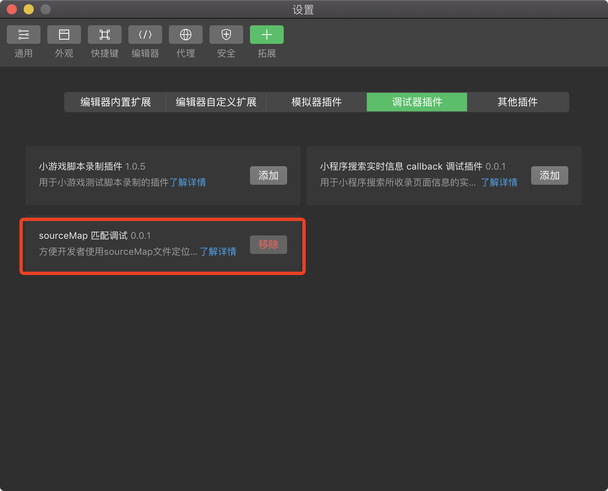
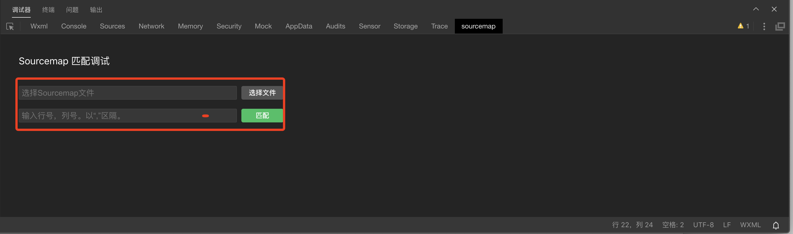
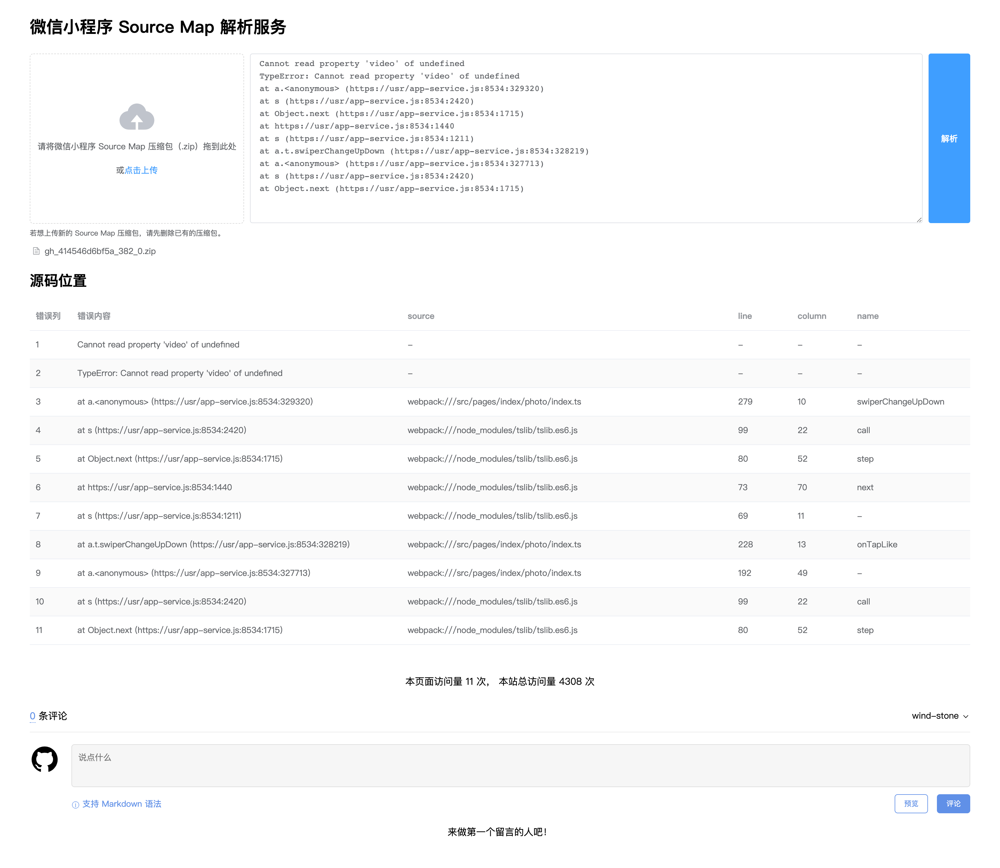

# 微信小程序 Source Map 的使用及一键解析

[[toc]]

## 背景介绍

在微信小程序后台的错误日志里或项目自己收集的错误日志里，经常会出现一些如下格式的错误堆栈信息:

```js
Cannot read property 'video' of undefined
TypeError: Cannot read property 'video' of undefined
at a.<anonymous> (https://usr/app-service.js:8534:329320)
at s (https://usr/app-service.js:8534:2420)
at Object.next (https://usr/app-service.js:8534:1715)
at https://usr/app-service.js:8534:1440
at s (https://usr/app-service.js:8534:1211)
at a.t.swiperChangeUpDown (https://usr/app-service.js:8534:328219)
at a.<anonymous> (https://usr/app-service.js:8534:327713)
at s (https://usr/app-service.js:8534:2420)
at Object.next (https://usr/app-service.js:8534:1715)
```

以错误堆栈信息里的第 3 行为例，其显示错误发生在`app-service.js`文件的`8543`行`329320`列，但在我们的微信小程序的产出里并不存在类似的`app-service.js`文件。

实际上，在微信开发者工具或 CI 工具上传小程序项目时，会将项目里的`app.js`、各个页面的`js`文件等所有的 JS 文件编译并打包成一个 JS 文件（每个分包会单独打包成一个 JS 文件），这个文件就是`app-service.js`。

尽管有打包后的 JS 文件的报错位置，但想要定位到微信小程序源码里哪里报错，却依然比较困难。

## Source Map

微信小程序为了开发者能够根据打包后的 JS 错误位置定位到源码里的错误位置，提供了 Source Map 支持。在开发者工具里若是开启了“ES6 转 ES5”（或“代码压缩”、“增强编译”），在上传代码时会生成[Source Map](https://developers.weixin.qq.com/miniprogram/dev/devtools/debug.html#source-map)文件，方便定位错误位置。

小程序后台获取的 Source Map 压缩包解压后的结构如下：

```txt
├── __APP__
│   └── app-service.map.map
├── __FULL__
│   └── app-service.map.map
├── sub-package-A
│   └── app-service.map.map
├── sub-package-B
│   └── app-service.map.map
└── ...
    └── app-service.map.map
```

其中：

- `__APP__/app-service.map.map`是小程序主包的 Source Map 文件
- `__FULL__/app-service.map.map`是小程序主包 + 分包合并在一起的 Source Map 文件
- 其他的是各个分包单独的 Source Map 文件，比如`sub-package-A/app-service.map.map`是`sub-package-A`分包的 Source Map 文件

获取到 Source Map 文件并按照[官方的 Source Map 使用方法](https://developers.weixin.qq.com/community/develop/article/doc/0008643aa54ce81d519ad84735b413)编写代码进行解析后，可以将`app-service.js`里的错误位置还原到上传之前的小程序代码。

然而，我第一次获得的小程序源码位置仍然不是我实际开发时的文件位置。对比解析得到的文件名称发现，我们是使用了小程序第三方开发框架`uni-app`并使用`Vue.js`来开发微信小程序的，而`uni-app`在生产环境打包时会将`Vue.js`开发的源码编译为经过压缩混淆的小程序代码，因此我们通过 Source Map 解析出的源码位置其实是`uni-app`编译产出的小程序代码的位置，而不是使用`Vue.js`编写的源码位置。

幸运的是，微信小程序针对这种“使用外部的编译脚本对源文件进行处理”的情况，也提供了解决方案，只需我们将第三方开发框架的源码在编译为小程序代码时生成的 Source Map 文件放置在小程序代码文件的相同目录下，开发者工具会读取、解析 Source Map 文件，并基于该 Source Map 文件在打包上传时生成最终的 Source Map 文件。

使用小程序第三方开发框架编译后产出的小程序代码目录：

```txt
├── pages
|   ├── index.js
|   ├── index.json
|   ├── index.wxml
|   ├── index.wxss
|   └── index.js.map
├── app.js
├── app.js.map
```

经过这样的方式产生的 Source Map 文件，就能将`app-service.js`里的错误位置映射到第三方开发框架的源码位置上。以下我将简单地描述如何配置项目来生成 Source Map 文件。

### 生成 Source Map

对于未使用小程序第三方框架而是采用原生的微信小程序语法开发的项目来说，只需要在`project.config.json`里配置开启“ES6 转 ES5”（或“代码压缩”、“增强编译”），这样在上传体验版时就会生成 Source Map 文件。

`project.config.json`里相关配置如下：

```json
{
  "description": "小程序项目配置文件",
  "setting": {
    // 以下三个配置，至少开启一项，上传代码时才能生成 Source Map
    "es6": true, // 是否启用 ES6 转 ES5
    "minified": true, // 上传代码时是否自动压缩
    "enhance": true, // 是否打开增强编译
    // ...
  }
}
```

针对使用了小程序第三方框架的项目，除了以上的`project.config.json`配置，还要配置第三方框架在生产环境打包时生成初始的 Source Map 文件。

以`uni-app`开发的项目来说，配置 Webpack 在生产环境打包时生成 Source Map 文件，并将该 Source Map 文件放置在与原先的 JS 文件同一目录下。

```js
// vue.config.js
module.exports = {
    // ...
    configureWebpack: config => {
        if (process.env.NODE_ENV === 'production') {
            config.devtool = 'source-map';
            config.output.sourceMapFilename = '../' + process.env.UNI_PLATFORM + '/[name].js.map'
        }
    },
    // ...
}
```

### 获取 Source Map

目前有很多种方式获取 Source Map 文件：

- 若是通过微信开发者工具上传小程序代码，在上传完成后可以下载 Source Map 压缩包
- 若是通过[CI 工具](https://developers.weixin.qq.com/miniprogram/dev/devtools/ci.html)上传，可以在上传完成后调用`ci.getDevSourceMap`方法获取 Source Map 压缩包
- 此外，针对线上版小程序，可在“[微信小程序后台](https://mp.weixin.qq.com/) --> 开发管理 --> 错误日志 --> 错误内容”里下载

### 解析 Source Map

目前微信小程序官方主要提供了两种解析 Source Map 的方式。

方式一：自行编写代码进行解析。

```js
import fs = require('fs')
import { SourceMapConsumer } from 'source-map'


async function originalPositionFor(line, column) {
  const sourceMapFilePath = 'Source Map 文件在硬盘里的位置'
  const sourceMapConsumer = await new SourceMapConsumer(JSON.parse(fs.readFileSync(sourceMapFilePath, 'utf8')))

  return  sourceMapConsumer.originalPositionFor({
      line,
      column,
   })
}

originalPositionFor(出错的行，出错的列)
```

方式二：下载最新版的开发者工具，使用“菜单-设置-拓展设置-调试器插件”，添加“sourceMap 匹配调试”插件。




## 一键解析

官方提供的两种解析 Source Map 的方式，每次只能解析单个 Source Map 文件，每次解析过程为：

1. 获取错误堆栈每一行报错信息的文件名称及行列号
2. 自行判断需要使用主包或是哪个分包的 Source Map 文件
3. 手动上传选定的 Source Map 文件，输入行列号，进行解析

这个过程在常规的错误堆栈日志都多达十来行的的情况下（正如文章开头所展示的），解析起来将会极其低效。

为了解决这个问题，我开发了一键解析 Source Map 的服务，可以一次性将错误堆栈里的所有报错信息全都解析出来。我们只需将整个 Source Map 压缩包上传，输入完整的错误堆栈日志，即可一键解析。

服务地址：[微信小程序 Source Map 一键解析服务](https://blog.windstone.cc/tools/wechat-mini-program-sourcemap)



### 常见问题说明

经常会有这样、那样的原因导致错误无法解析到源码上，比如:

- 问题一: 解压下载的 Source Map 压缩包，打开其中任意一个 Source Map 文件，文件中的`mappings`字段里全是分号`;`。

这个问题是最普遍的，其原因是在上传小程序项目时，没有开启“ES6 转 ES5”/“代码压缩”/“增强编译”，导致没有生成 Source Map，这也是下载的 Source Map 文件里的`mappings`字段里全是`;`的原因。解决方法是，“ES6 转 ES5”/“代码压缩”/“增强编译”这三个选项至少要开启一个，上传代码时才能生成 Source Map。

- 问题二：`WAServiceMainContext.js`、`WASubContext.js`等文件里的错误无法解析出来。

`WAServiceMainContext.js`、`WASubContext.js`等文件都是微信小程序基础库里的文件，无法解析出来是正常的。Source Map 是我们小程序的业务代码在上传时生成的，自然只能解析出业务代码（`app-service.js`）产生的错误。当然，有时候基础库文件产生的错误，可能也是我们业务代码导致的，我们可以先解析 Source Map 定位到业务代码的错误位置，进而确定是什么原因导致的基础库文件报错。

## 总结

微信小程序 Source Map 的使用对我们追查小程序线上报错起到了极其重要的作用，而 Source Map 一键解析服务则极大地提升了解析效率。目前 Source Map 一键解析服务仍处于逐步完善状态，非常欢迎大家试用。如有更好的优化建议或者遇到使用问题，欢迎在服务页面留言！

## 参考文档

- [官方文档 - 小程序调试 - Source Map](https://developers.weixin.qq.com/miniprogram/dev/devtools/debug.html#Source%20Map)
- [官方文档 - 微信开发者工具下载的 sourcemaps 怎么用](https://developers.weixin.qq.com/community/develop/article/doc/0008643aa54ce81d519ad84735b413)
