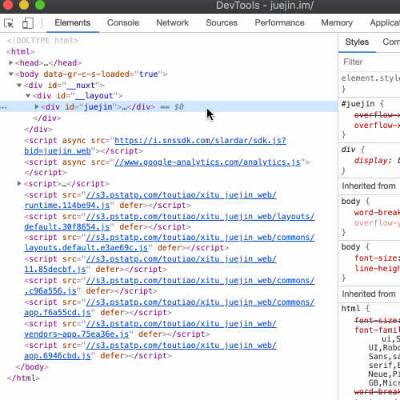
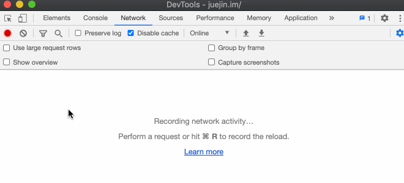
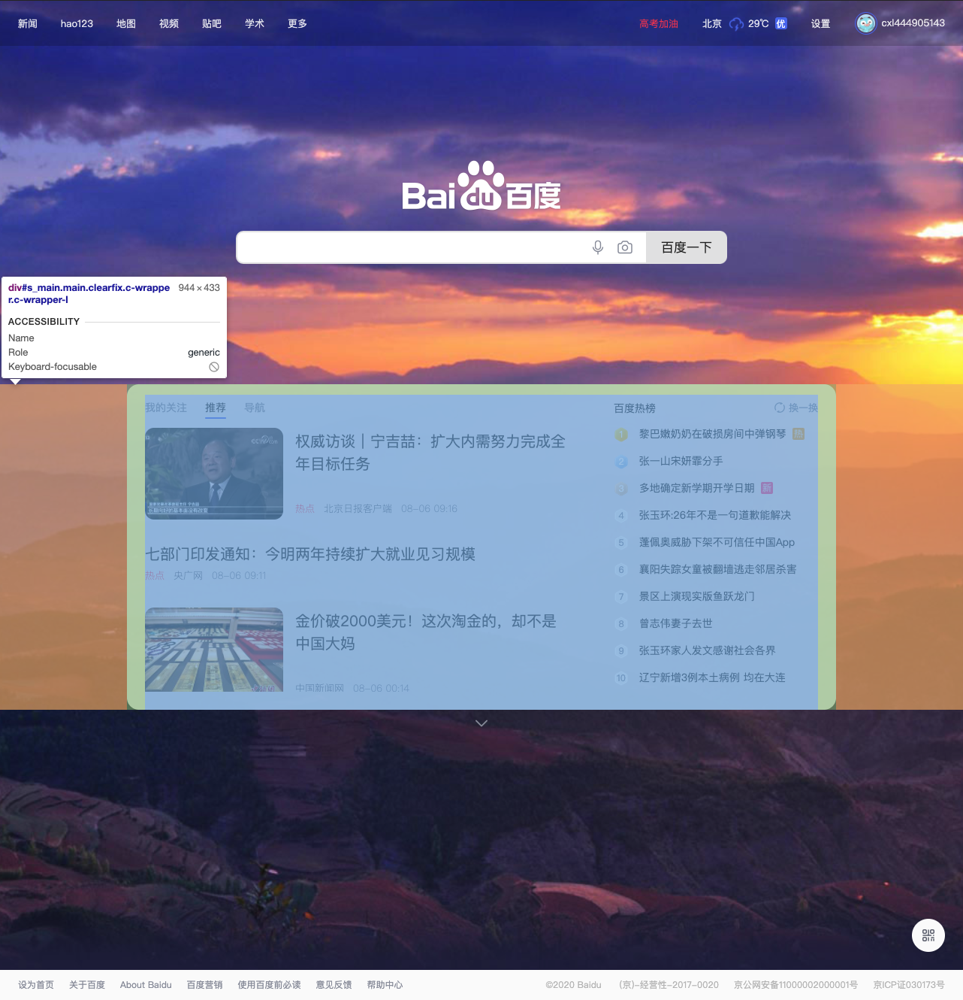
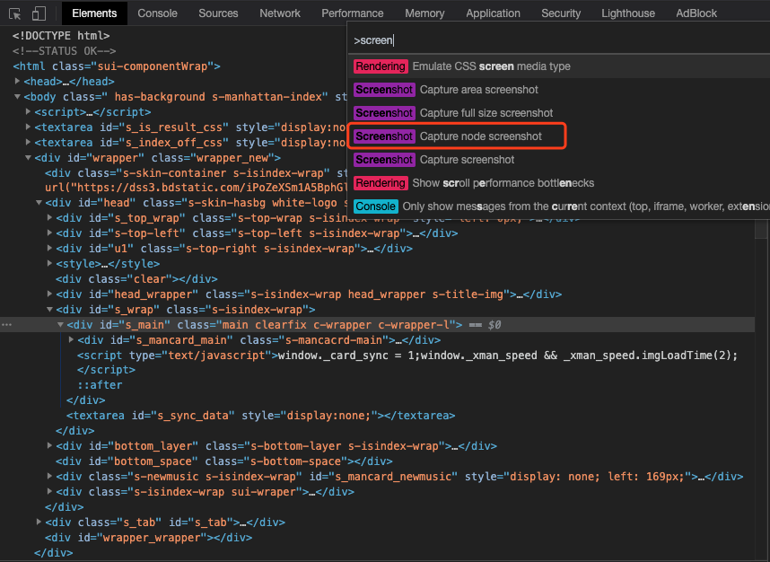

# DevTools

[[toc]]

## Eelements

### 展开所有的子节点

在进行 DOM 节点元素调试的时候，我们需要对每个节点进行展开查看，如果只是逐个点击目标元素下面的子元素展开，耗费时间。可以尝试下面的快捷操作。

```txt
控制面板 => Elements => 按 option + 点击要展开的元素图标
```



## Network

### 查询进行中的请求

网页请求服务器，有时候发起的请求太多，我们想知道哪些请求返回阻塞了。我们可以对请求的网络进行过滤，来定位问题。

```txt
控制面板 => Network => filter图标 => is:running => 刷新监控的页面
```



## 功能

### 命令菜单

按`Cmd + Shift + P`（如果使用 Windows，则按`Ctrl + Shift + P`）打开**命令**菜单。通过命令菜单，可以快捷完成各种操作。


### 截图

若你只是想对一个单独的 DOM 进行截图时，使用别的工具可能比较费时费力，而且多次截图的尺寸和位置也没办法保持完全一致。

现在，你可以先选中那个 DOM 节点，打开命令菜单并使用`Capture node screenshot`即可针对单个 DOM 节点进行截图。

选中 DOM 元素：



打开命令菜单并使用`Capture node screenshot`进行截图：



截图结果：


除此之外，使用`Capture screenshot`可以对页面可视区域截图。使用`Capture full size screenshot`还可以全屏截图，不止是页面可视区域，还包含滚动条在内的所有页面内容。


### 待补充

https://mp.weixin.qq.com/s/5VPjY-IN8RyERMyCwqSGlQ

## 参考文档

- [开发调试的九个技巧【谷歌浏览器】](https://juejin.cn/post/6881439870380834830)
- [Chrome DevTools中的这些骚操作，你都知道吗？](https://mp.weixin.qq.com/s/5VPjY-IN8RyERMyCwqSGlQ)
