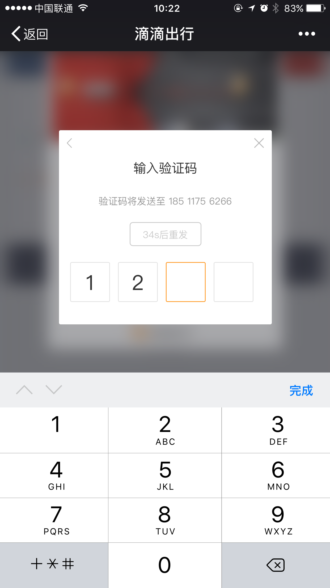

# 非视口内 input 输入延迟

[[toc]]

## 问题描述

UIWebView 环境下，如果 input 标签不在视口范围内，当该 input 聚焦 focus 的时候，输入将会产生延迟，更严重的会导致页面卡死。

- 结论：UIWebView 的 bug（也有可能是 feature）
- 复现：使用 iOS 系统，打开一款 APP 如支付宝、淘宝等，扫码打开测试页面
- 解决方案
  - 方案一：（不推荐使用）将 input 放在视口范围内，并设置 transform: scale(0)，但是低版本 iOS 下，键盘不能将输入区域顶起
  - 方案二：（推荐）给输入框的父级的父级或其祖先元素添加 fixed 定位

## 问题产生



```html
<div class="input-wrapper">
  <div class="hidden-input-ctn">
    <input class="hidden-input" type="tel" maxLength="4">
  </div>
  <div class="displayed-input-ctn">
    <span class="square"></span>
    <span class="square"></span>
    <span class="square"></span>
    <span class="square"></span>
  </div>
</div>
```

```css
<style>
  .input-wrapper {
    position: relative;
    width: 230px;
    margin: 200px auto;
  }
  .displayed-input-ctn {
    font-size: 0
  }
  .displayed-input-ctn > .square {
    display: inline-block;
    width: 48px;
    height: 48px;
    margin-right: 10px;
    border: 1px solid #e5e5e5;
    border-radius: 2px;
    font-size: 30px;
    line-height: 50px;
    vertical-align: middle;
    color: red;
    text-align: center;
  }
  .displayed-input-ctn > .square:last-child {
    margin-right: 0
  }
  .hidden-input-ctn {
    position: absolute;
    width: 100%;
    height: 100%;
  }
  .hidden-input-ctn > .hidden-input {
    position: relative;
    top: 0px;
    /* 问题就处在 left 这里，这样导致 input 不在视口范围内 */
    left: -1000px;
  }
</style>
```

```js
<script>
  var inputWrapper = document.querySelector('.input-wrapper')
  var hiddenInput = document.querySelector('.hidden-input')
  var squares = document.querySelectorAll('.displayed-input-ctn .square')
  var squaresLen = squares.length

  inputWrapper.addEventListener('click', function () {
    hiddenInput.focus()
  }, false)
  hiddenInput.addEventListener('input', function () {
    var value = this.value
    for (var i = 0; i < squaresLen; i++) {
      squares[i].textContent = value[i] || ''
    }
  }, false)
</script>
```

滴滴的密码/图形验证码采取的是如下图所示的输入框，采取四个方框来替代传统的 input 输入框，其实现逻辑大概是上面这样的。（请忽略方框高亮，demo 里没有实现）

```css
.hidden-input-ctn > .hidden-input {
  position: relative;
  top: 0px;
  /* 问题就处在 left 这里，这样导致 input 不在视口范围内 */
  left: -1000px;
}
```

请重点关注 css 里最后一条规则，这里 left 的声明导致 input 元素跑到视口范围之外，导致用户无法直接见到且无法感知到 input 的存在，此时，如果让 input 元素 focus 并进行输入，在 UIWebView 里将产生严重的延迟，十分影响用户体验。

（纯属）猜测：可能是 webview 的实现策略，简言之就是故意这么做的，而原因可能是"input 在视口内，可以让用户看到自己亲手输入，防止产生安全问题"，而 input 在视口外时，故意产生输入延迟，以警示用户。

## 解决方案

### （不推荐）方案一：scale(0)

如何解决呢？

只有一个思路：只能将 input 放在视口内，且让用户感知不到 input 的存在。

input 放在视口内好办，但是让用户感知不到 input 的存在，这一点有些困难。
我们尝试了各种方法，都不能解决这个问题，这些方法不能解决的原因分为这几类：

1. input 聚焦 focus 时不能弹出键盘
    - 设置 input 或者其父元素 的可见性为 visibility: hidden;
    - 设置 input 的 height: 0
2. input 有光标出现
    - 设置 input 及其父元素为 z-index: -999
    - 设置 position: absolute 且设置 clip （裁剪）属性
    - 设置 opacity: 0
3. input 无法获取焦点
    - input 的 type="hidden"

目前（已知）只有一个方法解决：

```css
.hidden-input-ctn > .hidden-input {
  /* 完美解决不能弹出键盘和光标问题 */
  transform: scale(0)
}
```

### （推荐）方案二：输入框祖先元素 fixed 定位

经过与滴滴 webapp 登录 sdk 实现对比发现，如果在 input 祖先元素（不包括父级元素）添加 fixed 定位，可将 input 定位到视口范围之外而不引起输入延迟的问题。

```css
.input-wrapper {
  /* 关键解决代码 */
  position: fixed;
  left: 0;
  right: 0;
  width: 230px;
  margin-top: 200px
}
.displayed-input-ctn {
  font-size: 0
}
.displayed-input-ctn > .square {
  display: inline-block;
  width: 48px;
  height: 48px;
  margin-right: 10px;
  border: 1px solid #e5e5e5;
  border-radius: 2px;
  font-size: 30px;
  line-height: 50px;
  vertical-align: middle;
  color: red;
  text-align: center;
}
.displayed-input-ctn > .square:last-child {
  margin-right: 0
}
.hidden-input-ctn {
  position: absolute;
  width: 100%;
  height: 100%;
}
.hidden-input-ctn > .hidden-input {
  position: relative;
  top: 0px;
  left: -1000px;
}
```

如上代码所示，fixed 定位加在 input-wrapper 元素上，还可以加在 input-wrapper 元素的祖先元素上，但是不能加在 hidden-input-ctn 和 hidden-input 元素上。

## html 示例

<<< @/docs/browser-env/compatibility/input-delay/input-hidden.html
