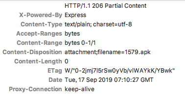

# 微信 - Android 微信里自动调起系统浏览器访问页面

[[toc]]

正常情况下，在微信里是无法自动调起系统浏览器访问页面的，但是通过如下所描述的 hack 方式，可以在 Android 微信里自动打开浏览器访问页面。

具体步骤为：

1. 在微信里访问页面地址，比如`http://windstone.cc/weixin/auto-launch-browser`。
2. 后端或 Nginx 层判断是否是在 Android 微信里访问的，若是则返回如下的核心`response header`；否则正常返回页面内容。
3. Android 微信接收到上面的`response header`，会自动调起系统浏览器，并在系统浏览器里再次访问页面地址`http://windstone.cc/weixin/auto-launch-browser`，此时后端或 Nginx 层判断出不是在 Android 微信里，则正常返回内容。



```txt
HTTP/1.1 206 Partial Content
X-Powered-By: Express
Content-Type: text/plain; charset=utf-8
Accept-Ranges: bytes
Content-Range: bytes 0-1/1
Content-Disposition: attachment;filename=1579.apk
Content-Length: 0
ETag: W/"0-2jmj7l5rSw0yVb/vlWAYkK/YBwk"
Date: Tue, 17 Sep 2019 07:32:12 GMT
Proxy-Connection: keep-alive
```

核心`response header`代码片段

这个实现需要后端配合，或者在 Nginx 层里进行处理，要是想简单测试，可以通过 Charles 里的 Breakpoints 设置断点，在页面响应里将`response header`修改为上述`response header`，即可验证。

## 进一步优化

在上述的实现里，微信在拉起系统浏览器后，会显示一个白屏的页面，用户需要手动关闭这个页面，体验不好。

可以如下优化：

1. 在微信里访问页面地址，比如`http://windstone.cc/weixin/auto-launch-browser`。
2. 后端或 Nginx 层正常返回页面内容，页面返回后正常执行、渲染。
3. 页面渲染完成后，判断页面所在环境，若是在 Android 微信里，则通过`window.location.href = 'http://windstone.cc/weixin/auto-launch-browser-api'`请求后端接口，接口判断是在 Android 微信里后，返回上述的核心`response header`；此时，微信里打开的页面正常显示。
4. Android 微信接收到上面的`response header`，会自动调起系统浏览器，并在系统浏览器里再次访问页面地址`http://windstone.cc/weixin/auto-launch-browser-api`，此时后端或 Nginx 层判断出不是在 Android 微信里，则通过 302 重定向到`http://windstone.cc/weixin/auto-launch-browser`。

此方案还可以通过后端接口控制是否要调起浏览器，防止微信修复了该漏洞后出问题。

## 核心 response header 的解释

```txt
HTTP/1.1 206 Partial Content
X-Powered-By: Express
Content-Type: text/plain; charset=utf-8
Accept-Ranges: bytes
Content-Range: bytes 0-1/1
Content-Disposition: attachment;filename=1579.apk
Content-Length: 0
ETag: W/"0-2jmj7l5rSw0yVb/vlWAYkK/YBwk"
Date: Tue, 17 Sep 2019 07:32:12 GMT
Proxy-Connection: keep-alive
```

- `206 Partial Content`: 该成功状态响应代码表示请求已成功，并且主体包含所请求的数据区间，该数据区间是在请求的 Range 首部指定的。详见[MDN - 206 Partial Content](https://developer.mozilla.org/zh-CN/docs/Web/HTTP/Status/206)
- `X-Powered-By: Express`: `X-Powered-By`是通用的非标准 HTTP 响应`header`（一般以`X-`作为前缀的`header`都是非标准的）。通常以特殊脚本技术默认包含在响应结构里。需要注意的是，这个头部可以被服务器禁用或修改。有些服务器选择不包含这个头部，甚至提供误导的信息以摆脱黑客，引导其转向一个特殊的技术/版本。因此，这个头部的信息时不足以为信的。更多详细信息，请参考[Stack Overflow - What does “x-powered by” mean?](https://stackoverflow.com/questions/33580671/what-does-x-powered-by-mean)。
- `Accept-Ranges: bytes`: 表示服务器支持`Range`请求，且支持的单位是`bytes`，也就意味着支持断点续传，可以并行多`range`进行下载。若是响应的是`Accept-Ranges: none`则表示不支持`Range`请求。
- `Content-Range: bytes 0-1/1`: 表示响应的`Range`单位、第一个比特的位置、最后一个比特的位置和资源的总长度。此例里，`Range`单位是`bytes`，第一个比特的位置是`0`，最后一个比特的位置是`1`，资源的总长度是`1`。
- `Content-Disposition: attachment;filename=1579.apk`: 在常规的 HTTP 应答中，`Content-Disposition`消息头指示回复的内容该以何种形式展示，是以内联的形式（即网页或者页面的一部分），还是以附件的形式下载并保存到本地。在 HTTP 场景中，第一个参数或者是`inline`（默认值，表示回复中的消息体会以页面的一部分或者整个页面的形式展示），或者是`attachment`（意味着消息体应该被下载到本地；大多数浏览器会呈现一个“保存为”的对话框，将`filename`的值预填为下载后的文件名，假如它存在的话）。更多详细信息，请参考[MDN - Content-Disposition](https://developer.mozilla.org/zh-CN/docs/Web/HTTP/Headers/Content-Disposition)
- `ETag: W/"0-2jmj7l5rSw0yVb/vlWAYkK/YBwk"`: 参考了其他几个第三方跳转服务的`response header`，其`ETag`的值也是`W/"0-2jmj7l5rSw0yVb/vlWAYkK/YBwk"`这个固定值。

因此，以上`response header`里，最核心的代码应该是`Content-Disposition: attachment;filename=1579.apk`。

## 参考

- [微信跳转外部浏览器打开指定链接源码](https://blog.csdn.net/qq_35445306/article/details/92461209)
- [第三方跳转服务 - Augpush](http://www.augpush.cn/)
- [第三方跳转服务 - 月牙跳转](http://www.aizhuanlove.cn/)
- [第三方跳转服务 - 忆天网络](http://www.aerae.cn/)
