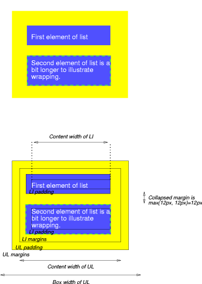

# 8 盒模型

CSS 盒模型描述了为文档树里的元素生成的矩形盒子，这些盒子会根据[视觉格式化模型](../9-visual-formatting-model/)来布局。

## 8.1 盒尺寸

每一个盒子都有一个内容区域（`content area`，简称内容区，比如文本、图片），且周围有可选的内边距（`padding`）、边框（`border`）、外边距（`margin`）区域。每一块区域的尺寸由以下定义的属性指定。下方的示意图表展示了这些区域是如何关联的，以及与`margin`、`border`、`padding`相关的术语。


示意图注释: 该图说明了所生成的 CSS 盒子的四个区域: 内容区域、内边距区域、边框区域和外边距区域。这里有四个嵌套的盒子，内容区域处于最里面，向外依次是内边距区域、边框区域和外边距区域。每一个区域都有一个不同的边框样式来区分其边界: 内容边界是细实线，内边距边界是细虚线，边框边界是是粗实线，外边距边界是粗虚线。盒子的顶部，列出了这四个边界所使用的边框样式。

`margin`、`border`、`padding`都可以分为上下左右四个部分（比如图表里的`LM`代表`left margin`，`RP`代表`right padding`，`TB`代表`top border`，等等）。

这四个区域（`content`，`padding`，`border`，`margin`）的边缘称为“边界”，因此每一个盒子都四个边界:

- 内容边界（`content edge`）或内边界(`inner edge`)
  - 内容边界围绕着由盒子的`width`和`height`确定的矩形，而这个矩形取决于元素的[渲染内容](https://www.w3.org/TR/CSS22/conform.html#rendered-content)。这四条内容边界定义了盒子的内容盒（`content box`）。
- 内边距边界（`padding edge`）
  - 内边距边界围绕着盒子的内边距。若内边距的宽度为`0`，则内边距边界就与内容边界相同。这四条内边距边界定义了盒子的内边距盒（`padding box`）。
- 边框边界（`border edge`）
  - 边框边界围绕着盒子的边框。若是边框的宽度为`0`，边框边界就与内边距边界相同。这四条边框边界定义了盒子的边框盒（`border box`）。
- 外边距边界（`margin edge`）或外边界（`outer edge`）
  - 外边距边界围绕着盒子的外边距。若是外边距的宽度为`0`，外边距边界就与边框边界相同。这四条外边距边界定义了盒子的外边距盒（`margin box`）

每一条边界都分为上下左右四个边界。

盒子内容区域的尺寸，即内容宽度和内容高度，取决于多个因素:

- 元素生成的盒子是否有`width`或`height`属性设置
- 盒子是否包含了文本或其他盒子
- 盒子是否是表格
- ...

盒子的宽度和高度将在[视觉格式化模型细节](https://www.w3.org/TR/CSS22/visudet.html)这一章节讨论。

盒子的内容区域、内边距区域以及边框区域的背景样式，由元素的`background`属性指定。外边距的背景总是透明的。

8.2 外边距/内边距/边框示例

这个示例说明了外边距、内边距和边框是如何相互作用的。

```html
<!DOCTYPE HTML PUBLIC "-//W3C//DTD HTML 4.01//EN">
<HTML>
  <HEAD>
    <TITLE>Examples of margins, padding, and borders</TITLE>
    <STYLE type="text/css">
      UL {
        background: yellow;
        margin: 12px 12px 12px 12px;
        padding: 3px 3px 3px 3px;
                                     /* No borders set */
      }
      LI {
        color: white;                /* text color is white */
        background: blue;            /* Content, padding will be blue */
        margin: 12px 12px 12px 12px;
        padding: 12px 0px 12px 12px; /* Note 0px padding right */
        list-style: none             /* no glyphs before a list item */
                                     /* No borders set */
      }
      LI.withborder {
        border-style: dashed;
        border-width: medium;        /* sets border width on all sides */
        border-color: lime;
      }
    </STYLE>
  </HEAD>
  <BODY>
    <UL>
      <LI>First element of list
      <LI class="withborder">Second element of list is
           a bit longer to illustrate wrapping.
    </UL>
  </BODY>
</HTML>
```

文档树里有一个 UL 元素，UL 元素里有两个 LI 元素。

下方的第一个图说明了这个示例的产生的结果。第二个图说明了 UL 元素及其 LI 子元素的`margin`、`border`、`padding`之间的关系。（图片没有缩放）



示意图注释: 该图说明了由 UL 列表和两个 LI 列表项生成的盒子。上方的图展示了列表元素生成的盒子的实际渲染结果。背景颜色和边框样式是不同的，以划定盒子的区域。下方的图展示了相同的渲染结果，但是每一个盒子的内容边界、内边距边界、边框边界和外边距边界都明确的标示了出来。此外，该图还展示了 LI 盒子建的垂直外边距是如何折叠的。

注意:

- 每一个 LI 盒子的内容宽度（`content width`）是自上而下计算的；每一个 LI 盒子的包含块是由 UI 元素创建的。
- 每一个 LI 盒子的外边距盒的高度取决于内容高度 + 上下内边距 + 上下边框 + 上下内边距。注意，LI 盒子之间的垂直外边距会折叠。
- LI 盒子的右内边距通过`padding`属性的第二个值设置为`0`，其效果在下方的图里显而易见。
- LI 盒子的外边距是透明的，而外边距总是透明的，因此 UL 的内边距和内容区域的黄色背景透过外边距显示了出来。
- 第二个 LI 元素通过`border-style`属性指定了一个虚线边框。

## 8.3 外边距属性

外边距属性指定了盒子的外边距区域的宽度。`margin`缩写属性设置了所有四边的外边距且每个值仅会设置到相应的边。这些属性可以应用到所有元素，但是垂直外边距将不能在非替换行内元素上起到任何效果。

该章节里定义的属性是指`<margin-width>`的值的类型，可取以下的值:

- `<length>`
  - 指定一个固定的值。
- `<percentage>`
  - 百分比是相对于盒子的包含块的宽度来计算的（注意，这也适用于`margin-top`和`margin-bottom`）。针对包含块的宽度取决于该元素的情况，CSS 2.2 里没有定义。
- `auto`
  - `auto`的行为可参见[计算宽度和外边距](https://www.w3.org/TR/CSS22/visudet.html#Computing_widths_and_margins)章节。

外边距属性允许取负值，但是具体实现可能会有限制。

| Name           | `margin-top`, `margin-bottom`                                                                          |
| -------------- | ------------------------------------------------------------------------------------------------------ |
| Value          | `<margin-width> \| inherit`                                                                            |
| Initial        | 0                                                                                                      |
| Applies to     | all elements except elements with table display types other than table-caption, table and inline-table |
| Inherited      | no                                                                                                     |
| Percentages    | refer to width of containing block                                                                     |
| Media          | visual                                                                                                 |
| Computed value | the percentage as specified or the absolute length                                                     |

::: tip 提示
`margin-top`和`margin-bottom`在非替换行内元素上不起作用。
:::

| Name           | `margin-right`, `margin-left`                                                                          |
| -------------- | ------------------------------------------------------------------------------------------------------ |
| Value          | `<margin-width> \| inherit`                                                                            |
| Initial        | 0                                                                                                      |
| Applies to     | all elements except elements with table display types other than table-caption, table and inline-table |
| Inherited      | no                                                                                                     |
| Percentages    | refer to width of containing block                                                                     |
| Media          | visual                                                                                                 |
| Computed value | the percentage as specified or the absolute length                                                     |

这些属性分别设置了盒子的上右下左外边距。

```css
h1 { margin-top: 2em }
```

| Name           | `margin`                                                                                               |
| -------------- | ------------------------------------------------------------------------------------------------------ |
| Value          | `<margin-width>{1,4} \| inherit`                                                                       |
| Initial        | see individual properties                                                                              |
| Applies to     | all elements except elements with table display types other than table-caption, table and inline-table |
| Inherited      | no                                                                                                     |
| Percentages    | refer to width of containing block                                                                     |
| Media          | visual                                                                                                 |
| Computed value | see individual properties                                                                              |

`margin`属性是一个简写属性，可以在样式表的同一地方设置`margin-top`、`margin-right`、`margin-bottom`、`margin-left`。

若该属性只有一个值，则会应用到四个方向上。若有两个值，则第一个值会应用到上/下外边距，第二个值会应用到左/右外边距。若有三个值，则第一个值会应用到上外边距，第二个值应用到左/右外边距，第三个值应用到下外边距。若有四个值，将相应地应用到上、右、下、左外边距。

```css
body { margin: 2em }         /* all margins set to 2em */
body { margin: 1em 2em }     /* top & bottom = 1em, right & left = 2em */
body { margin: 1em 2em 3em } /* top=1em, right=2em, bottom=3em, left=2em */

/* The last rule of the example above is equivalent to the example below: */
body {
  margin-top: 1em;
  margin-right: 2em;
  margin-bottom: 3em;
  margin-left: 2em;        /* copied from opposite side (right) */
}
```

### 8.3.1 外边距折叠

在 CSS 里，毗邻的两个或多个盒子（可能是兄弟，也可能不是）的外边距会合并形成单个外边距。合并外边距的这种方式成为“折叠（`collapse`）”，因而产生的合并的外边距，称为折叠的外边距（`collapsed margin`）。

毗邻的垂直外边距会折叠，除非:

- 根元素盒子的外边距不会折叠
- 若具有[安全间距](/css-spec/css2.2/9-visual-formatting-model/#_9-5-2-控制浮动旁边的流-clear-属性)的元素的上外边距和下外边距毗邻，则元素的外边距（译者注: 上下外边距折叠后的外边距）将与其随后的兄弟元素的毗邻的外边距（译者注: 上下外边距折叠后的外边距）折叠，但是最后产生的外边距不会与父块的下外边距折叠。（TODO: WHY?）
- 若盒子的`min-height`属性计算值为非零且`height`属性计算值为`auto`，且该盒子的的上外边距与它的处于常规流里的最后一个子盒子的下外边距折叠了，则子盒子的下外边距不会与其父盒子的下外边距发生折叠。

水平方向的外边距从不折叠。

两个外边距是毗邻的（`adjoining`），当且仅当:

- 都属于常规流里的块级盒子，这些块级盒子参与同一个 BFC
- 没有行盒、没有安全间距（`clearance`）、没有内边距、没有边框将它们隔离开。（注意，针对此目的，9.4.2 里提及的零高度的行盒将被忽略）
- 都属于垂直邻近的盒子的边界，即是以下任意一种情况:
  - 盒子的上外边距与其第一个处于常规流里的子盒子的上外边距
  - 盒子的下外边距与其随后处于常规流里的兄弟盒子的上外边距
  - 最后一个处于常规流里的子盒子的下外边距与其父盒子的下外边距，且父盒子的`height`属性的计算值为`auto`（译者注: 此时，盒子的`padding box`不会包含折叠的下外边距）
  - 盒子的上外边距与其自身的下外边距，且该盒子要满足以下所有条件:
    - 该盒子没有建立一个新的 BFC
    - 该盒子的`min-height`的计算值为`0`
    - 该盒子的`height`的计算值为`0`或`auto`
    - 该盒子没有处于常规流里的子盒子

若一个外边距的任意一个组成部分（译者注: 即上外边距或下外边距）与一个折叠的外边距是毗邻的，则认为该外边距与该折叠的外边距是毗邻的。

::: tip 提示
不仅仅只有兄弟元素或父子元素可以生成毗邻的外边距。
:::

::: tip 提示
以上的规则表明了：

- 浮动盒子的外间距和其他任何盒子之间的外边距不会折叠（浮动盒子及其处于常规流里的子盒子之间的外边距也不会折叠）。
- 创建了新的 BFC 的元素（比如浮动，或元素的`overflow`属性的值不为`visible`）的外边距不会与它们处于常规流里的子元素的外边距折叠。
- 绝对定位盒子的外边距不会折叠（也不会与它处于常规流里的子元素的外边距折叠）。
- `inline-block`盒子的外边距不会折叠（也不会与它处于常规流里的子元素的外边距折叠）。
- 处于常规流里的块级元素的下外边距总是与它下一个处于常规流里的块级兄弟元素的上外边距折叠，除非它的兄弟元素具有安全间距（`clearance`）。
- 处于常规流里的块元素的上外边距会与它的第一个处于常规流里的块级子元素的上外边距折叠，如果该元素没有上边框、上内边距，且子元素没有安全间距。
- 处于常规流里`height`为`auto`的块盒的下外边距会与它的最后一个处于常规流里的块级子元素的下外边距折叠，如果:
  - 该盒子没有下内边距，且
  - 该盒子没有下边框，且
  - 子元素的下外边距没有与具有安全间距的元素的上外边距折叠，且子元素的下外边距没有与该盒子（如果该盒子的`min-height`是非`0`）的上外边距折叠。
- 盒子自身的上下外边距会折叠，如果:
  - 该盒子的`min-height`属性值为`0`，且
  - 该盒子没有上或下边框，且
  - 该盒子没有上或下内边距，且
  - 该盒子的`height`的值为`auto`或`0`，且
  - 且该盒子不包含行盒，且
  - 若该盒子的有任何处于常规流的子元素，这些子元素的外边距必须全部折叠成一个外边距
:::

当两个或多个外边距折叠时，最终产生的外边距的宽度，将取这些参与折叠的外边距的宽度最大值。若是存在负外边距，则取`正的毗邻的外边距中的最大值 - 负的毗邻的外边距中绝对值的最大值`。若这些外边距都是负值，则取`0 - 毗邻的外边距中绝对值的最大值`。

若盒子的上下外边距是毗邻的，则可能会折叠。（If the top and bottom margins of a box are adjoining, then it is possible for margins to collapse through it。）

在这种情况下，元素的位置取决于它与其他发生了外边距折叠的元素的关系。

- 若是元素的外边距与其父元素的上外边距折叠，则元素的上边框边界与其父元素的相同。
- 否则，要么元素的父元素没参与外边距折叠，要么只有父元素的下外边距参与。元素的上边框边界的位置，跟它有一个非零的下边框时的上边框边界的位置一致。

注意，发生外边距折叠的元素的位置对其他发生外边距折叠的元素的位置没有影响。元素上边框边界的位置仅是用于其子孙元素的布局。


::: warning 译者注 - 示例 1: 元素的上下外边距折叠
<css-css-spec-margin-collapse-box-self></css-css-spec-margin-collapse-box-self>

```html
<div class="ctn">
    <div class="last"></div>
    <p>需要注意，该段落之前的...</p>
</div>
```

```less
.ctn {
  > .last {
    margin: 50px 0;
  }
  > p {
    padding: 10px;
  }
}
```

:::

::: warning 译者注 - 示例 2: 复杂的外边距折叠的情况
<css-css-spec-margin-collapse-complicated></css-css-spec-margin-collapse-complicated>

```html
<div class="ctn">
    <div class="float">浮动元素</div>
    <div class="clear-float"></div>
    <div class="last"></div>
    <div>这是 .ctn 元素的最后一个元素</div>
</div>
<p>这是 .ctn 元素的兄弟元素</p>
```

```css
.ctn {
  margin: 0 0 50px;
  > .float {
      float: left;
      height: 50px;
      background: blue;
  }
  > .clear-float {
      margin: 25px 0 50px;
      clear: left;
  }
  > .last {
    margin: 50px 0;
  }
}
```

该示例是个相当复杂的外边距折叠的情况。请打开 DevTools 一边查看代码，一边阅读。

- `.float`元素向左浮动，且具有`height: 50px`，即图中的蓝色背景的部分。
- `.clear-float`清除了左浮动，且上外边距为`25px`，下外边距为`50px`，且该元素的上下外边距符合折叠的条件，因此最终`.clear-float`元素的上下外边距折叠成`50px`的外边距。
- 按照清除浮动的规则，`.clear-float`的上边框边界将位于`.float`元素的下外边界之下，因此，`.clear-float`元素的上外边距`25px`的部分会与`.float`重合
- `.last`元素的上下外边距都为`50px`，且该元素的上下外边距符合折叠的条件，因此`.last`元素的上下外边距折叠成`50px`的外边距。
- 按照上面的规则，`clear-float`和`.last`的折叠后的外边距仍然可以继续折叠，因此，`clear-float`和`.last`最终折叠成一个`50px`的外边距，且根据规则，这个折叠后的外边距，（假设将`.ctn`的最后一个子元素设置为`display: none`）不会与父元素`.ctn`的下外边距折叠，其表现为: `.ctn`的兄弟元素不会位于原先“这是 .ctn 元素的最后一个子元素”文本所在的位置。
:::

## 8.4 内边距属性
