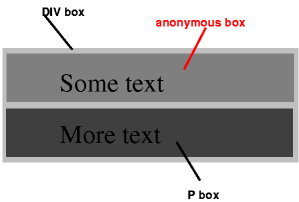
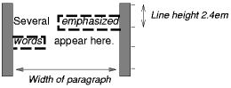
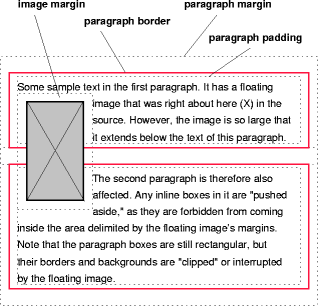
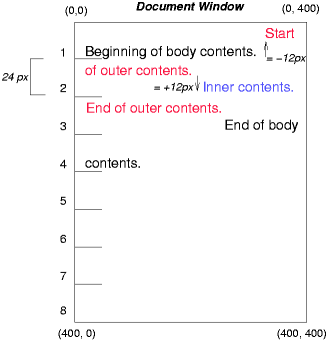
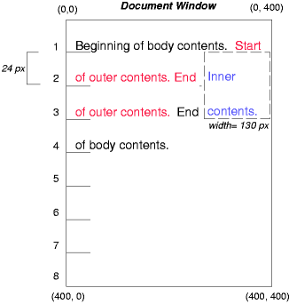
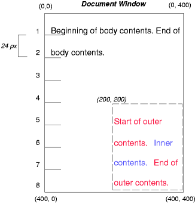

# 9 视觉格式化模型

视觉格式化模型，`visual formatting model`。

翻译自 CSS 2.2 官方文档，[Visual formatting model](https://www.w3.org/TR/CSS22/visuren.html)

## 9.1 介绍

这一章和下一章描述了视觉格式化模型: 用户代理（比如浏览器）如何为视觉媒体（比如屏幕）处理文档树。

在视觉格式化模型里，文档树里的每一个元素会根据盒模型生成 0 或多个盒子`box`。这些盒子的布局由以下因素决定：

- 盒子的尺寸
  - `content-area`
  - `padding`
  - `border`
  - `margin`
- 盒子的类型
  - 行内盒(`inline box`)
  - 行内级盒（`inline-level box`）
  - 块盒（`block box`）
- 定位方案（`positioning scheme`）
  - 常规流
  - 浮动
  - 绝对定位
- 文档树里元素之间的关系
- 外部信息（比如视口尺寸、图片的固有尺寸等）

该章节和下一章节定义的属性，可以应用到连续媒体（`continuous media`）和分页媒体（`paged media`）。但是，当应用到分页媒体时，`margin`相关的属性的意义就有所改变了，详情可见[page model](https://www.w3.org/TR/CSS22/page.html#page-margins)

视觉格式化模型没有明确格式化的各个方面（比如它没有指定一个`letter-spacing`算法），因此针对规格文档里没有涉及的格式化问题，用户代理可能表现不一致。

### 9.1.1 视口

连续媒体的用户代理通常给用户提供一个视口（屏幕上的一个窗口或者其他可视区域），以让用户翻阅文档。当视口`resized`后，用户代理可能改变文档的布局，可见[初始包含块](https://www.w3.org/TR/CSS22/visudet.html#containing-block-details)

当视口小于文档渲染的画布区域时，用户代理应该提供一个滚动机制。每一张画布至少有一个视口，但是用户代理可能渲染到不止一张画布上（比如提供同一个文档的不同视图）。

### 9.1.2 包含块

在 CSS 2.2 里，许多盒子的位置和尺寸的计算，都会跟一个称为包含块（`containing blocks`）的矩形盒子的边界有关。通常，生成的盒子就像是包含了后代盒子的块。我们称为一个盒子为它的后代“建立”了包含块。“一个盒子的包含块”指的是这个盒子所位于的包含块，而不是这个盒子生成的包含块。

每一个盒子都会有一个跟包含块有关的位置，但并不局限于包含块，比如它可能会溢出`overflow`。

关于包含块尺寸的计算细节，将在下一章节描述。

## 9.2 控制盒的生成

接下来我们将描述在 CSS 2.2 里可能产生的盒子的类型。在视觉格式化模型里，盒子的类型会部分影响它的行为。以下描述的`display`属性，明确了盒子的类型。

某些`display`属性的值，将导致源文档里的元素生成一个主盒（`principal box`）以包含后代盒子和内容，同时其自身也是参与到定位方案中的盒子。有些元素除了主盒之外，可能还会生成额外的盒子，比如`list-item`元素。这些额外的盒子的放置位置与主盒有关。

### 9.2.1 块级元素和块盒

块级元素（`block-level elements`）—— 这些源文档里的元素视觉上呈现为块（比如段落`p`元素），也是生成块级主盒的元素。设置元素的`display`属性为以下值，将导致元素成为块级`block-level`（译者注: 原文是说导致元素成为块级的，按照译者理解，应该是导致元素成为块级元素）。

- `block`
- `list-item`
- `table`

块级盒（`block-level boxes`）是参与块格式化上下文 BFC 的盒子。

（译者注: 块级元素将生成块级盒。）

在 CSS 2.2 里，一个块级盒同时也是块容器盒（`block container box`），除非它是一个`table box`或是一个替换元素的主盒。一个块容器盒要么仅包含块级盒，要么建立一个行内格式化上下文 IFC 并仅包含行内级盒。若元素的主盒是块容器盒，则该元素是块容器元素。`display`属性的以下取值，将使得一个非替换元素生成块容器盒。

- `block`
- `list-item`
- `inline-block`

不是所有的块容器盒都是块级盒: 非替换行内块（译者注: 比如`display: inline-block`的`span`元素）和非替换`table cell`都是块容器盒但不是块级盒。

若块级盒同时也是块容器盒，则称为块盒（`block boxes`）。

这里有三个术语，块级盒（`block-level box`）、块容器盒（`block container box`）、块盒（`block box`），在语义清晰的时候都简称为块（`block`）。

#### 9.2.1.1 匿名块盒

在如下的文档里，（假设 DIV 和 P 都是`display: block`），DIV 既有行内内容也有块内容。为了更容易地定义格式化，我们假设在“Some text”周边有一个匿名的块盒。

```html
<DIV>
  Some text
  <P>More text
</DIV>
```



图里显示了三个盒子，其中一个是匿名的

示意图注释: 该示意图说明了匿名块盒是如何存在于匿名内容周边的。这里有两个包含文本的矩形盒子，第一个是匿名的，它有一个浅灰色的背景，并包含了文本“Some text”。在它之下，是`p`元素的盒子，稍深灰色的背景，并包含了文本`More text`。这两个盒子都在`div`元素的盒子里面。

换句话说，如果一个块容器盒（比如上面 DIV 元素生成的盒子）里面有一个块级盒（比如上面的 P 元素生成的盒子），那么我们会强制让该块容器盒仅包含块级盒（译者注: 以添加匿名块盒的方式）。

当一个行内盒包含了一个处于常规流中的块级盒，这个行内盒（以及与它在同一行盒里的它的行内祖先盒子）将被这个块级盒（以及与它连续的兄弟块级盒，或者被“可折叠的空格”或“脱离了常规流的元素”分开的兄弟块级盒）折断，并将这个行内盒分离为两个盒子（即使两边都是空的），分别处于块级盒的两边。折断处之前和之后的行内盒都会被匿名块盒包裹住，并且原先的块级盒将成为这些匿名块盒的兄弟盒子。若是这个行内盒被相对定位所影响，任何因而产生的转变，也将影响到这个行内盒所包含的块级盒。

::: warning 根据如上的规则，这个模型将应用到下面的示例里

```css
p    { display: inline }
span { display: block }
```

```html
<!DOCTYPE HTML PUBLIC "-//W3C//DTD HTML 4.01//EN">
<HEAD>
<TITLE>Anonymous text interrupted by a block</TITLE>
</HEAD>
<BODY>
<P>
This is anonymous text before the SPAN.
<SPAN>This is the content of SPAN.</SPAN>
This is anonymous text after the SPAN.
</P>
</BODY>
```

P 元素包含了一个匿名文本的块（C1），其后是一个块级元素，再其后是另一个匿名文本的块（C2）。最终生成的盒子将是:，一个块盒，代表 BODY 元素，其中包含了：

- 一个包裹着 C1 的匿名块盒
- SPAN 块盒
- 另一个包裹着 C2 的匿名块盒
:::

匿名块盒的属性将继承于封闭的非匿名盒子（比如上面小节标题“匿名块盒”下的示例里的 DIV 盒子）。非继承属性有它们的初始值。比如，匿名块盒的`font`属性将继承于 DIV，但是`margin`属性将为 0。

已设置在导致生成匿名块盒元素上的属性，仍将应用到匿名块盒以及元素的内容上。比如在上面的示例里，若是已为 P 元素设置了`border`，那么 C1 和 C2 周围也将会有`border`。（译者注：但不会应用到 SPAN 元素上）


在 P 元素上设置了`border: 1px solid red`，导致包裹 C1 和 C2 的匿名块盒都有`border`，但 SPAN 元素没有

一些用户代理已经以其他方式实现了行内包含块的边框，比如在匿名行盒（`anonymous line boxes`）内部包装一个嵌套的块，并在这些盒子周边绘制行内边框。由于 CSS1 和 CSS2 并没有定义这个行为，`CSS1-only`和`CSS2-only`的用户代理可能实现了这个可选的模型，并声称和 CSS 2.2 的这部分保持了一致。而在这个规则文档发布之后开发的用户代理则不是这样。

当遇到处理指向匿名块盒的百分比值时，匿名块盒将被忽略，而距离最近的非匿名祖先盒子将被使用。比如，若是上面 DIV 元素里的匿名块盒的子元素需要知道它的包含块的高度以处理子元素的百分比高度时，将会使用由 DIV 元素形成的包含块的高度，而不是匿名块盒的高度。

### 9.2.2 行内级元素和行内盒

行内级元素（`inline-level elements`）是源文档里的一些元素，这些元素没有为内容形成新的块，而是将内容分布在行里（比如段落里文本的强调，行内图片等）。`display`属性的如下取值，将让元素成为行内级`inline-level`（译者注: 原文是说导致元素成为行内级的，按照译者理解，应该是导致元素成为行内级元素）:

- `inline`
- `inline-table`
- `inline-block`

行内级元素生成行内级盒`inline-level boxes`，这些行内级盒将参与到行内格式化上下文 IFC 中。

满足以下两个条件的盒子，称为行内盒`inline box`。

- 本身是行内级盒
- 其内容参与它所处的行内格式化上下文 IFC

一个非替换元素，若其`display`属性为`inline`，将生成一个行内盒。不是行内盒的行内级盒（比如可替换行内级元素，`inline-block`元素，和`inline-table`元素）原子行内级盒（`atomic inline-level boxes`），因为它们是以单个不透明的盒子参与到它们的行内格式化上下文中的。

#### 9.2.2.1 匿名行内盒

直接包含在块容器元素（而不是在行内元素里）的任何文本，都必须被当做一个匿名的行内元素。

比如如下文档里的 HTML 标记:

```html
<p>Some <em>emphasized</em> text</p>
```

`p`元素生成了一个块盒，内部有几个行内盒。“emphasized”的盒子是一个由行内元素`em`生成的行内盒。但是其他的盒子（比如“Some”和“text”）是由块级元素`p`生成的行内盒，称为匿名行内盒，因为它们没有一个与之相关联的行内级元素。

这种匿名行内盒，将从它们的块父级盒`block parent box`继承可继承的属性。不可继承的属性，会有初始值。在示例里，匿名行内盒的`color`属性将从 P 元素继承，但是`background`属性则为初始值`transparent`。

根据`white-space`属性折叠起来的空格内容，不会生成任何匿名的行内盒。

在这份规则文档里，如果从上下文可以清楚地知道是哪一种匿名盒子，匿名行内盒和匿名块盒都会简称为匿名盒子。

在格式化`table`的时候，还会有更多的匿名盒子产生。

### 9.2.3 Run-in boxes

这一章节之所以存在，是为了与之前的草案保持章节上的一致。`display: run-in`现在定义在 CSS level 3 里，详情请见[CSS basic box model](https://www.w3.org/TR/css-box-3/)

### 9.2.4 display 属性

Name: | display
--- | ---
Value: | `inline | block | list-item | inline-block | table | inline-table | table-row-group | table-header-group | table-footer-group | table-row | table-column-group | table-column | table-cell | table-caption | none | inherit`
Initial: | inline
Applies to: | all elements
Inherited: | no
Percentages: | N/A
Media: | all
Computed value: | see text

该属性有如下的取值及含义。

- `block`
  - 该值将导致元素生成一个主块盒`principal block box`
- `inline-block`
  - 该值将导致元素生成一个主行内级块容器`principal inline-level block container`（`line-block`元素内部形成了一个块盒，但是元素自身形成了一个原子行内级盒）
- `inline`
  - 该值导致元素生成一个或多个行内盒
- `list-item`
  - 该值导致元素（比如 HTML 里的`li`）生成一个主块盒以及一个标志盒。更多关于列表和列表格式化的嘻嘻，请参考[lists](https://www.w3.org/TR/CSS22/generate.html#lists)
- `none`
  - 该值导致元素不出现在格式化结构[formatting structure](https://www.w3.org/TR/CSS22/intro.html#formatting-structure)里（比如，在视觉媒体里，该元素不生成盒子，而且对布局无影响）。元素的后代元素也不会生成任何的盒子。元素及其内容将完全从`formatting structure`里移除。这种行为不会通过在后代元素上设置`display`属性来覆盖。
  - 请注意，`display: none`并不会创建一个不可见的盒子，这根本就不会创建盒子。CSS 引入了一个机制，可以在`formatting structure`里让元素生成盒子以影响布局，但是元素自身不可见，详情请见[visibility](https://www.w3.org/TR/CSS22/visufx.html#visibility)
- `table | inline-table | table-row-group | table-header-group | table-footer-group | table-row | table-column-group | table-column | table-cell | table-caption`
  - 这些值导致元素表现地像表格元素，这些内容将在[tables](https://www.w3.org/TR/CSS22/tables.html)章节描述

计算值与上面列出的这些值一样，除了定位和浮动元素（详见“9.7 `display`与`position`和`float`之间的关系”）以及根元素。对于根元素，计算值会像“9.7 `display`与`position`和`float`之间的关系”里描述地那样改变。

注意，尽管`display`的初始值是`inline`，但是用户代理默认样式表里的规则可能覆盖这个值，详见附录里的 HTML4 的[示例样式表](https://www.w3.org/TR/CSS22/sample.html)。

::: warning 这里是 display 属性的一些示例
p   { display: block }

em  { display: inline }

li  { display: list-item }

img { display: none }      /* Do not display images */
:::

## 9.3 定位方案

在 CSS 2.2 里，一个盒子可能会根据如下三种定位方案（`positioning schemes`）来布局:

- 常规流（`normal flow`）。在 CSS 2.2 里，常规流包括块级盒的块格式化，行内级盒的行内格式化，以及块级盒和行内级盒的相对定位。
- 浮动（`float`）。在浮动模型里，盒子一开始会按照常规流布局，之后将脱离常规流，转移到最左边或最右边。内容可能会沿着浮动元素的侧边流动。
- 绝对定位（`absolute positioning`）。在绝对定位模型里，盒子将完全从常规流里移除（它对其后的兄弟元素无影响）并放置在一个相对于包含块的位置。

若元素是浮动的、绝对定位的，或是根元素，我们称该元素是脱离流的（`out of flow`）。若元素没有脱离流，我们称元素处于流中（`in-flow`）。

元素 A 的流，是以下成员的集合:

- 元素 A
- 处于流中的元素且其最近的脱离流的祖先元素是元素 A

（译者注: 即使元素 A 脱离了流，但是其后代元素可能还是会处于元素 A 的流中）

::: tip 提示
CSS 2.2 的定位方案通过允许它们避免布局影响中的标记把戏的方式，帮助创造者使得他们的文档更加容易访问。（TODO: 待深入了解这句话）
:::

### 9.3.1 设置 position 属性来选择定位方案

`position`和`float`属性决定了使用哪种 CSS 2.2 定位算法来计算盒子的位置。

Name: | position
--- | ---
Value: | `static | relative | absolute | fixed | inherit`
Initial: | static
Applies to: | all elements
Inherited: | no
Percentages: | N/A
Media: | visual
Computed value: | as specified

`position`属性的这些值及其含义如下。

- `static`
  - 盒子是常规盒子，按照常规流来布局。`top`/`right`/`bottom`/`left`属性都不起作用。
- `relative`
  - 盒子的位置按照常规流计算（这称为常规流里的位置）。之后，盒子会相对于它在常规流里的位置发生偏移。当盒子 B 是相对定位的，会按照盒子 B 没有发生偏移来计算盒子 B 之后的盒子的位置。`position: relative`在 `table-row-group`/`table-header-grou`/`table-footer-group`/`table-row`/`table-column-group`/`table-colum`/`table-cell`/`table-caption`元素上的影响是未定义的。
- `absolute`
  - 盒子的位置（也可能包括尺寸）由`top`、`right`、`bottom`、`left`属性指定。这些属性明确了盒子相对于其包含块的偏移。绝对定位的盒子将脱离常规流，这意味着他们对之后的兄弟盒子的布局没有影响。另外，尽管绝对定位的盒子有`margin`属性，但是它们不会与任何其他元素的`margin`发生重叠。
- `fixed`
  - 盒子的位置按照绝对定位模型来计算，但是盒子是相对于某些参考系固定的。在绝对定位模型里，盒子的`margin`不会与其他任何元素的`margin`发生重叠。在手持式设备、投影、屏幕、TTY 和 TV 等媒体类型下，盒子会相对于视口（`viewport`）固定，并且在滚动时保持不动。在打印媒体类型下，盒子将在每一页绘制，并相对于页面盒子（`page box`）固定，即使页面可以通过一个视口看见（比如在打印预览的情况下）。对于其他媒体类型来说，其行为表现是未定义的。创造者（`author`）可能需要以媒体依赖的方式指定`fixed`。比如，创造者可能想要盒子固定在屏幕视口的顶部，但是不想要在打印的每一页的顶部。这两种特定需求可以通过使用`@media`规则来分离，就像这样：

```css
@media screen {
  h1#first { position: fixed }
}
@media print {
  h1#first { position: static }
}
```

  用户代理必须不能为固定盒子的内容分页。注意，用户代理可能通过其他方式打印不可见的内容，详情请见第 13 章的[Content outside the page box](https://www.w3.org/TR/CSS22/page.html#outside-page-box)。

针对根元素，用户代理可能将其对待为`position: static`。

### 盒子的偏移，top/right/bottom/left

若元素的`position`属性设置了除`static`之外的值，则这个元素是定位的（`positioned`）。定位的元素生成定位盒子，按照如下四个属性进行布局。

Name: | top
--- | ---
Value: | `<length> | <percentage> | auto | inherit`
Initial: | auto
Applies to: | positioned elements
Inherited: | no
Percentages: | refer to height of containing block
Media: | visual
Computed value: | if specified as a length, the corresponding absolute length; if specified as a percentage, the specified value; otherwise, 'auto'.

`top`属性指定了绝对定位盒子的上外边距的上边界，距离包含块盒子的上边界（译者注: 即包含块的上边框的下边界），偏移有多远。对于相对定位的盒子，偏移是相对于盒子自身的上边界（比如，盒子在常规流中有一个位置，然后相对于这个位置，按照这些属性的值进行偏移）。

Name: | right
--- | ---
Value: | `<length> | <percentage> | auto | inherit`
Initial: | auto
Applies to: | positioned elements
Inherited: | no
Percentages: | refer to width of containing block
Media: | visual
Computed value: | if specified as a length, the corresponding absolute length; if specified as a percentage, the specified value; otherwise, 'auto'.

类似于`top`，但是指定了盒子的右外边距的右边界，距离包含块盒子右边界的左边（译者注: 包含块的右边框的左边界），偏移有多远。对于相对定位的盒子，偏移是相对于盒子自身的右边界。

Name: | bottom
--- | ---
Value: `<length> | <percentage> | auto | inherit`
Initial: | auto
Applies to: | positioned elements
Inherited: | no
Percentages: | refer to height of containing block
Media: | visual
Computed value: | if specified as a length, the corresponding absolute length; if specified as a percentage, the specified value; otherwise, 'auto'.

类似于`top`，但是指定了盒子的下外边距的下边界，距离包含块盒子的底部（译者注: 包含块的下边框的上边界），偏移有多远。对于相对定位的盒子，偏移是相对于盒子自身的下边界。

Name: | left
--- | ---
Value: `<length> | <percentage> | auto | inherit`
Initial: | auto
Applies to: | positioned elements
Inherited: | no
Percentages: | refer to width of containing block
Media: | visual
Computed value: | if specified as a length, the corresponding absolute length; if specified as a percentage, the specified value; otherwise, 'auto'.

类似于`top`，但是指定了盒子的左外边距的左边界，距离包含块盒子的左边界的右边（译者注: 包含框的左边框的右边界），距离有多远。对于相对定位的盒子，偏移是相对于盒子自身的左边界。

这四个属性有如下取值及含义:

- `<length>`
  - 偏移是从参考系边界的固定距离，允许负值
- `<percentage>`
  - 偏移是包含块的`width`（针对`left`和`right`）或`height`（针对`top`和`bottom`）的百分比，允许负值
- `auto`
  - 对于非替换元素，这个值的效果依赖于具体哪个属性，详情请见绝对定位的非替换元素的`width`和`height`。对于替换元素，这个值的效果仅依赖于替换元素的固有尺寸，详情请见绝对定位的替换元素的`width`和`height`。

## 9.4 常规流

常规流里的盒子总是属于一个上下文，在 CSS 2.2 里，是 TFC、BFC、IFC 中的一种。在未来的 CSS 里，可能会有其他类型的格式化上下文。块级盒参与 BFC，行内级盒参与 IFC，表格格式化上下文将在表格一章描述。

### 9.4.1 BFC

BFC，`block formatting context`，块格式化上下文。以下几种元素都将为其内容创建新的块格式化上下文。

- 浮动元素
- 绝对定位元素
- 是块容器（比如`inline-block`/`table-cell`/`table-caption`）但不是块盒的元素
- `overflow`不为`visible`的块盒元素（除非值已经传播到了视口）

在 BFC 里，盒子在垂直方向上紧挨着放置，由包含块的顶部开始。两个兄弟盒子之间的垂直距离，由`margin`属性决定。在 BFC 里，相邻块级盒的垂直`margin`将发生坍塌。

在 BFC 里，每一个盒子的左外边界会紧挨着包含块的左边界（对于由右向左的排版，则是每一个盒子的右外边界会紧挨着包含块的右边界）。即使存在浮动（尽管盒子的行盒可能因为浮动而收缩）也是如此，除非盒子创建了新的 BFC（在这种情况下，盒子自身可能因为浮动，导致更加狭窄）。

BFC 的特性:

- 若元素创建新的 BFC，可避免该元素与其子元素发生外边距折叠（但是处于同一 BFC 下的该元素与其兄弟元素仍会发生外边距折叠）
- 若元素创建新的 BFC，则该元素可包含其`float`浮动的子元素，且元素的高度会根据其浮动子元素的内容自动适应
- 若元素创建新的 BFC，可阻止元素与浮动的兄弟元素重叠（该元素与浮动元素位于同一个 BFC 下，详见“9.5 浮动”）

详见：[清除浮动及 BFC（块级格式化上下文）](http://blog.csdn.net/cxl444905143/article/details/42266723)

更多关于分页媒体中页面如何折断的信息，请翻阅[allowed page breaks](https://www.w3.org/TR/CSS22/page.html#allowed-page-breaks)章节。

### 9.4.2 IFC

IFC，`inline formatting contexts`，行内格式化上下文。

不包含块级盒的块容器盒将创建一个行内格式化上下文 IFC。在 IFC 里，盒子在水平方向上紧挨着放置，由包含块的顶部开始。盒子的水平`margin`/`border`/`padding`将起作用。这些盒子可能以各种方式在垂直方向上对齐：基于这些盒子的顶部或底部对齐，或基于盒子内的文本基线对齐。包含了这些矩形区域，形成了一行，称为行盒（`line box`）。

行盒的宽度，取决于包含块和浮动元素。行盒的高度取决于[行高的计算](https://www.w3.org/TR/CSS22/visudet.html#line-height)章节里给出的规则。

行盒总是足够高，以包含其内所有的盒子。而且，它可能比它包含的最高的盒子还要高（比如，盒子的对齐可能导致所有盒子的基线排成一行）。当盒子 B 的高度比包含它的行盒要小时，盒子 B 在行盒里的垂直对齐取决于`vertical-align`属性。当多个行内级盒不能水平放置在单个行盒里时，它们将分布在两个或多个垂直堆叠的行盒里。因此，段落就是一个由行盒垂直堆叠起来的堆栈。行盒堆叠时不会存在垂直间隙（除非在别处指定），而且它们从不重叠（译者注：简单说就是，两个相邻的行盒是紧挨着的，其间没有空隙）。

通常来说，行盒的左边界与其包含块的左边界紧挨着，行盒的右边界与其包含块的右边界紧挨着。但是，浮动盒子可能位于包含块边界和行盒边界中间。因此，尽管同一 IFC 内的行盒通常有同样的宽度（包含块的宽度），但如果因为浮动导致可用的水平空间减少，它们的宽度也是会变化的。同一 IFC 里的行盒的高度通常是不一样的，比如某一行盒可能包含一个较高的图片，而其他行盒只包含文本。

当行盒内的所有行内级盒的总宽度小于行盒的宽度时，它们在行盒内水平方向上的分布，将取决于`text-align`属性。若是`text-align`属性的的值为`justify`，用户代理可能拉伸行内盒里的空间和单词（但不会拉伸`inline-block`和`inline-table`盒子）。

当一个行内盒超过了行盒的宽度，将分离为多个盒子，这多个盒子将分布在多个行盒里。如果这个行内盒不能分离（比如行内盒包含了一个简单的字符，或者特定语言的单词折断规则不允许其在行内盒里折断，或者行内盒受取值为`nowrap`或`pre`的`white-space`属性影响），则行内盒将溢出行盒。

当一个行内盒分离后，`margin`/`border`/`padding`在分离发生的地方都不会有视觉上的影响。

由于[bidirectional text processing](https://www.w3.org/TR/CSS22/visuren.html#direction)，行内盒可能分离为多个盒子，并位于同一行盒内。

行盒的创建，是为了在 IFC 里处理行内级内容。

- 不包含文本、
- 不包含保留的空格（[preserved white space](https://www.w3.org/TR/CSS22/text.html#white-space-prop)）
- 不包含非 0 的`margin`/`padding`/`border`的行内元素
- 不包含其他处于流中的内容（比如图片、`inline-block`/`inline-table`元素）
- 不以保留的换行符结尾

若行盒满足了以上所有的情况，则必须被视为零高度的行盒，以便确定行盒内任意元素的位置；并且基于任何其他目的考虑时，该行盒也要被视为不存在。

::: warning 这里有一个行内盒构建的示例
以下的段落（由 HTML 块级元素 P 创建）包含了匿名文本，匿名文本周边夹杂着 EM 和 STRONG 元素。

```html
<P>Several <EM>emphasized words</EM> appear
<STRONG>in this</STRONG> sentence, dear.</P>
```

P 元素生成了一个块盒，包含了五个行内盒，其中三个是匿名的:

- 匿名: "Several"
- EM: "emphasized words"
- 匿名: "appear"
- STRONG: "in this"
- 匿名: "sentence, dear."

为了格式化这个段落，用户代理让这五个盒子流动在行盒里。在这个示例里，P 元素生成的盒子为行盒创建了包含块。如果包含块足够宽，则所有的行内盒将布局在单个行盒里，最终显示效果为:

Several <em>emphasized words</em> appear <strong>in this</strong> sentence, dear.

否则，这些行内盒将分离开，分布在多个行盒里。原先的段落可能分离为以下这样:

Several <em>emphasized words</em> appear

<strong>in this</strong>  sentence, dear.

或者像这样:

Several <em>emphasized</em>

<em>words</em> appear <strong>in this</strong>

sentence, dear.
:::

在上面示例的最后一个效果里，EM 盒子分离为两个 EM 盒子（称之为`split1`和`split2`）。`margin`/`border`/`padding`或`text-decoration`在`split1`之后和`split2`之前都没有视觉上的效果。

::: warning 考虑如下的示例

```html
<!DOCTYPE HTML PUBLIC "-//W3C//DTD HTML 4.01//EN">
<HTML>
  <HEAD>
    <TITLE>Example of inline flow on several lines</TITLE>
    <STYLE type="text/css">
      EM {
        padding: 2px;
        margin: 1em;
        border-width: medium;
        border-style: dashed;
        line-height: 2.4em;
      }
    </STYLE>
  </HEAD>
  <BODY>
    <P>Several <EM>emphasized words</EM> appear here.</P>
  </BODY>
</HTML>
```

依赖于 P 的宽度，盒子的分布可能如下所示:



示意图注释: 该示意图说明了在行内盒分离点处`margin`/`border`/`padding`的行为。这个图展示了 HTML 文档的渲染结果。行内盒包含的两个单词“emphasized text”在单词之间分离了，在分离点，`padding`、`border`（虚线边框以示强调）、`padding`都没渲染。（译者注: 应该是指水平方向上的`margin`/`border`/`padding`）

- `margin`会插入到"emphasized"之前和"words"之后
- `padding`会插入"emphasized"之前、之上和之下，"words"之后、之上和之下。虚线边框渲染在每一个盒子的三个边上。

------------------------ 分割线，以下为译者注 ------------------------

行内盒的上下`margin`/`border`/`padding`都会正常渲染，但是不会占据空间；行内盒的左右`margin`/`border`/`padding`正常渲染且占据空间

 

`border-width: medium` VS `border-width: 10px`

 

`padding: 10px` VS `padding: 20px`

可以发现，行内元素 EM 的上下`padding`/`border`都渲染了出来，即使`padding`/`border`增大了，元素占据的高度并没有改变（因为行内盒的高度实际上取决于`line-height`）。
:::

### 9.4.3 相对定位

一旦一个盒子按照常规流或浮动进行布局（即会有一个定位位置），则它可能会相对于这个位置被移动。这称为相对定位（`relative positioning`）。以这种方式使盒子 B1 偏移，不会影响到随后的盒子 B2: B2 会基于 B1 没有发生偏移来确定位置，在 B1 应用发生偏移的属性后，B2 也不会重新定位。这也表明了，相对定位可能会导致盒子发生重叠。但是，如果相对定位导致有`overflow: auto`或`overflow: scroll`的盒子发生溢出，用户代理必须允许用户访问溢出的内容（在溢出内容偏移后的位置上），通过产生滚动条的方式，这可能会改变布局。

::: tip 译者注

 

第一个 DIV 相对定位`position: relative; left: 100px; top: 50px;`前后对比

 

DIV 溢出后，导致`.ctn`产生了横向和纵向的滚动条

```css
.ctn {
  overflow: auto;
  padding: 10px;
  border: 1px solid black;
}
.ctn .offset {
  position: relative;
  left: 100px;
  top: 50px;
  background-color: red;
}
.ctn .reference {
  margin-top: 10px;
  background-color: gray;
}
```

```html
<div class="ctn">
  <div class="offset">hello world!</div>
  <div class="reference">hello world!</div>
</div>
```

上面的示例里，`.offset`元素进行了相对定位，向右发生了偏移，溢出到具有`overflow: auto`的包含块元素之外，导致包含块`.ctn`产生了滚动条。
:::

一个相对定位的盒子会保持它在常规流里的尺寸，包括换行和其原来保留的空格。[包含块](https://www.w3.org/TR/CSS22/visuren.html#containing-block)章节解释了一个相对定位的盒子何时将创建一个新的包含块。

对于相对定位元素，`left`和`right`将水平移动盒子，且不改变它们的尺寸。`left`将把盒子往右移动，而`right`将把盒子往左移动。由于`left`/`right`不会分离或拉伸盒子，对于使用的值，总有`left` = `-right`。

若`left`和`right`都是`auto`（即初始值），它们最终使用的值都是`0`（比如，盒子位于它的初始位置）。

若`left`是`auto`，它将使用`right`值的负值（比如，盒子按`right`的负值向左移动）。

若`right`指定为`auto`，它将使用`left`值的负值。

若`left`和`right`都不是`auto`，其位置将`over-constrained`，而且其中一个将被忽略。若包含块的`direction`属性是`ltr`，则`left`生效`right`将被忽略。若包含块的`direction`属性是`rtl`，则`right`生效`left`将被忽略。

::: warning 如下三个规则是相等的

```css
div.a8 { position: relative; direction: ltr; left: -1em; right: auto }
div.a8 { position: relative; direction: ltr; left: auto; right: 1em }
div.a8 { position: relative; direction: ltr; left: -1em; right: 5em }
```

:::

`top`和`bottom`属性将在垂直方向上移动相对定位元素，且不改变它们的尺寸。`top`向下移动盒子，`bottom`向上移动盒子。由于`top`/`bottom`不会分离或拉伸盒子，对于使用的值，总有`top` = `-bottom`。若这两个都是`auto`，它们最终使用的值都是`0`。若其中有一个是`auto`，其值为另一个的负值。如果这两个都不是`auto`，`bottom`将忽略（比如，`bottom`的值将是`top`的负值）。

::: tip 提示
在脚本环境里，相对定位盒子的动态移动可以产生动画效果（`visibility`属性也可以）。Although relative positioning may be used as a form of superscripting and subscripting, the line height is not automatically adjusted to take the positioning into consideration. See the description of [line height calculations](https://www.w3.org/TR/CSS22/visudet.html#line-height) for more information.
:::

## 9.5 浮动

浮动是将一个盒子转移至当前行的左边或右边。关于浮动盒子最有趣的特性是，内容可能沿着浮动盒子侧边流动（可以通过`clear`属性禁止这一特性）。内容将在左浮动的盒子的右侧流动，流向右浮动的盒子的左侧。以下将介绍浮动定位和内容流。控制浮动行为的确切规则，将在`float`属性的描述里给出。

一个浮动盒子将被转移到左边或右边，直到它的外边界接触到包含块的边界或者另一个浮动盒子的外边界。若是存在行盒，浮动盒子的上外边界将于当前行盒的顶部对齐。

若是水平方向上没有足够的空间容纳浮动盒子，它将向下转移，直到它能放下，或当前行没有浮动元素。

由于浮动元素不在流里，非定位的块盒将在浮动盒子流（`the float box flow`）的（垂直方向上）之前和之后创建，就好像浮动盒子不存在一样。但是，浮动元素旁边的当前和随后的行盒都将按需缩短，以便为浮动盒子的`margin box`（译者注: 即包括盒子的`margin`/`border`/`padding`/`content-area`）留出空间。

当存在一个垂直位置满足以下所有四个条件，行盒将与浮动元素相邻（译者注: 左右相邻，即行盒的）。

- 位于行盒的顶部，或之下
- 位于行盒的底部，或之上
- 在浮动元素的上外边距的边界之下
- 在浮动元素的下外边距的边界之上

::: tip 提示
这也就是说，若浮动元素的`outer height`（即`margin`+`padding`+`border`+`height`）为`0`或负值，则不会使行盒缩短。

```css
.ctn .float {
  float: left;
  height: 50px;
  /* margin-top: -50px; */
  background-color: red;
}
.ctn .reference {
  background-color: gray;
}
```

```html
<div class="ctn">
  <div class="float">hello world!</div>
  <div class="reference">
      hello world!
      hello world!
      hello world!
      hello world!
      hello world!
  </div>
</div>
```

 

`.float`设置`margin-top: -50px`前后
:::

如果缩短的行盒小到无法包含任何内容，则行盒将向下转移（行盒的宽度也将重新计算）直到能容纳下一些内容或当前行没有浮动元素。任何在当前行位于浮动元素之前的内容将重新流动到同一行浮动元素的另一边（译者注: 内容流动前，是指 HTML 里内容位于浮动元素之前；最终渲染时，内容将流动到浮动元素的另一边）。换句话说，若是将行内级盒子放置在行盒里（在遇到左浮动元素填充行盒剩余的空间之前），再将左浮动元素放置在该行，浮动元素将与行盒的顶部对齐，已经在行盒里的行内盒将相应地移动到浮动元素的右边。（右边是左浮动元素的另一边）。同理，针对`direction`为`rtl`的，遇到右浮动，行内盒将移动到右浮动元素的左边。

- `table`元素
- 块级替换元素
- 常规流里创建了 BFC 的元素（比如元素的`overflow`不为`visible`）

以上这些元素自身的`border box`必须不能与同一 BFC 里的任何浮动元素的`margin box`重叠（译者注: 这些元素的内部元素，可能会与浮动元素重叠）。若有必要，在实现时，应该将这些元素放在任何（之前的）浮动元素之下，以起到清除浮动的效果，但如果有充足的空间，也可以将这些元素与浮动元素相邻放置。浮动元素可能导致上面所说的这些元素的`border box`比[10.3.3 章节](https://www.w3.org/TR/CSS22/visudet.html#blockwidth)定义的要更窄一些。CSS 2 没有定义用户代理何时应该将上面这些元素放置在浮动元素旁边，或者这些元素将变得有多窄。

::: warning 示例
如下的文档片段里，包含块太窄不足以（在同一行）容纳浮动元素和文字内容，因此文字内容移动到浮动元素之下，并按照`text-align`属性在行盒里对齐。

```css
p {
  width: 10em;
  border: solid aqua;
}
span {
  float: left;
  width: 5em;
  height: 5em;
  border: solid blue;
}
```

```html
<p>
  <span> </span>
  Supercalifragilisticexpialidocious
</p>
```

以上文档片段最终的效果如下:


:::

多个浮动元素可能相邻，这个模型也可以应用到同一行里相邻的浮动元素上。

::: warning 示例
如下的规则使得所有含有`class="icon"`的 IMG 盒子向左浮动:

```css
img.icon {
  float: left;
  margin-left: 0;
}
```

:::

::: warning 示例
考虑如下的 HTML 和 CSS:

```html
<!DOCTYPE HTML PUBLIC "-//W3C//DTD HTML 4.01//EN">
<HTML>
  <HEAD>
    <TITLE>Float example</TITLE>
    <STYLE type="text/css">
      IMG { float: left }
      BODY, P, IMG { margin: 2em }
    </STYLE>
  </HEAD>
  <BODY>
    <P>
       Some sample text that has no other...
  </BODY>
</HTML>
```

IMG 盒子向左浮动，随后的内容被格式化到浮动元素的右边，与浮动元素于同一行开始，浮动元素右边的行盒应为浮动元素的存在而缩短，但是在浮动元素之下恢复了常规的宽度（P 元素创建的包含块的宽度）。这个文档可能格式化为以下这样:


示意图注释: 该示意图说明了文本是如何围绕在浮动元素周边的，尤其是，在浮动元素旁边的行盒是如何缩短以为浮动盒子（包括`margin`）让出空间的。图片里顶部的`max (BODY margin, P margin)`表明垂直`margin`坍塌了。但是因为浮动，IMG 元素的`margin`并没有参与坍塌的计算。图片里的左边，BODY、P、和 IMG 的左`margin`并没有坍塌（因为水平`margin`并不会坍塌）。段落里的文本沿着 IMG 的右边流动，开始于段落的顶部，到段落右`margin`的左边。当文本到达 IMG 下`margin`的底部，它将继续流动，就像它处于正常的 P 元素里一样（译者注: 即此时不再受浮动元素影响）。因此，只有（在水平方向）挨着浮动元素的行盒会缩短。

若是文档修改为如下这样，格式化的结果也是完全一样的:

```html
<BODY>
  <P>Some sample text
  
           that has no other...
</BODY>
```

因为挨着浮动元素左边的内容被浮动元素取代，并重新流动在浮动元素的右边。
:::

正如在[8.3.1 章节]规定的，浮动盒子的`margin`从不与相邻的盒子的`margin`发生坍塌。因此，在之前的示例里，P 盒子和浮动的 IMG 盒子之间的垂直`margin`并没有发生坍塌。

TODO:以下这一段还不太了解。

浮动元素的内容堆叠在一起，就好像浮动元素生成了新的堆栈上下文，除非任何定位元素以及实际上创建了新的堆栈上下文的元素参与到了浮动元素的父堆栈上下文里。浮动元素可以与常规流里的其他盒子重叠（比如浮动元素旁边处于常规流里的盒子有一个负外边距）。若是如此，浮动元素将渲染在非定位的处于常规流里的块级元素的前面，但是在处于行内元素后面。

::: warning 示例
这里有另一个插图，展示了当浮动元素与常规流里元素的边框重叠时的情况。



示意图注释: 该示意图说明了浮动图片与常规流里的两个段落的边框重叠了: 段落的边框被图片的非透明部分给覆盖了。常规流里有两个段落，都有红色边框。左浮动的图片导致了上面的段落的最后三行沿着浮动元素的右边浮动。这也导致随后的段落的前三行也是沿着图片的右边浮动，而剩余的段落内容则正常。段落的边框穿过了图片盒子的`margin box`区域，导致图片的非透明部分将覆盖这些边框。

译者大致还原了这张插图的 HTML 片段和 CSS:

```css
p {
  margin: 2em;
  padding: 1em;
  border: 1px solid red;
}
img {
  float: left;
  width: 100px;
  height: 165px;
  margin: 1em;
  background: gray;
}
```

```html
<p class="first">
  Some sample text in the first paragraph. It has a  floating image that was right about here(X) in the source. However, the image is so large that it extends below hte text of this paragraph..
</p>
<p class="second">
  The second paragraph is therefore alse affected. Any inline boxes in it ara "pushed aside." as they are forbidden from coming inside the area delimited by the floating image's margins. Note that the paragraph boxes are still rectangular, but their borders and backgrounds ara "clipped" or interrupted by the floating image.
</p>
```

其效果大概是这样:


:::

接下来的这个插图说明了使用`clear`属性来阻止内容在浮动元素旁边流动。

::: warning 示例
假设有一个如下的规则

```css
p {
  clear: left;
}
```

格式化的结果如下:


示意图注释: 该示意图说明了浮动图片与常规流里的一个段落的边框发生了重叠: 段落的边框被图片的非透明部分给覆盖了。通过`clear`属性，第二个段落被强制推到浮动元素之下。常规流里有两个段落，都有红色边框。左浮动的图片导致了上面的段落的最后三行沿着浮动元素的右边浮动。段落的边框穿过了图片盒子的`margin box`区域，导致图片的非透明部分将覆盖这些边框。第二个段落则正常渲染，开始于图片的下外边距之下。充足的“安全间距”被添加到第二个段落的上外边距之上，因此它的边框接触到之前段落的下外边距（译者注: 实际上，第二个段落的上边框接触到了图片的下外边距）。

两个段落都有设置`clear: left`，但只导致第二个段落被推到浮动元素的下方 —— 通过在段落顶部添加一段“安全间距（clearance）”来完成这个效果（详见[clear](https://www.w3.org/TR/CSS22/visuren.html#propdef-clear)属性）
:::

### 9.5.1 float 属性

Name: | float
--- | ---
Value: | left | right | none | inherit
Initial: | none
Applies to: | all, but see 9.7
Inherited: | no
Percentages: | N/A
Media: | visual
Computed value: | as specified

该属性指定了盒子是应该浮动到左边、右边，还是不浮动。该属性可设置到任意元素上，但是只应用到生成非绝对定位盒子的元素上。该属性的所有取值如下:

- `left`
  - 元素生成浮动到左边的块盒。内容将在盒子的右边流动，开始于顶部
- `right`
  - 类似于`left`，盒子浮动到右边，内容将在盒子的左边流动，开始于顶部
- `none`
  - 盒子不浮动

在根元素上，用户代理可能会将其视为`none`。

如下是一些控制浮动行为的精确的规则:

1. 左浮动盒子的左外边界可能不会处于它包含块的左边界的左边。右浮动同理。
    - 译者注: 即左浮动盒子不会超过其包含块的左外边界。实际上 UA 实现时，浮动盒子的`margin box`是处于包含块的`content box`里的
2. 若当前盒子是左浮动的，而且在其之前源文档里已经有了其他左浮动的盒子，那么，要么当前盒子的左外边界必须处于之前浮动盒子右边界的右边，要么当前盒子的顶部必须比之前盒子的底部要低（即当前盒子处于之前盒子的下面）。右浮动同理。
    - 译者注: 这条规则可以防止浮动元素相互“覆盖”，保证浮动内容都是可见的
3. 左浮动盒子的右外边界可能不会位于与其相邻的任何右浮动盒子的左边界的右边。右浮动同理。
    - 译者注: 这条规则可以防止浮动元素相互重叠
4. 浮动盒子的上外边界可能不会高于其包含块的顶部。当浮动发生在两个坍塌的外边距之间时，浮动盒子定位时，就好像它有一个空的匿名父块盒参与到流里。这个父块盒的位置由外边距坍塌章节里的规则确定。
    - 译者注: 该规则可以防止浮动元素一直浮动到文档的顶端
5. 浮动盒子的上外边界可能不会高于源文档里之前元素生成的块盒或浮动盒子的上外边界。
    - 译者注: 类似于规则 4，该规则要求浮动元素不能一直浮动到其包含块的顶端
6. 若源文档里浮动盒子之前有别的元素生成的盒子，则浮动盒子的上外边界可能不会高于包含了别的元素生成的盒子的任何行盒。
    - 译者注: 类似于规则 4 和 5，该规则进一步限制了浮动盒子的向上浮动
7. 若左浮动盒子的左边有另一个左浮动的盒子，那么它的右外边界可能不会位于其包含块右边界的右边。宽松点说，左浮动盒子不会伸出其包含块的右边界，除非它已经离左边界尽可能远。右浮动同理。
    - 译者注: 这就是说，浮动盒子不能超出其包含块，除非浮动盒子太宽，无法独立位于一行里，这时可以超出包含块。
8. 浮动盒子必须尽可能高地放置。
9. 左浮动盒子必须尽可能远离包含块的左边界，右浮动盒子必须尽可能远离包含块的右边界。
    - 译者注: 这条规则是说，多个浮动盒子应该尽可能放置在同一行（即最后一个浮动盒子离包含块的边界尽可能远）

But in CSS 2.2, if, within the block formatting context, there is an in-flow negative vertical margin such that the float's position is above the position it would be at were all such negative margins set to zero, the position of the float is undefined.

上述规则里提到的其他元素的引用，仅是指与浮动元素在同一 BFC 里其他元素。

::: warning 示例
以下的文档片段将导致 b 浮动到右边。

```html
<P>a<SPAN style="float: right">b</SPAN></P>
```

若是 P 元素足够宽，a 和 b 将各在一边，像下图这样。


:::

### 9.5.2 控制浮动旁边的流: clear 属性

Name: | clear
--- | ---
Value: | none | left | right | both | inherit
Initial: | none
Applies to: | block-level elements
Inherited: | no
Percentages: | N/A
Media: | visual
Computed value: | as specified

该属性表明元素盒子的哪一边不能与之前的浮动盒子相邻。`clear`属性不影响元内部的浮动或其他 BFC 里的浮动。

以下值及含义，将应用到非浮动的块级盒上:

- `left`
  - 要求盒子的上边框边界（`border edge`）位于任何源文档里之前生成的左浮动盒子的下外边界之下。
- `right`
  - 要求盒子的上边框边界位于任何源文档里之前生成的右浮动盒子的下外边界之下。
- `both`
  - 要求盒子的上边框边界位于任何源文档里之前生成的右浮动或左浮动盒子的下外边界之下。
- `none`
  - 相对于浮动盒子，盒子的位置没有限制

除`none`以外的值，都有可能引入安全间距（`clearance`）。安全间距将阻止外边距坍塌，并作为元素`margin-top`之上的空间存在。安全间距将被用于元素在垂直方向上越过浮动元素。（译者注: 即同一水平线上，不能同时存在元素和浮动元素）

若是计算设置了`clear`属性的元素的安全间距，首先要确定元素上边框边界的假定位置。这个位置就是，元素的`clear`属性设置为`none`时，实际的上边框边界所在的位置。若是元素上边框边界的这个假定的位置没有越过相关的浮动元素，则将引入安全间距，外边距将按照 8.3.1 的规则发生坍塌。

安全间距将被设置为以下的较大者:

- 将块的上边框边界放置在最低的浮动元素的下外边界（之下）以实现清除浮动效果的必需距离
- 将块的上边框边界放置在它假定位置的必需距离

另一种选择是，将安全间距设置为，将块的上边框边界放置在最低的浮动元素的下外边界（之下）以实现清除浮动效果的必需距离。

::: tip 提示
这两种方式都允许推迟对“与现有 Web 内容的兼容性”的评估。但未来的 CSS 规范将要求其中一个是确定的。
:::

::: tip 提示
安全间距可以是负数，或 0。
:::

::: warning 示例 1
为了简化，假定我们有三个盒子，顺序是:

- 块 B1，`margin-bottom`为 M1（B1 没有子节点且没有`padding`和`border`）
- 浮动的块 F，高度为 H
- 块 B2，`margin-top`为 M2（B2 没有子节点且没有`padding`和`border`），B2 设置了`clear: both`，我们还假设 B2 不是空的。

我们先不考虑 B2 的`clear`属性，此时的情况如下图所示。B1 和 B2 发生了外边距坍塌。我们以 B1 的下边框的边界作为 Y 轴的原点，即 y = 0，则各个位置的坐标如下:

- F 的顶部: y = M1
- B2 的上边框边界: y = max(B1, B2)
- F 的底部: y = M1 + H


我们也假设 B2 不在 F 之下，即假设我们处于规范里描述的需要添加安全间距的情况下，这就是说，

> max(M1, M2) < M1 + H

我们需要计算安全间距 C 两次，C1 和 C2，并保留较大的，即 C = max(C1, C2)。第一种方式是将 B2 的顶部放置在 F 的底部，即 B2 的上边框边界: y = M1 + H。这也就是说，由于有了安全间距，B1 和 B2 间的外边距不再坍塌:

> F 的底部 = B2 的上边框边界 ⇔
>
> M1 + H = M1 + C1 + M2 ⇔
>
> C1 = M1 + H - M1 - M2
>
> = H - M2

第二个计算方式是保持 B2 在它原先的位置，即 y = max(M1, M2)。这也就是说，

> max(M1, M2) = M1 + C2 + M2 ⇔
>
> C2 = max(M1, M2) - M1 - M2

我们之前已经得出了 max(M1, M2) < M1 + H，因此

> C2 = max(M1, M2) - M1 - M2 < M1 + H - M1 - M2 = H - M2 ⇒
>
> C2 < H - M2

并且，由于 C1 = H - M2，我们可以知道

> C2 < C1

因此，

> C = max(C1, C2) = C1
:::

::: warning 示例 2
这里有一个负安全间距的例子，其安全间距为`-1em`。（假定元素都没有`border`和`padding`）

```html
<p style="margin-bottom: 4em">
  First paragraph.

<p style="float: left; height: 2em; margin: 0">
  Floating paragraph.

<p style="clear: left; margin-top: 3em">
  Last paragraph.
```

解释: 若是没有`clear`，第一个和最后一个段落的外边距将发生坍塌，最后一个段落的上边框边界完全与浮动段落的顶部平齐。但是`clear`要求最后一个段落的上边框边界处于浮动元素之下，即再降低`2em`。这也就说，必须引入安全间距。按照上面的计算，外边距不再坍塌，因此安全间距被设置为: clearance + margin-top = 2em，即 clearance = 2em - margin-top = 2em - 3em = -1em
:::

当`clear`设置在浮动元素上时，将导致对规则里的一个修改，以便来定位浮动元素。一个额外的约束(#10)被添加了:

- 浮动元素的上外边界必须处于所有之前左浮动盒子的下外边界之下（`clear: left`的情况下），或所有之前右浮动盒子的下边界之下（`clear: right`的情况下），或所有之前左浮动和右浮动盒子的下边界之下（`clear: both`的情况下）

::: tip 提示
该属性可以应用到 CSS 1 里的所有属性。实现可能因此已经支持了所有元素上的该属性。在 CSS 2 和 CSS 2.2 里，`clear`属性，仅应用到块级元素上。因此创作者应该仅在块级元素上使用该属性。如果实现支持在行内元素上清除浮动，但不是如下描述里设置了安全间距，那么实现应该强制打断，插入一或多个空的行盒（或在之下插入 9.5 章节里描述的新的行盒），以将行内元素的顶部移动到与之相关的浮动盒子之下。
:::

## 9.6 绝对定位

在绝对定位模型里，盒子明确地相对于它的包含块偏移。它将完全地从常规流里移除，不会对后续兄弟盒子产生影响。一个绝对定位的盒子会为它的处于常规流里的子盒子以及绝对定位（不包括`fixed`定位）的后代盒子创建一个新的包含块。而且，绝对定位元素的内容不会流动在任何盒子的周边。绝对定位元素可能会覆盖其他盒子的内容（或者被覆盖），这取决于相互重叠的盒子的堆叠层级（`stack level`）。

该规范里提及的绝对定位元素（或其盒子），是指该元素的`position`属性的值为`absolute`或`fixed`。

### 9.6.1 固定定位

固定定位（`fixed positioning`）是绝对定位的一个子类别，其区别在于，固定定位的盒子，其包含块是由视口创建的。对于连续媒体（`continuous media`），文档滚动时，固定定位的盒子不会移动。这一点，有些类似于固定背景图片的效果。对于分页媒体，固定定位的盒子会重复在每一页上出现，这有利于一些内容的放置，比如每一页底部的签名。固定定位的盒子，比裁剪的页面区域要大。固定定位的盒子在初始包含块里不可见的部分，将不会打印出来。

::: warning 示例
创作者可能使用固定定位创建类似框架式的呈现，比如如下的框架式布局:


示意图注释: 该示意图说明了使用了`position: fixed`的类似框架式的布局。这个插图显示有四个面板的框架集。顶部面板（`header`）覆盖了框架集的全部宽度，占用了`15%`的垂直空间。在它之下的左边是侧边栏（`sidebar`），`10em`宽; 它的高度是自动计算的。`sidebar`的右边（以及`header`的下边）是`main`区域，它的尺寸是基于剩余可用的空间来计算的。最后，底部是`footer`区域，高`100px`，覆盖了框架集的全部宽度。每个区域都做了标记，非`auto`的尺寸也指明了出来。

这可以通过如下的 HTML 和样式规则来实现。

```html
<!DOCTYPE HTML PUBLIC "-//W3C//DTD HTML 4.01//EN">
<HTML>
  <HEAD>
    <TITLE>A frame document with CSS</TITLE>
    <STYLE type="text/css" media="screen">
      BODY { height: 8.5in } /* Required for percentage heights below */
      #header {
        position: fixed;
        width: 100%;
        height: 15%;
        top: 0;
        right: 0;
        bottom: auto;
        left: 0;
      }
      #sidebar {
        position: fixed;
        width: 10em;
        height: auto;
        top: 15%;
        right: auto;
        bottom: 100px;
        left: 0;
      }
      #main {
        position: fixed;
        width: auto;
        height: auto;
        top: 15%;
        right: 0;
        bottom: 100px;
        left: 10em;
      }
      #footer {
        position: fixed;
        width: 100%;
        height: 100px;
        top: auto;
        right: 0;
        bottom: 0;
        left: 0;
      }
    </STYLE>
  </HEAD>
  <BODY>
    <DIV id="header"> ...  </DIV>
    <DIV id="sidebar"> ...  </DIV>
    <DIV id="main"> ...  </DIV>
    <DIV id="footer"> ...  </DIV>
  </BODY>
</HTML>
```

:::

## 9.7 display、position、float 之间的关系

这三个属性都会影响和盒子的生成和布局，`display`、`position`和`float`按如下相互作用:

1. 若是`display`的值为`none`，则`position`和`float`将不会应用（译者注: 即不会起作用）。这种情况下，元素不会生成盒子。
2. 否则，若是`position`的值为`absolute`或`fixed`，盒子将绝对定位，`float`的计算值将为`none`，`display`的值将按照下表设置。盒子的位置将由`top`/`right`/`bottom`/`left`属性以及盒子的包含块决定。
3. 否则，若`float`的值不为`none`，盒子将浮动，`display`的值将按下表设置。
4. 否则，若元素是根元素，`display`的值将按下表设置，除了 CSS 2.2 没有定义的一点，即指定值为`list-item`的，其计算值为`block`还是`list-item`。
5. 否则，`display`的值就为指定的值。

Specified value | Computed value
--- | ---
`inline-table` | `table`
`inline`/`table-row-group`/`table-column`/`table-column-grou`/`table-header-group`/`table-footer-group`/`table-row`/`table-cel`/`table-caption`/`inline-block` | `block`
others | same as specified

## 9.8 常规流、浮动、绝对定位的对比

为了说明常规流、相对定位、浮动、绝对定位之间的区别，我们将基于以下的 HTML 提供一系列的示例。

```html
<!DOCTYPE HTML PUBLIC "-//W3C//DTD HTML 4.01//EN">
<HTML>
  <HEAD>
    <TITLE>Comparison of positioning schemes</TITLE>
  </HEAD>
  <BODY>
    <P>
      Beginning of body contents.
      <SPAN id="outer">
        Start of outer contents.
        <SPAN id="inner"> Inner contents.</SPAN>
        End of outer contents.
      </SPAN>
      End of body contents.
    </P>
  </BODY>
</HTML>
```

假设该文档有如下的规则:

```css
body {
  display: block;
  font-size:12px;
  line-height: 200%;
  width: 400px;
  height: 400px
}
p {
  display: block
}
span {
  display: inline
}
```

在之后的每个示例里，`outer`和`inner`生成的盒子的位置将不一样。在每一个插图里，挨着插图左边的数字表示常规流里行的位置，这些行都是双倍行距的，为了更清晰地说明。

::: tip 提示
这一章节里的示意图都是解释性的，且没有缩放。这是为了高亮 CSS 2.2 里不同位置方案的区别，且并没有为在实现所给示例的渲染时作为参考的意图。
:::

### 9.8.1 常规流

考虑如下对`outer`和`inner`的 CSS 声明，并没有改变常规流的盒子:

```css
#outer { color: red }
#inner { color: blue }
```

P 元素包含了所有的内联内容: 匿名行内文本以及两个 SPAN 元素。因此，所有的内容将放置在由 P 元素建立的包含框产生的 IFC 里，其渲染结果如下所示:


示意图注释: 这个图说明了父盒子和兄弟盒子之间文本的常规流。文档窗口里，有 8 行（从 1 到 8），每一行高`24px`，展示了四行文本，占用了行 1 到行 4。在下面的 PRE 元素里，每一个`24px`高的行将由两行模拟，第二行将由确切的行号开始。按照在图片里出现的顺序，包括:

```txt
1 Beginning of body contents. Start

2 of outer contents. Inner contents.

3 End of outer contents. End of body

4 contents.
```

默认的文本颜色是黑色，"Start of outer contents"是红色的，"Inner contents"是蓝色的，"End of outer contents"是红色的。

### 9.8.2 相对定位

我们指定如下规则，来看一下相对定位的影响:

```css
#outer { position: relative; top: -12px; color: red }
#inner { position: relative; top: 12px; color: blue }
```

`outer`元素之前的文本都正常流动。`outer`文本会流动到其常规流里的位置和尺寸（在行 1 的结尾处）。之后，包含了文本（分布在三行）的行内盒子以`-12px`为单位向上移动了。

`inner`的内容，作为`outer`的子节点，将正常流动在语句"of outer contents"（在 1.5 行）之后。但是，`inner`内容自身相对于`outer`内容向下偏移了`12px`，回到了它们在第 2 行的初始位置。

注意，`outer`之后的内容没有因为`outer`的相对定位而受到影响。



示意图注释: 该示意图说明了相对定位的影响。文档窗口里，有 8 行（从 1 到 8），每一行高 `24px`。`outer`盒子的文本（位于行 1 的结尾，一部分在行 2 里，一部分在行 3 里）向上转移了`12px`。`inner`盒子的文本，也向上转移了，且其自身是相对定位的，导致它定位在其常规流的位置上，即行 2 的结尾处。在下方的 PRE 元素里，每一个`24px`高的行将由两行模拟，第二行将由确切的行号开始。按照在图片里出现的顺序，包括:

```txt
                              Start
1 Beginning of body contents.

2 of outer contents.
                     Inner contents.
3
  End of outer contents.
4                       End of body

5 contents.
```

默认的文本颜色是黑色，"Start of outer contents"是红色的，"Inner contents"是蓝色的，"End of outer contents"是红色的。

同时注意，若是`outer`偏移的距离是`-24px`，`outer`的文本和`body`的文本将发生重叠。

### 9.8.3 浮动盒子

以下的规则将让`inner`元素向右浮动，我们来考虑下其影响。

```css
#outer { color: red }
#inner { float: right; width: 130px; color: blue }
```

`inner`盒子之前的文本都正常流动。而`inner`盒子则脱离了流并向右浮动，紧挨着右外边距（其宽度已经明确指定）。浮动盒子左边的行盒缩短了，且文档里剩余的文本都流动在这些行盒里。



示意图注释: 该示意图说明了浮动盒子的影响。文档窗口里，有 8 行（从 1 到 8），每一行高 `24px`。由于`inner`盒子浮动到了右边，所有其他的文本在其周边流动（从行 1 到行 4）。在下方的 PRE 元素里，每一个`24px`高的行将由两行模拟，第二行将由确切的行号开始。竖条代表了浮动盒子的左边界。图片的出现的这些行，包括:

```txt
1 Beginning of body contents. Start

2 of outer contents. End | Inner

3 of outer contents. End | contents.

4 of body contents.
```

默认的文本颜色是黑色，"Start of outer contents"是红色的，"Inner contents"是蓝色的，"End of outer contents"是红色的。

为了展示`clear`属性的影响，我们在示例里添加一个兄弟元素:

```html
<!DOCTYPE HTML PUBLIC "-//W3C//DTD HTML 4.01//EN">
<HTML>
  <HEAD>
    <TITLE>Comparison of positioning schemes II</TITLE>
  </HEAD>
  <BODY>
    <P>
      Beginning of body contents.
      <SPAN id=outer>
        Start of outer contents.
        <SPAN id=inner> Inner contents.</SPAN>
        <SPAN id=sibling> Sibling contents.</SPAN>
        End of outer contents.
      </SPAN>
      End of body contents.
    </P>
  </BODY>
</HTML>
```

CSS 规则为:

```css
#inner {
  float: right;
  width: 130px;
  color: blue;
}
#sibling { color: red }
```

让`inner`盒子像之前一样浮动到右边，文档里剩下的文本将流入到空出的空间（译者注: 也就是浮动左边的行盒）里。


示意图注释: 该示意图说明了浮动盒子（`inner`）的影响以及它的兄弟盒子如何在它旁边流动。文档窗口里，有 8 行（从 1 到 8），每一行高 `24px`。由于`inner`盒子浮动到了右边，所有其他的文本在其周边流动，包括兄弟盒子（从行 1 到 行 5）。在下方的 PRE 元素里，每一个`24px`高的行将由两行模拟，第二行将由确切的行号开始。竖条代表了浮动盒子的左边界。图片的出现的这些行，包括:

```txt
1 Beginning of body contents. Start

2 of outer contents.     | Inner

3 Sibling contents. End  | contents.

4 of outer contents. End of body

5 contents.
```

默认的文本颜色是黑色，"Start of outer contents"是红色的，"Sibling contents"也是红色的，"Inner contents"是蓝色的，"End of outer contents"是红色的。

但是，若是兄弟元素的`clear`属性设置为`right`（这也就是说，生成的兄弟盒子的右边不能有浮动元素），兄弟元素的内容将在浮动元素之下开始流动:

```css
#inner {
  float: right;
  width: 130px;
  color: blue;
}
#sibling {
  clear: right;
  color: red
}
```


示意图注释: 该示意图说明了浮动盒子（`inner`）的影响以及它的兄弟盒子由于`clear`属性被迫在位于其下。文档窗口里，有 8 行（从 1 到 8），每一行高 `24px`。`inner`盒子之前的文本流动在行 1，且有一部分在行 2。`inner`盒子已经浮动到右边，以及占用了行 3 和行 4 的一半。兄弟盒子流动在之后的行 4 里，其后是剩余的文本。在下方的 PRE 元素里，每一个`24px`高的行将由两行模拟，第二行将由确切的行号开始。竖条代表了浮动盒子的左边界。图片的出现的这些行，包括:

```txt
1 Beginning of body contents. Start

2 of outer contents.     | Inner

3                        | contents.

4 Sibling contents. End of outer

5 contents. End of body contents.
```

默认的文本颜色是黑色，"Start of outer contents"是红色的，"Sibling contents"也是红色的，"Inner contents"是蓝色的，"End of outer contents"是红色的。

### 9.8.4 绝对定位

最后，我们来看下绝对定位的影响。考虑以下的 CSS 声明:

```css
#outer {
  position: absolute;
  top: 200px;
  left: 200px;
  width: 200px;
  color: red;
}
#inner { color: blue }
```

这将导致`outer`盒子的顶部相对于其包含块定位。定位盒子的包含块是由距离定位盒子最近的定位祖先所建立（若没有最近的定位祖先，则是初始包含块所建立，比如在我们的示例里）。`outer`盒子的上边界位于包含块顶部之下`200px`，左边界距离包含块左边界`200px`。`outer`盒子的子盒子在其父盒子内正常流动。



示意图注释: 该示意图说明了绝对定位盒子的影响。文档窗口里，有 8 行（从 1 到 8），每一行高 `24px`。`outer`之外的所有文本已经流动在行 1 和行 2 上。`outer`盒子是绝对定位的，因此它占据了文档窗口的右下方区域。`outer`及其后代盒子里的文本占据了行 5 到行 8 的右半部分。在下方的 PRE 元素里，每一个`24px`高的行将由两行模拟，第二行将由确切的行号开始。竖条代表了浮动盒子的左边界。图片的出现的这些行，包括:

```txt
1 Beginning of body contents. End of

2 body contents.

3

4

5                Start of outer

6                contents. Inner

7                contents. End of

8                outer contents.
```

默认的文本颜色是黑色，"Start of outer contents"是红色的，"Inner contents"是蓝色的，"End of outer contents"是红色的。

下面的示例显示了一个绝对定位盒子，它的父盒子是一个相对定位的盒子。尽管`outer`父盒子实际上没有偏移，设置它的`position`属性为`relative`意味着，它的盒子将作为它后代定位元素的包含块。由于`outer`盒子是分离为多行的行内盒，第一个行内盒的上边界和左边界（下方的示意图里以粗虚线来表示）将作为`top`和`left`属性偏移的参考点。

```css
#outer {
  position: relative;
  color: red;
}
#inner {
  position: absolute;
  top: 200px;
  left: -100px;
  height: 130px;
  width: 130px;
  color: blue;
}
```

最终的效果为:


示意图注释: 该示意图说明了绝对定位盒子`inner`的影响，这个绝对定位盒子的包含块是有一个相对定位的祖先盒子`outer`创建的。文档窗口里，有 8 行（从 1 到 8），每一行高 `24px`。所有`body`和`outer`的文本已流动在行 1、2、3 里。`inner`盒子相对于`outer`元素第一个行内盒的上边界和左边界进行相对定位。在下方的 PRE 元素里，每一个`24px`高的行将由两行模拟，第二行将由确切的行号开始。示意图里，定位`inner`盒子的参考边界以粗虚线来指明。`inner`盒子的左上点坐标通过`(+200, -100)`来标示。在下方的 PRE 元素里，`inner`盒子定位的参考边界以竖条和等号标示。方框号里的是`inner`盒子的偏移。图片里这些包含文本的行，大概是这样:

```txt
                        ====
                             |
1 Beginning of body contents.|Start

2 of outer contents. End of outer

3 contents. End of body contents.

4          [(+200, -100)]

5                Inner

6                contents.

7

8
```

默认的文本颜色是黑色，"Start of outer contents"是红色的，"Inner contents"是蓝色的，"End of outer contents"是红色的。

若是我们不对`outer`盒子进行定位:

```css
#outer { color: red }
#inner {
  position: absolute;
  top: 200px;
  left: -100px;
  height: 130px;
  width: 130px;
  color: blue;
}
```

`inner`盒子的包含块就变成了初始包含块。下方的插图展示了这种情况下，`inner`盒子将定位在何处。


示意图注释: 该示意图说明了相对于初始包含块的绝对定位盒子的影响。文档窗口里，有 8 行（从 1 到 8），每一行高 `24px`。所有`body`和`outer`的文本已流动在行 1、2、3 里。`inner`盒子相对于`0, 0`坐标点（文档窗口的左上角），定位在`-100, 200`，因此导致`inner`盒子的大部分内容渲染到文档窗口之外。在下方的 PRE 元素里，每一个`24px`高的行将由两行模拟，第二行将由确切的行号开始。行号左边的文本放置在初始包含块之外。图片里的这些行，大概是这样:

```txt
      1 Beginning of body contents. [@]Start

      2 of outer contents. End of outer

      3 contents. End of body contents.

      4

Inner 5

Conte 6 nts

      7

      8
```

默认的文本颜色是黑色，"Start of outer contents"是红色的，"Inner contents"是蓝色的，"End of outer contents"是红色的。

::: warning 示例
相对定位和绝对定位可能用于实现变更指示符（`change bars`），就像如下这样。文档片段为:

```html
<P style="position: relative; margin-right: 10px; left: 10px;">
  I used two red hyphens to serve as a change bar. They will "float" to the left of the line containing THIS
  <SPAN style="position: absolute; top: auto; left: -1em; color: red;">--</SPAN>
  word.
</P>
```

其效果为:


示意图注释: 该示意图说明了使用绝对定位创建变更指示符的影响。变更指示符（图片里以两个连字符即`--`表示）出现在段落左边`10px`宽的空间里。该插图里的垂直线代表了段落的包含块的左边界。示意图里，黑色的段落文本偏移了边界`10px`。变更指示符出现在第四行文本的开头单词`THIS`的左边。下方的 PRE 元素模拟了这个示例，垂直线条代表了包含块的左边界。

```js
|   I used two red hyphens to serve
|   as a change bar. They will "float"
|   to the left of the line containing
| --THIS word.
```

首先，段落（其包含块的边界显示在上图里）正常流动。段落偏移了包含块左边界`10px`（因此，之所以加上`margin-right: 10px`是为了这个偏移；要是不加的话，偏移后会导致文本超出包含块）。用两个连字符表示的变更指示符脱离了流，并定位在当前行（由于`top: auto`），且距离其包含块（由 P 元素建立）的左边界`-1em`。最终效果看起来像是变更指示符浮动在当前行的左边。
:::

## 9.9 层级展示

层级展示，`layered presentation`。

### 9.9.1 指定堆叠层级: z-index 属性

Name | z-index
--- | ---
Value | `auto | <integer> | inherit`
Initial | auto
Applies to | positioned elements
Inherited | no
Percentages | N/A
Media | visual
Computed value | as specified

对于一个定位盒子来说，`z-index`属性指定了:

- 在当前堆叠上下文中，盒子的堆叠层级
- 盒子是否建立了堆叠上下文

该属性有如下取值:

- `<integer>`
  - 该整数是所生成的盒子在当前堆叠上下文里的堆叠层级。该盒子同时也建立了一个堆叠上下文。
- `auto`
  - 所生成的盒子在当前堆叠上下文里的堆叠层级为`0`。若是盒子有`position: fixed`或它是根元素，它也会建立一个堆叠上下文。

在该章节，“在...之前”（`in front of`）意味着当用户面对屏幕时离用户更近。

在 CSS 2.2 里，每一个盒子的位置都有三个尺寸。除了它们的水平和垂直位置，盒子会沿着 Z 轴放置，并格式化为一个在另一个之上，因此还会有一个 Z 轴位置。当盒子在视觉上重叠时，Z 轴的位置尤其有意义。该章节将讨论盒子如何沿着 Z 轴定位。

渲染树绘制到`canvas`上的顺序，将从堆叠上下文的角度来描述。堆叠上下文可以包含更多的堆叠上下文。在父堆叠上下文的角度来看，一个堆叠上下文是原子的，其他堆叠上下文的盒子不会位于该堆叠上下文的盒子之间。

每一个盒子都属于一个堆叠上下文。给定的堆叠上下文中，每一个定位的盒子都有一个整数的堆叠层级，这就是盒子在 Z 轴的位置（相对于同一堆叠上下文里其他的堆叠层级来说）。具有较大堆叠层级的盒子在格式化时，总是位于具有较小堆叠层级的盒子之前。盒子可能有负数的堆叠层级。同一堆叠上下文里具有相同堆叠层级的盒子，将按照文档树的顺序从后到前的堆叠（译者注: 即文档树里越靠后的元素，渲染时越在前面）。

根元素形成根堆叠上下文。其他堆叠上下文将由任何`z-index`计算值不为`auto`的定位元素（包括相对定位）产生。堆叠上下文并不是必然与包含块相关。在未来的 CSS 里，其他属性可能也会产生堆叠上下文，比如`opacity`。

在每一个堆叠上下文里，以下的层级将按照从后到前的顺序来绘制:

1. 建立了堆叠上下文的元素的背景和边框
2. 堆叠层级为负数的子堆叠上下文（负数绝对值越大，越靠后）
3. 处于流中的、非行内级的、非定位的后代
4. 非定位的浮动元素
5. 处于流中的、行内级的、非定位的后代，包括`inline-table`和`inline-block`
6. 堆叠层级为 0 的子堆叠上下文，以及堆叠层级为 0 的后代定位元素
7. 堆叠层级为正数的子堆叠上下文（正数值越小，越靠后）

在每一个堆叠上下文里，堆叠层级为 0 的定位元素（层6）、非定位的浮动元素（层4）、`inline-table`和`inline-block`（层5）在绘制时，就像是它们自身创建了新的堆叠上下文，除非他们的后代定位元素以及任何潜在的子堆叠上下文参与了当前的堆叠上下文。

这个绘制顺序会递归地应用到每一个堆叠上下文中。此处关于堆叠上下文绘制顺序的描述，算是[Appendix E](https://www.w3.org/TR/CSS22/zindex.html)里详细规范定义的概述。

::: warning 示例
以下的示例里，盒子的堆叠层级为: `text2`为`0`, `image`为`1`, `text3`为`2`，`text1`为`3`。`text2`的堆叠层级是从根元素盒子继承而来，其他的是由`z-index`属性指定的。

```html
<!DOCTYPE HTML PUBLIC "-//W3C//DTD HTML 4.01//EN">
<HTML>
  <HEAD>
    <TITLE>Z-order positioning</TITLE>
    <STYLE type="text/css">
      .pile {
        position: absolute;
        left: 2in;
        top: 2in;
        width: 3in;
        height: 3in;
      }
    </STYLE>
  </HEAD>
  <BODY>
    <P>
      

    <DIV id="text1" class="pile"
         style="z-index: 3">
      This text will overlay the butterfly image.
    </DIV>

    <DIV id="text2">
      This text will be beneath everything.
    </DIV>

    <DIV id="text3" class="pile"
         style="z-index: 2">
      This text will underlay text1, but overlay the butterfly image
    </DIV>
  </BODY>
</HTML>
```

:::

这个示例论证了透明性的概念。（盒子的）背景的默认行为，就是允许其之后的盒子可见。在这个示例里，每一个盒子都透明地覆盖在它后面的盒子之上。这个行为可以通过使用背景属性（比如`background-color/image`）覆盖。

## 9.10 文本方向: direction 和 unicode-bidi 属性

不支持双向文本的用户代理可能忽略本章节描述的`direction`和`unicode-bidi`属性。这个例外包括那些简单渲染从右到左的字符的用户代理，因为系统里的字体包含了这些字符，但是不支持从右到左的文本方向的概念。

某些文字里的字符是从右往左书写的。在一些文档里，尤其是使用阿拉伯语（`Arabic`）和希伯来语（`Hebrew`）以及一些混合语言的环境下，单个块里文本可能出现混合的方向性（译者注: 既存在从左往右的文本，也存在从右往左的文本）。这种现象称为双向性`bidirectionality`，简称`bidi`。

Unicode 标准（[UNICODE](https://www.w3.org/TR/CSS22/refs.html#ref-UNICODE)，[UAX9](https://www.w3.org/TR/CSS22/refs.html#ref-UAX9)）定义了复杂的算法来确定文本的正确方向。算法包含了基于字符属性的隐式部分，以及对嵌入和覆盖的显示控制。CSS 2.2 依赖于这个算法来完成正确的双向渲染。`direction`和`unicode-bidi`属性允许创作者指定文档语言的元素和属性如何映射到这个算法上。

支持双向文本的用户代理必须将 Unicode 双向算法应用到每一次（不被强制折断或不受块边界影响的）行内盒子的排序上。在双向算法里，这个次序形成了段落单元。段落的嵌入层级（`embedding level`）是按照包含块的`direction`属性的值来设置的，而不是 Unicode 算法里步骤 P2 和 P3 给出的启发式方法。

因为文本的方向性取决于文档语言的结构和语义，因此在绝大多数情况下，这些属性应该只被文档类型定义（DTD，Document Type Definition）的设计者或者特殊文档的创作者使用。若是默认的样式表指定了这些属性，创作者和用户就不应该指定其他规则来覆盖它们。

[HTML 4](https://www.w3.org/TR/CSS22/refs.html#ref-HTML4)的规范的 8.2 章节定义了 HTML 元素的双向性行为。[简单样式表](https://www.w3.org/TR/CSS22/sample.html#bidi)里的规则可以完成 HTML 4 里确定的双向性行为。HTML 4 规范也包括了更多关于双向性问题的信息。

Name | direction
--- | ---
Value | `ltr | rtl | inherit`
Initial | ltr
Applies to | all elements, but see prose
Inherited | yes
Percentages | N/A
Media | visual
Computed value | as specified

该属性指定了块元素里书写方向的基础，以及 Unicode 双向性算法的嵌入和覆盖的方向（详见`unicode-bidi`）。并且，它还指定了这些事情:

- 表格列布局的方向
- 水平溢出的方向
- 块元素设置为`text-align: justify`时且其最后一行不完整时文本的位置

该属性的取值及含义如下:

- `ltr`
  - 方向为，由左到右
- `rtl`
  - 方向为，由右向左

由于`direction`属性会影响到行内元素的重新排序，因此`unicode-bidi`属性的值必须为`embed`或`override`。

::: tip 提示
当为表格列元素指定`direction`属性时，将不会被列里的表格单元元素继承，因为在文档树里，列元素不是表格单元元素的祖先。因此，CSS 不能轻易地控制 HTML 4 里 11.3.2.1 章节里描述的`dir`特性的继承规则。
:::

Name | unicode-bidi
--- | ---
Value | `normal | embed | bidi-override | inherit`
Initial | normal
Applies to | all elements, but see prose
Inherited | no
Percentages | N/A
Media | visual
Computed value | as specified

该属性的取值和含义如下:

- `normal`
  - 对双向算法，元素不会打开一个额外的嵌入级别。对于行内元素，隐式的重新排序将在元素的边界上起作用。
- `embed`
  - 若是行内元素，该值会为双向算法打开一个额外的嵌入级别。这个嵌入级别的方向是由`direction`属性给定的。在元素里，重新排序将隐式完成。这相应地会在元素的开始处添加一个 LRE（U+202A; for 'direction: ltr'）或 RLE（U+202B; for 'direction: rtl'），以及在元素的结尾处添加一个 PDF（U+202C）
- `bidi-override`
  - 对于行内元素来说，这将创建一个覆盖（`override`）。对于块容器元素，这将为那些不在另一个块容器元素的行内级后代元素创建一个覆盖。这也就是说，在元素里，重新排序会严格按照`direction`属性按序排列，双向算法的隐式部分将忽略。这相应地会在元素的开始处添加一个 LRO（U+202D; for 'direction: ltr'）或 RLO（U+202E; for 'direction: rtl'），以及在元素的结尾处添加一个 PDF（U+202C）

每一个块容器里的字符的最终顺序就像是，如上述描述的那样添加了双向性控制代码、剥去了标记、且作为结果的字符顺序被传递给一个 Unicode 双向性算法的实现，这个算法为普通文本产生与有样式的文本一样的断行。在这个过程里，`display: inline`的替换元素会被当做中立的字符对待，除非它们的`unicode-bidi`属性的值不为`normal`（在这种情况下，在为元素指定的`diretion`里，它们会被当做加粗字符）。所有其他的原子行内级盒子始终被当做中立的字符看待。

需要注意的是，为了能够在一个统一的方向（要不完全地由左向右，要不完全地由右向左）里流动行内盒子，有可能必须创建更多的行内盒子（包括匿名行内盒子），而且有些行内盒子在流动之前，可能必须分离以及重新排序。

因为 Unicode 算法有 61个嵌入层级的限制，要注意不要使用非`normal`的`unicode-bidi`属性，除非特定的情况。尤其是，值`inherit`的使用要格外注意。但是，通常对于那些意图像块一样显示的元素，将`unicode-bidi`设置为`embed`比起将元素保持在一起，会有更高的优先级，以防被改变为行内显示（请见下方的示例）。

下方的示例展示了包含双向文本的 XML 文档。它说明了一个重要的设计原则: DTD 设计者应该将双向性纳入到语言本体`language proper`（元素和特性）以及与之相随的样式表的考虑中。样式表应该设计为，将双向性与其他样式规则分离开。双向性规则也不应该被其他样式表覆盖，以便保留文档语言或 DTD 的双向性行为。

::: warning 示例
在这个示例里，小写字母代表固有的由左向右的字符，大写字母代表固有的由右向左的字符:

```html
<HEBREW>
  <PAR>HEBREW1 HEBREW2 english3 HEBREW4 HEBREW5</PAR>
  <PAR>HEBREW6 <EMPH>HEBREW7</EMPH> HEBREW8</PAR>
</HEBREW>
<ENGLISH>
  <PAR>english9 english10 english11 HEBREW12 HEBREW13</PAR>
  <PAR>english14 english15 english16</PAR>
  <PAR>english17 <HE-QUO>HEBREW18 english19 HEBREW20</HE-QUO></PAR>
</ENGLISH>
```

由于这是 XML，样式表将负责设置书写方向。样式表为:

```css
/* Rules for bidi */
HEBREW, HE-QUO  {direction: rtl; unicode-bidi: embed}
ENGLISH         {direction: ltr; unicode-bidi: embed}

/* Rules for presentation */
HEBREW, ENGLISH, PAR  {display: block}
EMPH                  {font-weight: bold}
```

HEBREW 元素是块级元素，且基础方向是由右向左。ENGLISH 元素也是块级元素，且基础方向是由左向右。PAR 元素也是块级元素，且从它们的父级元素那里继承了基础方向。因此，前两个 PAR 元素是从右上方读起的，最后三个 PAR 元素是从左上方读起的。请注意，HEBREW 和 ENGLISH 是为了明确性而仅仅作为元素的名称而已；而通常情况下，元素名称应该在不参考语言的情况下表达出结构信息。

EMPH 元素是行内级元素，且由于它的`unicode-bidi`的值为初始值`normal`，因此它对文本的顺序没有影响。HE-QUO 元素，创建了一个嵌入层级。

如果行足够长，这些文本的格式化看起来可能是这样:

```txt
               5WERBEH 4WERBEH english3 2WERBEH 1WERBEH

                                8WERBEH 7WERBEH 6WERBEH

english9 english10 english11 13WERBEH 12WERBEH

english14 english15 english16

english17 20WERBEH english19 18WERBEH
```

注意，HE-QUO 嵌入导致 HEBREW18 位于 english19 的右边。

若是行必须折断，看起来可能是这样:

```txt
       2WERBEH 1WERBEH
  -EH 4WERBEH english3
                 5WERB

   -EH 7WERBEH 6WERBEH
                 8WERB

english9 english10 en-
glish11 12WERBEH
13WERBEH

english14 english15
english16

english17 18WERBEH
20WERBEH english19
```

因为 HEBREW18 必须在 english19 之前阅读，因此它在`english19`之上的一行里，而不是仅仅从之前的格式化里将长行折断。注意，`english19`的第一个音节可能已经装进上一行，但是在由右向左的环境里，由左向右的单词的断字通常被禁止，以防止必须在一行的中间位置展示连字符。
:::
