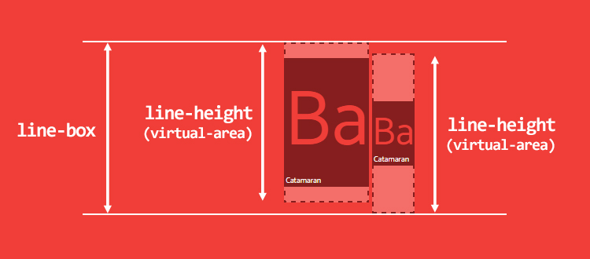

# 深入理解 CSS：字体度量、line-height 和 vertical-align

[[toc]]

翻译自[Deep dive CSS: font metrics, line-height and vertical-align](http://iamvdo.me/en/blog/css-font-metrics-line-height-and-vertical-align)

`line-height`和`vertical-align`都是简单的 CSS 属性，简单到我们绝大多数人都自信已经完全明白它们是如何工作的，以及如何使用它们。但是，事实却不是这样。它们确实很复杂，甚至是最难理解的，因为它们在 CSS 鲜为人知的特性————行内格式化上下文（`inline formatting context`，简称 IFC）的创建中承担着主要的角色。

举例来说，`line-height`的值可以设置为一个单位为`px`的长度值，或者是一个无单位的数字，但是默认值是`normal`。但是，`normal`是什么呢？我们经常了解到它可能是`1`，可能是`1.2`，甚至[CSS 规则也没有说清楚这一点](https://www.w3.org/TR/CSS2/visudet.html#propdef-line-height)。我们知道，若设置`line-height`为无单位的数字，其计算值为相对于`font-size`的倍数，但问题是，`100px`在不同的字体族表现不一致，那么`line-height`是相同的呢还是不同的呢？它真的是在`1`和`1.2`之间吗？以及，`vertical-align`与`line-height`存在什么样的联系呢？

让我们一起深入了解下不是如此简单的 CSS 机制。

## 术语中英文对照

- `line-box`: 行框
- `content-area`: 内容区域
- `virtual-area`: 实际区域

## font-size

如下的代码里，`p`标签包含了 3 个`span`标签，每一个`span`标签都设置了不同的字体。

```html
<p>
    <span class="a">Ba</span>
    <span class="b">Ba</span>
    <span class="c">Ba</span>
</p>
```

```css
p { font-size: 100px }
.a { font-family: Helvetica }
.b { font-family: Gruppo }
.c { font-family: Catamaran }
```

相同的`span`元素，使用了相同的`font-size`，不同的`font-family`，但最终高度却不一样。


图 1: 相同的`font-size`，不同的`font-family`，高度不一样

实验结果：

<!-- <code-font-different-fon-family></code-font-different-fon-family> -->

即使我们意识到这种行为，但是为什么`font-size: 100px`没创建出`100px`的高度呢？我已经测量了每个`span`元素最终的高度值: Helvetica，`115px`； Gruppo，`97px`以及 Catamaran，`164px`。


图 2: `font-size: 100px`的元素的高度分别为`97px`/`115px`/`164px`

尽管一开始我们会认为有些怪异，但是这完全是符合预期的。原因就在于字体自身，如下说明了它是如何工作的：

- 每个字体都定义了`em-square`(或 UPM, `units per em`)，这是一种容器，字符将在这个容器里绘制。这个`em-square`使用的是相对单位，并且通常是 1000 个相对单位，但是相对单位数也可以是 1024、2048 等。
- 字体的度量也是基于这种相对单位，比如`ascender`，`descender`，`capital height`，`x-height`等等。注意，有些度量值可以会超出`em-square`方框
- 浏览器里，相对单位将依据`font-size`进行相应的缩放，比如`font-size: 100px`，则 1000 个相对单位的大小即为`100px`，500 个相对单位即为`50px`

让我们在[FontForge](https://fontforge.github.io/en-US/)里打开 Catamaran 字体，以获取它的一些度量值。

- `em-square`是 1000 个相对单位
- `ascender`是 1100 个相对单位，`descender`是 540 个相对单位。经过测试发现，Mac OS 上的浏览器使用的是`HHead Ascent/Descent`值，Windows 使用的是`Win Ascent/Descent`值，而这两种取值可能还不一样。我们还注意到`capital height`是 680 个相对单位，`x height`是 485 个相对单位。

（译者注:

- 这里的`ascender`值指的是基线到字符顶端的距离
- 这里的`descender`值指的是基线到字符底部的距离
- 这里的`capital height`值指的是大写字母的高度
- 这里的`x height`值指的是小写字母`x`的高度

）


图 3: FontForge 上 Catamaran 的字体度量值

这意味着尽管`em-square`只有 1000 个相对单位， 但 Catamaran 字体却使用了 1100 + 540 个相对单位，也就是说，当设置`font-size: 100px`时，Catamaran 字体的文字高度为`164px`。这个计算高度定义了元素的内容区域`content-area`，我将在之后解释这个概念。你可以认为，内容区域`content-area`就是背景属性应用的地方。

我们还可以看到，大写字母的高度是`68px`（680 个相对单位），小写字母（`x-height`）是`49px`（485 个相对单位）。因此，`1ex = 49px`，而`1em = 100px`，而不是`164px`。（值得感谢的是，`em`是相对于`font-size`，而不是计算高度）


图 4: Catamaran 字体，UPM（`Units Per Em`）和使用`font-size: 100px`时对应的像素

在继续深入之前，我们先来看看这解决了什么问题。当`p`元素渲染在屏幕上时，它会包含多行，具体行数由其内容的宽度决定。每一行都由一或多个行内元素（HTML 标签或匿名行内文本元素）组成，每一行都成为`line-box`。`line-box`的高度是基于它子元素的高度。浏览器会计算这一行里每一个行内元素的高度，最后计算出`line-box`的高度，即取最高的子元素的上边界和最低子元素的下边界之间的距离。因此默认情况下，`line-box`总是足够高以包含它所有的子元素。

> 每一个 HTML 元素实际上都是由一到多个`line-box`组成的，只要你知道每一个`line-box`的高度，你就能知道这个元素的高度。

如果我们像下面这样修改之前的 HTML 代码：

```html
<p>
    Good design will be better.
    <span class="a">Ba</span>
    <span class="b">Ba</span>
    <span class="c">Ba</span>
    We get to make a consequence.
</p>
```

这将生成 3 个`line-box`:

- 第一个和最后一个`line-box`都包含了一个简单的匿名行内文本元素
- 第二个`line-box`包含了两个匿名行内文本元素，和 3 个`span`元素


图 5: `p`元素（黑色边框）有多个`line-box`（白色边框）组成，`line-box`里包含了行内元素（实线边框）和匿名行内元素（虚线边框）

我们可以明显的看到，第二个`line-box`比其他两个要更高一些，因为它子元素的`content-area`，更确切地说，使用了 Catamaran 字体的子元素的`content-area`。

关于`line-box`的创建最难的是，我们无法看见，也无法通过 CSS 控制。即使对`::first-line`伪类添加背景也不能给我们任何关于第一个`line-box`高度的视觉效果。

## line-height

到现在为止，我介绍了两个概念：`content-area`和`line-box`。如果你仔细阅读，你会发现我说过`line-box`的高度是根据它子元素的高度计算而来的，但并没有说是它子元素`content-area`的高度，这二者区别甚大。

一个行内元素有两个不同的高度：内容区域`content-area`高度和实际区域`virtual-area`高度（我发明了`virtual-area`这个术语，作为对于我们来说不可见的高度，你在规格文档里找不到这个术语）。

- `content-area`高度通过字体度量定义
- `virtual-area`高度就是`line-height`，并且它会被用于计算`line-box`的高度

(译者注：这里的`content-area`高度是实际上绘制出来的高度，但是`virtual-area`高度是元素实际占据位置的高度。针对`font-size: 16px; line-height: 12px`的元素，其最终绘制出来的`content-area`高度是通过`font-size: 16px`和字体度量计算出来的，即用户能看到的字体最顶端到最底端的距离；而这个元素的`virtual-area`只占据了`12px`的高度。因此，在这种`line-height`小于`font-size`的情况下，我们可能会看到文字重叠在一起)


图 6: 行内元素有两个不同的高度

也就是说，这打破了“`line-height`是基线之间的距离”这一广受欢迎的说法，在 CSS 里，不是这样。


图 7: CSS 里，`line-height`不是基线之间的距离

`virtual-area`高度和`content-area`高度的差值，称之为`leading`。`leading`的一半添加到`content-area`的顶部，另一半添加到`content-area`的底部。因此，`content-area`总是在`virtual-area`的中间位置。

经过计算之后，`line-height`（也就是`virtual-area`的高度）可以与`content-area`高度相同，也可以更大或更小。若是`leading`是负数，则`virtual-area`高度就比`content-area`高度要小，而且`line-box`实际上也会比其子元素要小。

这里罗列了其他几种行内元素：

- 可替换行内元素（`img`，`input`，`svg`元素等）
- `display`为`inline-block`或`inline-*`的元素
- 参与特定格式化上下文的行内元素（比如，`flex`布局元素的所有直接子元素的`display`都是`blockified`）

对于上面这些特定的行内元素，其高度是基于它们的`height`、`margin`、`border`属性来计算的（译者注: 漏掉了`padding`？另外，这里行内元素的高度应该是指包括`height`、`border`、`padding`在内的元素的总高度，即行内框`inline box`的高度）。若是将`height`设为`auto`，则`line-height`将被使用，且`content-area`严格等于`line-height`（译者注: 即此时`height`的计算值等于`line-height`的计算值）。


图 8: 行内替换元素、`inline-block`元素、`inline-*`以及`blocksified`行内元素，其内容区域等同于`height`或`line-height`

然而，我们现在仍然没弄明白`line-height: normal`的值到底是什么。这个答案，关系到`content-area`高度的计算，就藏在字体度量里面。让我们回到 FontForge，Catamaran 字体的`em-square`是 1000，但是我们见到了很多`ascender`/`descender`的值：

- `generals Ascent/Descent`: `ascender`是 770，`descender`是 230，用于绘制字符。(table “OS/2”)
- `metrics Ascent/Descent`: `ascender`是 1100，`descender`是 540，用于计算`content-area`的高度。(table “hhea” and table “OS/2”)
- `metric Line Gap`: 用于`line-height: normal`, 通过将这个值添加到`metrics Ascent/Descent` . (table “hhea”)

在这个场景里，Catamaran 字体定义的`Line Gap`是 0，那么`line-height: normal`将等于`content-area`，即 1640 个相对单位，或者说是 1.64（即`em-square`的 1.64 倍）。

作为比较，Arial 字体的`em-square`是 2048 个相对单位，`ascender`是 1854 个相对单位，`descender`是 434 个相对单位，`Line Gap`是 67 个相对单位。这也就是说，`font-size: 100px`时，

- `content-area`的高度为 112px，即 (1854 + 434) / 2048 * 100px = 111.72px
- `line-height: normal`的值为 115px，即 (1854 + 434 + 67) / 2048 * 100px = 115px

所有这些度量都是与指定字体相关的，也是由字体设计师设置的。

如此看来，设置`line-height: 1`是个很糟糕的实践。设置`line-height`为无单位的数字，其值是相对于`font-size`的，而不是相对于`content-area`，因此导致`virtual-area`比`content-area`要小，这也是很多问题的原因。


图 9: 使用`line-height: 1`会创建一个比`content-area`小的`line-box`

但不仅是`line-height: 1`有问题。我电脑上从 Google Web Fonts 安装的 1117 款字体，其中 95% 约 1059 款字体计算出的`line-height`要比 1 大，它们计算出的`line-height`最小是 0.618，最大是 3.378。你没看错，是 3.378！

行框`line-box`计算的一些小细节：

- 对于行内元素，`padding`和`border`增大了背景区域，但是不会增大`content-area`的高度（也不会增大`line-height`的高度）。因此你通常在屏幕上看到的并不是`content-area`，`margin-top`和`margin-bottom`也不会起作用。
- 对于可替换的行内元素、`inline-block`元素和`blocksified`行内元素，`padding`、`margin`和`border`会增大`height`，`content-area`，以及行框`line-box`的高度。（译者注: `padding`、`margin`和`border`应该只会影响到`line-box`的高度，不会影响`height`和`content-area`）

## vertical-align

我还没提到`vertical-align`属性，尽管它是计算行框`line-box`高度的必要因素。我们甚至可以说，`vertical-align`可能占据着行内格式化上下文 IFC 中是主导性的位置。

`vertical-align`属性的默认值是`baseline`。你还记得字体度量的`ascender`和`descender`？这些值决定了`baseline`的位置，以及比率。由于`ascenders`和`descender`的比率很少有 1:1 的，这将导致一些超出预期的结果，比如相邻的两个元素：

```html
<p>
    <span>Ba</span>
    <span>Ba</span>
</p>
```

```css
p {
    font-family: Catamaran;
    font-size: 100px;
    line-height: 200px;
}
```

`p`标签有两个相邻的`span`元素，继承了`font-family`、`font-size`、以及固定的`line-height`。它们将基于基线对齐，并且行框`line-box`的高度等于`span`的`line-height`。


图 10: 相同的`font-family`、相同的`baseline`，一切看起来都正常

但是给第二个`span`设置一个更小的`font-size`呢？

```css
span:last-child {
    font-size: 50px;
}
```

这看起来有些奇怪，默认的基线对齐导致产生了更高的行框`line-box`，如下图所示。我之前说过，行框`line-box`高度是由最高子元素的顶边到最低子元素的底边计算而来的。


图 11: 子元素设置了更小的`font-size`，导致产生了更高的行框`line-box`

这个例子可以作为一个论据，以支持“`line-height`的值应该使用无单位的数字”，但是有时候你需要将`line-height`写成固定值以创建更好的排版。实话说，不管你选择哪种方式，你都将在行内对齐上遇到麻烦。

让我们再来看个例子。一个`p`标签，`line-height: 200px`，包含了单个`span`标签，并继承了`line-height`。

```html
<p>
    <span>Ba</span>
</p>
```

```css
p {
    line-height: 200px;
}
span {
    font-family: Catamaran;
    font-size: 100px;
}
```

那么行框`line-box`是多高呢？我们期望是`200px`，但是实际上不是。问题就在于`p`元素有自己的`font-family`（默认是`serif`），这与`span`的`font-family`不一样。`p`元素和`span`元素的`baseline`位置是不一样的，因此行框`line-box`的高度比期望的高。这种问题的发生，是因为浏览器会认为每一个行框`line-box`的起始位置有一个零宽度的字符，规格文档里称为`strut`，这个字符将参与行框`line-box`高度的计算。

> 不可见的字符，但是会导致可见的影响。

让我们继续之前的问题。


图 12: 每个子元素对齐时，会认为行框`line-box`起始位置有一个不可见的零宽度的字符

基线`baseline`对齐，令人费解。那么`vertical-align: middle`会不会好一些呢？就像你从规则文档里了解到的，`middle`是“对齐行内框的垂直中心点，对齐点是`parent box`的`baseline`加上`parent box`中`x-height`的一半的高度”。基线`baseline`的位置与字体有关，`x-height`也是，因此`middle`对齐也是不可靠的。更糟糕的是，在绝大多数场景里，`middle`并不是真正的“中心点”，这个过程里有太多因素（比如`x-height`, `ascender`/`descender`的比率等）参与，因此不能通过 CSS 来实现。

顺便说一下，还有四个其他值，在一些场景里可能有用：

- `vertical-align: top / bottom`: 以行框`line-box`的顶部或底部对齐
- `vertical-align: text-top / text-bottom`: 以`content-area`的顶部或底部对齐


图 13: `vertical-align: top/bottom/text-top/text-bottom`

但你仍然需要小心，在大多数情况下，对齐的是实际区域`virtual-area`，也就是不可见的高度。如下这个示例使用了`vertical-align: top`，不可见的`line-height`可能产生奇怪的但是意料之中的结果。


图 14: `vertical-align`可能产生奇怪的结果，但是当考虑到`line-height`后，就理所当然了

最后，`vertical-align`的值也可以是数字，这将相对于基线`baseline`提升或降低整个行内框，不到万不得已的时候，最好别用。

## 总结

- 行内格式化上下文 IFC 真的很难理解
- 所有的行内元素有两种高度：
  - 内容区域`content-area`高度（基于字体度量）
  - 实际区域`virtual-area`高度（`line-height`）
  - 这两种高度，你都是不可见的
- `line-height: normal`基于字体度量
- `line-height: 1`可能创建导致实际区域`virtual-area`比内容区域`content-area`要小
- `vertical-align`不是特别可靠
- 行框`line-box`的高度是基于子元素的`line-height`和`vertical-align`属性计算得出的
- 我们无法轻易通过 CSS 获取或设置字体度量
