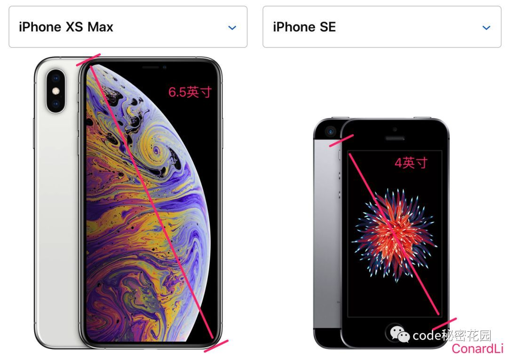
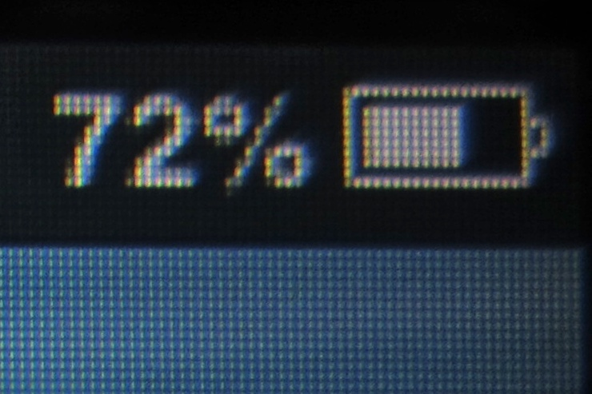
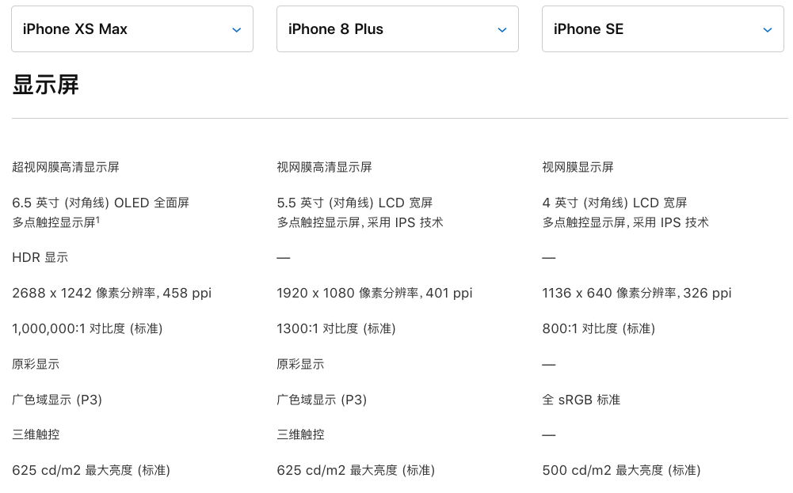
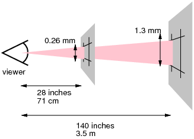
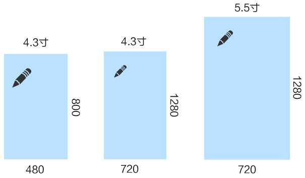

# 屏幕尺寸单位

[[toc]]

## 英寸

一般用英寸描述屏幕的物理大小，如电脑显示器的`17`英寸、`22`英寸，手机显示器的`4.8`英寸、`5.7`英寸等等，使用的单位都是英寸。

需要注意，上面的尺寸都是屏幕对角线的长度：

英寸和厘米的换算：`1`英寸 = `2.54`厘米

## DPI

参考: [维基百科 - 每英寸点数](https://zh.wikipedia.org/wiki/%E6%AF%8F%E8%8B%B1%E5%AF%B8%E7%82%B9%E6%95%B0)

DPI（`Dot Per Inch`），每英寸点数，是一个量度单位，用于点阵数位影像，意思是指每一英寸长度中，取样或可显示或输出点的数目。如：打印机输出可达 600 DPI的分辨率，表示打印机可以在每一平方英寸的面积中可以输出`600*600＝360000`个输出点。

打印机所设定之分辨率的 DPI 值越高，印出的图像会越精细。打印机通常可以调校分辨率。例如撞针打印机，分辨率通常是 60 至 90 DPI。喷墨打印机则可达 1200 DPI，甚至 9600 DPI。激光打印机则有 600 至 1200 DPI。

## PPI

参考: [维基百科 - 每英寸像素](https://zh.wikipedia.org/wiki/%E6%AF%8F%E8%8B%B1%E5%AF%B8%E5%83%8F%E7%B4%A0)

PPI（`Pixels Per Inch`），每英寸像素，又被称为像素密度，是一个表示打印图像或显示器单位面积上像素数量的指数。一般用来计量计算机显示器，电视机和手持电子设备屏幕的精细程度。通常情况下，每英寸像素值越高，屏幕能显示的图像也越精细。

有研究表明，人类肉眼能够分辨的最高像素点密度是 300 每英寸像素。超过 300 每英寸像素的屏幕被常常称为 Retina 显示屏，这个概念是不正确的。Retina 显示器指的是在人体正常使用距离下，无法看到屏幕的像素。

### 计算机与手机屏幕的 PPI

计算机与手机屏幕的每英寸像素值取决于尺寸和分辨率，通常指的就是每英寸上的像素点数。

例如一台 4:3 的 15 寸显示器，分辨率为 1024×768(XGA)，其横向和纵向的像素密度均为 85 每英寸像素。同样的一台显示器，如果分辨率设置的不同，像素点数也不同。分辨率越高，每英寸像素值也越高。

### 屏幕 PPI 计算公式

#### 计算机及手机

要计算显示器的每英寸像素值，首先要确定屏幕的尺寸和分辨率。

其中，

- dp为屏幕对角线的分辨率
- wp为屏幕横向分辨率
- hp为屏幕纵向分辨率
- di为屏幕对角线的长度(单位为英寸)。

以屏幕尺寸为4吋的 iPhone 5 为例，分辨率为 1136x640，像素密度为 326PPI。而分辨率为1920x1080的家用21.5寸显示器，像素密度为103PPI。

另外，由于屏幕的尺寸有时并不代表其实际的大小（例如苹果公司生产的 21.5 寸iMac计算机实际对角线长度为 21.465 寸），因此单凭尺寸算得的每英寸像素值会有一定的误差。

### 基于每英寸像素值的屏幕分级

根据屏幕每英寸像素值的不同，Android 系统的开发者将平板电脑和手机的屏幕分成五类：

| 名称   | 显示等级     | PPI 每英寸像素值                 |
| ------ | ------------ | -------------------------------- |
| LDPI   | 低等像素密度 | 每英寸大约120像素 (36 x 36 px)   |
| MDPI   | 中等像素密度 | 每英寸大约160像素 (48 x 48 px)   |
| HDPI   | 高等像素密度 | 每英寸大约180像素 (72 x 72 px)   |
| XHDPI  | 极高像素密度 | 每英寸大约320像素 (96 x 96 px)   |
| XXHDPI | 超高像素密度 | 每英寸大约480像素 (144 x 144 px) |

iPhone 3GS (160每英寸像素，MDPI)

iPhone 4 (326每英寸像素，XHDPI)

iPhone 三款机型对比

## 像素

参考:

- [CSS像素、物理像素、逻辑像素、设备像素比、PPI、Viewport](https://github.com/jawil/blog/issues/21)
- [掘金 - 你真的了解css像素嘛？](https://juejin.im/post/5b95a8186fb9a05cd7772455)

根据维基百科解释，像素，为影像显示的基本单位，译自英文“pixel”，`pix`是英语单词`picture`的常用简写，加上英语单词“元素”`element`，就得到`pixel`，故“像素”表示“画像元素”之意，有时亦被称为`pel`（`picture element`）。每个这样的消息元素不是一个点或者一个方块，而是一个抽象的取样。仔细处理的话，一幅影像中的像素可以在任何尺度上看起来都不像分离的点或者方块；但是在很多情况下，它们采用点或者方块显示。

### 设备像素/物理像素

设备像素（物理像素），顾名思义，显示屏是由一个个物理像素点组成的，通过控制每个像素点的颜色，使屏幕显示出不同的图像，屏幕从工厂出来那天起，它上面的物理像素点就固定不变了，单位`pt`。注意，`pt`在 CSS 单位中属于真正的绝对单位，1`pt` = 1/72`inch`，`inch`即英寸，而 1 英寸等于 2.54 厘米。

不同的设备，其图像基本单位是不同的，比如显示器的点距，可以认为是显示器的物理像素。现在的液晶显示器的点距一般在 0.25mm 到 0.29mm 之间。而打印机的墨点，也可以认为是打印机的物理像素，300dpi 就是 0.085mm，600dpi 就是 0.042mm。

注意，我们通常所说的显示器分辨率，其实是指桌面设定的分辨率，而不是显示器的物理分辨率。只不过现在液晶显示器成为主流，由于液晶的显示原理与 CRT 不同，只有在桌面分辨率与物理分辨率一致的情况下，显示效果最佳，所以现在我们的桌面分辨率几乎总是与显示器的物理分辨率一致了。

::: tip 提示
一般屏幕分辨率里说的像素，就是指物理像素。
:::

### CSS 像素

CSS 像素（`CSS pixels`），CSS 和 JavaScript 使用的抽象单位，浏览器内的一切长度都是以 CSS 像素为单位的，CSS 像素的单位是`px`。

需要注意，在 CSS 规范中，长度单位可以分为两类，绝对单位以及相对单位。`px`是一个相对单位，相对的是设备像素（`device pixel`）。

- CSS 像素的第一方面的相对性：在同一设备上，每 1 个 CSS 像素所代表的物理像素是可以变化的，比如调整屏幕的分辨率。
- CSS 像素的第二方面的相对性：在不同的设备之间，每 1 个 CSS 像素所代表的物理像素是可以变化的，比如 iPhone 5 和 iPhone 6P。

#### CSS 像素的真正含义

由于不同的物理设备的物理像素的大小是不一样的，所以 CSS 认为浏览器应该对 CSS 中的像素进行调节，使得浏览器中一个 CSS 像素的大小在不同物理设备上看上去大小总是差不多，目的是为了保证阅读体验一致。为了达到这一点浏览器可以直接按照设备的物理像素大小进行换算，而 CSS 规范中使用“参考像素”来进行换算。

一个参考像素即为从一臂之遥看解析度为`96dpi`的设备输出（即 1 英寸 96 点）时，1 点（即 1/96 英寸）的视角。它并不是 1/96 英寸长度，而是从一臂之遥的距离处看解析度为`96dpi`的设备输出一单位（即 1/96 英寸）时视线与水平线的夹角。通常认为常人臂长为 28 英寸，所以它的视角是:

`(1/96)in / (28in * 2 * PI / 360deg) = 0.0213度`

由于 CSS 像素是一个视角单位，所以在真正实现时，为了方便基本都是根据设备像素换算的。浏览器根据硬件设备能够直接获取 CSS 像素。

#### 示例-说明 CSS 像素的相对性

作为 Web 开发者，我们接触的更多的是用于控制元素样式的样式单位像素。这里的像素我们称之为 CSS 像素。

CSS 像素有什么特别的地方？我们可以借用[quirksmode](https://www.quirksmode.org/mobile/viewports.html)中的这个例子：

假设我们用 PC 浏览器打开一个页面，浏览器此时的宽度为`800px`，页面上同时有一个`400px`宽的块级元素容器。很明显此时块状容器应该占页面的一半。

但如果我们把页面放大（通过“Ctrl”键加上“+“号键），放大为`200%`，也就是原来的两倍。此时块状容器则横向占满了整个浏览器。

诡异的是此时我们既没有调整浏览器窗口大小，也没有改变块状元素的 CSS 宽度，但是它看上去却变大了一倍，这是因为我们把 CSS 像素放大为了原来的两倍。

CSS 像素与屏幕像素 1:1 同样大小时：

CSS 像素（黑色边框）开始被拉伸，此时 1 个 CSS 像素大于 1 个屏幕像素

也就是说，PC 端浏览器默认情况下一个 CSS 像素应该是等于一个物理像素的宽度的，但是浏览器的放大操作让一个 CSS 像素等于了两个设备像素宽度。在后面你会看到更复杂的情况，在高 PPI 的设备上，CSS 像素甚至在默认状态下就相当于多个物理像素的尺寸。

从上面的例子可以看出，CSS 像素从来都只是一个相对值。

#### CSS 像素到底有多大？

我们知道，CSS 像素`px`是相对于设备像素的抽象单位，那么已知设备像素和分辨率，如何确定`px`的大小呢？

我们先看这段[W3C 规范](https://www.w3.org/TR/CSS22/syndata.html#values)关于:

> For a CSS device, these dimensions（译者注，指`in`、`cm`、`mm`、`pt`、`pc`、`px`） are either anchored (i) by relating the physical units to their physical measurements, or (ii) by relating the pixel unit to the reference pixel. For print media and similar high-resolution devices, the anchor unit should be one of the standard physical units (inches, centimeters, etc). For lower-resolution devices, and devices with unusual viewing distances, it is recommended instead that the anchor unit be the pixel unit. For such devices it is recommended that the pixel unit refer to the whole number of device pixels that best approximates the reference pixel.

由规范可知，针对高分辨率设备和低分辨率设备，`px`取值所参考的基准单位是不一样。

对高分辨率设备和打印媒体，这些尺寸单位的`anchor unit`（可以理解为基准单位）应该是基于物理测量的物理单位中的一个，如英尺`inches`、厘米`centimeters`等。而对于低分辨率的设备（如电脑显示器），`anchor unit`推荐使用`pixel`单位。

##### 高分辨率设备

高分辨率设备（`high-resolution devices`）和打印媒体的`anchor unit`应该是基于物理测量的标准物理单位之一，比如英尺`inches`、厘米`centimeters`。所谓基于物理测量，就是指实际测量的物理长度。

针对`in`、`cm`、`mm`、`pt`、`pc`等物理单位，这比较好理解。比如单位`cm`，用 CSS 设置一个盒子的宽度为`1cm`，那它就等于物理上的`1cm`，你用尺子去量，它就是`1cm`。

但是针对`px`，怎么基于物理测量呢？在上面 W3C 规范内容的之后有另一段话:

> Note that if the anchor unit is the pixel unit, the physical units might not match their physical measurements. Alternatively if the anchor unit is a physical unit, the pixel unit might not map to a whole number of device pixels.

而且，依据[MDN](https://developer.mozilla.org/en-US/docs/Web/CSS/length)上关于`px`的解释:

> px: One pixel. For screen displays, it traditionally represents one device pixel (dot). However, for printers and high-resolution screens, one CSS pixel implies multiple device pixels. 1px = 1/96th of 1in.

因此，我们可知，在高分辨率设备和打印媒体上，`1px`就是 96 分之一英寸，约等于`0.2646mm`。

##### 低分辨率设备

低分辨率设备（`low-resolution devices`）的`anchor unit`应该是`pixel unit`，而`pixel unit`是什么呢？

> For such devices it is recommended that the pixel unit refer to the whole number of device pixels that best approximates the reference pixel.
>
> 针对这些设备，建议`pixel unit`应该是最接近参考像素的整数个设备像素。

我们举个例子来说明一下，一个分辨率为`1680*1050`的 22 英寸电脑显示器。对于电脑显示器来说，它的参考像素约为`0.26mm`(这个值的大小由设备的典型视距决定，出厂时已经确定)。确定了参考像素之后，再来计算设备像素。通过分辨率和尺寸，计算出该显示器的 PPI 为 `90.05ppi`，此时一个设备像素的值就等于`0.28mm`。对比这两个像素值之后发现，一个设备像素的值是最接近参考像素的。所以对于这个设备来说，一个像素单位(`1px`)就等于一个设备像素。

#### 总结

- 为什么一个元素在 PC 上和移动端的物理尺寸不一样，但是两者的视觉效果上却差不多呢？

因为 CSS 像素是基于参考像素确定的，而参考像素就是为了让同一元素在不同设备上显示效果尽量一致而设计的（对于移动端和 PC 端来说，参考像素的物理大小肯定不一样，但是显示效果基本是一致的）。所以同一个元素，尽管在 PC 端和移动端尺寸不一样，但视觉效果却是差不多的。

- 当改变屏幕的分辨率时，屏幕上显示的内容大小为什么会跟着改变？

我们举一个例子来说明这个问题，还是以上面那个典型的 22 寸显示器为例：

正常分辨率下，即`1680*1050`，此时的 PPI 是`90.05ppi`，那一个设备像素的长度就约为`0.28mm`。这时一个设备像素就约等于一个参考像素对应的大小。如果你用 CSS 定义了一个盒子宽为`375px`，此时你用尺子去屏幕上量，会发现375px盒子的实际宽度是`0.28(mm) * 375 ≈ 10.5cm`。

调整显示器的分辨率为`1024*640`时，此时一个设备像素对应的长度是`0.46mm`，虽然它和参考像素对应的大小有差距，但是没办法，你还得使用它，毕竟它现在就是最接近参考像素大小的设备像素了。上面那个`375px`的盒子，此时的实际宽度则为`0.46 * 375 ≈ 17.4cm`。所以降低分辨率之后，相同的内容会显得大了。

调整显示器的分辨率为`1920*1080`，此时一个设备像素对应的长度是`0.25mm`，此时`375px`的盒子实际宽度是`0.25 * 375 ≈ 9.3cm`，所以提高分辨率后，内容自然就变小了。

- 当你缩放浏览器大小时，浏览器中的内容的大小会跟着改变？

这个现象，PPK 在之前的一篇文章里提到过。缩放浏览器时，也就相当于改变了浏览器的分辨率，所以这个问题和第 2 个一样。

### DPR

DPR（`device pixels ratio`），设备像素比，描述的是未缩放状态下设备像素和 CSS 像素的初始比例关系。当这个比率为 1:1 时，使用 1 个设备像素显示 1 个CSS 像素。当这个比率为 2:1 时，使用 4 个设备像素显示 1 个 CSS 像素，当这个比率为 3:1 时，使用 9 个设备像素显示 1 个 CSS 像素。所以，有如下公式：

`DPR = 设备像素/CSS像素`

### DIP

DIP（`Device independent Pixel`，或`density-independent pixel`），设备独立像素，也称为逻辑像素。根据上述设备像素与 CSS 像素之间的关系、及 DPR 的官方定义，我们可以推断出：

`CSS 像素 = 设备独立像素 = 逻辑像素`

引用[移动前端开发之viewport的深入理解](http://www.cnblogs.com/2050/p/3877280.html)文中的内容说明：

在移动端浏览器中以及某些桌面浏览器中，`window`对象有一个`devicePixelRatio`属性，它的官方的定义为：设备物理像素和设备独立像素的比例，也就是 `devicePixelRatio = 物理像素 / 独立像素`。

CSS 像素就可以看做是设备的独立像素，所以通过`devicePixelRatio`，我们可以知道该设备上一个 CSS 像素代表多少个物理像素。例如，在 Retina 屏的 iPhone 上，`devicePixelRatio`的值为 2，也就是说 1 个 CSS 像素相当于 2 个物理像素。但是要注意的是，`devicePixelRato`在不同的浏览器中还存在些许的兼容性问题，所以我们现在还并不能完全信赖这个东西，具体的情况可以看下这篇文章[devicePixelRatio](https://www.quirksmode.org/blog/archives/2012/06/devicepixelrati.html)。

为什么是“每四个一组”？而且要让这四个一组来显示“原来屏幕的一个像素”？这大概就是 Retina 显示技术的一种表现吧。而这“每四个一组”的“大像素”，可以被称作“设备独立像素”，它可以是系统中的一个点，这个点代表一个可以由程序使用的虚拟像素，然后由相关系统转换为物理像素。

“设备独立像素”也有人称为“CSS像素”，一种形象的说法，更倾向于表明与 CSS 中尺寸的对应。

设备独立像素与物理像素的对应关系，可以这样看：

类似的每四个一组的对应关系，也许正是 Retina 显示技术所做的。

## DP

该部分内容主要复制于[DPI、PPI、DP、PX 的详细计算方法及算法来源是什么？](https://www.zhihu.com/question/21220154)

DP 主要是用于 Android 设备做适配的单位，在不同屏幕密度下，`1dp`的物理长度也相同。

液晶屏显示图像，放大来看就是由一个个小点组成的，这些小点就是像素点（`px`）。

有的手机屏幕小像素点少，比如 4.3 寸分辨率为`480*800`的屏幕；还有的屏幕大尺寸点多，比如 5.5 寸分辨率为`720*800`的屏幕。

| 屏幕 | 分辨率（px） | 屏幕尺寸（对角线尺寸） |
| ---- | ------------ | ---------------------- |
| 图一 | 480 * 800    | 4.3 寸                 |
| 图二 | 720 * 1280   | 4.3 寸                 |
| 图三 | 720 * 1280   | 5.5 寸                 |

上图里的图片（原始大小，单位为`px`，未额外设置尺寸），会在不同的屏幕上显示出不同的效果，但是我们一般需要在不同的屏幕上显示出统一的视觉效果，即可以简单理解为在不同屏幕上，图片占据的物理尺寸是一样的。

当实现时使用图片的原始大小时: 在相同屏幕尺寸的屏幕上，比如图一和图二都是 4.3 寸，其视觉效果不统一，图二的图片显示明显偏小；在相同分辨率的屏幕上，比如图二和图三，其视觉效果也不统一，图二的图片显示也明显偏小。那么，我们在设计视觉稿时，就需要有一个统一的基准，使用这个基础实现的图片大小，在各个屏幕上能显示出统一的视觉效果。

PS: 无论实现时使用什么长度单位，最终都会转换为`px`。

最终我们找到了点密度（`density`），也就是像素数和屏幕尺寸的比值。`density`是每单位长度容纳的像素`px`数量，其单位是 像素/英寸，即 PPI（`pixel per inch`）。

而屏幕尺寸是屏幕对角线的长度，计算对角线像素数量再除以屏幕尺寸就得到了 PPI 值，上面三个屏幕的 PPI 分别为`217ppi`，`342ppi`，`267ppi`。可以看到，相同原始大小的图片在不同的屏幕上，屏幕 PPI 越低图片显示越大，屏幕 PPI 越高图片显示越小。

要让不同屏幕显示图片的视觉大小相同，就需要对图片进行缩放，给高 PPI 屏幕提供更大的图片。

高 PPI 屏幕需要更大的图片才能得到同样的显示效果，反之亦然。PPI 和图片`px`的关系如下:

`px1`/`px2` = `ppi1`/`ppi2`

选定一个 PPI 值作为基础绘制图片，用 PPI 的比值计算出图片缩放比例就可以适配各种屏幕。

`px2` = `px1`*(`ppi2`/`ppi1`)

安卓选定的这个基础值就是`160ppi`。

`px2` = `px1`*(`ppi2`/`160`)

我们已经解决了图片放大缩小的问题，还需要一个单位用来描述长度（因为`px`不固定，`inch`不方便）。安卓创造了一个新的单位`dp`，中文名设备独立像素。并且规定在`160ppi`的屏幕上，`1dp`=`1px`。设计师只需要针对`160ppi`的显示屏设计并制图，安卓会根据当前手机屏幕的`ppi`值来放大缩小图片，在不同的屏幕上得到相近的显示效果。
