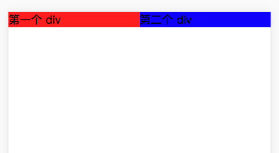
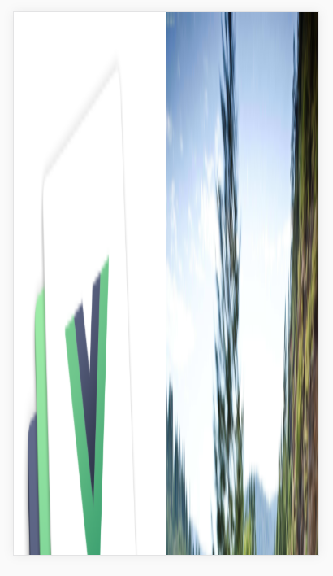

# flex 布局下 img 显示问题

[[toc]]

常规的 Flex 布局实例如下：

```html
<div class="div-ctn">
  <div class="first-div">第一个 div</div>
  <div class="second-div">第二个 div</div>
</div>
```

```css
.div-ctn {
  display: flex;
}
.div-ctn > div {
  flex-grow: 1;
}
.div-ctn  > .first-div {
  background: red;
}
.div-ctn  > .second-div {
  background: blue;
}
```

结果：



## 问题

但是将上例里的`div-ctn`里的`div`元素替换成`img`元素，就会出现问题。

这里有两张图片，一张是`600*600`像素的图片，另一张是`2000*3000`像素的图片。


```html
<div class="img-ctn">
  
  
</div>
```

```css
.img-ctn {
  display: flex;
}
.img-ctn > img {
  flex: auto;
}
```

结果：


我们期望的是，在屏幕范围内并排显示两张完整的图片，并保持着原始比例。

而实际上，图片却按原始的`600*600`的尺寸来显示，导致出现了横向的滚动条。

## 解决方案

针对`img`元素等替换元素来说，在作为 Flex 容器的子元素时，需要确定宽度或者高度，才能按期望进行放大和缩小。

### 确定宽度

我们先给`img`象征性地添加`width: 1px`，而`flex: auto`可以确保子元素等比例放大以充满剩余空间。

```css
.img-ctn {
  display: flex;
}
.img-ctn > img {
  flex: auto;
  width: 1px;
}
```

结果是，图片按期望的在屏幕内并排显示，但是却没有保持图片原来的比例。



### align-items

上例里的图片没有成比例显示而是拉伸，是因为 Flex 容器的`align-items`默认值是`stretch`，即子元素在交叉轴上将占满整个容器的高度（子元素未设置高度或高度设为`auto`时）。而且第二张图片高为`2000px`，导致容器的高度也撑到了`2000px`，导致两张图片未保持原始的宽高比，出现了严重的拉伸效果。

想要消除这种拉伸效果，可以设置容器的`align-items`（或者子元素的`align-self`）为`flex-start`，即可让图片保持原始比例。


### 确定高度

确定图片的高度，也能解决图片拉伸的问题。但是一般情况下，我们都会要求保持图片的宽高比，而当图片高度确定后，图片宽度可能会随着容器的扩大而扩大、缩小而缩小，导致不能维持宽高比。因此，一般不会采用确定高度的方式。
