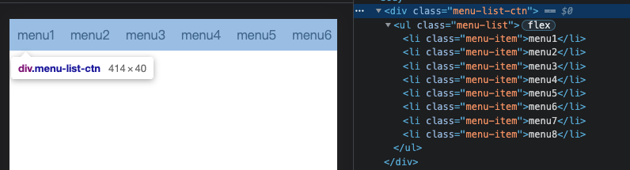
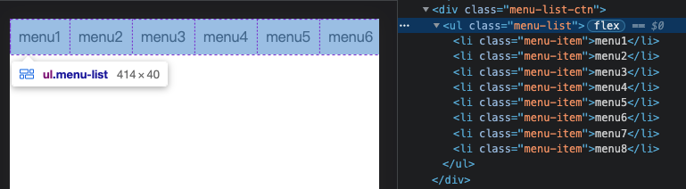

# flex 布局

## flex 父容器宽度无法自适应子元素宽度

假设有个水平的菜单列表，该列表可在水平方向可滚动，使用`flex`进行实现的代码如下：

```html
<div class="menu-list-ctn">
    <ul class="menu-list">
        <li class="menu-item">menu1</li>
        <li class="menu-item">menu2</li>
        <li class="menu-item">menu3</li>
        <li class="menu-item">menu4</li>
        <li class="menu-item">menu5</li>
        <li class="menu-item">menu6</li>
        <li class="menu-item">menu7</li>
        <li class="menu-item">menu8</li>
    </ul>
</div>

<style>
.menu-list {
    display: flex;
    flex-wrap: nowrap;
}
.menu-item {
    flex: none;
    padding: 10px;
    font-size: 16px;
    line-height: 20px;
}
</style>
```

但是现在出现一个问题，通过开发工具 Elements 可查看到，无论是`.menu-list-ctn`还是`.menu-list`的宽度都是`414px`（假设视口宽度为`414px`）。




可是，视口宽度内并没有完全显示出所有菜单项，说明`.menu-list`的实际宽度应该不止`414px`。

解决方案：给`.menu-list`元素添加`width: max-content`。

```css
.menu-list {
    display: flex;
    flex-wrap: nowrap;
    width: max-content;
}
```
