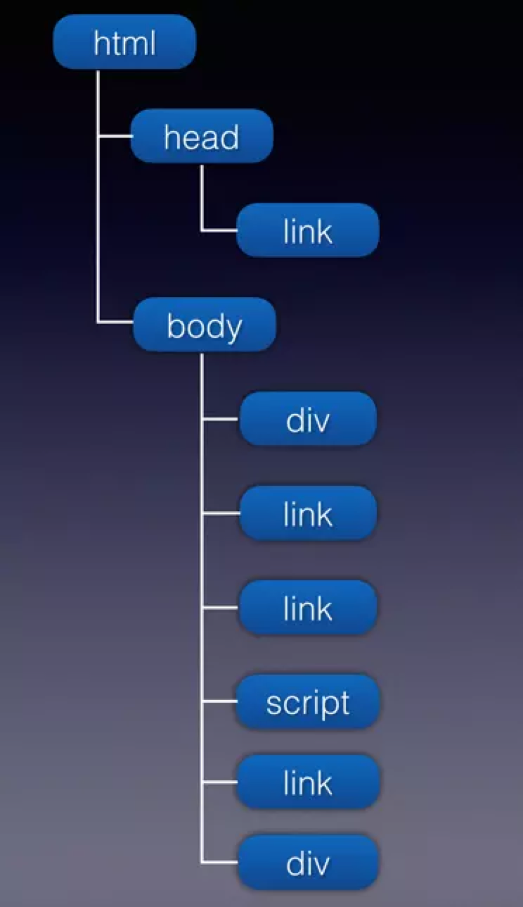

# 浏览器

## 概念

- 下载/加载: 浏览器将资源下载到本地的过程。

## HTML 的加载和解析

浏览器加载到的 HTML 文件，其实就是一个包含字符串的文件。浏览器会将 HTML 文件里的字符串读取到内存中，按照 HTML 规则，对字符串进行取词编译，将字符串转化成另一种易于表达的数据结构。

```html
<!DOCTYPE html>
<html lang="en">
<head>
  <meta charset="UTF-8">
  <meta name="viewport" content="width=device-width, initial-scale=1.0">
  <meta http-equiv="X-UA-Compatible" content="ie=edge">
  <title>只有css</title>
  <link rel="stylesheet" href="./index.css" />
</head>
<body>
  <div id="div1"></div>
  <link rel="stylesheet" href="./c1.css" />
  <link rel="stylesheet" href="./c3.css" />
  <script src="http://test.com:9000/mine/load/case2/j1.js"></script>
  <link rel="stylesheet" href="./c4.css" />
  <div id="div2"></div>
</body>
</html>
```

比如上面这段代码，浏览器会对这个 HTML 文件进行编译，转化成类似下面的结构（这里把`head`中的其他标签省略了）。



注意，这里的结构不是 DOM 树哦。

浏览器会对转化后的数据结构自上而下进行分析。

- 首先，通过网络进程，对所有的资源进行优先级排序下载。注意，这里仅仅是下载资源，并不会执行或应用。可能的优先级策略有：
  - Chrome 浏览器里，同一域名同一时间只能有 6 个 TCP 连接，超过的话需要排队，等待这 6 个连接释放。（仅适用于 HTTP/1.0 和 HTTP/1.1）
  - pre-load ？
- 与此同时，渲染进程主线程会对文档进行解析：
  - 遇到 DOM 标签时，执行 DOM 构建，将该 DOM 元素添加到 DOM 树中。
  - 遇到`script`标签时，检查该`script`是否已经下载下来。
    - 若是未下载完成，则等待下载完成（下载完立即执行代码），等待期间会阻塞其后 HTML 内容的解析。
    - 若是已下载，便执行代码，执行代码期间也会阻塞其后 HTML 内容的解析
    - 总之，遇到`script`标签，一定会阻塞其后 HTML 内容的解析，直到文件加载完成并执行完成之后，才能继续解析其后的 HTML 内容
  - 遇到`link`标签时，检查`link`资源是否已下载。
    - 若是已下载，则开始构建 CSSOM 树，同时继续解析其后的 HTML 内容
    - 若是未下载完成，则继续解析其后的 HTML 内容
    - 总之，无论`link`标签里的文件是否下载，都不会阻塞其后 HTML 内容的解析；但是因为 CSSOM 树还未构建完成，会阻塞页面渲染。

### 页面首次渲染

页面首次渲染的时机，会根据 HTML 内容的不同而不同。

渲染进程主线程解析 HTML 内容时，会按照由上而下的顺序进行。

- 当解析到`head`标签时，`head`标签内的外部资源主要是外链 JavaScript 文件和外链 CSS 文件。
  - 若是外链 JavaScript 文件，则停止解析之后的 HTML 内容，等待该文件下载并执行。
  - 若是外链 CSS 文件，继续解析之后的 HTML 内容。
- 当解析到`body`标签时，`body`里可能会有 DOM 元素、外链 JavaScript/CSS 文件，而其内不同的内容，浏览器的解析机制也会不同。
  - 若只有 DOM 元素
    - 等 DOM 树构建完成后，结合 CSSOM 树生成 Render 树，**页面首次渲染**。
  - 若有 DOM 元素和外链 JavaScript 文件
    - 当解析到外链 JavaScript 时，若该文件尚未加载完成，则该文件之前已构建（但不完整）的 DOM 树会与 CSSOM 树会生成 Render 树进而进行**首次页面渲染**。
    - 此时，会等待该 JavaScript 文件的加载和执行，并阻塞其后 HTML 内容的解析。
  - 若有 DOM 元素和外链 CSS 文件
    - 外链 CSS 文件不会阻塞其后 HTML 内容的解析，但是会阻塞页面的渲染，也就是说，外链 CSS 加载完成之前，页面还是白屏。
  - 若有 DOM 元素、外链 JavaScript 和 CSS 文件
    - 外链 JavaScript 文件的 CSS 文件的顺序会影响页面的渲染，这点尤为重要。
    - 当`body`里外链 JavaScript 文件之前的外链 CSS 文件未加载完成之前，页面是不会渲染的。
    - 当`body`里外链 JavaScript 文件之前的外链 CSS 文件加载完成之后，该 JavaScript 文件之前的 DOM 树会和 CSSOM 树结合为 Render 树，**页面首次渲染**出该 JavaScript 文件之前的 DOM 结构。
- 整个 HTML 文档解析完毕后，页面会重新渲染。当页面里引用的所有 JavaScript 不同代码执行完毕，触发`DOMContentLoaded`事件。
- 当 HTML 里的图片资源、JavaScript 代码里有异步加载的 CSS/JavaScript/图片资源都加载完毕之后，触发`load`事件

```html
<body>
  <!-- 白屏 -->
  <div id="div1"></div>
  <!-- 白屏 -->
  <link rel="stylesheet" href="./c1.css" />
  <!-- 白屏 -->
  <link rel="stylesheet" href="./c3.css" />
  <!-- 如果此时 j1.js 尚未下载到本地，则首次渲染，此时的 DOM 树 只有 div1 ，所以页面上只会显示 div1，样式是 c1.css 和 c3.css 的并集。-->
  <!-- 如果此时 j1.js 已经下载到本地，则先执行 j1.js，页面不会渲染，所以此时仍然是白屏。-->
  <!--下面的 js 阻塞了 DOM 树的构建，所以下面的 div2 没有在文档的 DOM 树中。 -->
  <script src="http://test.com:9000/mine/load/case2/j1.js"></script>
  <!-- j1.js 执行完毕，继续 DOM 解析，div2 被构建在文档 DOM 树中，此时页面上有了div2 元素，样式仍然是 c1.css 和 c3.css 的并集 -->
  <link rel="stylesheet" href="./c4.css" />
  <!-- c4.css 加载完毕，重新构建render树，样式变成了 c1.css、c3.css 和 c4.css 的并集 -->
  <div id="div2"></div>
  <script>
    // 利用 performance 统计 load 加载时间。
    window.onload = function() {
      console.log(performance.timing.loadEventStart - performance.timing.fetchStart);
    }
  </script>
</body>
```


::: warning 注意
HTML 解析过程中，遇到`body`中的第一个`script`标签时，若该资源还没完成下载，则浏览器将会进行首次渲染，将该`script`标签前面的 DOM 树和 CSSOM 树合并成一棵 Render 树，进而渲染页面。**这是页面从白屏到首次渲染的时间节点，比较关键。**
:::

### DOMContentLoaded 和 load 事件的触发时机

MDN 的解释：

> 当初始的 HTML 文档被完全加载和解析完成之后，`DOMContentLoaded`事件被触发，而无需等待样式表、图像和子框架的完成加载。注意: `DOMContentLoaded`事件必须等待其所属`script`之前的样式表加载解析完成才会触发。
>
> 整个页面加载完成之后，包括所有依赖的资源比如样式表和图片，`load`事件被触发。

MDN 的解释并不是那么地清楚，从上一节“页面首次渲染”来看:

- HTML 文档加载完毕，且 HTML 里引用的内联 JavaScript 和外链 JavaScript 文件都加载完成并执行完成之后，触发`DOMContentLoaded`事件。
  - 注意: `DOMContentLoaded`事件必须等待其所属`script`之前的样式表加载解析完成才会触发。
  - 注意: 若是外链 JavaScript 文件且存在`defer`属性，则会在该文件加载执行完成之后，才会触发`DOMContentLoaded`事件。
- HTML 文档里引用的 JavaScript 文件、CSS 文件、图片，以及 JavaScript 代码里异步加载的 JavaScript、CSS 和图片都加载完成之后，触发`load`事件。注意:
  - HTML 文档里引用的 JavaScript 代码里若是有异步加载的 JavaScript、CSS、图片，是会影响`load`事件触发的。
  - `video`、`audio`、`flash`不会影响`load`事件触发。

### 浏览器下载并发数

浏览器对同一域名下的资源并发下载数，Chrome 为 6 个。超过 6 个的话，之后的下载请求将会在队列中等待。详见[Timing breakdown phases explained](https://developers.google.com/web/tools/chrome-devtools/network/reference#timing-explanation)。

这就是为什么我们要将资源收敛到不同的域名下的原因，就是为了充分利用该机制，最大程度的并发下载所需资源，尽快的完成页面的渲染。

## 关于 JS 文件和 CSS 文件加载和执行是否阻塞页面解析和渲染的问题

请先了解[浏览器的渲染阶段](https://blog.windstone.cc/front-end/browser-env/browser/open-page-process.html#_5-%E6%B8%B2%E6%9F%93%E9%98%B6%E6%AE%B5)。

以下讨论的 JS/CSS 文件都是指页面里同步的 JS/CSS 文件。

- CSS 文件的加载，不会阻塞 HTML 的解析（即不会阻塞 DOM 树的构建），但是会阻塞页面渲染
- JS 文件的加载和执行，会阻塞其后 HTML 的解析（即阻塞了 DOM 树的构建，肯定也会阻塞页面渲染）
  - `<script>`标签里的 JS 代码执行完，才会继续解析之后的 HTML；一个常见的应用是，`<script>`里的代码执行时，查询到的最后一个`<script>`标签即是代码所在的`<script>`标签对应的 DOM 节点。
  - 【疑问】既然 JS 文件的加载和执行会阻塞之后 HTML 的解析，那为什么会出现并行请求 JS 文件？浏览器的优化？

```js
const scripts = document.getElementsByTagName('script');
// 当前代码所在 script 标签对应的 DOM 节点
const currentScript = scripts[scripts.length - 1];
// 获取 script 标签上的 attributes
// ...
```

### 为什么要将 JS 文件放文档底部 </body> 之前

先说结论：JS 文件的加载和执行，会阻塞 JS 文件之后 DOM 节点的解析和渲染，但不会影响其之前 DOM 节点的解析和渲染，因此要将 JS 文件放到页面尽可能底部的地方。

但是要完全弄明白这个问题，就要深究以上的结论。

首先，JS 文件的加载和执行，为什么会阻塞其之后 DOM 节点的解析和渲染呢？这完全是历史原因。以前的 JS 经常在执行的时候运行`document.write`（往文档里插入内容），这可能会导致其后 DOM 完全发生变化，因此无法安全地在 JS 执行的同时来渲染 DOM。

::: tip 相关知识点
`document.write`方法将一个文本字符串写入一个由`document.open()`打开的文档流（document stream）。

若向一个已经加载且没有调用过`document.open()`的文档写入数据时，会自动调用`document.open`。一旦完成了数据写入，建议调用`document.close()`，以告诉浏览器当前页面已经加载完毕。写入的数据会被解析到文档结构模型（DOM）里，完全覆盖当面的文档（即`<html>`标签内的内容都被替换）。

若`document.write`是在页面的`<script></script>`里同步调用的（说明当前文档还未完成加载），则它将不会自动调用`document.open()`，且此时通过`document.write`写入的内容会追加在当前文档里。
:::

现在的浏览器都支持`async`或者`defer`属性了，说明脚本非阻塞其实一点问题都没有，而脚本阻塞就是历史原因导致的兼容性问题。

正是因为 JS 文件的加载和执行会阻塞其后 DOM 节点的解析和渲染，因此若是将 JS 文件置于文档顶部会导致首屏白屏时间增加；置于文档中部，可能会导致页面只渲染一部分后阻塞渲染后一部分。因此，将 JS 文件置于文档尽可能底部的地方是最优的方式。

### 为什么要将 CSS 文件放在 head 标签之间

若是将 CSS 文件放在页面底部即`</body>`之前，浏览器会先解析 HTML 并构建 DOM 树，解析到文件底部 CSS 文件所在位置时，DOM 树基本构建完成，而此时才开始构建 CSSOM 树，因此 DOM 树的构建和 CSSOM 树的构建基本上是串行的。而且在这种情况下，底部的 CSS 文件加载时，浏览器会先渲染出一个没有样式的页面（内联样式不会渲染，否则等 CSS 文件加载好后，又要结合全部样式再渲染一次），等 CSS 文件加载完后会再渲染成一个有样式的页面，页面会出现明显的闪动的现象。

而将 CSS 文件放在`<head>`标签之间，CSSOM 树的构建可以更早地进行。

### CSS 的加载可能阻塞 DOM 的解析吗

答案是，有可能。

```html
<html>
    <head>
        <style type="text/css" src = "theme.css" />
    </head>
    <body>
        <p>极客时间</p>
        <script>
            let e = document.getElementsByTagName('p')[0]
            e.style.color = 'blue'
        </script>
    </body>
</html>
```

当在 JavaScript 中访问了某个元素的样式，那么这时候就需要等待这个样式被下载完成才能继续往下执行。所以在这种情况下，CSS 也会阻塞 DOM 的解析。

## 异步脚本

### defer VS async

```js
<script src="path/to/myModule.js" defer></script>
<script src="path/to/myModule.js" async></script>
```

`script`标签打开`defer`或`async`属性，脚本就会异步加载。渲染引擎遇到这一行命令，就会开始下载外部脚本，但不会等它下载和执行，而是直接执行后面的命令。

`defer`与`async`的区别是：`defer`要等到整个页面在内存中正常渲染结束（DOM 结构完全生成，以及其他脚本执行完成），才会执行；`async`一旦下载完，渲染引擎就会中断渲染，执行这个脚本以后，再继续渲染。一句话，`defer`是“渲染完再执行”，`async`是“下载完就执行”。另外，如果有多个`defer`脚本，会按照它们在页面出现的顺序加载，而多个`async`脚本是不能保证加载顺序的。

### ES6 模块

```js
<script type="module" src="./foo.js"></script>
```

浏览器对于带有`type="module"`的`script`，都是异步加载，不会造成堵塞浏览器，即等到整个页面渲染完，再执行模块脚本，等同于打开了`script`标签的`defer`属性。

如果网页有多个`<script type="module">`，它们会按照在页面出现的顺序依次执行。

`script`标签的`async`属性也可以打开，这时只要加载完成，渲染引擎就会中断渲染立即执行。执行完成后，再恢复渲染。

```js
<script type="module" src="./foo.js" async></script>
```

一旦使用了`async`属性，`<script type="module">`就不会按照在页面出现的顺序执行，而是只要该模块加载完成，就执行该模块。

## 优化技巧

- 预解析 DNS

```html
<link rel="dns-prefetch" href="https://blog.windstone.cc">
```

- 预建立 TCP 连接

```html
<link rel="preconnect" href="https://blog.windstone.cc">
```

## 参考文章

- [再谈 load 与 DOMContentLoaded](https://juejin.im/post/5b2a508ae51d4558de5bd5d1)
