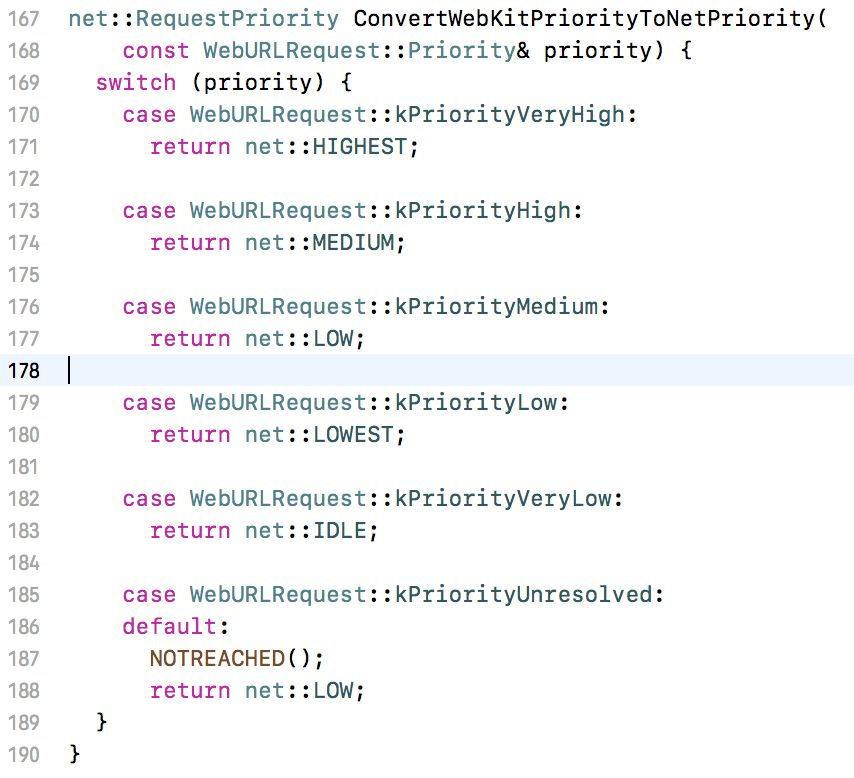
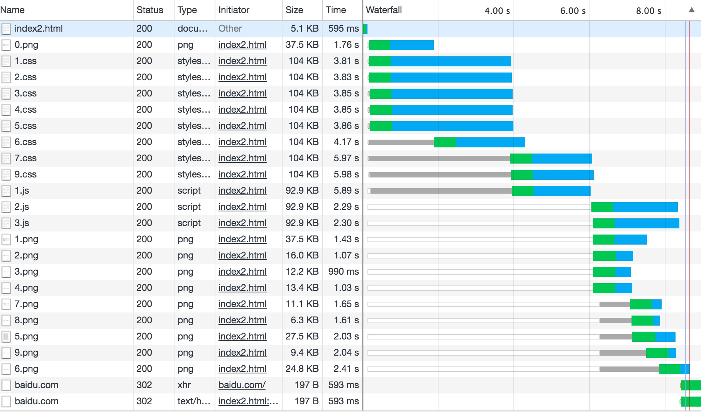
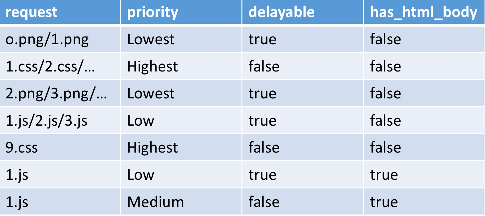

# 浏览器里的资源请求

以下内容如无特殊说明，都是基于 Chrome 浏览器。

- [Preload, Prefetch And Priorities in Chrome](https://medium.com/reloading/preload-prefetch-and-priorities-in-chrome-776165961bbf)
- [Resource Fetch Prioritization and Scheduling in Chromium](https://docs.google.com/document/d/1bCDuq9H1ih9iNjgzyAL0gpwNFiEP4TZS-YLRp_RuMlc/edit)
- [掘金 - 浏览器页面资源加载过程与优化](https://juejin.im/post/5a4ed917f265da3e317df515)
- [知乎 - 从Chrome源码看浏览器如何加载资源](https://zhuanlan.zhihu.com/p/30558018)

## 资源分类

Chrome 浏览器里会将资源分为 14 类，如下表所示。

| 类型            | 说明                                                                                                                                |
| --------------- | ----------------------------------------------------------------------------------------------------------------------------------- |
| kMainResource   | 主资源，比如导航栏输入地址、`frame`/`iframe`里请求、超链接点击、表达提交等得到的 HTML 页面文件资源                                  |
| kImage          | 图片资源                                                                                                                            |
| kCSSStyleSheet  | CSS 层叠样式表资源                                                                                                                  |
| kScript         | 脚本资源，例如 JavaScript 资源                                                                                                      |
| kFont           | 字体资源，例如网页中常用的字体集`.woff`资源                                                                                         |
| kRaw            | 混合类型资源，比如 Ajax 请求（因为 Ajax 可以请求多种资源）                                                                          |
| kSVGDocument    | SVG 可缩放矢量图形文件资源                                                                                                          |
| kXSLStyleSheet  | 扩展样式表语言 XSLT，是一种转换语言，关于该类型可以查阅 W3C XSL来了解                                                               |
| kLinkPrefetch   | HTML5 页面的预读取资源(Link prefetch)，例如`dns-prefetch`。                                                                         |
| kTextTrack      | `<video>`的字幕资源，`.vtt`格式，在`<track>`标签里使用                                                                              |
| kImportResource | HTML Imports，将一个 HTML 文件导入到其他 HTML 文档中，例如`<link href="import/post.html" rel="import" />`。详细了解请查阅相关文档。 |
| kMedia          | 多媒体资源，比如`video`和`audio`都属于该类资源                                                                                      |
| kManifest       | HTML5 应用程序缓存资源                                                                                                              |
| kMock           | 预留的测试类型                                                                                                                      |

## 预处理请求

浏览器在对资源开始请求之前，需要先对请求做预处理。预处理主要做两件事情: 检查请求是否合法和更改请求。

- **CSP检查**

[CSP（Content Security Policy）](https://developer.mozilla.org/zh-CN/docs/Web/HTTP/CSP)通过指定有效域（即浏览器认可的资源的有效来源），来减少和报告 XSS 攻击。浏览器会检查`<meta>`标签里或 HTTP 响应头里的`Content-Security-Policy`设置的策略，当该类资源不符合 CSP 的设置时，浏览器将报错，并阻止资源请求。

```html
<meta http-equiv="Content-Security-Policy" content="img-src 'self';...">
```

- **upgrade-insecure-requests**

若设置了如下的 CSP 策略:

```html
<meta http-equiv="Content-Security-Policy" content="upgrade-insecure-requests">
```

则浏览器会将页面里的`http`请求强制升级为`https`，包括改变`url`的协议和端口号。

- **Mixed Content 检查**

Mixed Content 是指在`https`的页面里请求`http`的内容，通常这种`http`的 JavaScript 文件请求会被浏览器阻止，以防止受到中间人的攻击导致整个页面被控制。但是图片之类的资源即使内容被修改可能只是展示出问题，不会影响整个页面，因此不会被浏览器阻止。

被动混合内容: 那些不会打破页面重要部分，风险比较低的，但是使用频率又比较高的 Mixed Content 内容。--[W3C - Optionally-blockable Content](https://w3c.github.io/webappsec-mixed-content/#category-optionally-blockable)

翻看 Chromium 64 的源码可以发现，有如下四类资源属于被动混合内容。

- audio
- favicon
- image
- video

其他的几乎资源都是`blockable`，即浏览器会阻止请求的资源。

- **Origin Block 检查**

`svg`使用`use`获取 SVG 资源时必须不能跨域，否则将会被浏览器阻止并报错。

```html
<svg>
    <use href="http://windstone.cc/images/logo.svg#abc"></use>
</svg>
```

源码里会检查这种请求是否同源，包括协议、域名、端口号。注意这里的同源与同源策略不同，若不是同源的话，就会连请求都发不出去，而同源策略可以发出请求但是阻止请求的返回结果。

## 资源请求优先级

### 最终的优先级


注释:

- `*` Preload using “as” or fetch using “type” use the priority of the type they are requesting. (e.g. preload as=stylesheet will use Highest priority). With no “as” they will behave like an XHR.
- `**` “Early” is defined as being requested before any non-preloaded images have been requested (“late” is after).

自 2016 年 6 月起，以上表格表示了 Chrome 里（in Blink as of Chrome 46 and beyond）处理所有资源的优先级。

资源的优先级划分为 5 级。不同场景下，这 5 级的命名和描述上可能有所不同，但本质上是一一对应的。比如:

- 网络优先级: Highest、Medium、Low、Lowest、Idle
- 浏览器内核: VeryHigh、High、Medium、Low、VeryLow
- 用户端控制台显示: Highest、High、Medium、Low、Lowest

是不是跟星巴克咖啡的中杯、大杯、超大杯类似？

#### script 优先级

`script`脚本的优先级取决于它们在文档里的位置以及它们是否是`async`异步的、`defer`延迟的或`blocking`阻塞的。

- 位于第一个图片之前被请求的`blocking`脚本的优先级是: Net:Medium
- 位于第一个图片之后被请求的`blocking`脚本的优先级是: Net:Low
- `async`/`defer`/`injected`脚本的优先级是: Net:Lowest

这里的`第一个图片`的定义是，在任何非`proload`的图片被请求之前的第一个被请求的图片。

#### image 优先级

可见且位于视口内的`image`图片（Net:Medium）比那些不在视口内的图片（Net:Lowest）具有更高的优先级，因此在某些程度上 Chrome 会尽量为你（伪）懒加载这些图片。一开始具有低优先级的图片（Net:Lowest）在布局完成之后被发现位于视口内时，将获得优先级提升（Net:Medium）。但是当布局完成时已经在请求中的图片不会重新更改优先级。

#### preload & as

`preload`且使用`as`属性的资源，将获得与该资源类型相同的资源优先级。比如，`<link rel="preload" as="style">`将和样式表一样获得 Net:Highest 的优先级；`<link rel="preload" as="script">`将获得 Net:Medium/Low 的优先级。这些资源仍然遵从着相同的 CSP 政策。

`preload`且没有使用`as`属性的资源的请求优先级与异步 XHR 的优先级一致。

### 计算资源加载优先级

上一节尽管已经给出了最终的资源加载优先级，但是这些优先级是如何一步步计算得到的呢？

#### 资源的默认优先级

首先，每一类资源都有个默认的优先级，这个默认的优先级将作为初始化的优先级。

源码里，不同类型的资源优先级是这么定义的:

```c++
ResourceLoadPriority TypeToPriority(Resource::Type type) {
  switch (type) {
    case Resource::kMainResource:
    case Resource::kCSSStyleSheet:
    case Resource::kFont:
      // Also parser-blocking scripts (set explicitly in loadPriority)
      return kResourceLoadPriorityVeryHigh;
    case Resource::kXSLStyleSheet:
      DCHECK(RuntimeEnabledFeatures::XSLTEnabled());
    case Resource::kRaw:
    case Resource::kImportResource:
    case Resource::kScript:
      // Also visible resources/images (set explicitly in loadPriority)
      return kResourceLoadPriorityHigh;
    case Resource::kManifest:
    case Resource::kMock:
      // Also late-body scripts discovered by the preload scanner (set
      // explicitly in loadPriority)
      return kResourceLoadPriorityMedium;
    case Resource::kImage:
    case Resource::kTextTrack:
    case Resource::kMedia:
    case Resource::kSVGDocument:
      // Also async scripts (set explicitly in loadPriority)
      return kResourceLoadPriorityLow;
    case Resource::kLinkPrefetch:
      return kResourceLoadPriorityVeryLow;
  }

  return kResourceLoadPriorityUnresolved;
}
```

可以看到，从浏览器内核 Blink 层面来看，优先级总共分为五级: VeryHigh、High、Medium、Low、VeryLow。其中，MainRescource、CSS、字体的优先级是最高的 VeryHigh；其次，Ajax、Script 这类的优先级是 High；图片、音视频的优先级是 Low；最后`prefetch`预加载的资源的优先级是最低的 VeryLow。

注意上面的`switch-case`设定资源优先级有一个顺序，若资源既是`script`又是`prefetch`的话得到的优化级是 High，而不是`prefetch`的 VeryLow，因为`prefetch`是最后一个判断。所以在设定了资源默认的优先级之后，会再对一些情况做一些调整，主要是对`prefetch`/`preload`的资源。

#### 优先级调整

- **降低`preload`的字体的优先级**

若字体是`preload`的，则浏览器会将`preload`的字体的优先级从默认的 VeryHigh 调整为 High。

- **降低`defer`/`async`的`script`的优先级**

若`script`是`defer`或`async`的，则将该`script`的优先级从默认的 High 调整为 Low。

- **页面底部`preload`的`script`优先级变成 Medium**

紧接着上一条，若`script`不是`defer`或`async`的，且是`preload`的`script`，并且如果页面之前已经加载了一张图片就认为这个`script`是在页面偏底部的位置，就把它的优先级调成 Medium。资源在第一张非`preload`的图片前认为是`early`，而在其后则认为是`late`，`late`的`script`的优先级会偏低。

`preload`不同于`prefetch`，在早期浏览器，`script`资源是阻塞加载的，当页面遇到一个`script`，那么要等这个`script`下载和执行完了，才会继续解析剩下的 DOM 结构，也就是说`script`是串行加载的，并且会堵塞页面其它资源的加载，这样会导致页面整体的加载速度很慢，所以早在 2008 年的时候浏览器出了一个推测加载(speculative preload)策略，即遇到`script`的时候，DOM 会停止构建，但是会继续去搜索页面需要加载的资源，如看下后续的 HTML 有没有`img`/`script`标签，先进行预加载，而不用等到构建 DOM 的时候才去加载。这样大大提高了页面整体的加载速度。

TODO: 这里的`preload`是指推测加载，跟`<link rel="preload">`貌似不一样？

- **把同步即阻塞加载的资源的优先级调成最高**

若是同步加载的资源，那么它的 ResourceRequest 对象里面的优先最级是最高的，所以本来是 High 的 Ajax 同步请求在最后调整为了 VeryHigh。

经过这一步的处理，资源最终的优先级是取了两个值的最大值，第一个值是上面进行各种判断得到的优先级，第二个在初始这个 ResourceRequest 对象本身就有的一个优先级属性，返回最大值后再重新设置资源的优先级。

在构建 ResourceRequest 对象时所有资源的优先级都是最低的 VeryLow，但是同步请求在初始化时优先级会设置为最高的 VeryHigh。

### 转换成 Net 的优先级

上一节`计算资源加载优先级`里提到的优先级都是浏览器内核 Blink 层面的优先级，而这些资源的优先级在发送请求之前会被转换为网络层面的 Net 优先级。二者的对应关系如下:



Net Priority 是请求资源的时候使用的，这个是在 Chrome 的网络进程里面进行的。

### 资源加载

资源加载的优先级已经确定，那么网络进程是如何根据优先级触发加载资源呢？

网络进程里有个函数`ShouldStartRequest`会判断当前资源是否可以加载，若能则准备加载，否则就继续把它放到`pending_requests`队列里面。

```c++
 void ScheduleRequest(const net::URLRequest& url_request,
                       ScheduledResourceRequest* request) {
  SetRequestAttributes(request, DetermineRequestAttributes(request));
  ShouldStartReqResult should_start = ShouldStartRequest(request);
  if (should_start == START_REQUEST) {
    // New requests can be started synchronously without issue.
    StartRequest(request, START_SYNC, RequestStartTrigger::NONE);
  } else {
    pending_requests_.Insert(request);
  }
}
```

网络进程一但收到页面渲染进程的加载资源消息，调用`ScheduleRequest`函数，进而调用`ShouldStartRequest`判断资源是加载还是放到`pending_requests`队列。

```c++
void LoadAnyStartablePendingRequests(RequestStartTrigger trigger) {
  // We iterate through all the pending requests, starting with the highest
  // priority one.
  RequestQueue::NetQueue::iterator request_iter =
      pending_requests_.GetNextHighestIterator();

  while (request_iter != pending_requests_.End()) {
    ScheduledResourceRequest* request = *request_iter;
    ShouldStartReqResult query_result = ShouldStartRequest(request);

    if (query_result == START_REQUEST) {
      pending_requests_.Erase(request);
      StartRequest(request, START_ASYNC, trigger);
    }
  }
}
```

除了收到渲染进程的消息之外，还会在`LoadAnyStartablePendingRequests`函数里调用`ShouldStartRequest`函数。`LoadAnyStartablePendingRequests`函数里会遍历`pending_requests`，获取到优先级最高的请求对象，调用`ShouldStartRequest`判断该请求是否可以加载。若能的话，将该请求从`pending_requests`队列里删除，并开始加载资源。而`LoadAnyStartablePendingRequests`函数会在三个地方被调用，一个是 IO 进程的循环判断，只要还有未完成的任务，就会触发加载；第二个是当有请求完成时会调；第三个是要插入`body`标签的时候。

所以主要总共有三个地方会触发加载:

- 收到来自渲染进程 IPC 的请求加载资源的消息
- 每个请求完成之后，触发加载`pending_requests`里的请求
- 网络进程定时循环未完成的任务，触发加载

### 示例

```html
<!DOCType html>
<html>
<head>
    <meta charset="utf-8">
    <link rel="icon" href="4.png">
    
    
    <link rel="stylesheet" href="1.css">
    <link rel="stylesheet" href="2.css">
    <link rel="stylesheet" href="3.css">
    <link rel="stylesheet" href="4.css">
    <link rel="stylesheet" href="5.css">
    <link rel="stylesheet" href="6.css">
    <link rel="stylesheet" href="7.css">
</head>
<body>
    <p>hello</p>
    
    
    
    
    
    
    
    

    <script src="1.js"></script>
    <script src="2.js"></script>
    <script src="3.js"></script>

    
<script>
!function(){
    let xhr = new XMLHttpRequest();
    xhr.open("GET", "https://baidu.com");
    xhr.send();
    document.write("hi");
}();
</script>
<link rel="stylesheet" href="9.css">
</body>
</html>
```

以上面的 HTML 为例研究优先加载的过程。把 Chrome 的网络速度调为 Fast 3G，让加载速度降低，以便更好地观察这个过程，结果如下图所示：



从上图可以发现以下特点：

- 每个域每次最多同时加载 6 个资源（仅在 http/1.1 时）
- CSS 具有最高的优先级，最先加载，即使是放在最后面`9.css`也是比前面资源先开始加载
- JS 比图片优先加载，即使出现得比图片晚
- 只有等 CSS 都加载完了，才能加载其它的资源，即使这个时候没有达到 6 个的限制
- `head`里面的非高优化级的资源最多能先加载一张（`0.png`）
- XHR 的资源虽然具有高优先级，但是由于它是排在`3.js`后面的，JS 的执行是同步的，所以它排得比较靠后，如果把它排在`1.js`前面，那么它也会比图片先加载。

为什么是这样呢？我们从源码寻找答案。

首先认清几个概念，请求可分为`delayable`和`none-delayable`两种:

```c++
// The priority level below which resources are considered to be delayable.
static const net::RequestPriority
    kDelayablePriorityThreshold = net::MEDIUM;
```

在优先级在 Net:Medium 以下的为`delayable`，即可推迟的，而大于等于 Medium 的为`non-delayable`的。因此结合 Net Priority，我们知道 CSS/JavaScript 是不可推迟的，而图片、`可推迟加载的。

还有一种是`layout-blocking`的请求：

```c++
// The priority level above which resources are considered layout-blocking if
// the html_body has not started.
static const net::RequestPriority
    kLayoutBlockingPriorityThreshold = net::MEDIUM;
```

`layout-blocking`的请求是指还没有解析到`body`标签且优先级在 Medium 之上的请求，比如`body`之前的 CSS 请求。

然后，上面提到的`ShouldStartRequest`函数，这个函数是规划资源加载顺序最主要的函数，从源码注释可以知道它大概的过程：

```c++
 // ShouldStartRequest is the main scheduling algorithm.
  //
  // Requests are evaluated on five attributes:
  //
  // 1. Non-delayable requests:
  //   * Synchronous requests.
  //   * Non-HTTP[S] requests.
  //
  // 2. Requests to request-priority-capable origin servers.
  //
  // 3. High-priority requests:
  //   * Higher priority requests (> net::LOW).
  //
  // 4. Layout-blocking requests:
  //   * High-priority requests (> net::MEDIUM) initiated before the renderer has
  //     a <body>.
  //
  // 5. Low priority requests
  //
  //  The following rules are followed:
  //
  //  All types of requests:
  //   * Non-delayable, High-priority and request-priority capable requests are
  //     issued immediately.
  //   * Low priority requests are delayable.
  //   * While kInFlightNonDelayableRequestCountPerClientThreshold(=1)
  //     layout-blocking requests are loading or the body tag has not yet been
  //     parsed, limit the number of delayable requests that may be in flight
  //     to kMaxNumDelayableWhileLayoutBlockingPerClient(=1).
  //   * If no high priority or layout-blocking requests are in flight, start
  //     loading delayable requests.
  //   * Never exceed 10 delayable requests in flight per client.
  //   * Never exceed 6 delayable requests for a given host.
```

从上面的注释可以得到以下信息：

- `Non-delayable`的、`High-priority`的请求(>= Medium)、同步请求和非 http(s) 的请求能够立刻加载
- 只要有一个`layout-blocking`的资源在加载，最多只能加载一个`delayable`的资源，这个就解释了为什么`0.png`能够先加载
- 只有当`layout-blocking`和`High-priority`的资源加载完成了，才能开始加载`delayable`的资源，这个就解释了为什么要等 CSS 加载完了才能加载其它的 js 和图片
- 同时加载的`delayable`资源同一个域只能有 6 个，同一个`client`即同一个页面最多只能有 10 个，否则要进行排队

注意这里说的开始加载，并不是说能够开始请求建立连接了。源码里面叫`in flight`，在飞行中，而不是叫`in request`之类的，能够进行`in flight`的请求是指那些不用`queue`的请求，如下图：


白色条是指`queue`的时间段，而灰色的是已经`in flight`了但受到同域只能最多只能建立 6 个TCP连接等的影响而进入的`stalled`状态，绿色是 TTFB（Time to First Byte）从开始建立 TCP 连接到收到第一个字节的时间，蓝色是下载的时间。

我们已经解释了大部分加载的特点的原因，对着上面那张图可以再重述一次：

- 由于`1.css`到`9.css`这几个 CSS 文件是 High-priority 或者是 Non-delayable 的请求，所以马上`in flight`，但是还受到了同一个域最多只能有 6 个的限制，所以`6/7/9.css`这三个进入`stalled`的状态
- `1.css`到`5.css`是`layout-blocking`的，所以最多只能再加载一个`delayable`的`0.png`，在它相邻的`1.png`就得排队了
- 等到 High-priority 和`layout-blocking`的资源`7.css`/`9.css`/`1.js`加载完了，就开始加载`delayable`的资源，主要是图片。

这里有个问题，为什么`1.js`是 High-priority 的，而`2.js`和`3.js`却是`delayable`的？为此在源码的`ShouldStartRequest`函数里面添加一些代码，把每次判断请求的一些关键信息打印出来：

```c++
   LOG(INFO) << "url: " << url_request.url().spec() << " priority: " << url_request.priority()
    << " has_html_body_: " << has_html_body_ << " delayable: "
    << RequestAttributesAreSet(request->attributes(), kAttributeDelayable);
```

把打印出来的信息按顺序画成以下表格：



`1.js`的优先级一开始是 Low 的，即是`delayable`的，但是后面又变成了 Medium 就不是`delayable`了，是 High-priority。为什么它的优先级能够提高呢？一开始是 Low 是因为它是推测加载的，所以是优先级比较低，但是当 DOM 构建到那里的时候它就不是推测加载了，而是变成正常的 JS 加载了，所以它的优先级变成了 Medium，这个可以从`has_html_body`标签进行推测，而`2.js`要等到`1.js`下载和解析完，它才是正常加载，否则还是推测加载，因此它的优先级没有得到提高。

可以看到，当`1.js`加载完成后，`2.js`没有立即加载。因为此时`2.js`还是`delayable`的，而`layout-blocking`和`High-priority`的资源（`7.css`和`9.css`）加载还未完成，因此还不能加载`delayable`的`2.js`。需要等到`1.js`执行完成后解析到`2.js`，这时`2.js`的优先级变成了 Medium，即不是`delayable`的，因此开始加载`2.js`。

在`2.js`刚开始加载时，`9.css`还未加载完成，且`3.js`仍是`delayable`的，因此`3.js`还是不能加载，需要等待`9.css`加载完成，之后`3.js`和图片等`delayable`的资源才能开始加载。

## preload、prefetch

### preload

 `<link>`元素的`rel`属性的属性值`preload`能够让你在你的 HTML 页面`<head>`元素内部书写一些声明式的资源获取请求，可以指明哪些资源是在页面加载完成后即刻需要的。对于这种即刻需要的资源，你可能希望在页面加载的生命周期的早期阶段就开始获取，在浏览器的主渲染机制介入前就进行预加载。这一机制使得资源可以更早的得到加载并可用，且更不易阻塞页面的初步渲染，进而提升性能。

```html
<head>
  <meta charset="utf-8">
  <title>JS and CSS preload example</title>
  <link rel="preload" href="style.css" as="style">
  <link rel="preload" href="hello-world.png" as="script">
  <link rel="stylesheet" href="style.css">
</head>
<body>
<!-- ... -->
</body>
```

通俗的解释：

- 假设在如下的 HTML 文件里，`style.css`有张背景图片`hello-world.png`
- 无`preload`时，数据请求的顺序为：HTML -> `style.css` -> `hello-world.png`
- 有针对`hello-world.png`的`preload`时，数据请求的顺序为：HTML -> `style.css`、`hello-world.png`

Reference: [MDN - 通过rel="preload"进行内容预加载](https://developer.mozilla.org/zh-CN/docs/Web/HTML/Preloading_content)

### prefetch

链接预取是一种浏览器机制，其利用浏览器空闲时间来下载或预取用户在不久的将来可能访问的文档。网页向浏览器提供一组预取提示，并在浏览器完成当前页面的加载后开始静默地拉取指定的文档并将其存储在缓存中。当用户访问其中一个预取文档时，便可以快速的从浏览器缓存中得到。

Reference: [MDN - Link prefetching FAQ](https://developer.mozilla.org/zh-CN/docs/Web/HTTP/Link_prefetching_FAQ)

### 对比

- `preload`
  - 高优先级
  - 浏览器预先请求当前页必须需要的资源，以避免在用到的时候实时去请求
  - 应用场景：假设主 JS 文件里会动态创建`image`标签，并插入到 DOM 里
    - 不采用`preload`，则时间线是这样的：请求主 JS 文件 --> 执行主 JS 文件 --> 创建`image`标签并插入 DOM --> 请求`image`文件 --> 渲染到页面
    - 采用`preload`预加载`image`，则时间线是这样的：请求主 JS 文件、`image`文件 --> 创建`image`标签并插入 DOM（此时`image`文件已经加载好） --> 渲染到页面
  - 不会阻塞渲染，不会阻塞`window`的`onload`事件
- `prefetch`
  - 低优先级
  - 浏览器在后台（空闲时）获取将来可能用得到的资源，并且将他们存储在浏览器的缓存中

### 应用

- 使用`preload`加载字体，解决文字闪动的问题
