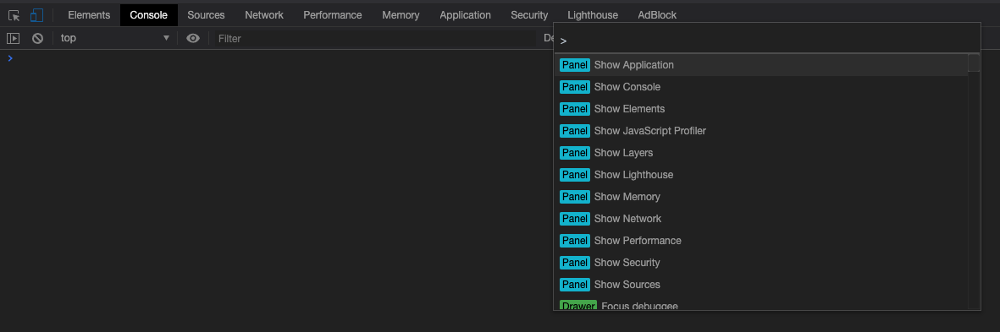
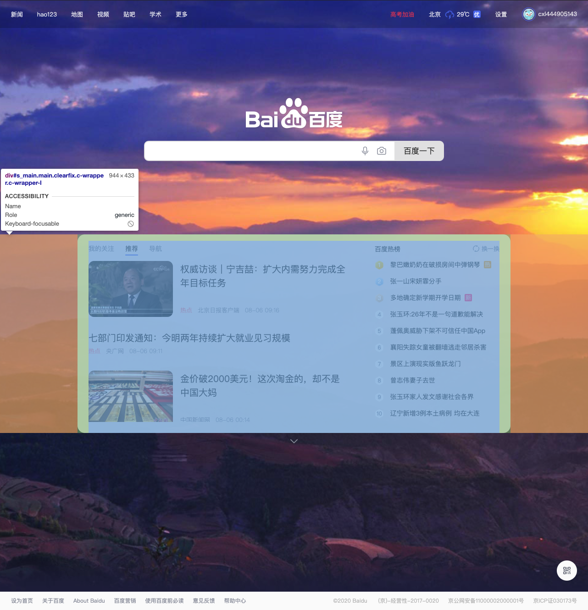
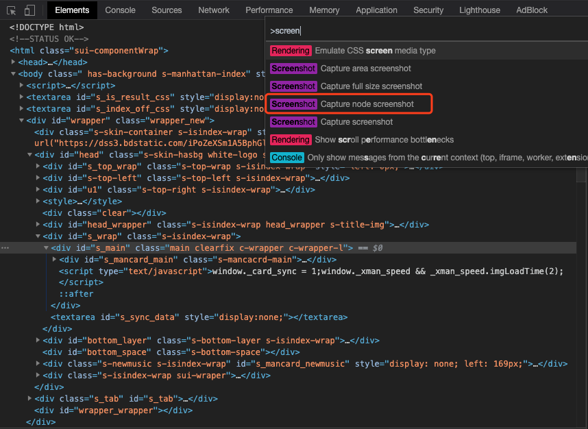

# DevTools

## Chrome DevTools 的功能简介

### 命令菜单

按`Cmd + Shift + P`（如果使用 Windows，则按`Ctrl + Shift + P`）打开**命令**菜单。通过命令菜单，可以快捷完成各种操作。

### 截图

若你只是想对一个单独的 DOM 进行截图时，使用别的工具可能比较费时费力，而且多次截图的尺寸和位置也没办法保持完全一致。

现在，你可以先选中那个 DOM 节点，打开命令菜单并使用`Capture node screenshot`即可针对单个 DOM 节点进行截图。

选中 DOM 元素：

打开命令菜单并使用`Capture node screenshot`进行截图：

截图结果：

除此之外，使用`Capture screenshot`可以对页面可视区域截图。使用`Capture full size screenshot`还可以全屏截图，不止是页面可视区域，还包含滚动条在内的所有页面内容。

### 待补充

https://mp.weixin.qq.com/s/5VPjY-IN8RyERMyCwqSGlQ
