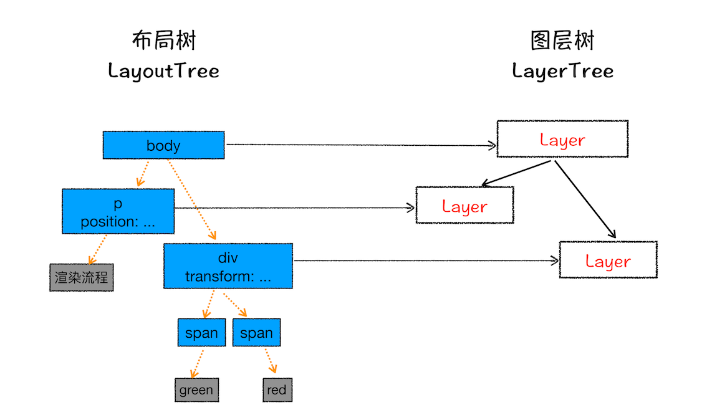

# 浏览器打开页面全流程

绝大部分内容复制于：

- [浏览器工作原理与实践 - 04 | 导航流程：从输入URL到页面展示，这中间发生了什么？](https://time.geekbang.org/column/article/117637)
- [浏览器工作原理与实践 - 05 | 渲染流程（上）：HTML、CSS和JavaScript，是如何变成页面的？](https://time.geekbang.org/column/article/118205)
- [浏览器工作原理与实践 - 06 | 渲染流程（下）：HTML、CSS和JavaScript，是如何变成页面的？](https://time.geekbang.org/column/article/118826)
- [浏览器工作原理与实践 - 22 | DOM树：JavaScript是如何影响DOM树构建的？](https://time.geekbang.org/column/article/140140)

## 1. 处理用户输入

当用户在地址栏中输入一个查询关键字时，地址栏会判断输入的关键字是**搜索内容**，还是**请求的 URL**。

若是搜索内容，地址栏会使用浏览器默认的搜索引擎，来合成新的带搜索关键字的 URL。

若是判断输入内容符合 URL 规则，比如输入的是`blog.windstone.cc`，那么地址栏会根据规则把这段内容加上协议，合成为完整的 URL，如`https://blog.windstone.cc`。

当用户输入关键字并键入回车之后，这意味着当前页面即将要被替换成新的页面。不过在这个流程继续之前，浏览器还给了当前页面一次执行`beforeunload`事件的机会，`beforeunload`事件允许页面在退出之前执行一些数据清理操作，还可以询问用户是否要离开当前页面，比如当前页面可能有未提交完成的表单等情况，因此用户可以通过`beforeunload`事件来取消导航，让浏览器不再执行任何后续工作。

若是当前页面没有监听`beforeunload`事件或者同意了继续后续流程，那么浏览器标签页上的图标便进入加载状态，**此时页面显示的依然是之前打开的页面内容，并没有立即替换为新的 URL 的页面。只有当新的 URL 请求返回之后，页面内容才会被替换**。

注意：接收用户输入的是浏览器进程，确定最终的 URL 后，浏览器进程会将 URL 转发给网络进程。

## 2. URL 请求过程

浏览器进程会通过进程间通信（IPC）把 URL 请求发送至网络进程，网络进程接收到 URL 请求后，会在这里发起真正的 URL 请求流程。

1. 查看浏览器本地缓存：首先，网络进程会查找本地缓存是否缓存了该资源。若有缓存资源且在有效期内，则直接返回资源给浏览器进程；否则，直接进入网络请求流程。
2. DNS 解析：请求前，要先进行 DNS 解析，以获取请求域名的服务器 IP 地址。如果请求协议是 HTTPS，那么还需要建立 TLS 连接。
3. 建立 TCP 连接。
4. 发送请求：构建请求行、请求头等信息，并把和该域名相关的 Cookie 等数据附加到请求头中，然后向服务器发送构建的请求信息。
5. 服务器返回响应数据
6. 根据响应码和响应头里的`Content-Type`判断如何处理响应数据
   1. 响应码为 301、302 等，重定向到新的 URL，重新进行**2. URL 请求过程**过程。
   2. 响应码为 200，且`Content-Type`为`text/html`，进入下一步准备渲染进程。
   3. `Content-Type`为下载类型，提交给浏览器的下载管理器
   4. 其他各种情况

::: warning 注意
当网络进程接收到响应头并判断`Content-Type`是`text/html`之后，浏览器进程会让当前页面执行退出前的清理操作，比如执行 JavaScript 中的`visibilitychange`，`beforunload`事件，清理操作执行结束之后，就进入下一步：准备渲染进程。

关于浏览器关闭页面时要执行的事件，可参考:

- [阮一峰 - Page Visibility API 教程](http://www.ruanyifeng.com/blog/2018/10/page_visibility_api.html)
- [阮一峰 - Page Lifecycle API 教程](http://www.ruanyifeng.com/blog/2018/11/page_lifecycle_api.html)

尤其需要注意的是，关闭页面时，可能会触发`visibilitychange`事件，`document.visibilityState`会变为`hidden`。
:::

## 3. 准备渲染进程

默认情况下，Chrome 会为每个页面分配一个渲染进程，也就是说，每打开一个新页面就会配套创建一个新的渲染进程。但是，也有一些例外，在某些情况下，浏览器会让多个页面直接运行在同一个渲染进程中。

那什么情况下多个页面会同时运行在一个渲染进程中呢？

要解决这个问题，我们就需要先了解下什么是同一站点（same-site）。具体地讲，我们将“同一站点”定义为根域名（例如，`windstone.cc`）加上协议（例如，`https://`或者`http://`），还包含了该根域名下的所有子域名和不同的端口，比如下面这三个：

```txt
https://blog.windstone.cc
https://cxl.windstone.cc
https://blog.windstone.cc:8080
```

它们都是属于同一站点，因为它们的协议都是 HTTPS，而且根域名也都是`windstone.cc`。

Chrome 的默认策略是，每个标签对应一个渲染进程。但如果从一个页面打开了另一个新页面，而新页面和当前页面属于同一站点的话，那么新页面会复用父页面的渲染进程。官方把这个默认策略叫`process-per-site-instance`。

若新页面和当前页面不属于同一站点，则会为新页面创建一个新的渲染进程。

总结来说，打开一个新页面采用的渲染进程策略就是：

- 通常情况下，打开新的页面都会使用单独的渲染进程；
- 如果从 A 页面打开 B 页面，且 A 和 B 都属于同一站点的话，那么 B 页面复用 A 页面的渲染进程；如果是其他情况，浏览器进程则会为 B 创建一个新的渲染进程。

渲染进程准备好之后，还不能立即进入文档解析状态，因为此时的文档数据还在网络进程中，并没有提交给渲染进程，所以下一步就进入了提交文档阶段。

::: warning 注意
多个页面共用一个渲染进程，也就意味着多个页面共用同一个主线程，所有页面的任务都是在同一个主线程上执行，这些任务包括渲染流程，JavaScript 执行，用户交互的事件的响应等等。但是，如果一个标签页里面执行一个死循环，那么意味着该 JavaScript 代码会一直霸占主线程，这样就导致了其它的页面无法使用该主线程，从而让所有页面都失去响应！
:::

## 4. 提交文档

所谓提交文档，就是指浏览器进程将网络进程接收到的 HTML 数据提交给渲染进程，具体流程如下：

- 首先当浏览器进程接收到网络进程的响应头数据之后，便向渲染进程发起“提交文档”的消息；
- 渲染进程接收到“提交文档”的消息后，会和网络进程建立传输数据的“管道”，开始持续传输数据，同时渲染进程里的 HTML 解析器会一边接受数据一边解析 HTML 内容并构建 DOM 树；
- 等文档数据传输完成之后，渲染进程会返回“确认提交”的消息给浏览器进程；
- 浏览器进程在收到“确认提交”的消息后，会更新浏览器界面状态，包括了安全状态、地址栏的 URL、前进后退的历史状态，并更新 Web 页面。

这也就解释了为什么在浏览器的地址栏里面输入了一个地址后，之前的页面没有立马消失，而是要加载一会儿才会更新页面。到这里，一个完整的导航流程就“走”完了，这之后就要进入渲染阶段了。

## 5. 渲染阶段

一旦文档被提交，渲染进程便开始页面解析和子资源加载了。一旦页面生成完成，渲染进程会发送一个消息给浏览器进程，浏览器接收到消息后，会停止标签图标上的加载动画。

### 构建 DOM 树


因为渲染引擎无法直接理解和使用 HTML 内容（以字节流的形式），所以需要将 HTML 字节流转换为浏览器能够理解的结果——DOM。DOM 提供了对 HTML 文档结构化的表述。

在渲染引擎中，DOM 有三个层面的作用:

- 从页面的视角来看，DOM 是生成页面的基础数据结构。
- 从 JavaScript 脚本视角来看，DOM 提供给 JavaScript 脚本操作的接口，通过这套接口，JavaScript 可以对 DOM 结构进行访问，从而改变文档的结构、样式和内容。
- 从安全视角来看，DOM 是一道安全防护线，一些不安全的内容在 DOM 解析阶段就被拒之门外了。

简言之，DOM 是表述 HTML 的内部数据结构，它会将 Web 页面和 JavaScript 脚本连接起来，并过滤一些不安全的内容。

渲染引擎内部的**HTML解析器**（HTMLParser）模块，负责将 HTML 字节流转换为 DOM 结构。而且，HTML 解析器并不是等整个文档加载完成之后再解析的，而是**网络进程加载了多少数据，HTML 解析器便解析多少数据**。


HTML 字节流转换为 DOM 的流程为：

1. 通过分词器将字节流转换为 Token
2. 将 Token 解析为 DOM 节点
3. 将 DOM 节点添加到 DOM 树中

更加详细的流程，可以参考: [浏览器工作原理与实践 - 22 | DOM树：JavaScript是如何影响DOM树构建的？](https://time.geekbang.org/column/article/140140)

::: tip 提示
DOM 树的构建过程是一个深度遍历过程：当前节点的所有子节点都构建好后才会去构建当前节点的下一个兄弟节点。
:::

### 样式计算（构建 CSSOM 树）

和 HTML 一样，渲染引擎也无法直接理解 CSS 文件内容，所以需要将其解析成渲染引擎能够理解的结构，这个结构就是 CSSOM。

在渲染引擎中，CSSOM 有具有两个作用:

- 提供给 JavaScript 操作样式表的能力
- 为布局树的合成提供基础的样式信息

这个 CSSOM 体现在 DOM 中就是[`document.styleSheets`](https://developer.mozilla.org/zh-CN/docs/Web/API/Document/styleSheets)。

#### 把 CSS 转换为浏览器能够理解的结构

CSS 样式来源主要有三种：

- 通过`link`标签引用的外部 CSS 文件
- `style`标签内的 CSS
- 元素的`style`属性内嵌的 CSS

当渲染引擎接收到 CSS 文本时，会执行一个转换操作，将 CSS 文本转换为浏览器可以理解的结构——styleSheets。你可以在控制台里输入`document.styleSheets`就可以看到这些样式。

::: warning 注意
经过实测，在浏览器里输入`document.styleSheets`，得到的只是`link`标签引用的外部 CSS 和`style`标签内的 CSS，不包含元素`style`属性内嵌的 CSS。
:::

#### 转换样式表中的属性值，使其标准化

经过上一步操作，已经将 CSS 文本转换为浏览器可以理解的结构了，接下来就要对其进行属性值的标准化操作。


CSS 文本中的很多属性值，如`2em`、`blue`、`bold`不容易渲染引擎理解，因此需要将所有值转换为渲染引擎容易理解的、标准化的计算值，这个过程就是属性值标准化。

我们看到，经过属性值标准化后，`2em`被解析成`32px`，`blue`被解析成`rgb(0, 0, 255)`，`bold`被解析成`700`。

#### 计算出 DOM 树中每个节点的具体样式

样式计算阶段的目的是为了计算出 DOM 节点中每个元素的具体样式，在计算过程中需要遵守 CSS 的继承和层叠两个规则。这个阶段最终输出的内容是每个 DOM 节点的样式，并被保存在 ComputedStyle 的结构内。可在 Chrome 的开发者工具 --> Elements 里选择某个 DOM 元素，并在 Computed 子标签里查看该 DOM 元素的计算样式。

### 布局

经过上两步，我们已经有了 DOM 树和 DOM 树中每个元素的样式。下一步，我们需要计算出 DOM 树中可见元素的几何位置，我们把这个计算过程叫做布局。

#### 创建布局树

DOM 树中仍然包含了一些不可见的元素，比如`head`标签、`meta`标签，以及那些`display: none`的元素。因此，在显示之前，我们需要额外构建一棵只包含可见元素的布局树（Render Tree）。


为了构建布局树，浏览器大体上完成了下面这些工作：

- 遍历 DOM 树中的所有可见节点，并把这些节点加到布局中。
- 不可见的节点会被布局树忽略掉，如`head`标签下面的全部内容，再比如`body.p.span`这个元素，因为它的属性包含`dispaly:none`，所以这个元素也没有被包进布局树。

#### 布局计算

有了完整的布局树之后，就要计算布局树节点的坐标位置了。

### 分层

有了布局树，且布局树上每个节点的具体位置信息都计算出来了，但仍然不能开始绘制页面，因为页面中有很多复杂的效果，如一些复杂的 3D 变换、页面滚动，或者使用`z-index`做 Z 轴排序等，为了更加方便地实现这些效果，渲染引擎还需要为特定的节点生成专用的图层，并生成一棵对应的图层树（LayerTree）。

浏览器的页面实际上被分成了很多图层，这些图层叠加后合成了最终的页面。



通常情况下，并不是布局树的每个节点都包含一个图层，如果一个节点没有对应的层，那么这个节点就从属于父节点的图层。如上图中的`span`标签没有专属图层，那么它们就从属于它们的父节点图层。但不管怎样，最终每一个节点都会直接或者间接地从属于一个层。

通常情况下，满足下面两点中任意一点的元素就可以被提升为单独的一个图层，渲染引擎会为其创建新的层。

- 拥有层叠上下文属性的元素会被提升为单独的一层。具体元素具有哪些层叠上下文属性，可参见[MDN - 层叠上下文](https://developer.mozilla.org/zh-CN/docs/Web/Guide/CSS/Understanding_z_index/The_stacking_context)。
- 需要剪裁（clip）的地方也会被创建为图层，比如元素存在`overflow: auto`且其子元素会超过自身导致的剪裁。

### 图层绘制

图层树构建好之后，渲染引擎会对图层树中的每个图层进行绘制。渲染引擎会把一个图层的绘制拆分成很多小的绘制指令，然后再把这些指令按照顺序组成一个待绘制列表。

绘制一个元素通常需要好几条绘制指令，因为每个元素的背景、前景、边框都需要单独的指令去绘制。所以在图层绘制阶段，输出的内容就是这些待绘制列表。

### 合成

#### 栅格化（raster）操作

当图层的绘制列表准备好之后，主线程会把该绘制列表提交给合成线程，由合成线程来进行绘制操作。

在有些情况下，有的图层可以很大，比如有的页面你使用滚动条要滚动好久才能滚动到底部，但是通过视口，用户只能看到页面的很小一部分，所以在这种情况下，要绘制出所有图层内容的话，就会产生太大的开销，而且也没有必要。

基于这个原因，合成线程会将图层划分为图块（tile），这些图块的大小通常是 256x256 或者 512x512，如下图所示：


合成线程会按照视口附近的图块来优先生成位图，实际生成位图的操作是由栅格化线程来执行的。所谓栅格化，是指将图块转换为位图。而图块是栅格化执行的最小单位。渲染进程维护了一个栅格化线程池，所有的图块栅格化都是在线程池内执行的。


通常，栅格化过程都会使用 GPU 来加速生成，使用 GPU 生成位图的过程叫快速栅格化，或者 GPU 栅格化，生成的位图被保存在 GPU 内存中。GPU 操作是运行在 GPU 进程中，如果栅格化操作使用了 GPU，那么最终生成位图的操作是在 GPU 中完成的，这就涉及到了跨进程操作。


::: tip
合成操作是在合成线程上完成的，这也就意味着在执行合成操作时，是不会影响到主线程执行的。这就是为什么经常主线程卡住了，但是 CSS 动画依然能执行的原因。
:::

### 显示

一旦所有图块都被光栅化，合成线程就会生成一个绘制图块的命令——“DrawQuad”，然后将该命令提交给浏览器进程。浏览器进程里面有一个叫 viz 的组件，用来接收合成线程发过来的 DrawQuad 命令，然后根据 DrawQuad 命令，将其页面内容绘制到内存中，最后再将内存显示在屏幕上。到这里，经过这一系列的阶段，编写好的 HTML、CSS、JavaScript 等文件，经过浏览器就会显示出漂亮的页面了。

### 总结


完整的渲染流程大致可总结为如下。

- 【DOM】渲染进程将 HTML 内容转换为能够读懂的 DOM 树结构。
- 【Style】渲染引擎将 CSS 样式表转化为浏览器可以理解的 styleSheets，计算出 DOM 节点的样式。
- 【layout】创建布局树，并计算元素的布局信息。
- 【layer】对布局树进行分层，并生成分层树。
- 【Paint】为每个图层生成绘制列表，并将其提交到合成线程。
- 【tiles、raster】合成线程将图层分成图块，并在光栅化线程池中将图块转换成位图。
- 【draw quad】合成线程发送绘制图块命令 DrawQuad 给浏览器进程。
- 【display】浏览器进程根据 DrawQuad 消息生成页面，并显示到显示器上。

提交数据之后，渲染进程会创建一个空白页面，而创建空白页面到页面首次渲染之间的时间，我们通常称之为**解析白屏**。

### 相关概念：重排、重绘、合成

#### 更新了元素的几何属性（重排）


如果你通过 JavaScript 或者 CSS 修改元素的几何位置属性，例如改变元素的宽度、高度等，那么浏览器会触发重新布局，解析之后的一系列子阶段，这个过程就叫重排。无疑，重排需要更新完整的渲染流水线，所以开销也是最大的。

#### 更新元素的绘制属性（重绘）


如果修改了元素的背景颜色，那么布局阶段将不会被执行，因为并没有引起几何位置的变换，所以就直接进入了绘制阶段，然后执行之后的一系列子阶段，这个过程就叫重绘。相较于重排操作，重绘省去了布局和分层阶段，所以执行效率会比重排操作要高一些。

#### 直接合成


如果更改一个既不要布局也不要绘制的属性，渲染引擎将跳过布局和绘制，只执行后续的合成操作，我们把这个过程叫做合成。比如，我们使用了 CSS 的`transform`来实现动画效果，这可以避开重排和重绘阶段，直接在合成线程上执行合成动画操作。这样的效率是最高的，因为是在非主线程上合成，并没有占用主线程的资源，另外也避开了布局和绘制两个子阶段，所以相对于重绘和重排，合成能大大提升绘制效率。

##### will-change

当使用`will-change`提前告诉渲染引擎元素将要做特效变换时，渲染引擎会将该元素单独实现为一层，等这些变换发生时，渲染引擎会通过合成线程直接去处理变换，这些变换并没有涉及到主线程，这样就大大提升了渲染的效率。这也是 CSS 动画比 JavaScript 动画高效的原因。

但是凡事都有两面性，每当渲染引擎为一个元素准备一个独立层的时候，它占用的内存也会大大增加，因为从层树开始，后续每个阶段都会多一个层结构，这些都需要额外的内存，所以你需要恰当地使用 `will-change`。
