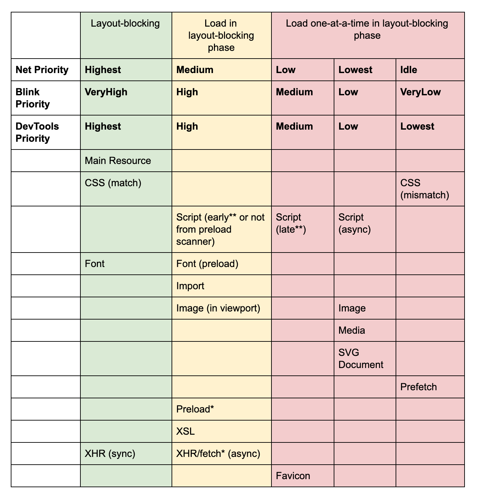

# 浏览器里资源请求优先级

## 资源请求优先级

- [Preload, Prefetch And Priorities in Chrome](https://medium.com/reloading/preload-prefetch-and-priorities-in-chrome-776165961bbf)
- [Resource Fetch Prioritization and Scheduling in Chromium](https://docs.google.com/document/d/1bCDuq9H1ih9iNjgzyAL0gpwNFiEP4TZS-YLRp_RuMlc/edit)
- [浏览器页面资源加载过程与优化](https://juejin.im/post/5a4ed917f265da3e317df515)



注释:

- `*` Preload using “as” or fetch using “type” use the priority of the type they are requesting. (e.g. preload as=stylesheet will use Highest priority). With no “as” they will behave like an XHR.
- `**` “Early” is defined as being requested before any non-preloaded images have been requested (“late” is after).

自 2016 年 6 月起，以上表格表示了 Chrome 里（in Blink as of Chrome 46 and beyond）处理所有资源的优先级。

资源的优先级划分为 5 级。不同场景下，这 5 级的命名和描述上可能有所不同，但本质上是一一对应的。比如:

- 网络优先级: Highest、Medium、Low、Lowest、Idle
- 浏览器内核: VeryHigh、High、Medium、Low、VeryLow
- 用户端控制台显示: Highest、High、Medium、Low、Lowest

是不是跟星巴克咖啡的中杯、大杯、超大杯类似？

### script 优先级

`script`脚本的优先级取决于它们在文档里的位置以及它们是否是`async`异步的、`defer`延迟的或`blocking`阻塞的。

- 位于第一个图片之前被请求的`blocking`脚本的优先级是: Net Priority:Medium
- 位于第一个图片之后被请求的`blocking`脚本的优先级是: Net Priority:Low
- `async`/`defer`/`injected`脚本的优先级是: Net Priority:Lowest

这里的`第一个图片`的定义是，在任何非`proload`的图片被请求之前的第一个被请求的图片。

### image 优先级

可见且位于视口内的`image`图片（Net Priority:Medium）比那些不在视口内的图片（Net Priority:Lowest）具有更高的优先级，因此在某些程度上 Chrome 会尽量为你（伪）懒加载这些图片。一开始具有低优先级的图片（Net Priority:Lowest）在布局完成之后被发现位于视口内时，将获得优先级提升（Net Priority:Medium）。但是当布局完成时已经在请求中的托片不会重新更改优先级。

### preload & as

`preload`且使用`as`属性的资源，将获得与该资源类型相同的资源优先级。比如，`<link rel="preload" as="style">`将和样式表一样获得 Net Priority:Highest 的优先级；`<link rel="preload" as="script">`将获得 Net Priority:Medium/Low 的优先级。这些资源仍然遵从着相同的 CSP 政策。

`preload`且没有使用`as`属性的资源的请求优先级与异步 XHR 的优先级一致。

## preload、prefetch

### preload

 `<link>`元素的`rel`属性的属性值`preload`能够让你在你的 HTML 页面`<head>`元素内部书写一些声明式的资源获取请求，可以指明哪些资源是在页面加载完成后即刻需要的。对于这种即刻需要的资源，你可能希望在页面加载的生命周期的早期阶段就开始获取，在浏览器的主渲染机制介入前就进行预加载。这一机制使得资源可以更早的得到加载并可用，且更不易阻塞页面的初步渲染，进而提升性能。

```html
<head>
  <meta charset="utf-8">
  <title>JS and CSS preload example</title>
  <link rel="preload" href="style.css" as="style">
  <link rel="preload" href="hello-world.png" as="script">
  <link rel="stylesheet" href="style.css">
</head>
<body>
<!-- ... -->
</body>
```

通俗的解释：

- 假设在如下的 HTML 文件里，`style.css`有张背景图片`hello-world.png`
- 无`preload`时，数据请求的顺序为：HTML -> `style.css` -> `hello-world.png`
- 有针对`hello-world.png`的`preload`时，数据请求的顺序为：HTML -> `style.css`、`hello-world.png`

Reference: [MDN - 通过rel="preload"进行内容预加载](https://developer.mozilla.org/zh-CN/docs/Web/HTML/Preloading_content)

### prefetch

链接预取是一种浏览器机制，其利用浏览器空闲时间来下载或预取用户在不久的将来可能访问的文档。网页向浏览器提供一组预取提示，并在浏览器完成当前页面的加载后开始静默地拉取指定的文档并将其存储在缓存中。当用户访问其中一个预取文档时，便可以快速的从浏览器缓存中得到。

Reference: [MDN - Link prefetching FAQ](https://developer.mozilla.org/zh-CN/docs/Web/HTTP/Link_prefetching_FAQ)

### 对比

- `preload`
  - 高优先级
  - 浏览器预先请求当前页必须需要的资源，以避免在用到的时候实时去请求
  - 应用场景：假设主 JS 文件里会动态创建`image`标签，并插入到 DOM 里
    - 不采用`preload`，则时间线是这样的：请求主 JS 文件 --> 执行主 JS 文件 --> 创建`image`标签并插入 DOM --> 请求`image`文件 --> 渲染到页面
    - 采用`preload`预加载`image`，则时间线是这样的：请求主 JS 文件、`image`文件 --> 创建`image`标签并插入 DOM（此时`image`文件已经加载好） --> 渲染到页面
  - 不会阻塞渲染，不会阻塞`window`的`onload`事件
- `prefetch`
  - 低优先级
  - 浏览器在后台（空闲时）获取将来可能用得到的资源，并且将他们存储在浏览器的缓存中

### 应用

- 使用`preload`加载字体，解决文字闪动的问题
