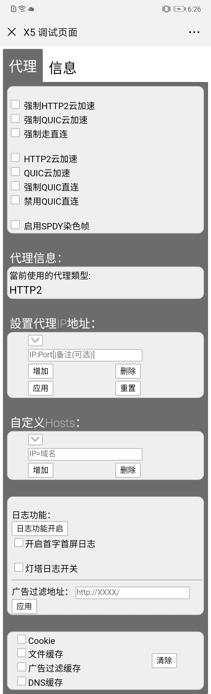

# 调试

[[toc]]

## 特定 APP

### Chrome

#### 远程调试

参考文档：[在安卓设备上使用 Chrome 远程调试功能](http://wiki.jikexueyuan.com/project/chrome-devtools/remote-debugging-on-android.html)

可能遇到的问题及解决方法：

1. 手机设置里，打开“USB 调试”开关后，Chrome 上未显示设备，可尝试以下解决方法：
    - 使用正规的数据线（最好是原装的）
    - 重置“开发者选项”

### 微信

#### Android 微信

Android 微信可以通过打开`http://debugx5.qq.com/`，进行一些代理、调试配置。




## Charles

### iOS 安装证书

1. 在 Safari 中访问`http://chls.pro/ssl`，安装证书
2. （需要抓包 https 时，针对 iOS 11 及以上）打开【设置】>【通用】>【关于本机】>【证书信任设置】，将上一步安装的证书设置为信任

### 解决 Charles 无法正常抓包 iOS 11 中的 Https 请求

[解决Charles无法正常抓包iOS 11中的Https请求](https://www.jianshu.com/p/4005cf4f370d)

## 浏览器控制台

[[toc]]

### $ 符号

- `$0` ~ `$4`：在 elements 面板中标记一个 DOM 元素，然后在 console 中使用它。Chrome Inspector 会保存最后 5 个元素在其历史记录中，所以最后标记的元素可以用 $0 来显示，倒数第二个被标记的元素为 $1 ，以此类推。
- `$(selector)`：`$('.class')`会返回 CSS 选择器所匹配的第一个元素
- `$$(selector)`：`$$('.class')`会返回所有的元素
- `$_`：返回最近执行表达式的值

### 事件相关

- `getEventListeners(document)`：返回指定 DOM 元素上注册的事件监听器。
- `monitorEvents(window, ['resize', 'scroll'])`/`unmonitorEvents(DOMElement)`：在指定 DOM 元素上触发任何事件时，都可以在控制台中看到相关信息。直到取消对相应元素的监视。

### debugger

```js
if (thisThing) {
  debugger
}
```

### console 命令

#### console.log 对象引用

console.log 会对你展示的对象保持引用关系。在控制台输入以下代码，查看结果。

```js
var fruits = [{one: 1}, {two: 2}, {three: 3}];
console.log('fruits before modification: ', fruits);   // 第 一 处
console.log('fruits before modification - stringed: ', JSON.stringify(fruits));  // 第 二 处
fruits.splice(1);
console.log('fruits after modification: ', fruits);  // 第 三 处
console.log('fruits after modification - stringed : ', JSON.stringify(fruits))  // 第 四 处
```

比较第一处和第三处的数据，发现展示的对象是相同的，只保留了`{one: 1}`，但第一处能看出来，有三项数据，第三处有一项数据。

当调试对象或数组时，你需要注意这点。我们可以看到 fruits 数组再被修改前包含 3 个对象，但之后发生了变化。如需要在特定时刻查看结果，可以使用 JSON.stringify 来展示信息。不过这种方法对于展示大对象来说并不方便。

#### console.assert()

`console.assert(expression, message)`

如果 expression 表达式的结果为 false，Console.assert 将会抛出错误。关键的是，assert 函数不会由于报错而停止评估之后的代码。它可以帮助你调试冗长棘手的代码，或者找到多次迭代后函数自身产生的错误。

```js
function callAssert(a,b) {
  console.assert(a === b, 'message: a !== b ***** a: ' + a +' b:' +b);
}
callAssert(5,6);
callAssert(1,1);
```

#### console.count()

它就是一个会计算相同表达式执行过多少次的 console.log。其它的都一样。

```js
for(var i =0; i <=3; i++) {
  console.count(i + ' Can I go with you?');
  console.count('No, no this time');
}
// 输出:
// 0 Can I go with you?: 1
// No, no this time: 1
// 1 Can I go with you?: 1
// No, no this time: 2
// 2 Can I go with you?: 1
// No, no this time: 3
// 3 Can I go with you?: 1
// No, no this time: 4
```

#### console.table

```js
var animals = [
  { animal: 'Horse', name: 'Henry', age: 43 },
  { animal: 'Dog', name: 'Fred', age: 13 },
  { animal: 'Cat', name: 'Frodo', age: 18 }
]
console.table(animals)
```

#### console.trace

获取函数的堆栈踪迹。

您可能了解 JavaScript 框架，生成大量代码 -- 快速地。它会构建视图和触发事件，因此你最终会想要知道是什么在调用函数。

JavaScript 不是一个非常结构化的语言，所以有时很难搞清楚 发生了什么 和 什么时候发生的 。因此 console.trace （console 面板中只需要 trace）就派上用场了。

假设你想知道 car 实例的 funcZ 方法的整个堆栈踪迹：

```js
var func1 = function() {
  func2();
}
var func2 = function() {
  func4();
}
var func3 = function() {
}
var func4 = function() {
  car = new Car();
  car.funcX();
}
var Car = function() {
  this.brand = 'volvo';
  this.color = 'red';
  this.funcX = function() {
    this.funcY();
  }
  this.funcY = function() {
    this.funcZ();
  }
   this.funcZ = function() {
    console.trace('trace car')
  }
}
func1();

// 输出：
// trace car
//     funcZ    @ 代码文件名和行信息
//     funcY    @ 代码文件名和行信息
//     funcX    @ 代码文件名和行信息
//     func4    @ 代码文件名和行信息
//     func2    @ 代码文件名和行信息
//     func1    @ 代码文件名和行信息
//     (anonymous function)    @ 代码文件名和行信息
```

#### 使用 CSS 定制 console

在更复杂的调试中我们有时想输出很多行。为了使你的输出保持更好的结构，你可以使用更多的 console 方法，如：

- console.log
- console.debug
- console.warn
- console.info
- console.error

等。

然后，你还可以在调试器中过滤他们。但是有时当你调试 JavaScript 时，这并不是你真正想要的。现在，你可以给你的信息添加点创意和样式了。你可以使用 CSS 并制定你自己的 console 输出格式：

```js
console.todo = function(msg) {
  console.log('%c %s %s %s', 'color: yellow; background-color: black;', '–', msg, '–');
}

console.important = function(msg) {
  console.log('%c %s %s %s', 'color: brown; font-weight: bold; text-decoration: underline;', '–', msg, '–');
}

console.todo("This is something that’ s need to be fixed");
console.important('This is an important message');
```

在 console.log() 中，%s 表示一个字符串，%i 表示整型，%c 表示自定义样式。你可能会找到更好的方式来使用它们。如果你使用单页面框架，你可能想对 view 的输出信息使用一种样式，对 models，collections，controllers 等使用其他的样式，你可能会使用 wlog，clog，mlog 等简称来命名。总之，尽情发挥你的创造力吧。

Reference: [console.log - MDN](https://developer.mozilla.org/zh-CN/docs/Web/API/Console/log)

#### 使用 console.time() 和 console.timeEnd() 对循环做基准测试

知道程序运行的确切时间是非常有用的，尤其当调试非常慢的循环时。通过给函数传参，你甚至可以启动多个计时器。让我们看看如何做：

```js
console.time('Timer1');

var items = [];

for(var i = 0; i < 100000; i++){
   items.push({index: i});
}

console.timeEnd('Timer1');
```

#### console 中使用 debug()

假设你想在某个函数中设置一个断点。最常用的两种方式是：

- 在调试器中找到相应的行并设置一个断点
- 在你的脚本中添加一个 debugger

以上两种方法，你都必须到你的文件中找到你想调试的那一行。

可能不常见的方式是使用 console。在 console 中使用 debug(funcName)，脚本会在运行到你传入的函数的时候停止。这种方式比较快，缺点是对私有和匿名函数无效。但是，如果排除这些情形的话，这可能是定位要调试函数的最快方法。

```js
var func1 = function() {
  func2();
};

var Car = function() {
  this.funcX = function() {
    this.funcY();
  }

  this.funcY = function() {
    this.funcZ();
  }
}

var car = new Car();
```

在 console 中输入 debug(car.funcY)，在调试模式下当调用 car.faunY 时脚本会停下来。

#### 监控特定函数调用及参数

在 Chrome 的 console 面板中，你可以监视一个特定的函数。每次该函数被调用，它将连同传入的参数一起打印出来。

```js
var func1 = function(x, y, z) {
//....
};
```

在控制台输入

```js
// 监控
> monitor(func1)

// 调用 func1
> func1(1, 2)
  function func1 called with arguments: 1, 2
```

### 断点调试

#### JS 断点调试

#### Sources 断点

#### DOM 断点调试

#### XHR 断点调试

#### 事件监听 断点调试

Reference:

- [前端早读课【第556期】一探前端开发中的JS调试技巧](https://mp.weixin.qq.com/s?__biz=MjM5MTA1MjAxMQ==&mid=2651220284&idx=1&sn=26eab0ec27163e7cb020fd95ac0dfaee&scene=21#wechat_redirect)
- [前端早读课【第556期】一探前端开发中的JS调试技巧](https://mp.weixin.qq.com/s?__biz=MjM5MTA1MjAxMQ==&mid=2651220284&idx=1&sn=26eab0ec27163e7cb020fd95ac0dfaee&scene=21#wechat_redirect)
- [前端早读课【第1104期】14 个你可能不知道的 JavaScript 调试技巧](https://mp.weixin.qq.com/s?__biz=MjM5MTA1MjAxMQ==&mid=2651227260&idx=1&sn=7471c6326c41ab56d9653948ab5803a8&chksm=bd495df88a3ed4eeec595e226eaa075890ff0b33d08ee72f5639868c63b3b8dd65d255f2cf22&scene=21#wechat_redirect)
- [前端早读课【第1112期】前端 Console 调试小技巧](https://mp.weixin.qq.com/s/0g8X8As0X5FdBdjnWWBQkQ)
