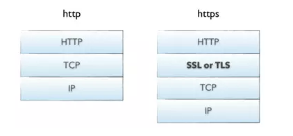

# https

[[toc]]

Reference:

- [阮一峰 - SSL/TLS协议运行机制的概述](http://www.ruanyifeng.com/blog/2014/02/ssl_tls.html)

## 术语

- SSL: Secure Sockets Layer，安全套接层
- TLS: Transport Layer Security，传输层安全协议

TLS 1.0 通常被标示为 SSL 3.1，TLS 1.1 为 SSL 3.2，TLS 1.2 为 SSL 3.3。

SSL/TLS 是一种介于传输层和应用层的协议。



## http vs https

不使用 SSL/TLS 的`http`，所有信息明文传播，存在的风险有：

- 窃听风险（eavesdropping）：第三方可以获知通信内容。
- 篡改风险（tampering）：第三方可以修改通信内容。
- 冒充风险（pretending）：第三方可以冒充他人身份参与通信。

SSL/TLS协议是为了解决这三大风险而设计的，希望达到：

- 所有信息都是加密传播，第三方无法窃听。
- 具有校验机制，一旦被篡改，通信双方会立刻发现。
- 配备身份证书，防止身份被冒充。

`https`是`http`的安全版，它的核心是 SSL/TLS（`https`后面的"s"就是指 SSL），其原理就是在传输层和应用层之间加了一层 SSL/TLS。

## SSL/TLS 加密基本过程

本节内容的重点是设计思想和运行过程，不涉及具体的实现细节。

SSL/TLS 协议的基本思路是采用公钥加密法，也就是说，客户端先向服务器端索要公钥，然后用公钥加密信息，服务器收到密文后，用自己的私钥解密。

- 如何保证公钥不被篡改？

解决方法：将公钥放在数字证书中。只要证书是可信的，公钥就是可信的。

- 公钥加密计算量太大，如何减少耗用的时间？

解决方法：每一次对话（session），客户端和服务器端都生成一个"对话密钥"（session key），用它来加密信息。由于"对话密钥"是对称加密，所以运算速度非常快，而服务器公钥只用于加密"对话密钥"本身，这样就减少了加密运算的消耗时间。

SSL/TLS协议的基本过程是这样的：

1. 客户端向服务器端索要并验证公钥。
2. 双方协商生成"对话密钥"。
3. 双方采用"对话密钥"进行加密通信。

上面过程的前两步，又称为"握手阶段"（handshake），接下来将详细说明握手阶段。

### 握手阶段


"握手阶段"涉及四次通信。

::: warning 注意
需要注意的是，"握手阶段"的所有通信都是明文的。
:::

#### 第一次通信: 客户端发出请求（ClientHello）

首先，客户端（通常是浏览器）先向服务器发出加密通信的请求，这被叫做`ClientHello`请求。

在这一步，客户端主要向服务器提供以下信息。

- 支持的协议版本，比如 TLS 1.0 版。
- 一个客户端生成的随机数，稍后用于生成"对话密钥"。（cxl: 这里产生生成对话秘钥的第一个随机数）
- 支持的加密方法，比如 RSA 公钥加密。
- 支持的压缩方法。

这里需要注意的是，客户端发送的信息之中不包括服务器的域名。也就是说，理论上服务器只能包含一个网站，否则会分不清应该向客户端提供哪一个网站的数字证书。这就是为什么通常一台服务器只能有一张数字证书的原因。

对于虚拟主机的用户来说，这当然很不方便。2006年，TLS 协议加入了一个`Server Name Indication`扩展，允许客户端向服务器提供它所请求的域名。

#### 第二次通信: 服务器回应（ServerHello）

服务器收到客户端请求后，向客户端发出回应，这叫做 ServerHello。服务器的回应包含以下内容。

- 确认使用的加密通信协议版本，比如 TLS 1.0 版本。如果浏览器与服务器支持的版本不一致，服务器关闭加密通信。
- 一个服务器生成的随机数，稍后用于生成"对话密钥"。（cxl: 这里产生生成对话秘钥的第二个随机数）
- 确认使用的加密方法，比如 RSA 公钥加密。
- 服务器证书。

除了上面这些信息，如果服务器需要确认客户端的身份，就会再包含一项请求，要求客户端提供"客户端证书"。比如，金融机构往往只允许认证客户连入自己的网络，就会向正式客户提供 USB 密钥，里面就包含了一张客户端证书。

#### 第三次通信: 客户端回应

客户端收到服务器回应以后，首先验证服务器证书。如果证书存在以下任意一种情况，就会向访问者显示一个警告，由其选择是否还要继续通信。

- 证书不是可信机构颁布
- 证书中的域名与实际域名不一致
- 证书已经过期

如果证书没有问题，客户端就会从证书中取出服务器的公钥。然后，向服务器发送下面三项信息。

- 一个随机数。该随机数用服务器公钥加密，防止被窃听。（cxl: 这里产生生成对话秘钥的第三个随机数）
- 编码改变通知，表示随后的信息都将用双方商定的加密方法和密钥发送。
- 客户端握手结束通知，表示客户端的握手阶段已经结束。这一项同时也是前面发送的所有内容的`hash`值，用来供服务器校验。

上面第一项的随机数，是整个握手阶段出现的第三个随机数，又称`pre-master key`。有了它以后，客户端和服务器就同时有了三个随机数，接着双方就用事先商定的加密方法，各自生成本次会话所用的同一把"会话密钥"。

TODO: 如何通过三个随机数，来生成会话秘钥？

至于为什么一定要用三个随机数，来生成"会话密钥"，dog250 解释得很好：

> "不管是客户端还是服务器，都需要随机数，这样生成的密钥才不会每次都一样。由于SSL协议中证书是静态的，因此十分有必要引入一种随机因素来保证协商出来的密钥的随机性。
>
> 对于RSA密钥交换算法来说，pre-master-key本身就是一个随机数，再加上hello消息中的随机，三个随机数通过一个密钥导出器最终导出一个对称密钥。
>
> pre master的存在在于SSL协议不信任每个主机都能产生完全随机的随机数，如果随机数不随机，那么pre master secret就有可能被猜出来，那么仅适用pre master secret作为密钥就不合适了，因此必须引入新的随机因素，那么客户端和服务器加上pre master secret三个随机数一同生成的密钥就不容易被猜出了，一个伪随机可能完全不随机，可是是三个伪随机就十分接近随机了，每增加一个自由度，随机性增加的可不是一。"

此外，如果前一步，服务器要求客户端证书，客户端会在这一步发送证书及相关信息。

#### 第四次通信: 服务器的最后回应

服务器收到客户端的第三个随机数`pre-master key`之后，计算生成本次会话所用的"会话密钥"。然后，向客户端最后发送下面信息。

- 编码改变通知，表示随后的信息都将用双方商定的加密方法和密钥发送。
- 服务器握手结束通知，表示服务器的握手阶段已经结束。这一项同时也是前面发送的所有内容的`hash`值，用来供客户端校验。

至此，整个握手阶段全部结束。接下来，客户端与服务器进入加密通信，就完全是使用普通的 HTTP 协议，只不过用"会话密钥"加密内容。

### 加密通信过程中的算法

#### 非对称加密

私钥和公钥不是同一个，公钥用于发送给发送方，私钥用于接收方自己保留。发送方使用接收方公布的公钥对通信内容进行加密，只有接收方自身保留的私钥才能解密。

非对称加密相比对称加密更加安全，但也存在两个明显缺点：

- CPU 计算资源消耗非常大。一次完全 TLS 握手，密钥交换时的非对称解密计算量占整个握手过程的 90% 以上。而对称加密的计算量只相当于非对称加密的 0.1%，如果应用层数据也使用非对称加解密，性能开销太大，无法承受。
- 非对称加密算法对加密内容的长度有限制，不能超过公钥长度。比如现在常用的公钥长度是 2048 位，意味着待加密内容不能超过 256 个字节。

因此，非对称加密算法目前只能用来作“密钥交换”或者“内容签名”，而不适合用来做应用层传输内容的加解密。非对称密钥交换算法是整个 HTTPS 得以安全的基石，充分理解非对称密钥交换算法是理解 HTTPS 协议和功能的关键。

常见的非对称加密算法有：

- RSA
  - 算法实现简单，诞生与1977年，历史悠久，经过了长时间的破解测试，安全性高。
  - 缺点就是需要比较大的素数(目前常用的是2048位)来保证安全强度，很消耗CPU运算资源。
  - RSA 是目前'唯一一个'既能用于'密钥交换'又能用于'证书签名'的算法。
- DH
- DHE
- ECDH
- ECDHE

目前最常用的非对称加密算法是 RSA 算法。

#### 对称加密

对称加密是指加密和解密使用的是同一个秘钥，即明文 A 通过秘钥 B 加密为密文 C，则将密文 C 用秘钥 B 解密，可以得到明文 A。

异或运算就是一种典型的对称密码，示例如下。

加密：

```sh
明文 A: 0110 0101 1101
秘钥 B: 0101 1001 1010
异或运算———————————————
密文 C: 0011 1100 0111
```

解密：

```sh
密文 C: 0011 1100 0111
秘钥 B: 0101 1001 1010
异或运算———————————————
明文 A: 0110 0101 1101
```

对称加密的优势：加解密速度快，效率高
对称加密的劣势：双方需要事先知道同一把秘钥，秘钥在传输过程中可能会被窃取，安全性没有非对称加密高。

对称加密分为两种模式：

- 流式加密
  - 现在常用的就是 RC4，不过 RC4 已经不再安全，微软也建议网站尽量不要使用 RC4 流式加密。
  - 一种新的替代 RC4 的流式加密算法叫 ChaCha20，它是 google 推出的速度更快，更安全的加密算法。目前已经被 android 和 chrome 采用，也编译进了 google 的开源 openssl 分支 —boring ssl，并且 nginx 1.7.4 也支持编译 boringssl。
- 分组加密
  - 以前常用的模式是 AES-CBC，但是 CBC 已经被证明容易遭受 BEAST 和 LUCKY13 攻击。
  - 目前建议使用的分组加密模式是 AES-GCM，不过它的缺点是计算量大，性能和电量消耗都比较高，不适用于移动电话和平板电脑。

在 SSL/TLS 握手之后的通信，都是采用对称加密，而握手的目的，主要就是为了通过非对称加密算法交换对称加密算法的秘钥。

#### 消息摘要算法

Reference: [聊聊对称/非对称加密在HTTPS中的应用](https://zhuanlan.zhihu.com/p/34732244)

消息摘要算法可以验证信息是否被篡改。

在数据发送前，首先使用消息摘要算法生成该数据的签名，然后签名和数据一同发送给接收者。接收者收到数据后，对收到的数据采用消息摘要算法获得签名，最后比较签名是否一致，以此来判断数据在传输过程中是否发生修改。

无论输入的消息有多长，计算出来的消息摘要的长度总是固定的。例如应用MD5算法摘要的消息有128个比特位，用SHA-1算法摘要的消息最终有160比特位的输出，SHA-1的变体可以产生192比特位和256比特位的消息摘要。一般认为，摘要的最终输出越长，该摘要算法就越安全。变长输入，定长输出。

只要输入的消息不同，对其进行摘要以后产生的摘要消息也必不相同；但相同的输入必会产生相同的输出。这正是好的消息摘要算法所具有的性质：输入改变了，输出也就改变了；两条相似的消息的摘要确不相近，甚至会大相径庭。从理论上来说，不管使用什么样的摘要算法，必然存在2个不同的消息，对应同样的摘要。因为输入是一个无穷集合，而输出是一个有限集合，所以从数学上来说，必然存在多对一的关系。但是实际上，很难或者说根本不可能人为的造出具有同样摘要的2个不同消息。所以我们选择摘要算法的时候，要注意其安全性。比如现在MD5就是不安全的，已经被国内王小云破解。

消息摘要是单向、不可逆的。只能进行正向的信息摘要，而无法从摘要中恢复出任何的原始消息，甚至根本就找不到任何与原信息相关的信息。当然，可以采用强力攻击的方法，即尝试每一个可能的信息，计算其摘要，看看是否与已有的摘要相同，如果这样做，最终肯定会恢复出摘要的消息。但实际上，要得到的信息可能是无穷个消息之一，所以这种强力攻击几乎是无效的。

消息摘要算法来源于CRC算法，最初CRC算法是用来验证数据完整性的，即我们常见的奇偶校验码、循环冗余校验，在CRC基础上发展处了MD和SHA量大算法家族，CRC比这些算法都要早，MD算法比SHA算法早，SHA算法是对MD算法的改进。再后来则发展出了可以带有密码的消息摘要算法-MAC算法。

消息摘要算法包括三大类，MD、SHA和MAC算法，MD的分类是按照版本规定的，SHA则是按照适用的消息长度分类的：

MD算法： Message Digest Algorithm ，目前主流的是MD5算法，为第五版算法，之前有MD2、MD3、MD4算法。
SHA算法：安全哈希算法（Secure Hash Algorithm）主要适用于数字签名标准（Digital Signature Standard DSS）里面定义的数字签名算法（Digital Signature Algorithm DSA）。
MAC算法：带有密码信息的信息摘要算法，是对MD和SHA算法的演变和改进，包括HmacMD2、HmacMD4、HmacMD5、HmacSHA-256等。

### 数字签名

TODO: ...

### 自我理解

- 各阶段的通信阶段是否加密了，采用什么加密方式？
  - 握手阶段的第一次和第二次通信: 没加密，内容都是明文的，因此会被窃听
  - 握手阶段的第三次通信: 客户端使用服务器端的公钥加密，最主要是对生成对话秘钥的第三个随机数进行加密
  - 握手阶段之后的通信: 使用普通的 HTTP 协议通信，但通信内容是经过“对话秘钥”加密的

## https 的实现

### https 加载 http 资源

`https`的网页可以加载`http`的图片，包括`img`标签和背景图片。Chrome 最严厉，但对于加载`http`的图片也只是警告，不会影响正常展示。其他浏览器可以正常加载`http`的请求。
