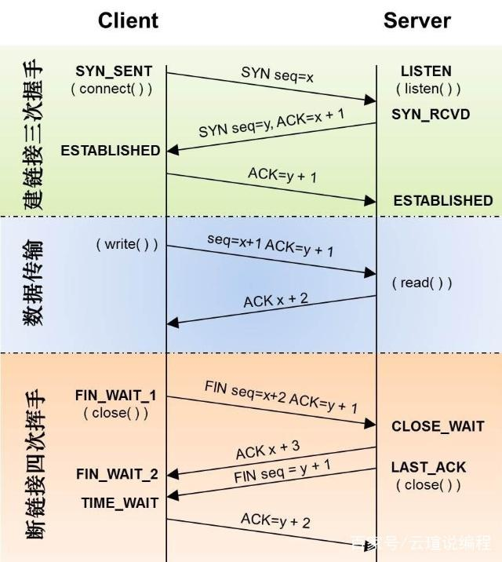

# HTTP

[[toc]]

## 浏览器 http 请求的生命周期

### 1. 构建 http 请求

```txt
GET /index.html HTTP1.1
```

### 2. 查找缓存

查找浏览器本地缓存，查看是否有所请求的副本及是否过期。若未查找到或已过期，进入下一步。

### 3. 确定服务器 IP 地址和端口

将域名解析为 IP 地址：优先使用浏览器的 DNS 数据缓存服务，若之前解析过会缓存起来；否则，请求 DNS 服务解析域名。

端口：若 URL 里没有显式指明端口，则 HTTP 协议默认是 80 端口。

### 4. 等待 TCP 队列

针对 Chrome 浏览器，同一个域名同时最多只能建立 6 个 TCP 连接（仅当使用 http/1.1 时），若该域名已经存在 6 个及以上请求，请求将进入排队等待状态，等到之前的 TCP 连接关闭之后才能建立新的 TCP 连接。浏览器会为每个域名维护 6 个 TCP 连接，但每个 TCP 连接是可以复用的，在处理完一个 HTTP 请求之后，可以不断开这个 TCP 连接，继续处理下一个 HTTP 请求。

### 5. 建立 TCP 连接

经过上一步的等待之后，经过三次握手，建立 TCP 连接。

#### 三次握手

参考链接：[TCP 为什么是三次握手，而不是两次或四次？ - 车小胖的回答 - 知乎](https://www.zhihu.com/question/24853633/answer/115173386)

总结：既保证了可靠传输（两次不可靠，因此要三次），且效率最高（成本最低）。

名词释义

- Seq: 序列号，Sequence Numbers
- SYN: 同步序列号，Synchronize Sequence Numbers
- ISN: 初始序列号，Initial Sequence Number
- ACK: 确认字符，Acknowledge Character
- FIN: 结束连接，Finish



TCP 建立连接的三次握手，就是为了相互告知对方自己的 ISN。

客户端 <-------> 服务端

1. 第一次握手: 客户端发送同步信号 SYN + 客户端 ISN = x
2. 第二次握手:
   - 服务端收到客户端的同步信号，记录客户端 ISN 到本地，并向客户端发送确认信号 ACK = 客户端 ISN + 1 = x + 1
   - 服务端再发送自己的同步信号 SYN + 服务端 ISN = y
3. 第三次握手: 客户端收到服务端的确认信号 ACK 和同步信号，记录服务端 ISN 到本地，并向服务端发送确认信号 ACK = 服务端 ISN + 1 = y + 1

注意，原本建立连接需要四次握手，但是服务端发送确认信号 ACK 和服务端发送同步信号 SYN 可以合并，因此最终是三次握手。

#### 四次挥手

四次挥手，断开连接。

客户端 <-------> 服务端

1. 第一次挥手: 客户端发送结束信号 FIN + Seq = x + 2，用于关闭客户端到服务端的数据发送，即客户端不会再给服务端发送数据。（但此时客户端仍可接收数据）
2. 第二次挥手: 服务端接收到客户端的结束信号 FIN，并向客户端发送确认信号 ACK = Seq + 1 = x + 3
3. 第三次挥手: 服务端也发送结束信号 FIN + Seq = y + 1，用于关闭服务端到客户端的数据发送，即服务端不会再给客户端发送数据
4. 第四次挥手: 客户端接收到服务端的结束信号 FIN，并向服务端发送确认信号 ACK = Seq + 1 = y + 2

第二次无法与第三次挥手合并，因为在接收到客户端的结束信号 FIN 后，服务端只是不再接收客户端发送的数据，但是服务端可能还有数据需要发送到客户端。

### 6. 发送 HTTP 请求

发送 HTTP 请求

### 7. 服务器处理请求并返回

### 8. 断开 HTTP 请求

通常情况下，一旦服务器向客户端返回了请求数据，它就要关闭 TCP 连接。不过如果浏览器或者服务器在其头信息中加入了：`Connection:Keep-Alive`，那么 TCP 连接在发送后将仍然保持打开状态，这样浏览器就可以继续通过同一个 TCP 连接发送请求。保持 TCP 连接可以省去下次请求时需要建立连接的时间，提升资源加载速度。比如，一个 Web 页面中内嵌的图片就都来自同一个 Web 站点，如果初始化了一个持久连接，你就可以复用该连接，以请求其他资源，而不需要重新再建立新的 TCP 连接。

## 请求/响应头

### 常用的通用头

#### Connection:Keep-Alive

当客户端或服务器端在头部里添加`Connection:Keep-Alive`时，那么 TCP 连接在发送后将仍然保持打开状态，这样浏览器就可以继续通过同一个 TCP 连接发送请求。保持 TCP 连接可以省去下次请求时需要建立连接的时间，提升资源加载速度。比如，一个 Web 页面中内嵌的图片就都来自同一个 Web 站点，如果初始化了一个持久连接，你就可以复用该连接，以请求其他资源，而不需要重新再建立新的 TCP 连接。

### 常用的请求头

### 常用的响应头
