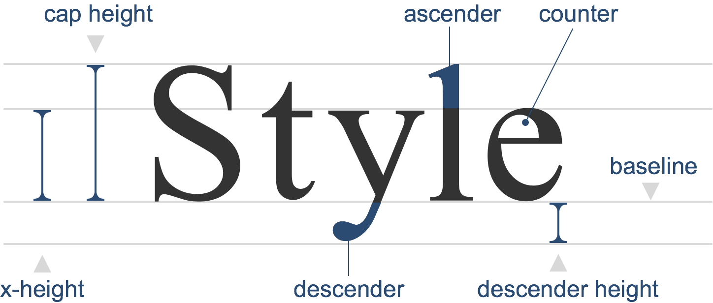

# 字体

[[toc]]

## 字体结构

- `ascender`: 字体的上端，如：`b`, `d`, `h`, `l`, `t`, `k`
  - `ascender line`，上伸线
- `descender`: 字体的下端，如：`j`, `q`, `g`
  - `descender line`，下伸线
- `counter`: 中空的部分，如：`O`, `o`, `P`, `p`, `D`
- `baseline`: 基线，字体会倚靠在`baseline`上，也是与其他文字或图片排版所依据的基础
- `x-height`: 小写`x`的高度
- `cap height`: 即`capital height`，从`baseline`到大写字母最上边的高度，也用来决定一个字的大小（即大写字母的高度）
- `descender height`：`descender`（距离`baseline`）的长度，會影响字体的风格与姿态

对不同字体设置`font-size: 100px`，会根据字体的`ascender`和`descender`计算出文字高度，不同字体的文字高度可能是不一样的，通常都会大于`100px`。而这个文字高度决定了 HTML 元素的`content-area`（内容区域），即`content-area`的高度是由`font-size`和字体自身的特性决定的。

## 深入理解 CSS：字体度量、line-height 和 vertical-align

请详细阅读本文[深入理解 CSS：字体度量、line-height 和 vertical-align](/front-end/css/layouts/font/css-font-metrics-line-height-and-vertical-align.html)

- [字型排版中的名詞解釋](http://otischou.tw/notes/2015/11/28/basic-of-typography.html)
- [只知道baseline是远远不够的——字体资料1](https://csbabel.wordpress.com/2010/01/05/baseline-is-only-the-beginning/)
- [深入理解 CSS：字体度量、line-height 和 vertical-align](https://zhuanlan.zhihu.com/p/25808995)

## 深入理解 font-weight

参考文章[深入了解font-weight](https://aotu.io/notes/2016/11/08/css3fontweight/index.html)，其解释了：

- 为什么 UI 在设计时，字重最好只选用`bold`、`regular`（`normal`）？
- 字体的字重不存在时，如何匹配别的字重？
- 字体合成[font-synthesis](https://developer.mozilla.org/en-US/docs/Web/CSS/font-synthesis)属性
