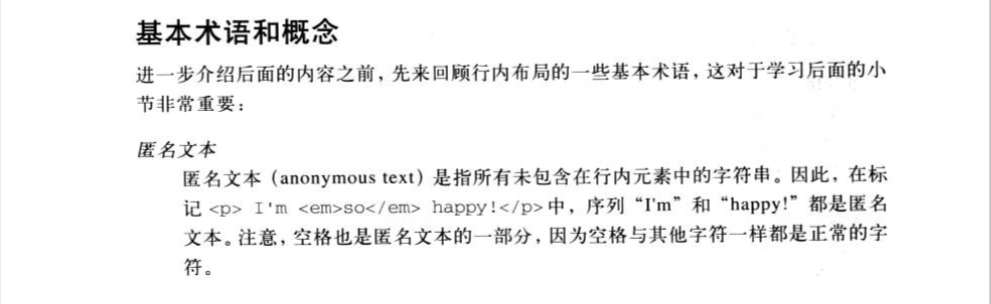

# IFC

[[toc]]

`inline formatting context`，行内格式化上下文，用来规定行内级盒子的格式化规则。

## 术语及对应英文

- `inline-box`: 行内框
- `line-box`: 行框

## 行内元素

行内元素分为：

- 非替换元素
- 可替换行内元素

### 非替换元素

### 可替换行内元素

### 关于 baseline

不同字体的`baseline`的位置可能不一样，这取决于字体的`ascender`（基线到字符顶端的距离）和`descender`（基线到字符底部的距离）。

## IFC 的产生

IFC 只有在一个块级元素中仅包含行内级别（`inline-level`）元素时才会生成。

## IFC 的作用

## IFC 布局规则

前提: IFC 只有在一个块级元素中仅包含行内级别元素时才会生成。

- 块级元素内部的行内级盒会在水平方向上，一个接一个放置
- 这些行内级盒垂直方向的起点

### 要点概述

- 关于`line-box`
  - `line-box`的产生: 水平方向上，元素内容的宽度超过包含框的宽度时，元素将分为多个行内框，分布在多行，每行是一个`line-box`
  - `line-box`高度的计算
    - `line-box`包含了该行中出现的行内框的最高点和最低点的最小框，也就是说，`line-box`的上边界要位于最高行内框的上边界，而`line-box`的底边要放在最低行内框的下边界
    - 浏览器会认为每一个行框`line-box`的起始位置有一个零宽度的字符，规格文档里称为strut，这个字符将参与行框`line-box`高度的计算。

### 行框、行内框

行框：包含该行中出现的行内框的最高点和最低点的最小框。换句话说，行框的上边界要位于最高行内框的上边界，而行框的底边要放在最低行内框的下边界。

需要注意的是，行内元素的`vertical-align`属性会最终影响到行框的高度。

#### 行内框

- 针对可替换行内元素/`inline-block`元素/`inline-table`元素
  - 行内框的高度为`margin box`的高度，即行内框的高度包括：内容、上下内边距、上下边框、上下外边距
  - `line-height`对行内框没有影响，但是可能会影响到元素的垂直对齐，因为`vertical-align`的值若是百分比，是相对于`line-height`的
  - 没有`baseline`，但是其行内框的下边界即下外边距边界会与行框的基线对齐，因此，可认为元素的`baseline`为行内框的下边界即下外边距边界。

- 针对非替换行内元素
  - 行内框的高度为其`line-height`的高度（因为设置`height`属性无效）
  - 元素的背景也是在`line-height`高度的区域内，但是最终的位置将由`font-size`和`line-height`共同确定。
  - 行内框的范围确定：得到非替换行内元素及不属于后代行内元素的所有文本的`font-size`值和`line-height`值，再将`line-height`将去`font-size`，这就得到了框的行间距。这个间距除以`2`，将其一半分别应用到`em`框的顶部和底部。

::: warning 注意
这里行内框的高度不是指元素的`height`属性，而是指行内框在垂直方向上占据的空间大小）
:::

### 行内元素的一些计算

#### content-area 的计算

这里的`content-area`可以理解为背景属性应用的地方（不包括`padding`和`border`）

- 可替换行内元素（`img`，`input`，`svg`元素等）
- `display`为`inline-block`或`inline-*`的元素
- 参与特定格式化上下文的行内元素（比如，`flex`布局元素的所有直接子元素的`display`都是`blockified`）

针对以上这些行内元素，若元素设置了`height`，则元素内容区域`content-area`的高度即为`height`；若`height`为默认值`auto`，则元素`content-area`的高度即为`line-height`（猜测：此时也是`line-height`撑开了`height`，使得`height`有了计算值）。

针对非替换行内元素，`content-area`是`font-size`与字体度量共同计算得出的结果。

### 块级元素内容高度的确定

若块级元素设置了`height`，则块级元素内容的高度即为`height`的计算值。若没设置`height`，即`height: auto`，块级元素内容的高度即由行框`line box`堆积而来，对于内容只有一行的，块级元素的内容高度即为`line box`的高度

### 行框基线的确定

行框`line box`的基线`baseline`，就是该行框里匿名行内文本`x`的底部。

但是有个问题，行框里不一定有匿名行内文本，即使有，也不一定有`x`，那这时如何确定行框的基线呢？

实际上，行框里匿名行内文本`x`的底部，同时也是匿名行内文本所在行内框的基线。即使用户没有添加任何的匿名行内文本，行框的起始位置也有一个零宽度的字符即`strut`，这个字符的所在行内框的基线就是行框的基线。
