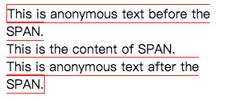

# 视觉格式化模型

[[toc]]

视觉格式化模型，`visual formatting model`。

翻译自 CSS 2.2 官方文档，[Visual formatting model](https://www.w3.org/TR/CSS22/visuren.html)

## 9.1 介绍

这一章和下一章描述了视觉格式化模型: 用户代理（比如浏览器）如何为视觉媒体（比如屏幕）处理文档树。

在视觉格式化模型里，文档树里的每一个元素会根据盒模型生成 0 或多个盒子`box`。这些盒子的布局由以下因素决定：

- 盒子的尺寸
  - `content-area`
  - `padding`
  - `border`
  - `margin`
- 盒子的类型
  - 行内盒(`inline box`)
  - 行内级盒（`inline-level box`）
  - 块盒（`block box`）
- 定位方案（`positioning scheme`）
  - 常规流
  - 浮动
  - 绝对定位
- 文档树里元素之间的关系
- 外部信息（比如视口尺寸、图片的固有尺寸等）

该章节和下一章节定义的属性，可以应用到流媒体（`continuous media`）和分页媒体（`paged media`）。但是，当应用到分页媒体时，`margin`相关的属性的意义就有所改变了，详情可见[page model](https://www.w3.org/TR/CSS22/page.html#page-margins)

视觉格式化模型没有明确格式化的各个方面（比如它没有指定一个`letter-spacing`算法），因此针对规格文档里没有涉及的格式化问题，用户代理可能表现不一致。

### 9.1.1 视口

流媒体的用户代理通常给用户提供一个视口（屏幕上的一个窗口或者其他可视区域），以让用户翻阅文档。当视口`resized`后，用户代理可能改变文档的布局，可见[初始包含块](https://www.w3.org/TR/CSS22/visudet.html#containing-block-details)

当视口小于文档渲染的画布区域时，用户代理应该提供一个滚动机制。每一张画布至少有一个视口，但是用户代理可能渲染到不止一张画布上（比如提供同一个文档的不同视图）。

### 9.1.2 包含块

在 CSS 2.2 里，许多盒子的位置和尺寸的计算，都会跟一个称为包含块（`containing blocks`）的矩形盒子的边界有关。通常，生成的盒子就像是包含了后代盒子的块。我们称为一个盒子为它的后代“建立”了包含块。“一个盒子的包含块”指的是这个盒子所位于的包含块，而不是这个盒子生成的包含块。

每一个盒子都会有一个跟包含块有关的位置，但并不局限于包含块，比如它可能会溢出`overflow`。

关于包含块尺寸的计算细节，将在下一章节描述。

## 9.2 控制盒的生成

接下来我们将描述在 CSS 2.2 里可能产生的盒子的类型。在视觉格式化模型里，盒子的类型会部分影响它的行为。以下描述的`display`属性，明确了盒子的类型。

某些`display`属性的值，将导致源文档里的元素生成一个主盒（`principal box`）以包含后代盒子和内容，同时其自身也是参与到定位方案中的盒子。有些元素除了主盒之外，可能还会生成额外的盒子，比如`list-item`元素。这些额外的盒子的放置位置与主盒有关。

### 9.2.1 块级元素和块盒

块级元素（`block-level elements`）—— 这些源文档里的元素视觉上呈现为块（比如段落`p`元素），也是生成块级主盒的元素。设置元素的`display`属性为以下值，将导致元素成为块级`block-level`（译者注: 原文是说导致元素成为块级的，按照译者理解，应该是导致元素成为块级元素）。

- `block`
- `list-item`
- `table`

块级盒（`block-level boxes`）是参与块格式化上下文 BFC 的盒子。

（译者注: 块级元素将生成块级盒。）

在 CSS 2.2 里，一个块级盒同时也是块容器盒（`block container box`），除非它是一个`table box`或是一个替换元素的主盒。一个块容器盒要么仅包含块级盒，要么建立一个行内格式化上下文 IFC 并仅包含行内级盒。若元素的主盒是块容器盒，则该元素是块容器元素。`display`属性的以下取值，将使得一个非替换元素生成块容器盒。

- `block`
- `list-item`
- `inline-block`

不是所有的块容器盒都是块级盒: 非替换行内块（译者注: 比如`display: inline-block`的`span`元素）和非替换`table cell`都是块容器盒但不是块级盒。

若块级盒同时也是块容器盒，则称为块盒（`block boxes`）。

这里有三个术语，块级盒（`block-level box`）、块容器盒（`block container box`）、块盒（`block box`），在语义清晰的时候都简称为块（`block`）。

#### 9.2.1.1 匿名块盒

在如下的文档里，（假设 DIV 和 P 都是`display: block`），DIV 既有行内内容也有块内容。为了更容易地定义格式化，我们假设在“Some text”周边有一个匿名的块盒。

```html
<DIV>
  Some text
  <P>More text
</DIV>
```


图 1: 图里显示了三个盒子，其中一个是匿名的

关于匿名块盒详细的描述: 这个图说明了匿名块盒是如何存在于匿名内容周边的。这里有两个包含文本的矩形盒子，第一个是匿名的，它有一个浅灰色的背景，并包含了文本“Some text”。在它之下，是`p`元素的盒子，稍深灰色的背景，并包含了文本`More text`。这两个盒子都在`div`元素的盒子里面。

换句话说，如果一个块容器盒（比如上面 DIV 元素生成的盒子）里面有一个块级盒（比如上面的 P 元素生成的盒子），那么我们会强制让该块容器盒仅包含块级盒（译者注: 以添加匿名块盒的方式）。

当一个行内盒包含了一个处于常规流中的块级盒，这个行内盒（以及与它在同一行盒里的它的行内祖先盒子）将被这个块级盒（以及与它连续的兄弟块级盒，或者被“可折叠的空格”或“脱离了常规流的元素”分开的兄弟块级盒）折断，并将这个行内盒分离为两个盒子（即使两边都是空的），分别处于块级盒的两边。折断处之前和之后的行内盒都会被匿名块盒包裹住，并且原先的块级盒将成为这些匿名块盒的兄弟盒子。若是这个行内盒被相对定位所影响，任何因而产生的转变，也将影响到这个行内盒所包含的块级盒。

::: warning 根据如上的规则，这个模型将应用到下面的示例里
```css
p    { display: inline }
span { display: block }
```

```html
<!DOCTYPE HTML PUBLIC "-//W3C//DTD HTML 4.01//EN">
<HEAD>
<TITLE>Anonymous text interrupted by a block</TITLE>
</HEAD>
<BODY>
<P>
This is anonymous text before the SPAN.
<SPAN>This is the content of SPAN.</SPAN>
This is anonymous text after the SPAN.
</P>
</BODY>
```

P 元素包含了一个匿名文本的块（C1），其后是一个块级元素，再其后是另一个匿名文本的块（C2）。最终生成的盒子将是:，一个块盒，代表 BODY 元素，其中包含了：

- 一个包裹着 C1 的匿名块盒
- SPAN 块盒
- 另一个包裹着 C2 的匿名块盒
:::

匿名块盒的属性将继承于封闭的非匿名盒子（比如上面小节标题“匿名块盒”下的示例里的 DIV 盒子）。非继承属性有它们的初始值。比如，匿名块盒的`font`属性将继承于 DIV，但是`margin`属性将为 0。

已设置在导致生成匿名块盒元素上的属性，仍将应用到匿名块盒以及元素的内容上。比如在上面的示例里，若是已为 P 元素设置了`border`，那么 C1 和 C2 周围也将会有`border`。（译者注：但不会应用到 SPAN 元素上）



图 2: 在 P 元素上设置了`border: 1px solid red`，导致包裹 C1 和 C2 的匿名块盒都有`border`，但 SPAN 元素没有

一些用户代理已经以其他方式实现了行内包含块的边框，比如在匿名行盒（`anonymous line boxes`）内部包装一个嵌套的块，并在这些盒子周边绘制行内边框。由于 CSS1 和 CSS2 并没有定义这个行为，`CSS1-only`和`CSS2-only`的用户代理可能实现了这个可选的模型，并声称和 CSS 2.2 的这部分保持了一致。而在这个规则文档发布之后开发的用户代理则不是这样。

当遇到处理指向匿名块盒的百分比值时，匿名块盒将被忽略，而距离最近的非匿名祖先盒子将被使用。比如，若是上面 DIV 元素里的匿名块盒的子元素需要知道它的包含块的高度以处理子元素的百分比高度时，将会使用由 DIV 元素形成的包含块的高度，而不是匿名块盒的高度。

### 9.2.2 行内级元素和行内盒

行内级元素（`inline-level elements`）是源文档里的一些元素，这些元素没有为内容形成新的块，而是将内容分布在行里（比如段落里文本的强调，行内图片等）。`display`属性的如下取值，将让元素成为行内级`inline-level`（译者注: 原文是说导致元素成为行内级的，按照译者理解，应该是导致元素成为行内级元素）:

- `inline`
- `inline-table`
- `inline-block`

行内级元素生成行内级盒`inline-level boxes`，这些行内级盒将参与到行内格式化上下文 IFC 中。

满足以下两个条件的盒子，称为行内盒`inline box`。

- 本身是行内级盒
- 其内容参与它所处的行内格式化上下文 IFC

一个非替换元素，若其`display`属性为`inline`，将生成一个行内盒。不是行内盒的行内级盒（比如可替换行内级元素，`inline-block`元素，和`inline-table`元素）原子行内级盒（`atomic inline-level boxes`），因为它们是以单个不透明的盒子参与到它们的行内格式化上下文中的。

#### 9.2.2.1 匿名行内盒

直接包含在块容器元素（而不是在行内元素里）的任何文本，都必须被当做一个匿名的行内元素。

比如如下文档里的 HTML 标记:

```html
<p>Some <em>emphasized</em> text</p>
```

`p`元素生成了一个块盒，内部有几个行内盒。“emphasized”的盒子是一个由行内元素`em`生成的行内盒。但是其他的盒子（比如“Some”和“text”）是由块级元素`p`生成的行内盒，称为匿名行内盒，因为它们没有一个与之相关联的行内级元素。

这种匿名行内盒，将从它们的块父级盒`block parent box`继承可继承的属性。不可继承的属性，会有初始值。在示例里，匿名行内盒的`color`属性将从 P 元素继承，但是`background`属性则为初始值`transparent`。

根据`white-space`属性折叠起来的空格内容，不会生成任何匿名的行内盒。

在这份规则文档里，如果从上下文可以清楚地知道是哪一种匿名盒子，匿名行内盒和匿名块盒都会简称为匿名盒子。

在格式化`table`的时候，还会有更多的匿名盒子产生。

### 9.2.3 Run-in boxes

这一章节之所以存在，是为了与之前的草案保持章节上的一致。`display: run-in`现在定义在 CSS level 3 里，详情请见[CSS basic box model](https://www.w3.org/TR/css-box-3/)

### 9.2.4 display 属性

Name: | display
--- | ---
Value: | `inline | block | list-item | inline-block | table | inline-table | table-row-group | table-header-group | table-footer-group | table-row | table-column-group | table-column | table-cell | table-caption | none | inherit`
Initial: | inline
Applies to: | all elements
Inherited: | no
Percentages: | N/A
Media: | all
Computed value: | see text

该属性有如下的取值及含义。

- `block`
  - 该值将导致元素生成一个主块盒`principal block box`
- `inline-block`
  - 该值将导致元素生成一个主行内级块容器`principal inline-level block container`（`line-block`元素内部形成了一个块盒，但是元素自身形成了一个原子行内级盒）
- `inline`
  - 该值导致元素生成一个或多个行内盒
- `list-item`
  - 该值导致元素（比如 HTML 里的`li`）生成一个主块盒以及一个标志盒。更多关于列表和列表格式化的嘻嘻，请参考[lists](https://www.w3.org/TR/CSS22/generate.html#lists)
- `none`
  - 该值导致元素不出现在格式化结构[formatting structure](https://www.w3.org/TR/CSS22/intro.html#formatting-structure)里（比如，在视觉媒体里，该元素不生成盒子，而且对布局无影响）。元素的后代元素也不会生成任何的盒子。元素及其内容将完全从`formatting structure`里移除。这种行为不会通过在后代元素上设置`display`属性来覆盖。
  - 请注意，`display: none`并不会创建一个不可见的盒子，这根本就不会创建盒子。CSS 引入了一个机制，可以在`formatting structure`里让元素生成盒子以影响布局，但是元素自身不可见，详情请见[visibility](https://www.w3.org/TR/CSS22/visufx.html#visibility)
- `table | inline-table | table-row-group | table-header-group | table-footer-group | table-row | table-column-group | table-column | table-cell | table-caption`
  - 这些值导致元素表现地像表格元素，这些内容将在[tables](https://www.w3.org/TR/CSS22/tables.html)章节描述

计算值与上面列出的这些值一样，除了定位和浮动元素（详见“9.7 `display`与`position`和`float`之间的关系”）以及根元素。对于根元素，计算值会像“9.7 `display`与`position`和`float`之间的关系”里描述地那样改变。

注意，尽管`display`的初始值是`inline`，但是用户代理默认样式表里的规则可能覆盖这个值，详见附录里的 HTML4 的[示例样式表](https://www.w3.org/TR/CSS22/sample.html)。

::: warning 这里是 display 属性的一些示例
p   { display: block }

em  { display: inline }

li  { display: list-item }

img { display: none }      /* Do not display images */
:::

## 9.3 定位方案

在 CSS 2.2 里，一个盒子可能会根据如下三种定位方案（`positioning schemes`）来布局:

- 常规流（`normal flow`）。在 CSS 2.2 里，常规流包括块级盒的块格式化，行内级盒的行内格式化，以及块级盒和行内级盒的相对定位。
- 浮动（`float`）。在浮动模型里，盒子一开始会按照常规流布局，之后将脱离常规流，转移到最左边或最右边。内容可能会流动在浮动元素的边缘。
- 绝对定位（`absolute positioning`）。在绝对定位模型里，盒子将完全从常规流里移除（它对其后的兄弟元素无影响）并放置在一个相对于包含块的位置。

若元素是浮动的、绝对定位的，或是根元素，我们称该元素是脱离流的（`out of flow`）。若元素没有脱离流，我们称元素处于流中（`in-flow`）。

元素 A 的流，是以下成员的集合:

- 元素 A
- 处于流中的元素，这些元素最近的脱离流的祖先元素是元素 A

（译者注: 即使元素 A 脱离了流，但是其后代元素可能还是会处于元素 A 的流中）

::: tip 提示
CSS 2.2 的定位方案通过允许它们避免布局影响中的标记把戏的方式，帮助创造者使得他们的文档更加容易访问。（TODO: 待深入了解这句话）
:::

### 9.3.1 设置 position 属性来选择定位方案

`position`和`float`属性决定了使用哪种 CSS 2.2 定位算法来计算盒子的位置。

Name: | position
--- | ---
Value: | `static | relative | absolute | fixed | inherit`
Initial: | static
Applies to: | all elements
Inherited: | no
Percentages: | N/A
Media: | visual
Computed value: | as specified

`position`属性的这些值及其含义如下。

- `static`
  - 盒子是常规盒子，按照常规流来布局。`top`/`right`/`bottom`/`left`属性都不起作用。
- `relative`
  - 盒子的位置按照常规流计算（这称为常规流里的位置）。之后，盒子会相对于它在常规流里的位置发生偏移。当盒子 B 是相对定位的，会按照盒子 B 没有发生偏移来计算盒子 B 之后的盒子的位置。`position: relative`在 `table-row-group`/`table-header-grou`/`table-footer-group`/`table-row`/`table-column-group`/`table-colum`/`table-cell`/`table-caption`元素上的影响是未定义的。
- `absolute`
  - 盒子的位置（也可能包括尺寸）由`top`、`right`、`bottom`、`left`属性指定。这些属性明确了盒子相对于其包含块的偏移。绝对定位的盒子将脱离常规流，这意味着他们对之后的兄弟盒子的布局没有影响。另外，尽管绝对定位的盒子有`margin`属性，但是它们不会与任何其他元素的`margin`发生重叠。
- `fixed`
  - 盒子的位置按照绝对定位模型来计算，但是盒子是相对于某些参考系固定的。在绝对定位模型里，盒子的`margin`不会与其他任何元素的`margin`发生重叠。在手持式设备、投影、屏幕、TTY 和 TV 等媒体类型下，盒子会相对于视口（`viewport`）固定，并且在滚动时保持不动。在打印媒体类型下，盒子将在每一页绘制，并相对于页面盒子（`page box`）固定，即使页面可以通过一个视口看见（比如在打印预览的情况下）。对于其他媒体类型来说，其行为表现是未定义的。创造者（`author`）可能需要以媒体依赖的方式指定`fixed`。比如，创造者可能想要盒子固定在屏幕视口的顶部，但是不想要在打印的每一页的顶部。这两种特定需求可以通过使用`@media`规则来分离，就像这样：

```css
@media screen {
  h1#first { position: fixed }
}
@media print {
  h1#first { position: static }
}
```

  用户代理必须不能为固定盒子的内容分页。注意，用户代理可能通过其他方式打印不可见的内容，详情请见第 13 章的[Content outside the page box](https://www.w3.org/TR/CSS22/page.html#outside-page-box)。

针对根元素，用户代理可能将其对待为`position: static`。

### 盒子的偏移，top/right/bottom/left

若元素的`position`属性设置了除`static`之外的值，则这个元素是定位的（`positioned`）。定位的元素生成定位盒子，按照如下四个属性进行布局。

Name: | top
--- | ---
Value: | `<length> | <percentage> | auto | inherit`
Initial: | auto
Applies to: | positioned elements
Inherited: | no
Percentages: | refer to height of containing block
Media: | visual
Computed value: | if specified as a length, the corresponding absolute length; if specified as a percentage, the specified value; otherwise, 'auto'.

`top`属性指定了绝对定位盒子的上外边距的上边界，距离包含块盒子的上边界（译者注: 即包含块的上边框的下边界），偏移有多远。对于相对定位的盒子，偏移是相对于盒子自身的上边界（比如，盒子在常规流中有一个位置，然后相对于这个位置，按照这些属性的值进行偏移）。

Name: | right
--- | ---
Value: | `<length> | <percentage> | auto | inherit`
Initial: | auto
Applies to: | positioned elements
Inherited: | no
Percentages: | refer to width of containing block
Media: | visual
Computed value: | if specified as a length, the corresponding absolute length; if specified as a percentage, the specified value; otherwise, 'auto'.

类似于`top`，但是指定了盒子的右外边距的右边界，距离包含块盒子右边界的左边（译者注: 包含块的右边框的左边界），偏移有多远。对于相对定位的盒子，偏移是相对于盒子自身的右边界。

Name: | bottom
--- | ---
Value: `<length> | <percentage> | auto | inherit`
Initial: | auto
Applies to: | positioned elements
Inherited: | no
Percentages: | refer to height of containing block
Media: | visual
Computed value: | if specified as a length, the corresponding absolute length; if specified as a percentage, the specified value; otherwise, 'auto'.

类似于`top`，但是指定了盒子的下外边距的下边界，距离包含块盒子的底部（译者注: 包含块的下边框的上边界），偏移有多远。对于相对定位的盒子，偏移是相对于盒子自身的下边界。

Name: | left
--- | ---
Value: `<length> | <percentage> | auto | inherit`
Initial: | auto
Applies to: | positioned elements
Inherited: | no
Percentages: | refer to width of containing block
Media: | visual
Computed value: | if specified as a length, the corresponding absolute length; if specified as a percentage, the specified value; otherwise, 'auto'.

类似于`top`，但是指定了盒子的左外边距的左边界，距离包含块盒子的左边界的右边（译者注: 包含框的左边框的右边界），距离有多远。对于相对定位的盒子，偏移是相对于盒子自身的左边界。

这四个属性有如下取值及含义:

- `<length>`
  - 偏移是从参考系边界的固定距离，允许负值
- `<percentage>`
  - 偏移是包含块的`width`（针对`left`和`right`）或`height`（针对`top`和`bottom`）的百分比，允许负值
- `auto`
  - 对于非替换元素，这个值的效果依赖于具体哪个属性，详情请见绝对定位的非替换元素的`width`和`height`。对于替换元素，这个值的效果仅依赖于替换元素的固有尺寸，详情请见绝对定位的替换元素的`width`和`height`。
