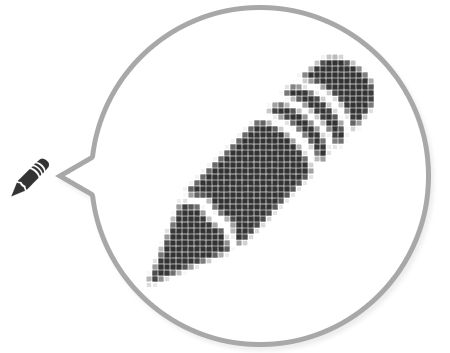
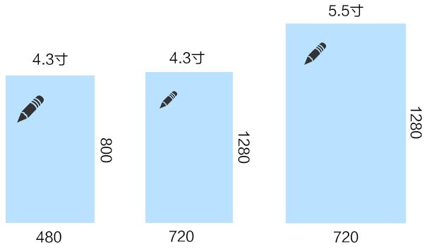

# UI

## dp

该部分内容主要复制于[DPI、PPI、DP、PX 的详细计算方法及算法来源是什么？](https://www.zhihu.com/question/21220154)

DP 主要是用于 Android 设备做适配的单位，在不同屏幕密度下，`1dp`的物理长度也相同。

液晶屏显示图像，放大来看就是由一个个小点组成的，这些小点就是像素点（`px`）。

有的手机屏幕小像素点少，比如 4.3 寸分辨率为`480*800`的屏幕；还有的屏幕大尺寸点多，比如 5.5 寸分辨率为`720*800`的屏幕。

屏幕 | 分辨率（px） | 屏幕尺寸（对角线尺寸）
--- | --- | ---
图一 | 480 * 800 | 4.3 寸
图二 | 720 * 1280 | 4.3 寸
图三 | 720 * 1280 | 5.5 寸

上图里的图片（原始大小，单位为`px`，未额外设置尺寸），会在不同的屏幕上显示出不同的效果，但是我们一般需要在不同的屏幕上显示出统一的视觉效果，即可以简单理解为在不同屏幕上，图片占据的物理尺寸是一样的。

当实现时使用图片的原始大小时: 在相同屏幕尺寸的屏幕上，比如图一和图二都是 4.3 寸，其视觉效果不统一，图二的图片显示明显偏小；在相同分辨率的屏幕上，比如图二和图三，其视觉效果也不统一，图二的图片显示也明显偏小。那么，我们在设计视觉稿时，就需要有一个统一的基准，使用这个基础实现的图片大小，在各个屏幕上能显示出统一的视觉效果。

PS: 无论实现时使用什么长度单位，最终都会转换为`px`。

最终我们找到了点密度（`density`），也就是像素数和屏幕尺寸的比值。`density`是每单位长度容纳的像素`px`数量，其单位是 像素/英寸，即 PPI（`pixel per inch`）。

而屏幕尺寸是屏幕对角线的长度，计算对角线像素数量再除以屏幕尺寸就得到了 PPI 值，上面三个屏幕的 PPI 分别为`217ppi`，`342ppi`，`267ppi`。可以看到，相同原始大小的图片在不同的屏幕上，屏幕 PPI 越低图片显示越大，屏幕 PPI 越高图片显示越小。

要让不同屏幕显示图片的视觉大小相同，就需要对图片进行缩放，给高 PPI 屏幕提供更大的图片。

高 PPI 屏幕需要更大的图片才能得到同样的显示效果，反之亦然。PPI 和图片`px`的关系如下:

`px1`/`px2` = `ppi1`/`ppi2`

选定一个 PPI 值作为基础绘制图片，用 PPI 的比值计算出图片缩放比例就可以适配各种屏幕。

`px2` = `px1`*(`ppi2`/`ppi1`)

安卓选定的这个基础值就是`160ppi`。

`px2` = `px1`*(`ppi2`/`160`)

我们已经解决了图片放大缩小的问题，还需要一个单位用来描述长度（因为`px`不固定，`inch`不方便）。安卓创造了一个新的单位`dp`，中文名设备独立像素。并且规定在`160ppi`的屏幕上，`1dp`=`1px`。设计师只需要针对`160ppi`的显示屏设计并制图，安卓会根据当前手机屏幕的`ppi`值来放大缩小图片，在不同的屏幕上得到相近的显示效果。

## px

`px`是相对单位，相同屏幕尺寸的屏幕，其分辨率有高有低。因此在相同屏幕尺寸但不同分辨率的屏幕下使用固定`px`的长度显示图片，最终图片显示的视觉效果就大小不一了，高分辨率屏幕下的图片要略小一些。