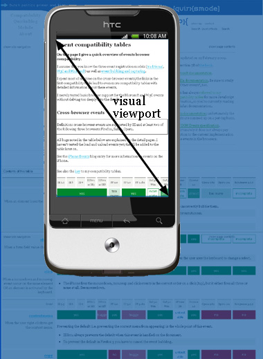

# A tale of two viewports — part two

翻译自: [PPK - A tale of two viewports — part two](https://www.quirksmode.org/mobile/viewports2.html)

在这个迷你系列文章里，我将解释视口以及各种重要元素的宽度是如何工作的，比如`html`元素、`window`和`screen`。

这篇文章我们将继续讨论移动端浏览器。若是你完全不了解移动端，我建议你先阅读第一部分关于桌面浏览器的内容，以便为本章内容做好铺垫。

## 移动端浏览器的问题

当我们对比移动端浏览器和桌面浏览器，最大的区别就是屏幕尺寸。针对专为桌面浏览器优化的网站，在移动端浏览器上展示的内容会明显地比桌面浏览器上要少，要不缩小页面直到文字小到无法阅读，要不仅在屏幕范围内展示网站的一小部分。

移动端屏幕远比桌面端屏幕要小，比如最大`400px`宽，有时会更小。（一些手机呈报较大的宽度，但是他们在说谎，或至少给了我们一些无用的信息）

处于中等大小的平板设备比如 iPad，将消除桌面端和移动端之间的差距，但这并没有改变根本问题。网站也必须工作在移动设备上，因此我们必须让他们在小屏幕上展示地更好。

最重要的问题集中在 CSS 上，尤其是视口的尺寸。若是我们一一照搬桌面端的模型，我们的 CSS 将失效。

让我们再次提及`width: 10%`的侧边栏。若是移动端浏览器像桌面端浏览器那么做，则侧边栏的宽度最多是`40px`，这太窄了。你的流式布局将变得难以想象地变形。

解决问题的方法之一，就是为移动端浏览器创建一个特殊的网站。即使抛开你是否应该这样做不说，实际问题是，只有极少的网站拥有者能够充分专门迎合移动设备。

移动端浏览器厂商想要给他们的客户提供最好的体验，就现在而言，这意味着“尽可能与桌面端浏览器一致”，因此就需要一些灵巧的方法了。

## 两种视口

因此移动端浏览器的视口太窄，导致不能满足 CSS 布局。最显而易见的解决方案就是，让视口更宽一些，因此，这就要求将视口一分为二: 视觉视口（`visual viewport`）和布局视口（`layout viewport`）。

George Cummins 在[Stack Overflow](https://stackoverflow.com/questions/6333927/difference-between-visual-viewport-and-layout-viewport)里最好地解释了这个基本概念:

> 将布局视口想象成一个大的图片，且不能改变大小和形状。再想象你有一个小一些的框，你可以通过该框看到那张大图片。这个小框周围都是不透明的材料，导致你只能透过小框看到大图片的一部分，而小框之外的视野都是模糊的（看不到任何东西）。你透过小框看到的图片的那部分就是视觉视口。你可以将小框拿得距离图片远一些（即对应着页面的缩小操作）进而可以一次看到整个图片，你也可以将小框拿得距离图片近一些（即对应着页面的放大操作）进而只能看到图片的一小部分。你还可以改变小框的方向，但是大图片（即布局视口）的大小和形状永不改变。

你还可以参考 Chris 的[这个解释](https://stackoverflow.com/questions/7344886/visual-viewport-vs-layout-viewport-on-mobile-devices)。

视觉视口是页面当前显示在屏幕上的一部分，用户可以通过滚动来改变他所看到的页面部分，或通过缩放来改变视觉视口的大小。

但是，CSS 布局，尤其是百分比的宽度，是相对于布局视口计算的，其结果可能要比视觉视口还要宽一些。

因此，`html`元素初始时的宽度是布局视口的宽度，且 CSS 是按照在明显比手机屏幕要宽的屏幕上的设定来诠释的。这也确保了你的网站布局就像在桌面端浏览器上表现的一样。

布局视口有多宽？每个浏览器都不一样。iPhone 上的 Safari 是`980px`；Opera 是`850px`，Android WebKit 是`800px`，IE 是`974px`。

一些浏览器还有一些特殊的行为:

- Symbian WebKit 试图让布局视口和视觉视口一样大，是的，这就表示有着百分比宽度的元素将表现地很古怪。但是，若是页面因为绝对宽度不能整个放入视觉视口里，浏览器会将视觉视口拉伸到最大`850px`。
- Samsung WebKit (on bada) 将布局视口设置为与最宽的元素一样宽。
- BlackBerry 上，在`100%`缩放时，布局视口与视觉视口相等。
