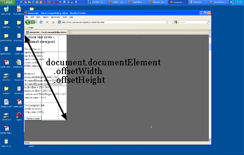
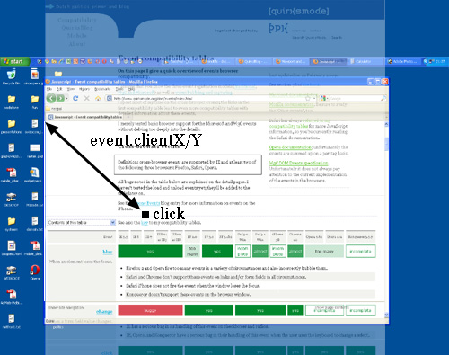
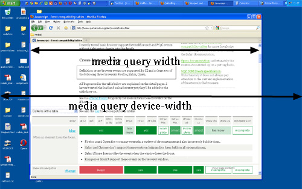

# A tale of two viewports — part one

翻译自: [PPK - A tale of two viewports — part one](https://www.quirksmode.org/mobile/viewports.html)

在这个迷你系列文章里，我将解释视口以及各种重要元素的宽度是如何工作的，比如`html`元素、`window`和`screen`。

这一篇是关于桌面端浏览器的，且其唯一的目的就是为之后关于移动端浏览器的类似讨论做出铺垫。绝大多数开发者已经直觉上理解绝大多数的桌面概念。在移动端我们会有相同的概念，但是更加复杂，因此先讨论这些每个人都已经知道的术语，将极大地帮助你理解移动端浏览器。

## 设备像素和 CSS 像素

你需要理解的第一个概念是 CSS 像素（`CSS pixels`），以及它与设备像素（`device pixels`）的区别。

设备像素是我们直觉上认为是“正确”的一类像素。设备像素给出了你使用的任一款设备的正规分辨率，且（通常）可以通过`screen.width/height`读取到。

若是你给定某元素的宽度为`width: 128px`，且你的显示器的宽度是`1024px`，若是你最大限度地利用你的浏览器屏幕，这个元素可以在显示器上平铺八次（让我们先粗略地忽略那些棘手的部分）。

若是用户进行缩放，这个计算将发生改变。若是用户放大到`200%`，`width: 128px`的元素将只能在`1024px`宽的显示器上平铺四次。

现代浏览器上实现的缩放，仅仅是拉伸像素。这也就是说，元素的宽度并没有从`128px`改变为`256px`；取而代之的是，实际像素在尺寸上增加了一倍。正规地说，元素的宽度仍然是`128`CSS 像素，即使它占据了`256`个设备像素的空间。

换句话说，放大到`200%`，让一个 CSS 像素增长到一个设备像素的四倍大小。（宽度增长到二倍，高度增长到二倍，因此总的增长到四倍）

以下的这些图片可以更好地说明这个概念。在缩放为`100%`时，有四个像素。这里没什么可说的，CSS 像素完全与设备像素重叠。


现在，我们来缩小。CSS 像素开始收缩，这意味着一个设备像素现在与多个 CSS 像素重叠。


若是你放大，则正好相反。CSS 像素开始增长，现在一个 CSS 像素与多个设备像素重叠。


这里的要点是，你只关注 CSS 像素，因为它决定你的样式表如何渲染。

设备像素几乎对你完全无用。但对用户来说，用户可以缩放网页，直到他认为阅读地更加舒服。而且，缩放的程度也与你无关。浏览器会自动地确保你的 CSS 布局是拉伸还是挤压。

### 100% 缩放

我开始示例时，是假设缩放程度为`100%`。现在定义的略微严格一些:

> 在缩放程度为`100%`时，一个 CSS 像素完全等于一个设备像素。

`100%`缩放的概念在之后的说明里特别重要，但是你不必在日常工作里过分担心。在桌面端浏览器里，你可以广泛地在`100%`缩放时测试你的网页，但即使用户进行缩放，CSS 像素的魔法将确保你的布局仍然保持了相同的比例。

## 屏幕尺寸（Screen size）

让我们看一些实际的测量。我们将从`screen.width`和`screen.height`开始。它们包含了用户屏幕的总宽度和总高度。这些尺寸都是以设备像素来度量的，因为它们从不会改变，它们是显示器的特性，而不是浏览器的。


有趣！但是我们可以做些什么呢？

基本上，没有。用户显示器的尺寸对我们不重要，除了你想要它以用于统计资料数据库。

::: tip screen.width/hieght
- 表示用户屏幕的总尺寸
- 以设备像素来度量
- 浏览器错误: IE8 在 IE7 和 IE 8 模式下，会用 CSS 像素来度量
:::

## 窗口尺寸（Window size）

实际上，你想知道的是浏览器窗口的内部尺寸。这将准确地告诉你，用户当前还有多少可用的空间用于 CSS 布局。你可以在`window.innerWidth`和`window.innerHeight`属性里找到这些尺寸。


显然，窗口的内部宽度是用 CSS 像素度量的。你需要知道，你可以将你布局的哪些部分挤压进浏览器窗口里，而且那部分会随着用户放大而变得更少。因此，若是用户放大，窗口里的可用空间将变得更少，且`window.innerWidth/innerHeight`将反映出这个减少。

（Opera 是个例外，它的`window.innerWidth/innerHeight`不会随着用户的放大而减小，它们是以设备像素来度量的。这在桌面端浏览器上是很烦人的，但是在移动端浏览器上是致命的，我们将在之后看到。）


注意，测量的宽度和高度都包含滚动条，它们也被认为是内部窗口的一部分。（这主要是历史遗留原因）

::: tip window.innerWidth/Height
- 表示浏览器窗口的总尺寸，包括滚动条
- 以 CSS 像素来度量
- 浏览器错误:
  - IE 不支持
  - Opera 使用设备像素来度量
:::

## 滚动偏移（Scrolling offset）

`window.pageXOffset`和`window.pageYOffset`是文档水平和垂直方向上的滚动偏移。由此你可以知道用户已经滚动了多长距离。


这两个属性也是以 CSS 像素来度量的。你想要知道文档已经向上滚动了多少，无论现在处于哪种缩放程度。

理论上，若是用户向上滚动，之后放大，`window.pageX/YOffset`将改变。但是，浏览器试图保持 Web 网页是始终如一的，通过在用户缩放时维持同一元素在可见页面的顶部。这不能完美地生效，但这意味着，实际上，`window.pageX/YOffset`并没有真的改变: 滚出到窗口之外的 CSS 像素的数量仍然是（粗略地）相同的。


::: tip window.pageX/YOffset
- 表示页面的滚动偏移
- 以 CSS 像素度量
- 无浏览器错误
:::

## 视口

在我们继续了解更多的 JavaScript 属性之前，我们必须先介绍另一个概念: 视口。

视口的作用是限制`html`元素，而`html`元素是你网站最上层的包含块。

这听起来可能有些含糊，因此我们给个实际的例子。假定你有个流式布局，且你的侧边栏的宽度是`width: 10%`。现在你调整浏览器窗口的大小，侧边栏会随之增长或收缩。但是这到底是如何工作的呢？

技术上来说，侧边栏获得了其父元素`body`元素`10%`的宽度，但你并没有给`body`元素设置宽度。因此问题就变成了，`body`元素的宽度是多少？

常规来说，所有的块级元素会占据它们父元素宽度的`100%`(当然也有例外，我们现在先忽略)。因此`body`元素，与它的父元素`html`元素一样宽。

那么现在`html`元素有多宽呢？它与浏览器窗口一样宽。这就是为什么你的`width: 10%`的侧边栏横跨了整个浏览器窗口的`10%`。所有的 Web 开发者都直觉上清楚并使用了这个事实。

但你可能不知道，这在理论上是如何工作的。理论上，`html`元素的宽度受限于视口的宽度，`html`元素占据了视口宽度的`100%`。

而视口（的宽度），是完全与浏览器窗口相等的，这就是这么定义的。视口不是构成 HTML 的一部分，因此你无法通过 CSS 来影响视口。视口的宽高，就是浏览器窗口的宽高，至少在桌面端浏览器上是如此，在移动端浏览器上，这将变得更加复杂。

### 后果

目前状态下，这会有一些奇特的后果。你可以在这个网站中见到其中一种。（译者注: 以下步骤请打开原网站后操作并查看结果）将网页滚动到最顶部，之后放大两到三次以便于这个网站的内容部分溢出到了浏览器窗口之外。现在滚动到右边，你将看到这个网站顶部的蓝色`bar`再也不会正确地对齐了。


这个行为就是所定义的视口的后果。我们给定了顶部蓝色`bar`的宽度为`width: 100%`，谁的`100%`呢？`html`元素的`100%`，而`html`元素与视口一样宽，而视口的宽度就是浏览器窗口的宽度。

要点是: 当缩放为`100%`时，这没什么问题，现在我们放大，视口的宽度变得比网站的总宽度要小一些。就其本身而言，这没什么问题，内容溢出了`html`元素，但是`html`元素有`overflow: visible`，这也就是说，溢出的内容在任何情况下都可以看到。

但是蓝色的`bar`不会溢出。我们给了它`width: 100%`，终究浏览器遵从了这个规则，给它设置了视口的宽度。浏览器也不会关心，（针对放大的页面来说，蓝色`bar`的）现在这个宽度略微有些窄。


### 文档宽度

我真正需要知道的是，页面总的内容有多宽，包括溢出的那部分。据我所知，没办法去找到这个值。（除非你计算网页里每个元素的宽度和外边距，不过这个比较容易出错）


我们真的感到很奇特，为什么不将这个值暴露给 CSS 呢？我更想要蓝色`bar`的`width: 100%`是基于文档宽度，而不是`html`元素的宽度。（但是这注定很难办，即使说无法实现，我也不会惊讶。）

浏览器厂商们，你们认为呢？

## 测量视口

你可能想要知道视口的尺寸，这些可以通过`document.documentElement.clientWidth/Height`。


若是你了解 DOM，你应该知道`document.documentElement`实际上就是`html`元素，即 HTML 文档的根元素。然而，可以这么说，视口是更高的层级，它是包含了`html`元素的元素。若是你给`html`元素设置`width`，你会发现这会有一些影响。（我不推荐这么做，但是确实是可以做的。）在这种情况下，`document.documentElement.clientWidth/Height`表示的是视口的尺寸，而不是`html`元素的尺寸。（这是个特殊的规则，仅是针对这对属性且仅针对`html`元素；在其他任何情况下，都表示元素实际的宽度。）


因此，`document.documentElement.clientWidth/Height`总是表示视口的尺寸，而不是`html`元素的尺寸。

::: tip document. documentElement.clientWidth/Height
- 代表视口的尺寸
- 以 CSS 像素度量
- 无浏览器错误
:::

### 两个属性对

但是，视口的尺寸不是通过`window.innerWidth/Height`给出了吗？嗯，是，也不是。

这两个属性对，略微有些区别：`document.documentElement.clientWidth/Height`不包括滚动条，而`window.innerWidth/Height`包括，尽管这有些吹毛求疵。

事实上，这两个属性对是在浏览器大战中遗留下来的。那时候，Netscape 仅支持`window.innerWidth/Height`，IE 仅支持`document.documentElement.clientWidth/Height`。之后，所有的浏览器都开始支持`document.documentElement.clientWidth/Height`，但 IE 却没支持`window.innerWidth/Height`。

有两个可用的属性对，在桌面端浏览器上是个较小的麻烦，但是在移动端却是个好事，我们之后将介绍。

## 测量 html 元素

因此，`document.documentElement.clientWidth/Height`在所有的情况下都表示视口的尺寸。但是，我们如何知道`html`元素自身的尺寸呢？它们存储在`document.documentElement.offsetWidth/Height`里。


这些属性可以让你访问作为块级元素的`html`元素；若是你给`html`设置了`width`，则可以通过`offsetWidth`反映出来。



::: tip document. documentElement.offsetWidth/Height
- 表示`html`元素的尺寸（也就是网页的尺寸）
- 以 CSS 像素来度量
- 浏览器错误: IE 用此来测量视口的尺寸，而不是`html`元素的
:::

## 事件坐标

我们现在来了解下事件坐标的内容。当发生鼠标事件时，至少有五组属性可以告知你事件发生的精确的位置信息。在我们的讨论中，其中有三组属性对较为重要:

1. `pageX/Y`以 CSS 像素的形式，给出相对于`html`元素的坐标
2. `clientX/Y`以 CSS 像素的形式，给出相对于视口的坐标
3. `screenX/Y`以设备像素的形式，给出相对于屏幕的坐标

::: tip pageX/Y, clientX/Y, screenX/Y
- 浏览器错误
  - IE 不支持`pageX/Y`
  - IE 和 Opera 以 CSS 像素计算`screenX/Y`
:::

### pageX/Y、clientX/Y、screenX/Y 示意

#### pageX/Y


#### clientX/Y



#### screenX/Y


#### 总结

在`90%`的情况下，你将使用`pageX/Y`，因为通常你想知道事件相对于文档的位置。剩下的`10%`，你将使用`clientX/Y`。你几乎从不需要知道事件相对于屏幕的坐标。

## 媒体查询

最后，是关于媒体查询的。你可以定义特殊的 CSS 规则，仅在页面宽度大于、等于或小于某个特定的大小时才执行。比如:

```css
div.sidebar {
	width: 300px;
}

@media all and (max-width: 400px) {
	// styles assigned when width is smaller than 400px;
	div.sidebar {
		width: 100px;
	}

}
```

现在侧边栏宽度为`300px`，除了在宽度小于`400px`的情况下，这时侧边栏的宽度将变为`100px`。

问题在于，我们测量的是哪个宽度？

这里有像个相关的媒体查询: `width/height`和`device-width/device-height`。

1. `width/height`使用与`document.documentElement.clientWidth/Height`（也就是视口）一样的值，以 CSS 像素度量
2. `device-width/device-height`使用与`screen.width/height`（也就是屏幕）一样的值，以设备像素度量



你应该使用哪个？毫无疑问，当然是`width`。Web 开发者不关心设备像素，他们关心的是浏览器窗口的宽度。

因此，在桌面端浏览器上，使用`width`，忘记`devie-width`。我们之后会发现，这个状况在移动端会更加混乱。

::: tip Media queries
- 浏览器错误
  - IE 不支持
  - 对于`device-width/device-height`，若是以 CSS 像素度量的话，Firefox 会使用`screen.width/height`已有的值
  - 对于`width/height`，若是以设备像素度量的话，Safari 和 Chrome 会使用`documentElement .clientWidth/Height`已有的值。
:::

## 总结

这篇文章尝试说明了桌面端浏览器的行为，该系列的第二部分会将这些概念应用到移动端上，并强调与桌面的一些重要区别。
