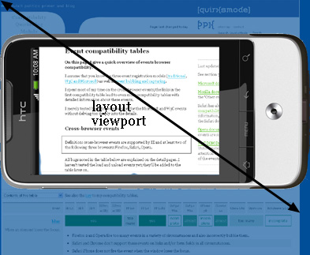

# A tale of two viewports — part two

翻译自: [PPK - A tale of two viewports — part two](https://www.quirksmode.org/mobile/viewports2.html)

在这个迷你系列文章里，我将解释视口以及各种重要元素的宽度是如何工作的，比如`html`元素、`window`和`screen`。

这篇文章我们将继续讨论移动端浏览器。若是你完全不了解移动端，我建议你先阅读第一部分关于桌面浏览器的内容，以便为本章内容做好铺垫。

## 移动端浏览器的问题

当我们对比移动端浏览器和桌面浏览器，最大的区别就是屏幕尺寸。针对专为桌面浏览器优化的网站，在移动端浏览器上展示的内容会明显地比桌面浏览器上要少，要不缩小页面直到文字小到无法阅读，要不仅在屏幕范围内展示网站的一小部分。

移动端屏幕远比桌面端屏幕要小，比如最大`400px`宽，有时会更小。（一些手机呈报较大的宽度，但是他们在说谎，或至少给了我们一些无用的信息）

处于中等大小的平板设备比如 iPad，将消除桌面端和移动端之间的差距，但这并没有改变根本问题。网站也必须工作在移动设备上，因此我们必须让他们在小屏幕上展示地更好。

最重要的问题集中在 CSS 上，尤其是视口的尺寸。若是我们一一照搬桌面端的模型，我们的 CSS 将失效。

让我们再次提及`width: 10%`的侧边栏。若是移动端浏览器像桌面端浏览器那么做，则侧边栏的宽度最多是`40px`，这太窄了。你的流式布局将变得难以想象地变形。

解决问题的方法之一，就是为移动端浏览器创建一个特殊的网站。即使抛开你是否应该这样做不说，实际问题是，只有极少的网站拥有者能够充分专门迎合移动设备。

移动端浏览器厂商想要给他们的客户提供最好的体验，就现在而言，这意味着“尽可能与桌面端浏览器一致”，因此就需要一些灵巧的方法了。

## 两种视口

移动端浏览器的视口太窄，导致不能满足 CSS 布局。最显而易见的解决方案就是，让视口更宽一些，因此，这就要求将视口一分为二: 视觉视口（`visual viewport`）和布局视口（`layout viewport`）。

George Cummins 在[Stack Overflow](https://stackoverflow.com/questions/6333927/difference-between-visual-viewport-and-layout-viewport)里最好地解释了这个基本概念:

> 将布局视口想象成一个大的图片，且不能改变大小和形状。再想象你有一个小一些的框，你可以通过该框看到那张大图片。这个小框周围都是不透明的材料，导致你只能透过小框看到大图片的一部分，而小框之外的视野都是模糊的（看不到任何东西）。你透过小框看到的图片的那部分就是视觉视口。你可以将小框拿得距离图片远一些（即对应着页面的缩小操作）进而可以一次看到整个图片，你也可以将小框拿得距离图片近一些（即对应着页面的放大操作）进而只能看到图片的一小部分。你还可以改变小框的方向，但是大图片（即布局视口）的大小和形状永不改变。

你还可以参考 Chris 的[这个解释](https://stackoverflow.com/questions/7344886/visual-viewport-vs-layout-viewport-on-mobile-devices)。

视觉视口是页面当前显示在屏幕上的一部分，用户可以通过滚动来改变他所看到的页面部分，或通过缩放来改变视觉视口的大小。

但是，CSS 布局，尤其是百分比的宽度，是相对于布局视口计算的，其结果可能要比视觉视口还要宽一些。

因此，`html`元素初始时的宽度是布局视口的宽度，且 CSS 是按照在明显比手机屏幕要宽的屏幕上的设定来诠释的。这也确保了你的网站布局就像在桌面端浏览器上表现的一样。

布局视口有多宽？每个浏览器都不一样。iPhone 上的 Safari 是`980px`；Opera 是`850px`，Android WebKit 是`800px`，IE 是`974px`。

一些浏览器还有一些特殊的行为:

- Symbian WebKit 试图让布局视口和视觉视口一样大，是的，这就表示有着百分比宽度的元素将表现地很古怪。但是，若是页面因为绝对宽度不能整个放入视觉视口里，浏览器会将视觉视口拉伸到最大`850px`。
- Samsung WebKit (on bada) 将布局视口设置为与最宽的元素一样宽。
- BlackBerry 上，在`100%`缩放时，布局视口与视觉视口相等。

### 缩放

显然，这两个视口都是以 CSS 像素度量的。但是视觉视口的尺寸会随着缩放而改变（若是放大，屏幕内能显示的 CSS 像素更少），而布局视口的尺寸会保持不变。（假设布局视口的尺寸也改变的话，当百分比的宽度重新计算时，页面将不断回流`reflow`）

### 理解布局视口

为了理解布局视口的大小，我们必须先看一下当页面完全缩小时会发生什么。许多移动端浏览器初始时都是以完全缩小的模式显示任何页面。

要点是，浏览器已经选择了布局视口的尺寸，以便于它能在完全缩小的模式下，完全覆盖屏幕（即布局视口等于视觉视口）。

因此，布局视口的宽度和高度等同于在完全缩小模式下屏幕能展示的宽度和高度。当用户放大时，这些尺寸也保持不变。

布局视口的宽度也总是一样。若是你旋转你的手机，视觉视口会改变，但是浏览器通过轻微放大来适应新的方向，以便布局视口再次与视觉视口一样宽。

但这会对布局视口的高度产生影响，高度比竖屏模式时的高度要大大减小。但是 Web 开发者不关心高度，只关心宽度。

## 测量布局视口

现在我们想要测量这两个视口。幸运的是，浏览器大战，给我们留下了两个属性对。

`document.documentElement.clientWidth/Height`表示布局视口的尺寸。

屏幕方向会对`height`生成影响，但不会影响`width`。

::: tip document. documentElement. clientWidth/Height
- 表示布局视口尺寸。
- 以 CSS 像素度量。
- 完全支持: Opera、iPhone、Android、Symbian、Bolt、MicroB、Skyfire、Obigo。
- 问题:
  - 在 Iris 里，表示视觉视口的尺寸。
  - Samsung WebKit: 当`<meta viewport>`应用到页面时，其返回正确的值；否则，返回`html`元素的值。
  - Firefox 里屏幕尺寸是以设备像素度量的。
  - IE 返回`1024x768`。但是，这些信息是储存在`document.body.clientWidth/Height`里的。这与 IE6 桌面浏览器保持了一致。
  - NetFront 的值仅在`100%`缩放时是正确的。
  - Symbian WebKit 1 (老的 S60v3 设置)不支持这些属性。
  - BlackBerry 不支持。
:::

## 测量视觉视口

我们通过`window.innerWidth/Height`来测量视觉视口。显然，随着用户缩放，测量值会随之改变，因为屏幕里的 CSS 像素会变得更多或更少。

不幸的是，这个会有兼容性问题。许多浏览器仍然必须添加对视觉视口的测量的支持。此外，没有浏览器将这个测量储存在任何其他属性对里，因此我猜测`window.innerWidth/Height`是个标准，尽管支持地不太好。

::: tip window.innerWidth/Height
- 表示视觉视口的尺寸。
- 以 CSS 像素度量。
- 完全支持: iPhone、Symbian、BlackBerry。
- 问题:
  - Opera 和 Firefox 以设备像素返回屏幕宽度。
  - Android、Bolt、MicroB 和 NetFront 以 CSS 像素返回布局视口的尺寸。
- 不完全支持:
  - IE，但是它通过`document.documentElement.offsetWidth/Height`给出了视觉视口的尺寸。
  - Samsung WebKit: 当`<meta viewport>`应用到页面时，返回布局视口的尺寸；否则，返回`html`的尺寸。
- 完全不知所谓: Iris、Skyfire、Obigo。
:::

## 屏幕

在桌面浏览器里，`screen.width/height`以设备像素的形式，给出了屏幕大小，且作为 Web 开发者，你几乎用不到这个信息。你对屏幕的物理尺寸没兴趣，而是对它当前能显示多少 CSS 像素感兴趣。

::: tip screen.width/height
- 表示屏幕尺寸。
- 以设备像素度量。
- 完全支持: Opera Mini、Android、Symbian、Iris、Firefox、MicroB、IE、BlackBerry。
- 问题:
  - Windows Mobile 上的 Opera Mobile 只给出了`landscape`尺寸。S60 上的 Opera Mobile 正常。
  - Samsung WebKit: 当`<meta viewport>`应用到页面时，返回布局视口的尺寸；否则，返回`html`的尺寸。
  - iPhone 和 Obigo 只给出了竖向的尺寸。
  - NetFront 只给出了`landscape`尺寸。
:::

### 缩放层级

直接获得缩放层级是不可能的，但是你可以通过使用`screen.width`除以`window.innerWidth`的方式获得，当然这仅在这两个属性都完美支持的情况才可以做到。

幸运的是，缩放层级并不重要。你所要知道的是，屏幕上当前能显示多少 CSS 像素，而你能从`window.innerWidth`里的得知这个信息（若是这个属性能正确地支持的话）。

## 滚动偏移

你还需要知道，相对于布局视口，视觉视口当前的位置，也就是滚动偏移，就跟桌面端浏览器一样，这些信息储存在`window.pageX/YOffset`。

::: tip window.pageX/YOffset
- 表示滚动偏移，与视觉视口相对于布局视口的偏移一致。
- 以 CSS 像素来度量。
- 完全支持: iPhone、Android、Symbian、Iris、MicroB、Skyfire、Obigo。
- 问题:
  - Opera、Bolt、Firefox、和 NetFront 总是返回`0`。
  - Samsung WebKit 仅当`<meta viewport>`应用到页面时，返回正确的值。
- 不支持: IE 和 BlackBerry。IE 在`document.documentElement.scrollLeft/Top`储存了这些信息。
:::

## html 元素

与桌面端浏览器一样，`document.documentElement.offsetWidth/Height`表示`html`元素的尺寸，以 CSS 像素度量。

::: tip document.documentElement.offsetWidth/Height
- 表示`html`元素的总尺寸
- 以 CSS 像素度量
- 完全支持: Opera、iPhone、Android、Symbian、Samsung、Iris、Bolt、Firefox、MicroB、Skyfire、BlackBerry、Obigo。
- 问题:
  - NetFront 的值仅在`100%`缩放的时候是正确的。
  - IE 使用该属性对去存储视觉视口的尺寸。在 IE 里，通过` document.body.clientWidth/Height`获取正确的值。
:::

## 媒体查询

媒体查询与桌面端一样。`width/height`是使用布局视口的宽高，且以 CSS 像素度量，`device-width/height`是使用设备屏幕的宽高，且以设备像素度量。

换句话说，`width/height`的值就是`document.documentElement.clientWidth/Height`的值，`device-width/height`的值就是`screen.width/height`的值（它们在所有浏览器里都保持一致，即使值是错误的）。

现在哪种视口对我们 Web 开发者是有用的呢？我不知道..

我一开始认为`device-width`是最重要的，因为它给了我们一些关于我们将会使用的设备的信息。比如，你可以更改你布局的宽度来适应设备的宽度。但是，你也可以通过使用`<meta view-port>`来做到，不一定要使用`device-width`这个媒体查询。

那么，`width`是更重要的媒体查询吗？有可能，它给出了浏览器厂商在这个设备上认为好的宽度。但这不太明确，而且`width`媒体查询不能给出任何其他信息。

因此，我无法决定。目前来说，我认为媒体查询对于弄清楚你是在使用桌面端、平板电脑或是移动端设备是很重要的，但是对于区分不同的平板电脑或移动端设备来说，就没那么有用了。

::: tip 媒体查询
- 表示测量`html`元素宽度（CSS 像素）或设备宽度（设备像素）
- 完全支持: Opera、iPhone、Android、Symbian、Samsung、Iris、Bolt、Firefox、MicroB。
- 不支持: Skyfire、IE、BlackBerry、NetFront、Obigo。
- 注意: 我测试的是浏览器是否从这些属性里拿到数据，数据是否正确，就不是这次测试的部分了。
:::

## 事件坐标

事件坐标跟桌面端差不多。不幸的是，在 12 个测试的浏览器里，只有 Symbian WebKit 和 Iris 这 2 个，获得的三个属性对是完全正确的。其他的浏览器都或多或少有一些严重的问题。

`pageX/Y`仍然是相对于页面的坐标，以 CSS 像素度量。跟在桌面端浏览器里一样，这个属性对是目前为止三个属性对里最有用的。

`clientX/Y`是相对于视觉视口的坐标，以 CSS 像素度量。这也有道理，尽管我们不能完全确定这有什么益处。

`screenX/Y`是相对于屏幕的坐标，以设备像素度量。当然，它与`clientX/Y`引用的是同一个值，而且设备像素是无用的。因此，我们无需关心`screenX/Y`，它跟在桌面端上一样没有用。

::: tip 事件坐标
- 问题:
  - Opera Mobile 在这个三个属性对都给了`pageX/Y`一样的值，但是当你滚动很多的时候，会出现问题。
  - 在 iPhone 上，Firefox 和 BlackBerry 上的`clientX/Y`等同于`pageX/Y`。
  - 在 Android 和 MicroB 上，`screenX/Y`等同于`clientX/Y`（也就是说，以 CSS 像素度量）
  - 在 Firefox 上，`screenX/Y`是错误的。
  - IE、BlackBerry 和 Obigo 不支持`pageX/Y`。
  - 在 NetFront 上，这是三个属性对都是`screenX/Y`。
  - 在 Obigo 上，`clientX/Y`就是`screenX/Y`。
  - Samsung WebKit 总是返回`pageX/Y`。
- 没测试的: Opera Mini、Bolt、Skyfire
:::

## Meta viewport

最后，我们来讨论下`<meta name="viewport" content="width=320">`，这原先是 Apple 的扩展，同时被许多其他的浏览器复制了。这是为了调整布局视口。为了明白这为什么是有必要的，让我们往回看一步。

假设你开发了一个简单的页面，且不设置元素的宽度。现在这些元素拉伸以占据布局视口`100%`的宽度。绝大多数浏览器会缩小以在屏幕上完整展示整个布局视口，效果像是这样:

用户会立即放大，这会起作用，但是绝大多数浏览器会保持元素的宽度不变，这将导致文字难以阅读。

（在这里，Android WebKit 是个明显的例外，它实际上减少了包含了文字的元素的大小，以便可以适应屏幕。这绝对是很巧妙的，并且我认为其他浏览器应该复制这种行为。之后我将完整地将其写成文档。）

现在你可以尝试设置`html`为`{width: 320px}`。现在`html`元素收缩了，所有其他的元素，都占据了`320px`的`100%`。这在用户放大时会起作用，但是之后，当用户缩小页面时，页面的大部分都将是空白。

为了解决这个问题，Apple 发明了`meta`视口标签。当你设置`<meta name="viewport" content="width=320">`时，你就将布局视口设置为了`320px`。现在，页面的初始状态也是正确的了。

你可以将布局视口设置为任何你想要的尺寸，包括`device-width`，这将使用`screen.width`（以设备像素）的大小来相应地调整布局视口。

有时正规的`screen.width`也没什么道理，因为像素数量太高了。比如，Nexus One 的正规宽度为`480px`，但是谷歌工程师认为当使用`device-width`将布局视口的宽度设置为`480px`时，这个设置的值太高了。他们将其收缩到`2/3`，因此`device-width`给了`320px`的宽度，与在 iPhone 上一样。

据说，新的 iPhone 将有一个更大的像素数量（但没必要等同于一个更大的屏幕），若是 iPhone 复制了这个行为，我也不会吃惊。也许最后，`device-width`将近意味着`320px`。

## 相关研究

之后，有几项相关的主题需要研究:

- `position: fixed`。一个固定定位的元素，是相对于视口定位的，但是相对于哪个视口呢？我同时也做了[这个研究](https://www.quirksmode.org/blog/archives/2010/12/the_fifth_posit.html)。
- 其他的媒体查询: `dpi`、`orientation`、`aspect-ratio`。尤其是`dpi`，问题最多，不仅是因为所有浏览器都呈报`96dpi`（尽管通常不是），也是因为我不能完全确认对 Web 开发者来说哪个值更有用。
- 当一个元素比布局视口或`html`元素还要宽，将会发生什么？比如我往测试页面里插入一个`width: 1500px`的元素？这个元素将溢出`html`元素（`overflow: visible`），但是这也意味着实际的视口可以比布局视口还要宽。此外，当这发生时，一个老的 Android（Nexus One）将扩大`html`元素。这真的是个好注意吗？
