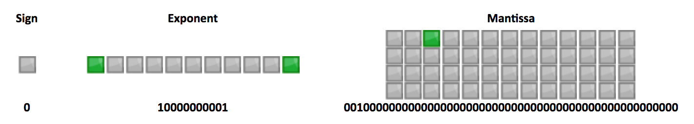
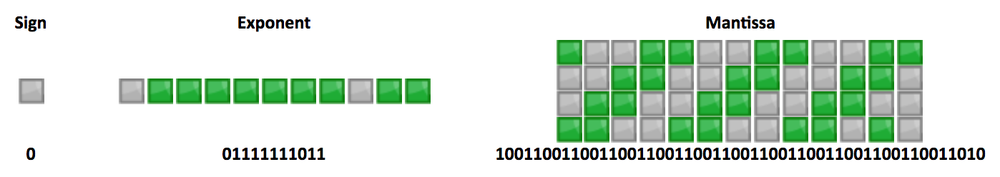

# JavaScript 关于 IEEE 754 双精度浮点数的实现

[[toc]]

## 简介

众所周知，JavaScript 浮点数运算时经常遇到会`0.000000001`和`0.999999999`这样奇怪的结果，如`0.1+0.2=0.30000000000000004`、`1-0.9=0.09999999999999998`，很多人知道这是浮点数误差问题，但具体就说不清楚了。本文帮你理清这背后的原理以及解决方案，还会向你解释 JavaScript 中的大数危机和四则运算中会遇到的坑。

## 双精度浮点数的存储

首先我们来了解一下 JavaScript 是如何存储数字的。和其它语言如 Java 和 Python 不同，JavaScript 中所有数字包括整数和小数都只有一种类型 — `Number`。它的实现遵循 IEEE 754 标准，使用 64 位固定长度来表示，也就是标准的双精度浮点数（其他的还有 32 位单精度等）。

这样的存储结构优点是可以归一化处理整数和小数，节省存储空间。

64 位比特又可分为三个部分：

- 符号位
- 指数位
- 尾数位 M：最后的 52 位是尾数（`mantissa`），超出的部分自动进一舍零


### 符号位

符号位（`sign`），占 1 比特，`0`代表正数，`1`代表负数

### 指数位

指数位（`exponent`），占 11 比特，用来表示 2 的次方数。

类比整数使用所有位为 0 的数字表示数值“0”，双精度浮点数表示 0 时指数部分也为 0。若如此，便可能产生冲突：比如全 0 的数字可能表示“0”，也可能表示“1 * 2<sup>0</sup> = 1”，于是此处规定：

- 0x000: 即二进制的`00000000000`，用来代表带符号的 0（尾数为 0）或下溢数（尾数不为 0）。
- 0x7ff: 即二进制的`11111111111`，用来代表无穷大（尾数为 0）或NaN（尾数不为 0）。
- 其他: 即二进制的`00000000001`-`11111111110`代表 2 的`exponent-0x3ff`次方。

之所以要减去`0x3ff`，是因为指数还需要表示负数。在因此指数位里，二进制的`10000000000`~`11111111110`，即十进制的`1024`~`2046`，代表指数表示正数，二进制`00000000001`~`1111111110`，即十进制的`1`~`1022`，代表指数表示负数。

### 尾数位

尾数位（`mantissa`），占 52 比特，用来表示二进制科学计算法 Mantissa 部分`1.`后面的数字。

在二进制的科学计数法里，数字被表示为：

Mantissa * 2<sup>exponent</sup>

为了最大限度提高精确度，可以要求尾数规范化，把尾数处理到大于等于`1`而小于`2`的区间内，便可省去前述的“1”。例如：

> 二进制的 11.101 * 2<sup>1001</sup> 可以规范化为 1.1101 * 2<sup>1010</sup> ，存储尾数则只需要存储 1101 即可

> 二进制的 0.00110011 * 2<sup>-1001</sup> 可以规范化为 1.10011 * 2<sup>-1100</sup> ，存储尾数则只需要存储 10011 即可

于是，可得到以下形式: 1.mantissa * 2<sup>exponent</sup>

### 总结

根据以上的叙述，一个双精度浮点数所代表的数值为：(-1)<sup>sign</sup> * 2<sup>exponent - 0x3ff</sup> * 1.mantissa

比如，十进制的 4.5，转换成二级制则为 100.1，表示为二进制的科学计数法为，1.001 * 2<sup>2</sup> ，因此，`sign`为`0`，`exponent`为二进制的`10000000001`即十进制的`1023 + 2 = 1025`，`mantissa`为二进制`001`（后面再跟 49 个 0）



## 计算误差

### 安全整数

所谓“安全整数”，就是说该整数与其双精度浮点数表示是一一对应的，即该整数有且仅有一个双精度浮点数表示，其该双精度浮点数表示有且仅有一个对应的整数。

安全整数的范围是(-2<sup>53</sup>, 2<sup>53</sup>)，不包括两端的取值。超过这个范围，有的整数是无法精确表示的，只能`round`到与它相近的双精度浮点数，其结果就是，超过一个的整数对应同一个双精度浮点数。

JavaScript 的`Number`构造函数上有如下两个静态属性:

- `Number.MAX_VALUE`: 常量，其值为`1.7976931348623157e+308`，表示 JavaScript 里所能表示的最大数值。
- `Number.MAX_SAFE_INTEGER`: 常量，其值为`9007199254740991`，即 2<sup>53</sup> - 1，表示 JavaScript 里所能表示的最大安全整数。

#### 确定最大安全整数

但是，安全整数的范围是如何确定的呢？基于上面双精度浮点数存储的知识，我们试图来确定一下最大安全整数。

我们知道，尾数的最大值是为 52 个 1，加上规范化时省略的 1，共计 53 个 1，因此其能表示的最大整数的二进制科学计数法表示为：

1.{52个1} * 2<sup>exponent - 0x3ff </sup>

其中，小数点之前是 1 个 1，小数点后是 52 个 1。`exponent`为指数，其取值为`0 < exponent < 2047`，因此，其所能表示的最大整数用二进制科学计数法表示为

1.{52个1} * 2<sup>2046 - 0x3ff</sup> = 1.{52个1} * 2<sup>1023</sup> = (2<sup>53</sup>-1) * 2<sup>1023 - 52</sup> = (2<sup>53</sup>-1) * 2<sup>971</sup>

上面这个数，表示成二进制就是 53 个 1 后面加上 971 个 0；表示成十进制是 1.7976931348623157e+308，即 1.7976931348623157 * 10<sup>308</sup>。

但是，能表示的最大整数并不都是安全的。事实上，超过大于 2<sup>53</sup>-1 的整数都是不安全整数。

十进制数 | 二进制数 | 科学计算法 | 存储时的指数值(十进制)和尾数值(二进制)
--- | --- | --- | ---
2<sup>53</sup>-3 | {51个1}01 | 1.{50个1}01 * 2<sup>52</sup> | `exponent`: 52<br>`mantissa`: 50个1, 后跟01<br>（整数与浮点数一一对应，安全整数）
2<sup>53</sup>-2 | {51个1}10 | 1.{50个1}10 * 2<sup>52</sup> | `exponent`: 52<br>`mantissa`: 50个1, 后跟10<br>（整数与浮点数一一对应，安全整数）
2<sup>53</sup>-1 | {51个1}11 | 1.{50个1}11 * 2<sup>52</sup> | `exponent`: 52<br>`mantissa`: 50个1, 后跟11<br>（整数与浮点数一一对应，安全整数）
2<sup>53</sup> | 1{53个0} | 1.{53个0} * 2<sup>53</sup> | `exponent`: 53<br>`mantissa`: 52 个 0<br>（只有 52 比特，最后一个 0 被省略了）<br>（两个整数对应一个浮点数，不安全整数）
2<sup>53</sup> + 1 | 1 {52个0} 1 | 1.{52个0}1 * 2<sup>53</sup> | `exponent`: 53<br>`mantissa`: 52 个 0<br>（只有 52 比特，最后一个 1 被省略了）<br>（两个整数对应一个浮点数，不安全整数）
2<sup>53</sup> + 2 | 1 {51个0} 10 | 1.{51个0}10 * 2<sup>53</sup> | `exponent`: 53<br>`mantissa`: 51 个 0, 1 个 1<br>（只有 52 比特，最后一个 0 被省略了）<br>（两个整数对应一个浮点数，不安全整数）
2<sup>53</sup> + 3 | 1 {51个0} 11 | 1.{51个0}11 * 2<sup>53</sup> | `exponent`: 53<br>`mantissa`: 51 个 0, 1 个 1<br>（只有 52 比特，最后一个 1 被省略了）<br>（两个整数对应一个浮点数，不安全整数）

上表里，小于等于 2<sup>53</sup>-1 的整数，都能找到一一对应的双精度浮点数。但是 2<sup>53</sup> 及以后的整数，一个双精度浮点数都能对应多个整数。比如我们在控制台里测试 2<sup>53</sup> 与 2<sup>53</sup> + 1 是否相等：

```js
Math.pow(2,53) === Math.pow(2,53) + 1 // true
```

事实上，因为尾数位只能 52 位，导致超过 52 位都会被省略，因此，

(2<sup>53</sup> ~ 2<sup>54</sup>) 之间的数，只能精确表示 2<sup>1</sup> 的倍数，即偶数

(2<sup>54</sup> ~ 2<sup>55</sup>) 之间的数，只能精确表示 2<sup>2</sup> 的倍数，即 4 的倍数

(2<sup>55</sup> ~ 2<sup>56</sup>) 之间的数，只能精确表示 2<sup>3</sup> 的倍数，即 8 的倍数

以此类推...

因此，最大安全整数是 2<sup>53</sup> - 1，最小安全整数是 -(2<sup>53</sup> - 1)

### 小数

#### 小数误差

我们先以 0.1 为例，解析浮点误差的原因。0.1 转换为二进制表示为 0.0001100110011001100（1100 循环），表示为二进制的科学计数法为，1.100110011001100 * 2<sup>-4</sup>，所以`exponent`为`-4 + 1023 = 1019`；`mantissa`舍去小数点左边的 1，得到 100110011001100（1100 循环）。最终存储时就是:



再从存储里取出，转换为十进制后就为`0.100000000000000005551115123126`，因此就出现了浮点误差。

#### 0.1 + 0.2 = 0.30000000000000004

JavaScript 里关于数字的运算，都是先转为二进制后再进行运算，因此`0.1`和`0.2`转为二进制为：

`0.00011001100110011001100110011001100110011001100110011010` +
`0.0011001100110011001100110011001100110011001100110011010` =
`0.0100110011001100110011001100110011001100110011001100111`

计算结果转换为十进制，正好是`0.30000000000000004`

#### 为什么 x = 0.1 能得到 0.1

因为`mantissa`固定长度是 52 位，二进制科学计数法可能会出现这样的数据:

1.{51个0}1 * 2<sup>0</sup>，转换为十进制就是 2<sup>0</sup> + 2<sup>-52</sup>

也就是说，转化为十进制时，小数的精度为 2<sup>-52</sup>，即 2.220446049250313e-16。

因此，当数字转换为十进制时，JavaScript 能表示的精度最多能精确到小数点后第 16 位。也就是说，会将小数点后的第 17 位进行凑整处理。

我们将`0.1`~`0.9`指定 21 位有效数字，查看其值是多少。

```js
0.1.toPrecision(21) // 0.100000000000000005551
0.2.toPrecision(21) // 0.200000000000000011102
0.3.toPrecision(21) // 0.299999999999999988898
0.4.toPrecision(21) // 0.400000000000000022204
0.5.toPrecision(21) // 0.500000000000000000000
0.6.toPrecision(21) // 0.599999999999999977796
0.7.toPrecision(21) // 0.699999999999999955591
0.8.toPrecision(21) // 0.800000000000000044409
0.9.toPrecision(21) // 0.900000000000000022204
```

因此，在对小数点后的第 17 位进行凑整处理后，实际上就是:

```js
0.10000000000000000555.toPrecision(16) // 0.1000000000000000
```

也就是`0.1`，因此，正常打印`0.1`~`0.9`

## 疑问

既然`0.1`通过`toPrecision(16)`来做精度运算，最终结果为`0.1`；那么为啥`0.1 + 0.2`的结果`0.30000000000000004`并没有按照`toPrecision(16)`来做精度运算，而是`toPrecision(17)`呢？

```js
(0.1 + 0.2).toPrecision(16)  // 0.3000000000000000
(0.1 + 0.2).toPrecision(17)  // 0.30000000000000004
```

## TODO

TODO: 如何在 Javascript 数字计算中保证精度正确？ [number-precision](https://github.com/nefe/number-precision)

## Reference

- [JavaScript 浮点数陷阱及解法 #9](https://github.com/camsong/blog/issues/9)
