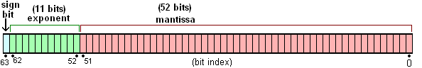

# JavaScript 关于 IEEE 754 双精度浮点数的实现

[[toc]]

## 简介

众所周知，JavaScript 浮点数运算时经常遇到会`0.000000001`和`0.999999999`这样奇怪的结果，如`0.1+0.2=0.30000000000000004`、`1-0.9=0.09999999999999998`，很多人知道这是浮点数误差问题，但具体就说不清楚了。本文帮你理清这背后的原理以及解决方案，还会向你解释 JavaScript 中的大数危机和四则运算中会遇到的坑。

## 双精度浮点数的存储

首先我们来了解一下 JavaScript 是如何存储数字的。和其它语言如 Java 和 Python 不同，JavaScript 中所有数字包括整数和小数都只有一种类型 — `Number`。它的实现遵循 IEEE 754 标准，使用 64 位固定长度来表示，也就是标准的双精度浮点数（其他的还有 32 位单精度等）。

这样的存储结构优点是可以归一化处理整数和小数，节省存储空间。

64 位比特又可分为三个部分：

- 符号位
- 指数位
- 尾数位 M：最后的 52 位是尾数（`mantissa`），超出的部分自动进一舍零



### 符号位

符号位（`sign`），占 1 比特，`0`代表正数，`1`代表负数

### 指数位

指数位（`exponent`），占 11 比特，用来表示 2 的次方数。

类比整数使用所有位为 0 的数字表示数值“0”，双精度浮点数表示 0 时指数部分也为 0。若如此，便可能产生冲突：比如全 0 的数字可能表示“0”，也可能表示“1 * 2<sup>0</sup> = 1”，于是此处规定：

- 0x000: 即二进制的`00000000000`，用来代表带符号的 0（尾数为 0）或下溢数（尾数不为 0）。
- 0x7ff: 即二进制的`11111111111`，用来代表无穷大（尾数为 0）或NaN（尾数不为 0）。
- 其他: 即二进制的`00000000001`-`11111111110`代表 2 的`exponent-0x3ff`次方。

之所以要减去`0x3ff`，是因为指数还需要表示负数。在因此指数位里，二进制的`10000000000`~`11111111110`，即十进制的`1024`~`2046`，代表指数表示正数，二进制`00000000001`~`01111111110`，即十进制的`1`~`1022`，代表指数表示负数。

### 尾数位

尾数位（`mantissa`），占 52 比特，用来表示二进制科学计算法 Mantissa 部分`1.`后面的数字。

在二进制的科学计数法里，数字被表示为：

Mantissa * 2<sup>exponent</sup>

为了最大限度提高精确度，可以要求尾数规范化，把尾数处理到大于等于`1`而小于`2`的区间内，便可省去前述的“1”。例如：

> 二进制的 11.101 * 2<sup>1001</sup> 可以规范化为 1.1101 * 2<sup>1010</sup> ，存储尾数则只需要存储 1101 即可

> 二进制的 0.00110011 * 2<sup>-1001</sup> 可以规范化为 1.10011 * 2<sup>-1100</sup> ，存储尾数则只需要存储 10011 即可

于是，可得到以下形式: 1.mantissa * 2<sup>exponent</sup>

### 总结

根据以上的叙述，一个双精度浮点数所代表的数值为：(-1)<sup>sign</sup> * 2<sup>exponent - 0x3ff</sup> * 1.mantissa

比如，十进制的 4.5，转换成二级制则为 100.1，表示为二进制的科学计数法为，1.001 * 2<sup>2</sup> ，因此，`sign`为`0`，`exponent`为二进制的`10000000001`即十进制的`1023 + 2 = 1025`，`mantissa`为二进制`001`（后面再跟 49 个 0）


需要注意的是，`mantissa`若是超过 52 位，会判断第 53 位，若是 1 则进 1，若是 0 则舍去。

比如对于`0.1`，其二进制表示为`0.00011001100110011001100110011001100110011001100110011001100...（1100无限循环）`，表示成二级制科学计数法为

1.10011001100110011001100110011001100110011001100110011【注意，第 53 为是 1】00...（1100无限循环）* 2<sup>-4</sup>

因为第 53 为是 1，因此最终要进 1，变成了

1.1001100110011001100110011001100110011001100110011010 * 2<sup>-4</sup>

符号位、指数位、尾数位分别为：


也就是说，`0.1`经过转换存储后再转为十进制数，实际上比原先的`0.1`要略大！

## 计算误差

### 安全整数

所谓“安全整数”，就是说该整数与其双精度浮点数表示是一一对应的，即该整数有且仅有一个双精度浮点数表示，其该双精度浮点数表示有且仅有一个对应的整数。

安全整数的范围是(-2<sup>53</sup>, 2<sup>53</sup>)，不包括两端的取值。超过这个范围，有的整数是无法精确表示的，只能`round`到与它相近的双精度浮点数，其结果就是，超过一个的整数对应同一个双精度浮点数。

JavaScript 的`Number`构造函数上有如下两个静态属性:

- `Number.MAX_VALUE`: 常量，其值为`1.7976931348623157e+308`，表示 JavaScript 里所能表示的最大数值。
- `Number.MAX_SAFE_INTEGER`: 常量，其值为`9007199254740991`，即 2<sup>53</sup> - 1，表示 JavaScript 里所能表示的最大安全整数。

#### 确定最大安全整数

但是，安全整数的范围是如何确定的呢？基于上面双精度浮点数存储的知识，我们试图来确定一下最大安全整数。

我们知道，尾数的最大值是为 52 个 1，加上规范化时省略的 1，共计 53 个 1，因此其能表示的最大整数的二进制科学计数法表示为：

1.{52个1} * 2<sup>exponent - 0x3ff </sup>

其中，小数点之前是 1 个 1，小数点后是 52 个 1。`exponent`为指数，其取值为`0 < exponent < 2047`，因此，其所能表示的最大整数用二进制科学计数法表示为

1.{52个1} * 2<sup>2046 - 0x3ff</sup> = 1.{52个1} * 2<sup>1023</sup> = (2<sup>53</sup>-1) * 2<sup>1023 - 52</sup> = (2<sup>53</sup>-1) * 2<sup>971</sup>

上面这个数，表示成二进制就是 53 个 1 后面加上 971 个 0；表示成十进制是 1.7976931348623157e+308，即 1.7976931348623157 * 10<sup>308</sup>。

但是，能表示的最大整数并不都是安全的。事实上，超过大于 2<sup>53</sup>-1 的整数都是不安全整数。

| 十进制数           | 二进制数     | 科学计算法                   | 存储时的指数值(十进制)和尾数值(二进制)                                                                                                  |
| ------------------ | ------------ | ---------------------------- | --------------------------------------------------------------------------------------------------------------------------------------- |
| 2<sup>53</sup>-3   | {51个1}01    | 1.{50个1}01 * 2<sup>52</sup> | `exponent`: 52 + 1023<br>`mantissa`: 50个1, 后跟01<br>（整数与浮点数一一对应，安全整数）                                                |
| 2<sup>53</sup>-2   | {51个1}10    | 1.{50个1}10 * 2<sup>52</sup> | `exponent`: 52 + 1023<br>`mantissa`: 50个1, 后跟10<br>（整数与浮点数一一对应，安全整数）                                                |
| 2<sup>53</sup>-1   | {51个1}11    | 1.{50个1}11 * 2<sup>52</sup> | `exponent`: 52 + 1023<br>`mantissa`: 50个1, 后跟11<br>（整数与浮点数一一对应，安全整数）                                                |
| 2<sup>53</sup>     | 1{53个0}     | 1.{53个0} * 2<sup>53</sup>   | `exponent`: 53 + 1023<br>`mantissa`: 52 个 0<br>（只有 52 比特，最后一个 0 被省略了）<br>（两个整数对应一个浮点数，不安全整数）         |
| 2<sup>53</sup> + 1 | 1 {52个0} 1  | 1.{52个0}1 * 2<sup>53</sup>  | `exponent`: 53 + 1023<br>`mantissa`: 52 个 0<br>（只有 52 比特，最后一个 1 被省略了）<br>（两个整数对应一个浮点数，不安全整数）         |
| 2<sup>53</sup> + 2 | 1 {51个0} 10 | 1.{51个0}10 * 2<sup>53</sup> | `exponent`: 53 + 1023<br>`mantissa`: 51 个 0, 1 个 1<br>（只有 52 比特，最后一个 0 被省略了）<br>（两个整数对应一个浮点数，不安全整数） |
| 2<sup>53</sup> + 3 | 1 {51个0} 11 | 1.{51个0}11 * 2<sup>53</sup> | `exponent`: 53 + 1023<br>`mantissa`: 51 个 0, 1 个 1<br>（只有 52 比特，最后一个 1 被省略了）<br>（两个整数对应一个浮点数，不安全整数） |

上表里，小于等于 2<sup>53</sup>-1 的整数，都能找到一一对应的双精度浮点数。但是 2<sup>53</sup> 及以后的整数，一个双精度浮点数都能对应多个整数。比如我们在控制台里测试 2<sup>53</sup> 与 2<sup>53</sup> + 1 是否相等：

```js
Math.pow(2,53) === Math.pow(2,53) + 1 // true
```

事实上，因为尾数位只能 52 位，导致超过 52 位都会被省略，因此，

(2<sup>53</sup> ~ 2<sup>54</sup>) 之间的数，只能精确表示 2<sup>1</sup> 的倍数，即偶数

(2<sup>54</sup> ~ 2<sup>55</sup>) 之间的数，只能精确表示 2<sup>2</sup> 的倍数，即 4 的倍数

(2<sup>55</sup> ~ 2<sup>56</sup>) 之间的数，只能精确表示 2<sup>3</sup> 的倍数，即 8 的倍数

以此类推...

因此，最大安全整数是 2<sup>53</sup> - 1，最小安全整数是 -(2<sup>53</sup> - 1)

::: warning 警告
超过 2<sup>53</sup> - 1 之后，计算结果不能确保其正确性。在控制台打印 Math.pow(2, 53) 之后的 10 个数，发现并不是两个整数对应一个结果。

```
> Math.pow(2, 53)
9007199254740992
> Math.pow(2, 53) + 1
9007199254740992
> Math.pow(2, 53) + 2
9007199254740994
> Math.pow(2, 53) + 3
9007199254740996
> Math.pow(2, 53) + 4
9007199254740996
> Math.pow(2, 53) + 5
9007199254740996
> Math.pow(2, 53) + 6
9007199254740998
> Math.pow(2, 53) + 7
9007199254741000
> Math.pow(2, 53) + 8
9007199254741000
> Math.pow(2, 53) + 9
9007199254741000
> Math.pow(2, 53) + 10
9007199254741002
```

| 整数                 | 实际打印结果     | 存储之前的二级制                                                 | 实际存储的二级制          |
| -------------------- | ---------------- | ---------------------------------------------------------------- | ------------------------- |
| Math.pow(2, 53)      | 9007199254740992 | `exponent`: 52 + 1023，`mantissa`: 000...0000 （53 个 0）        | `mantissa`: 52 个 0       |
| Math.pow(2, 53) + 1  | 9007199254740992 | `exponent`: 52 + 1023，`mantissa`: 000...0001 （52 个 0 + 1）    | `mantissa`: 52 个 0       |
| Math.pow(2, 53) + 2  | 9007199254740994 | `exponent`: 52 + 1023，`mantissa`: 000...0010 （51 个 0 + 10）   | `mantissa`: 51 个 0 + 1   |
| Math.pow(2, 53) + 3  | 9007199254740996 | `exponent`: 52 + 1023，`mantissa`: 000...0011 （51 个 0 + 11）   | `mantissa`: 50 个 0 + 10  |
| Math.pow(2, 53) + 4  | 9007199254740996 | `exponent`: 52 + 1023，`mantissa`: 000...0100 （50 个 0 + 100）  | `mantissa`: 50 个 0 + 10  |
| Math.pow(2, 53) + 5  | 9007199254740996 | `exponent`: 52 + 1023，`mantissa`: 000...0101 （50 个 0 + 101）  | `mantissa`: 50 个 0 + 10  |
| Math.pow(2, 53) + 6  | 9007199254740998 | `exponent`: 52 + 1023，`mantissa`: 000...0110 （50 个 0 + 110）  | `mantissa`: 50 个 0 + 11  |
| Math.pow(2, 53) + 7  | 9007199254741000 | `exponent`: 52 + 1023，`mantissa`: 000...0111 （50 个 0 + 111）  | `mantissa`: 49 个 0 + 100 |
| Math.pow(2, 53) + 8  | 9007199254741000 | `exponent`: 52 + 1023，`mantissa`: 000...1000 （49 个 0 + 1000） | `mantissa`: 49 个 0 + 100 |
| Math.pow(2, 53) + 9  | 9007199254741000 | `exponent`: 52 + 1023，`mantissa`: 000...1001 （49 个 0 + 1001） | `mantissa`: 49 个 0 + 100 |
| Math.pow(2, 53) + 10 | 9007199254741002 | `exponent`: 52 + 1023，`mantissa`: 000...1010 （49 个 0 + 1010） | `mantissa`: 49 个 0 + 101 |

到这里，可以大致猜测，在`mantissa`的第 52 位和第 53 位都为 1 时，会进 1 位，而其他情况则舍去，因此会出现每相邻的 4 个数中，有 3 个数是一样的。
:::

### 小数

#### Number.EPSILON

ES6 在`Number`对象上面，新增一个极小的常量`Number.EPSILON`。根据规格，它表示 1 与大于 1 的最小浮点数之间的差。

1 的二进制科学计算法表示为：1.00...00 * 2<sup>0</sup>，其中`mantissa`为 52 个 0。
比 1 大的最小浮点数为：1.00...01 * 2<sup>0</sup>，其中`mantissa`为 51 个 0 和 1 个 1。

因此，`Number.EPSILON` = (1 + 2<sup>-52</sup>) - 1 = 2<sup>-52</sup>

即 IEEE 754 双精度浮点数在转为十进制时，最小精度为 2<sup>-52</sup>，即 2.220446049250313e-16，这也就意味着，(1, 1 +  2<sup>-52</sup> )之间的十进制数，对应的是同一个双精度浮点数。

进一步我们可以知道，当数字越来越大时，一个双精度浮点数对应的十进制的数值范围就越大，比如比 1023 大的最小浮点数是 1023 + 2<sup>-43</sup>，因此（1023, 1023 + 2<sup>-43</sup>）之间的十进制数，对应的是同一个双精度浮点数。

解释：十进制的 1023 转换为二进制为 1111111111，转为双精度浮点数是：1.111111111 * 2<sup>-9</sup>，其`mantissa`为 9 个 1。而`mantissa`最多是 52 位，若是超过 52 位，第 53 位之后都会被直接舍去，只判断第 53 位，若是 1 则进 1，若是 0 则舍去。因此比 1023 大的最小浮点数是：1.111111111{42个0}1 * 2<sup>-9</sup>，即十进制的 1023 + 2<sup>-43</sup>。（若存在第 53 位为 0，即 1.111111111{42个0}10 * 2<sup>-9</sup>，第 53 位 0 会被舍去，等同于 1.111111111{42个0}1 * 2<sup>-9</sup>；若存在第 53 位为 1，即 1.111111111{42个0}11 * 2<sup>-9</sup>，第 53 位会进 1，最后变成 1.111111111{41个0}10 * 2<sup>-9</sup>，这个数比 1.111111111{42个0}1 * 2<sup>-9</sup>还要大）

#### 小数误差

我们先以 0.1 为例，解析浮点误差的原因。0.1 转换为二进制表示为 0.0001100110011001100（1100 循环），表示为二进制的科学计数法为，1.100110011001100 * 2<sup>-4</sup>，所以`exponent`为`-4 + 1023 = 1019`；`mantissa`舍去小数点左边的 1，得到 100110011001100（1100 循环），且`mantissa`的第 53 位是 1，因此会进位，最终存储时就是:


再从存储里取出，转换为十进制后就为`0.100000000000000005551115123126`，因此就出现了浮点误差。

#### 0.1 + 0.2 = 0.30000000000000004

JavaScript 里关于数字的运算，都是先转为二进制，再转成二进制的科学计数法进行存储，再取出存储值转为二级制，最后进行运算。而在先存储再取出值的过程中，就可能丢失精度。

`0.1`和`0.2`存储后转为二进制的形式为：

`0.0001  1001  1001  1001  1001  1001  1001  1001  1001  1001  1001  1001  1001  1010` +

`0.0011  0011  0011  0011  0011  0011  0011  0011  0011  0011  0011  0011  0011  010` =

`0.0100  1100  1100  1100  1100  1100  1100  1100  1100  1100  1100  1100  1100  111`

计算结果转换为十进制，正好是`0.30000000000000004`

#### 为什么 x = 0.1 能得到 0.1

因为`mantissa`固定长度是 52 位，二进制科学计数法可能会出现这样的数据:

1.{51个0}1 * 2<sup>0</sup>，（即`exponent`为十进制的`1023`，`mantissa`为二进制的`{51个0}1`），转换为十进制就是 2<sup>0</sup> + 2<sup>-52</sup>

也就是说，转化为十进制时，小数的精度为 2<sup>-52</sup>，即 2.220446049250313e-16。

因此，当数字转换为十进制时，JavaScript 能表示的精度最多能精确到小数点后第 16 位。也就是说，会将小数点后的第 17 位进行凑整处理。

我们将`0.1`~`0.9`指定 21 位有效数字，查看其值是多少。

```js
0.1.toPrecision(21) // 0.100000000000000005551
0.2.toPrecision(21) // 0.200000000000000011102
0.3.toPrecision(21) // 0.299999999999999988898
0.4.toPrecision(21) // 0.400000000000000022204
0.5.toPrecision(21) // 0.500000000000000000000
0.6.toPrecision(21) // 0.599999999999999977796
0.7.toPrecision(21) // 0.699999999999999955591
0.8.toPrecision(21) // 0.800000000000000044409
0.9.toPrecision(21) // 0.900000000000000022204
```

因此，在对小数点后的第 17 位进行凑整处理后，实际上就是:

```js
0.10000000000000000555.toPrecision(16) // 0.1000000000000000
```

也就是`0.1`，因此，正常打印`0.1`~`0.9`

## IEEE 754是按照什么规则来实现双精度浮点数的截断的？

在`Number.EPSILON`一节我们知道，双精度浮点数的小数精度为 2<sup>-52</sup>，即 2.220446049250313e-16，但是在将双精度浮点数转换为十进制的数字字符串时，小数点后要保留多少位有效数字呢？我们先来看看浏览器控制台的一组计算及其返回：

```
0.1 + 0.2 = 0.30000000000000004     // 17 位有效数字
100.27 * 0.41 = 41.110699999999994  // 17 位有效数字
0.95 * 1 / 3 = 0.31666666666666665  // 17 位有效数字
300.73 - 300 = 0.7300000000000182   // 16 位有效数字
```

事实上以上例子打印出的结果均是真实算数结果的近似值，然而却有不同的有效数字位；在浏览器控制台里输入`0.1` ，而我们也明白这个不是精确的值，而控制台依然显示的是`0.1`，不显示`0.10000000000000001`。很明显，在控制台输出的浮点数近似值都是经过一定的规则来截断的。同时这种表现不仅限于 JS，大家可以在 Terminal 中尝试一下，所有采用 IEEE 754 双精度浮点数标准的语言如 Node 和 Python 都有同样的表现。那么，IEEE 754是按照什么规则来实现双精度浮点数的截断的？

在 IEEE 754 规范的 Wiki 页面里看到对浮点数和十进制字符串转换的描述有这么一段：

> The standard requires operations to convert between basic formats and external character sequence formats. Conversions to and from a decimal character format are required for all formats. Conversion to an external character sequence must be such that conversion back using round to even will recover the original number. There is no requirement to preserve the payload of a NaN or signaling NaN, and conversion from the external character sequence may turn a signaling NaN into a quiet NaN. The original binary value will be preserved by converting to decimal and back again using 17 decimal digits for binary64.

IEEE 754 规定，浮点数被转成十进制数字字符串，当这个字符串（使用 Round to Even 向偶舍入）转回浮点数时，必须要跟原来的数相同。对双精度浮点数来说，十进制字符串使用17位有效数字即可保存原始二进制值。

我们来做个实验，以`0.1`为例，它在内存中的二进制表示转换为十进制的数字字符串为：`0.1000000000000000055511151231257827021181583404541015625`

当我们获取它的 17 位(经过舍入的)有效数为`0.10000000000000001`，那为什么控制台不显示`0.10000000000000001`而显示`0.1`？事实上，有许多不同的十进制数共享相同的最接近的近似二进制小数，在这个例子里，`0.1`、`0.10000000000000001`、`0.1000000000000000055511151231257827021181583404541015625`分别在内存中的 64bit 都是完全相同的，在大多数系统上现在能够选择这些表示中最短的来展示，也就是`0.1`。因此可以推断出：截断判断的依据是截断后的数在`console`里打印成字符串，这个字符串再转回浮点数后，是否还是同一个数。

说人话就是：在`console`里打印出来的，就是可以表示这个浮点数的最短的字符串！

这就解释了为啥`console`里有些浮点数的计算得出 17 位有效位，有些只有 16 位，有些直接显示自己本身。

## TODO

TODO: 如何在 Javascript 数字计算中保证精度正确？ [number-precision](https://github.com/nefe/number-precision)

## Reference

- [JavaScript 浮点数陷阱及解法 #9](https://github.com/camsong/blog/issues/9)
- [IEEE 754 双精度浮点数可视化工具](http://bartaz.github.io/ieee754-visualization/)
- [从计组课到前端深坑：IEEE 754双精度浮点数的那些事](https://jacelyn.fish/2019/06/08/ieee-floating-point-number/)
- [IEEE 754 round-to-nearest-even](https://blog.csdn.net/qq_16097611/article/details/52373936)
- [前端应该知道的JavaScript浮点数和大数的原理](https://zhuanlan.zhihu.com/p/66949640)
