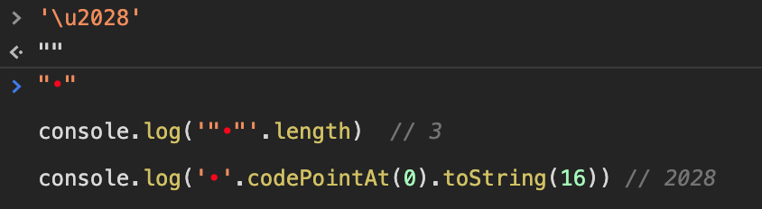
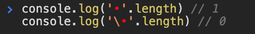

# 字符串

## JavaScript 中字符串字面量的计算

### 背景

在 JavaScript 中，字符串字面量是由单引号或双引号括起来的字符序列。单引号括起来的字符串字面量内可以包含双引号，但不能包含单引号；双引号括起来的字符串字面量内可以包含单引号，但不能包含双引号。

那么，如果我们想要在单引号括起来的字符串字面量内包含单引号，或者双引号括起来的字符串字面量内包含双引号，应该怎么做呢？

比如，我们想定义这样一个字符串，`' is a single quote, and " is a double quote.`，该字符串无论是用单引号括起来还是用双引号括起来，都会有问题。

```js
const strA = "' is a single quote, and " is a double quote."
const strB = '' is a single quote, and " is a double quote.'
```

### 特殊字符及转义序列

针对这种情况，针对像单引号和双引号这些特殊用途的字符，或者像换行符这种非打印字符，JavaScript 允许其通过以反斜线`\`开头的转义序列的形式来代表单个字符，可以放在字符串字面量内的任意位置。

反斜线`\`在 JavaScript 字符串字面量里具有特殊用途，它与其后的字符结合之后，就不再表示该字符的字面含义了。比如`\n`，表示的是换行符。

| 转义序列                 | 所表示的字符                      |
| ------------------------ | --------------------------------- |
| `\0`                     | 空字符（注意，不是空字符串）      |
| `\'`                     | 单引号`'`                         |
| `\"`                     | 双引号`"`                         |
| `\\`                     | 反斜线`\`                         |
| `\n`                     | 换行                              |
| `\r`                     | 回车                              |
| `\v`                     | 垂直制表符                        |
| `\t`                     | 水平制表符                        |
| `\b`                     | 退格                              |
| `\f`                     | 换页                              |
| `\xXX`                   | Latin-1 字符(`x`小写)             |
| `\uXXXX`                 | Unicode 基本多文种平面里的字符    |
| `\u{X}` ... `\u{XXXXXX}` | Unicode 所有 Code Point（实验性） |

`\xXX`是指在`\x`后紧跟着两个十六进制数`XX`，代表一个字符，`XX`是字符的 Unicode 码位，取值范围是`00`~`FF`，因此能输出 256 种字符，即[Latin-1 字符](https://zh.wikipedia.org/wiki/ISO/IEC_8859-1)。

`\uXXXX`是指在`\u`后紧跟着四个十六进制数`XXXX`，代表一个字符，`XXXX`是字符的 Unicode 码位，取值范围`0000`~`FFFF`，能输出[Unicode 基本多文种平面](https://zh.wikipedia.org/wiki/Unicode%E5%AD%97%E7%AC%A6%E5%B9%B3%E9%9D%A2%E6%98%A0%E5%B0%84#%E5%9F%BA%E6%9C%AC%E5%A4%9A%E6%96%87%E7%A7%8D%E5%B9%B3%E9%9D%A2)里的字符。

由此可知，我们可以如下这样声明之前的那个字符串:

```js
const str = '\' is a single quote, and \" is a double quote.'
```

### JavaScript 是如何计算字符串字面量的

既然我们可以将一些特殊字符以转义序列的形式放置在字符串字面量中，那么 JavaScript 引擎是如何将字符串字面量计算成 JavaScript 字符串的呢？

JavaScript 引擎会对代码里定义的每一个字符串字面量进行计算，将字符串字面量里的转义序列转换成其所表示的字符，最终将字符串字面量计算为 JavaScript 里字符串类型的值。

那 JavaScript 是如何处理字符串字面量里的每个字符以得到最终的 JavaScript 字符串的呢？主要分为以下几种情况。

第一种，若字符前没有反斜杠`\`，则该字符即为其本身。

```js
> 'world'
< "world"
```

第二种，若字符前有反斜杠`\`，且`\`能与该字符（或者其后多个字符）能组合成上表里的转义序列，则将`\`和该字符串转义为其所表示的字符。

```js
> 'hello, \'world\''
< "hello, 'world'"

> '\x61bcd'
< "abcd"

> '\u4f60好'
< "你好"
```

第一种和第二种是[ECMA 262 - String Literals](https://tc39.es/ecma262/#sec-literals-string-literals)规定的；而下面的第三种和第四种情况，规范里并没有规定如何处理，具体的处理方式还得看 JavaScript 引擎的实现。[从一个 JSON.parse 错误深入研究 JavaScript 的转义字符](https://zhuanlan.zhihu.com/p/31030352)这篇文章分析了 V8 源码，并给出了如下两种情况。

第三种，若字符串前有反斜杠`\`，且`\`与该字符（或者其后多个字符）不能组合成上表里的转义序列，且该字符不是`u`或者`x`，则将`\`和该字符串转义为该字符本身。

```js
> 'hello, \world'
< "hello, world"
```

第四种，若字符串前有反斜杠`\`，且`\`与该字符（或者其后多个字符）不能组合成上表里的转义序列，且该字符是`u`或者`x`，则会导致语法错误。

```js
> '\u'
× Uncaught SyntaxError: Invalid Unicode escape sequence

> '\u12'
× Uncaught SyntaxError: Invalid Unicode escape sequence

> '\x'
× Uncaught SyntaxError: Invalid hexadecimal escape sequence
```

### 哪些场景需要考虑字符串字面量的计算

理论上来说，但凡涉及到字符串字面量的地方，都需要考虑字符串字面的计算问题。

字符串字面量，是定义在 JavaScript 代码里的字符串类型的固定值。因此只要是定义在 JavaScript 代码里的字符串字面量，都要经过 JavaScript 计算才能成为 JavaScript 字符串。

如下介绍两种必须要考虑字符串字面量计算的场景。

#### 动态创建正则表达式

若我们知道正则表达式模式将会改变，或者我们事先不知道什么模式而是从另一个来源获取（比如用户输入、接口返回），通常我们会选择动态创建正则表达式，而`RegExp`构造函数允许传入一个字符串参数来创建一个正则对象。

假设我们给`RegExp`构造函数传入一个字符串字面量来生成一个正则对象，该正则对象用于判断当前页面域名是否是`windstone.cc`的三级域名。

```js
const host = location.host;

const regA = new RegExp('\w+\.windstone\.cc', 'i');
const regB = new RegExp('\\w+\\.windstone\\.cc', 'i')

// 当 host 为 blog.windstone.cc 时，
regA.test(host); // false
regB.test(host); // true

// 当 host 为 www-windstone-cc.windstone.com 时，
regA.test(host); // true
regB.test(host); // false
```

因为示例里`RegExp`的第一个参数是字符串字面量，需要经过计算才能得到字符串，所以：

- `regA`的正则对象等价于`/w+.windstone.cc/i`
- `regB`的正则对象等价于`/\w+\.windstone\.cc/i`

因此，在使用字符串字面量生成期望的正则对象时，尤其要注意字符串字面量的计算问题。

PS: 常规情况下，尽量避免使用字符串字面量生成正则对象，而应该使用正则表达式字面量。

#### eval

`eval()`函数会将传入的字符串当做 JavaScript 代码进行执行。观察最后一行代码的打印结果。

```js
const word = '\\u0077';
const str = 'console.log("' + word + '")';
console.log(word) // \u0077
console.log(str) // console.log("\u0077")
eval(str)
```

以上代码里，赋值给常量`word`的`'\\u0077'`，以及`'console.log("'`和`'")'`都是字符串字面量。`'\\u0077'`计算成字符串`\u0077`并赋值给常量`word`，经过`+`运算生成字符串`console.log("\u0077")`并赋给常量`str`。

此时传入`eval()`函数的字符串参数`console.log("\u0077")`成为了一段代码，而其中的`"\u0077"`也就变成了字符串字面量，在`eval()`执行时会将其计算成`w`，因此最终要执行的代码等价于`console.log("w")`，所以最终打印出`w`。

### 哪些场景不需要考虑 JavaScript 计算

#### 表单项输入的字符串

表单项输入的字符串，已经是 JavaScript 字符串，不需要再经过 JavaScript 计算。

```html
<!-- 在此输入框里输入: \u0077 -->
<input type="text" id="input">
```

```js
const input = document.getElementById('input');
console.log(input) // \u0077
```

#### 接口返回的字符串

接口返回的字符串，也已经是 JavaScript 字符串，不需要再经过 JavaScript 计算。

```js
fetch('http://windstone.cc/test')
  .then(res => res.text())
  .then(data => {
      console.log(typeof data);
      console.log('data', data)
  })
```

若接口返回的文本是`{"x":"\u0077"}`，则打印结果为：

```js
string
{"x":"\u0077"}
```

### JSON 字符串

有效的 JSON 字符串，不能包含控制字符，否则无法通过`JSON.parse`解析。

```js
const a = '\n';
JSON.parse(`"${a}"`)
// Uncaught SyntaxError: Unexpected token
//   in JSON at position 1
//     at JSON.parse (<anonymous>)
//     at <anonymous>:1:6
```

字符串字面量`\n`经过 JavaScript 转义之后，变成单个字符即换行符`↵`（此处的字符仅用于示意，实际上换行符是不可打印字符），Unicode 码位是`\u000A`，属于控制字符。

当使用`JSON.parse`解析包含控制字符的 JSON 字符串时会报错，因为包含控制字符的字符串不是有效的 JSON 字符串。

### JSON.stringify 无法转换控制字符

参考规范文档[ECMA 262 - JSON.stringify - QuoteJSONString](https://tc39.es/ecma262/#sec-quotejsonstring)，`JSON.stringify`可以将换行符转换为`"\n"`，但是不能将行分隔符转成类似的形式，而是保持字符不变，结果为`"
"`。

以下操作可以直观地看到这一事实。

```js
> a = '\n'
< "
  "
> b = JSON.stringify(a)
< ""\n""
> b.charCodeAt(0).toString(16)
< "22"
> b.charCodeAt(1).toString(16)
< "5c"
> b.charCodeAt(2).toString(16)
< "6e"
> b.charCodeAt(3).toString(16)
< "22"
```

```js
> a = '\u2028'
< "
"
> b = JSON.stringify(a)
< ""
""
> b.length
< 3
> b.charCodeAt(0).toString(16)
< "22"
> b.charCodeAt(1).toString(16)
< "2028"
> b.charCodeAt(2).toString(16)
< "22"
```

注意，码位为`\u2028`的字符是非打印字符，我们能看到的可能是个类似乱码的符号。

### 如何打出行分隔符

我们知道行分隔符是不可见字符，但是有没有办法输出这个字符呢？



1. 在控制台里输入`'\u2028'`。注意，输入完毕后，一定一定一定不要按回车键！
2. 此时，你能在下一行预览到结果`""`。其实这是两个双引号`"`包裹着一个行分隔符，一共三个字符，只是行分隔符我们看不见而已。
3. 最后，将光标移到预览结果`""`上，全部选中并复制。此时你的剪切板里就有行分隔符了，不过其左右两边各有一个`"`，共三个字符。
4. 可将剪切板内容粘贴出来，就能“看到”行分隔符了。

为了验证粘贴出来的小圆点真的代表的是行分隔符，我们可将小点单独复制出来，获取其 Unicode 码位并转成 16 进制输出，可得到结果`2028`。

### 零长度的行继续符

> 有时，你的代码可能含有很长的字符串。你可能想将这样的字符串写成多行，而不是让这一行无限延长或着被编辑器折叠。有两种方法可以做到这一点。
>
> 其一，可以使用 + 运算符将多个字符串连接起来，如下所示：
>
> ```js
> let longString = "This is a very long string which needs " +
>                 "to wrap across multiple lines because " +
>                 "otherwise my code is unreadable.";
> ```
>
> 其二，可以在每行末尾使用反斜杠字符（“\”），以指示字符串将在下一行继续。确保反斜杠后面没有空格或任何除换行符之外的字符或缩进; 否则反斜杠将不会工作。 如下所示：
>
> ```js
> let longString = "This is a very long string which needs \
> to wrap across multiple lines because \
> otherwise my code is unreadable.";

以上是 MDN 里关于[长字符串](https://developer.mozilla.org/zh-CN/docs/Web/JavaScript/Reference/Global_Objects/String#%E9%95%BF%E5%AD%97%E7%AC%A6%E4%B8%B2)的描述，而我们标题里所说的行继续符，其实就是与上面的第二种方法有关。

ECMA 262 规范里对[行继续符](https://tc39.es/ecma262/#prod-LineContinuation)的定义是：

```txt
LineContinuation ::
    \ LineTerminatorSequence
```

这表示行继续符是由`\`与`行终止符序列`构成，而`行终止符序列`的定义是：

```txt
LineTerminatorSequence ::
    <LF>
    <CR> [lookahead ≠ <LF>]
    <LS>
    <PS>
    <CR><LF>
```

其中，

- `<LF>`: 换行符，Unicode 码位是`\u000A`，Unix 系统里的行尾结束符
- `<CR>`: 回车符，Unicode 码位是`\u000D`
- `<LS>`: 行分隔符，Unicode 码位是`\u2028`
- `<PS>`: 段分隔符，Unicode 码位是`\u2029`
- `<CR><LF>`: 回车符与换行符的组合，Windows 系统里的行尾结束符

这就是说，在字符串字面量里，`\`与其后的`行终止符序列`表示行继续符。而更为奇妙的是，行继续符是零长度的。

实践出真知，我们利用上一小结里的行分隔符，来组成行继续符并打印出它的长度。



可见，行分隔符的长度是`1`，而行继续符的长度是`0`，因此当行继续符加在字符串字面量里连接多行字符串时，我们丝毫不用担心字符串的长度会因为行继续符的存在而变长。

### JSON 转义

- 通过`new RegExp(str)`构造正则表达式时
- 通过`JSON.parse(str)`解析 JSON 字符串时

参考:

- [从一个 JSON.parse 错误深入研究 JavaScript 的转义字符](https://zhuanlan.zhihu.com/p/31030352)
- [从 RegExp 构造器看 JS 字符串转义设计](https://cloud.tencent.com/developer/article/1186832)
- [ECMA 262 - JSON.stringify - QuoteJSONString](https://tc39.es/ecma262/#sec-quotejsonstring)
- [ECMA 262 - JSON.parse](https://tc39.es/ecma262/#sec-json.parse)
- [ECMA 262 - LineContinuation](https://tc39.es/ecma262/#prod-LineContinuation)
- [Standard ECMA-404 The JSON Data Interchange Syntax](https://www.ecma-international.org/publications/standards/Ecma-404.htm)
- [ECMA 262 - String Literals](https://tc39.es/ecma262/#sec-literals-string-literals)
