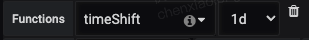

# Grafana

[[toc]]

## ClickHouse 监控配置

### 常用函数

#### concat

```sql
SELECT
    $timeSeries as t,
    sum(`count`),
    concat('字符串第一部分', first, '，字符串第二部分', extra2)
FROM $table
WHERE
    `timestamp` >= toDateTime($from)
    AND `timestamp` < toDateTime($to)
    AND dt >= toDate($from)
    AND dt <= toDate($to)
GROUP BY t, concat('字符串第一部分', first, '，字符串第二部分', extra2)
ORDER BY t
```

#### JSONExtractString

```sql
SELECT
    $timeSeries as t,
    JSONExtractString(person, 'name') as name,
    count() AS c
FROM $table
WHERE $timeFilter
AND ...
GROUP BY t, name
ORDER BY t
```

### 常用场景

#### 成功率

```sql
SELECT
      t,
      a.c / b.c as `成功率`
  FROM (
  SELECT
    $timeSeries as t,
    count() as c
  FROM $table
  WHERE $timeFilter
    AND p_date>=formatDateTime(toDateTime($from),'%Y%m%d')
    AND p_date<=formatDateTime(toDateTime($to),'%Y%m%d')
    AND status = 'success'
    AND 其他条件
  GROUP BY t
  ORDER BY t
) as a
ANY LEFT JOIN (
  SELECT
    $timeSeries as t,
    count() as c
  FROM $table
  WHERE $timeFilter
    AND p_date>=formatDateTime(toDateTime($from),'%Y%m%d')
    AND p_date<=formatDateTime(toDateTime($to),'%Y%m%d')
    AND 其他条件
  GROUP BY t
  ORDER BY t
) as b USING t
```

#### 今日昨日对比

今日的`query`配置好之后，复制一份新的`query`，在新的`query`的`Functions`配置上添加`timeShift: 1d`



还有一种方式，是将`timeShift`函数通过`query`实现出来，比如如下就是求`昨日成功率`的`query`：

```sql
SELECT
    t,
    yesterdaySuccess.c / yesterdayAll.c as `昨日成功率`
FROM (
    SELECT
        (intDiv(toUInt32(server_timestamp/1000) + 86400, 60) * 60) * 1000 as t,
        count() as c
    FROM $table
    WHERE toDate(server_timestamp/1000) >= toDate($from - 86400)
        AND server_timestamp/1000 >= toDateTime($from - 86400)
        AND server_timestamp/1000 < toDateTime($to - 86400)
        AND p_date>=formatDateTime(toDateTime($from - 86400),'%Y%m%d')
        AND p_date<=formatDateTime(toDateTime($to - 86400),'%Y%m%d')
        AND status = 'success'
        AND 其他条件
    GROUP BY t
    ORDER BY t
) as yesterdaySuccess
ANY LEFT JOIN (
    SELECT
        (intDiv(toUInt32(server_timestamp/1000) + 86400, 60) * 60) * 1000 as t,
        count() as c
    FROM $table
    WHERE toDate(server_timestamp/1000) >= toDate($from - 86400)
        AND server_timestamp/1000 >= toDateTime($from - 86400)
        AND server_timestamp/1000 < toDateTime($to - 86400)
        AND p_date>=formatDateTime(toDateTime($from - 86400),'%Y%m%d')
        AND p_date<=formatDateTime(toDateTime($to - 86400),'%Y%m%d')
        AND 其他条件
    GROUP BY t
    ORDER BY t
) as yesterdayAll USING t
```

#### 今日昨日成功率报警

有时候，我们不仅想看到`今日成功率`和`昨日成功率`这两条曲线的对比，还想配置报警。比如，当`今日成功率`比`昨日成功率`低 10% 时，触发报警。

```sql
SELECT
    t,
    (today.successRate - yesterday.successRate) as `今天的成功率 - 昨天的成功率`
FROM (
    SELECT
        t,
        todaySuccess.c / todayAll.c as successRate
    FROM (
        SELECT
            (intDiv(toUInt32(server_timestamp/1000), 60) * 60) * 1000 as t,
            count() as c
        FROM $table
        WHERE toDate(server_timestamp/1000) >= toDate($from)
        AND server_timestamp/1000 >= toDateTime($from)
        AND server_timestamp/1000 < toDateTime($to)
        AND p_date>=formatDateTime(toDateTime($from),'%Y%m%d')
        AND p_date<=formatDateTime(toDateTime($to),'%Y%m%d')
        AND status = 'success'
        AND 其他条件
        GROUP BY t
        ORDER BY t
    ) as todaySuccess
    ANY LEFT JOIN (
        SELECT
            (intDiv(toUInt32(server_timestamp/1000), 60) * 60) * 1000 as t,
            count() as c
        FROM $table
        WHERE toDate(server_timestamp/1000) >= toDate($from)
        AND server_timestamp/1000 >= toDateTime($from)
        AND server_timestamp/1000 < toDateTime($to)
        AND p_date>=formatDateTime(toDateTime($from),'%Y%m%d')
        AND p_date<=formatDateTime(toDateTime($to),'%Y%m%d')
        AND 其他条件
        GROUP BY t
        ORDER BY t
    ) as todayAll USING t
) as today
ANY LEFT JOIN (
    SELECT
        t,
        yesterdaySuccess.c / yesterdayAll.c as successRate
    FROM (
        SELECT
            (intDiv(toUInt32(server_timestamp/1000) + 86400, 60) * 60) * 1000 as t,
            count() as c
        FROM $table
        WHERE toDate(server_timestamp/1000) >= toDate($from - 86400)
            AND server_timestamp/1000 >= toDateTime($from - 86400)
            AND server_timestamp/1000 < toDateTime($to - 86400)
            AND p_date>=formatDateTime(toDateTime($from - 86400),'%Y%m%d')
            AND p_date<=formatDateTime(toDateTime($to - 86400),'%Y%m%d')
            AND status = 'success'
            AND 其他条件
        GROUP BY t
        ORDER BY t
    ) as yesterdaySuccess
    ANY LEFT JOIN (
        SELECT
            (intDiv(toUInt32(server_timestamp/1000) + 86400, 60) * 60) * 1000 as t,
            count() as c
        FROM $table
        WHERE toDate(server_timestamp/1000) >= toDate($from - 86400)
            AND server_timestamp/1000 >= toDateTime($from - 86400)
            AND server_timestamp/1000 < toDateTime($to - 86400)
            AND p_date>=formatDateTime(toDateTime($from - 86400),'%Y%m%d')
            AND p_date<=formatDateTime(toDateTime($to - 86400),'%Y%m%d')
            AND 其他条件
        GROUP BY t
        ORDER BY t
    ) as yesterdayAll USING t
) as yesterday USING t
```

配置了该`query`后，得到的一条在`0%`上下波动的曲线，此时就可以配置当曲线值低于`10%`的时候触发报警。报警条件里，只需要最后一个点的值低于`-0.1`。


