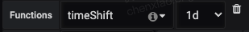

# Grafana

[[toc]]

## SQL 语法

### 连接查询

- INNER JOIN


- LEFT OUTER JOIN


- RIGHT OUTER JOIN


- FULL OUTER JOIN


详见：[连接查询](https://www.liaoxuefeng.com/wiki/1177760294764384/1179610888796448)

## ClickHouse 监控配置

### 常用函数

#### URL 操作

##### domain

假设`url`是页面地址，形如`https://www.baidu.com?a=1&b=2`，如果想要按域名来统计，可以使用`domain`函数获取域名。

```sql
SELECT
    $timeSeries as t,
    domain(url),
    count() as c
FROM $table
WHERE $timeFilter
AND ...
GROUP BY
    t,
    domain(url)
ORDER BY t
```

##### extractURLParameter

提取 url 里的参数。比如如下示例就是按 url 上的 source 值进行分组。

```sql
SELECT
    $timeSeries as t,
    extractURLParameter(url, 'source') as source,
    count()
FROM $table
WHERE $timeFilter
  AND ...
GROUP BY t, source
ORDER BY t
```

#### JSON 操作

##### JSONExtractString

```sql
SELECT
    $timeSeries as t,
    JSONExtractString(person, 'name') as name,
    count() AS c
FROM $table
WHERE $timeFilter
AND ...
GROUP BY t, name
ORDER BY t
```

#### 字符串方法

##### concat

```sql
SELECT
    $timeSeries as t,
    sum(`count`),
    concat('字符串第一部分', first, '，字符串第二部分', extra2)
FROM $table
WHERE
    `timestamp` >= toDateTime($from)
    AND `timestamp` < toDateTime($to)
    AND dt >= toDate($from)
    AND dt <= toDate($to)
GROUP BY t, concat('字符串第一部分', first, '，字符串第二部分', extra2)
ORDER BY t
```

##### splitByChar

假设`url`是页面地址，形如`https://www.baidu.com?a=1&b=2`，如果想要按**域名 + 协议**来统计，可以使用`splitByChar`函数来分隔`url`。

```sql
SELECT
    $timeSeries as t,
    arrayElement(
        splitByChar('?', assumeNotNull(url)),
        1
    ),
    count() as c
FROM $table
WHERE $timeFilter
AND ...
GROUP BY
    t,
    arrayElement(
        splitByChar('?', assumeNotNull(url)),
        1
    )
ORDER BY t
```

- [splitByChar](https://clickhouse.com/docs/en/sql-reference/functions/splitting-merging-functions/#splitbycharseparator-s)，按字符将字符串分隔为字符串数组
- [arrayElement](https://clickhouse.com/docs/en/sql-reference/functions/array-functions/#arrayelementarr-n-operator-arrn)，按索引获取数据项
- [assumeNotNull](https://clickhouse.com/docs/en/sql-reference/functions/functions-for-nulls/#assumenotnull)，一定要加这个，确保`url`不为`null`

##### countSubstrings

统计字符串里存在特定子串的数量。比如如下示例里，统计 url 上存在至少 3 个 ? 字符的数量

```sql
SELECT
    $timeSeries as t,
    url,
    count() as cc
FROM $table
WHERE
    countSubstrings(url, '?') >= 3
GROUP BY
    t,
    url
ORDER BY t
```

### 常用语法

#### CASE WHEN

```sql
SELECT OrderID, Quantity,
CASE
    WHEN Quantity > 30 THEN 'The quantity is greater than 30'
    WHEN Quantity = 30 THEN 'The quantity is 30'
    ELSE 'The quantity is under 30'
END AS QuantityText
FROM OrderDetails;
```

详见：[SQL CASE Statement](https://www.w3schools.com/sql/sql_case.asp)

##### 秒开率

```sql
SELECT
    sum(
        CASE
            WHEN fmp <= 1000 THEN 1
            ELSE 0
        END
    ) / count() as `秒开率`
FROM $table
WHERE
    ...
    AND event_name = 'fmp'
```

#### WITH

##### 触达率

```sql
WITH
    sumIf(1 / final_sample, event_name = 'fmp') as fmp_event,
    sumIf(1 / final_sample, event_name = 'CREATED') as created_event
SELECT
    $timeSeries as t,
    if(created_event = 0, 0, fmp_event / created_event) as `页面触达率`
FROM 表名
WHERE 查询条件
GROUP BY t
ORDER BY t
```

### 常用场景

#### 成功率

```sql
SELECT
      t,
      a.c / b.c as `成功率`
  FROM (
  SELECT
    $timeSeries as t,
    count() as c
  FROM $table
  WHERE $timeFilter
    AND p_date>=formatDateTime(toDateTime($from),'%Y%m%d')
    AND p_date<=formatDateTime(toDateTime($to),'%Y%m%d')
    AND status = 'success'
    AND 其他条件
  GROUP BY t
  ORDER BY t
) as a
ANY LEFT JOIN (
  SELECT
    $timeSeries as t,
    count() as c
  FROM $table
  WHERE $timeFilter
    AND p_date>=formatDateTime(toDateTime($from),'%Y%m%d')
    AND p_date<=formatDateTime(toDateTime($to),'%Y%m%d')
    AND 其他条件
  GROUP BY t
  ORDER BY t
) as b USING t
```

#### 今日昨日对比

今日的`query`配置好之后，复制一份新的`query`，在新的`query`的`Functions`配置上添加`timeShift: 1d`



还有一种方式，是将`timeShift`函数通过`query`实现出来，比如如下就是求`昨日成功率`的`query`：

```sql
SELECT
    t,
    yesterdaySuccess.c / yesterdayAll.c as `昨日成功率`
FROM (
    SELECT
        (intDiv(toUInt32(server_timestamp/1000) + 86400, 60) * 60) * 1000 as t,
        count() as c
    FROM $table
    WHERE toDate(server_timestamp/1000) >= toDate($from - 86400)
        AND server_timestamp/1000 >= toDateTime($from - 86400)
        AND server_timestamp/1000 < toDateTime($to - 86400)
        AND p_date>=formatDateTime(toDateTime($from - 86400),'%Y%m%d')
        AND p_date<=formatDateTime(toDateTime($to - 86400),'%Y%m%d')
        AND status = 'success'
        AND 其他条件
    GROUP BY t
    ORDER BY t
) as yesterdaySuccess
ANY LEFT JOIN (
    SELECT
        (intDiv(toUInt32(server_timestamp/1000) + 86400, 60) * 60) * 1000 as t,
        count() as c
    FROM $table
    WHERE toDate(server_timestamp/1000) >= toDate($from - 86400)
        AND server_timestamp/1000 >= toDateTime($from - 86400)
        AND server_timestamp/1000 < toDateTime($to - 86400)
        AND p_date>=formatDateTime(toDateTime($from - 86400),'%Y%m%d')
        AND p_date<=formatDateTime(toDateTime($to - 86400),'%Y%m%d')
        AND 其他条件
    GROUP BY t
    ORDER BY t
) as yesterdayAll USING t
```

#### 今日昨日成功率报警

有时候，我们不仅想看到`今日成功率`和`昨日成功率`这两条曲线的对比，还想配置报警。比如，当`今日成功率`比`昨日成功率`低 10% 时，触发报警。

```sql
SELECT
    t,
    (today.successRate - yesterday.successRate) as `今天的成功率 - 昨天的成功率`
FROM (
    SELECT
        t,
        todaySuccess.c / todayAll.c as successRate
    FROM (
        SELECT
            (intDiv(toUInt32(server_timestamp/1000), 60) * 60) * 1000 as t,
            count() as c
        FROM $table
        WHERE toDate(server_timestamp/1000) >= toDate($from)
        AND server_timestamp/1000 >= toDateTime($from)
        AND server_timestamp/1000 < toDateTime($to)
        AND p_date>=formatDateTime(toDateTime($from),'%Y%m%d')
        AND p_date<=formatDateTime(toDateTime($to),'%Y%m%d')
        AND status = 'success'
        AND 其他条件
        GROUP BY t
        ORDER BY t
    ) as todaySuccess
    ANY LEFT JOIN (
        SELECT
            (intDiv(toUInt32(server_timestamp/1000), 60) * 60) * 1000 as t,
            count() as c
        FROM $table
        WHERE toDate(server_timestamp/1000) >= toDate($from)
        AND server_timestamp/1000 >= toDateTime($from)
        AND server_timestamp/1000 < toDateTime($to)
        AND p_date>=formatDateTime(toDateTime($from),'%Y%m%d')
        AND p_date<=formatDateTime(toDateTime($to),'%Y%m%d')
        AND 其他条件
        GROUP BY t
        ORDER BY t
    ) as todayAll USING t
) as today
ANY LEFT JOIN (
    SELECT
        t,
        yesterdaySuccess.c / yesterdayAll.c as successRate
    FROM (
        SELECT
            (intDiv(toUInt32(server_timestamp/1000) + 86400, 60) * 60) * 1000 as t,
            count() as c
        FROM $table
        WHERE toDate(server_timestamp/1000) >= toDate($from - 86400)
            AND server_timestamp/1000 >= toDateTime($from - 86400)
            AND server_timestamp/1000 < toDateTime($to - 86400)
            AND p_date>=formatDateTime(toDateTime($from - 86400),'%Y%m%d')
            AND p_date<=formatDateTime(toDateTime($to - 86400),'%Y%m%d')
            AND status = 'success'
            AND 其他条件
        GROUP BY t
        ORDER BY t
    ) as yesterdaySuccess
    ANY LEFT JOIN (
        SELECT
            (intDiv(toUInt32(server_timestamp/1000) + 86400, 60) * 60) * 1000 as t,
            count() as c
        FROM $table
        WHERE toDate(server_timestamp/1000) >= toDate($from - 86400)
            AND server_timestamp/1000 >= toDateTime($from - 86400)
            AND server_timestamp/1000 < toDateTime($to - 86400)
            AND p_date>=formatDateTime(toDateTime($from - 86400),'%Y%m%d')
            AND p_date<=formatDateTime(toDateTime($to - 86400),'%Y%m%d')
            AND 其他条件
        GROUP BY t
        ORDER BY t
    ) as yesterdayAll USING t
) as yesterday USING t
```

配置了该`query`后，得到的一条在`0%`上下波动的曲线，此时就可以配置当曲线值低于`10%`的时候触发报警。报警条件里，只需要最后一个点的值低于`-0.1`。


#### 最近两小时新出现的 JS 错误影响的用户数

```sql
SELECT
    t,
    key,
    sum(value)
FROM
(
    SELECT
        -- 第四步：使用 min 聚合函数，选择 server_timestamp 最小的那条数据
        min(server_timestamp) as t,
        msg as key,
        count(DISTINCT device_id) as value
    FROM $table
    WHERE
        -- 第一步：筛选最近 7 天的所有 JS 错误
        server_timestamp >= toUnixTimestamp(now()) * 1000 - 7 * 24 * 60 * 60 * 1000
        AND server_timestamp < toUnixTimestamp(now()) * 1000
        AND 项目
    -- 第二步：按 JS 错误内容聚合
    GROUP BY key
    -- 第三步：在聚合后的数据里，筛选出“JS 错误出现的最小 server_timestamp 是在 2 个小时内（这意味着在最近一周里，JS 错误第一次出现是在 2 小时内）”的数据
    -- 说明：在 SQL 中增加 HAVING 子句原因是，WHERE 关键字无法与聚合函数一起使用。HAVING 子句可以让我们筛选分组后的各组数据。
    HAVING (IF(min(server_timestamp) > toUnixTimestamp(now()) * 1000 - 2 * 60 * 60 * 1000, 1, 0)) >= 1
)
GROUP BY
    t,
    key
```
