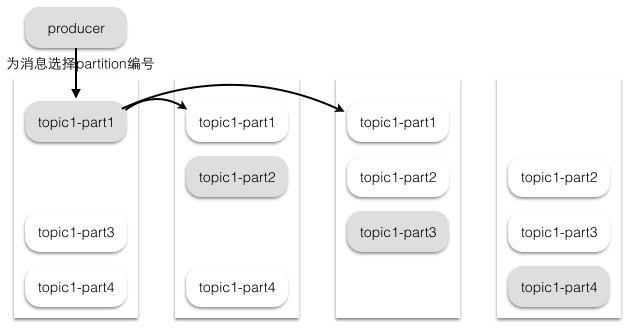
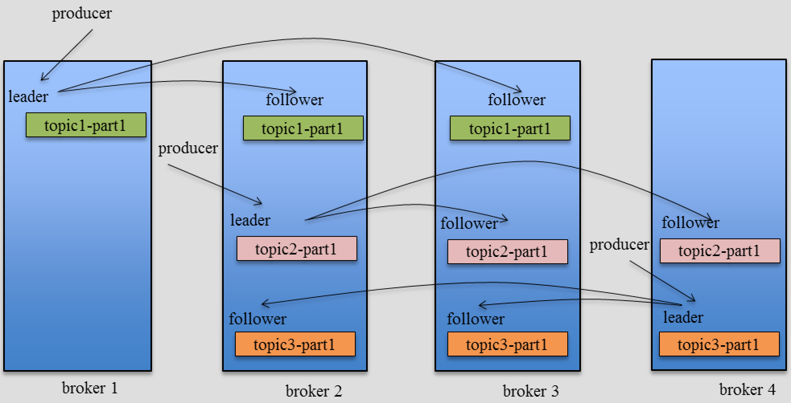
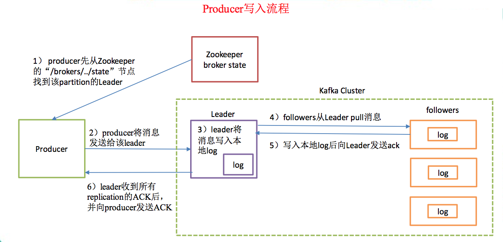
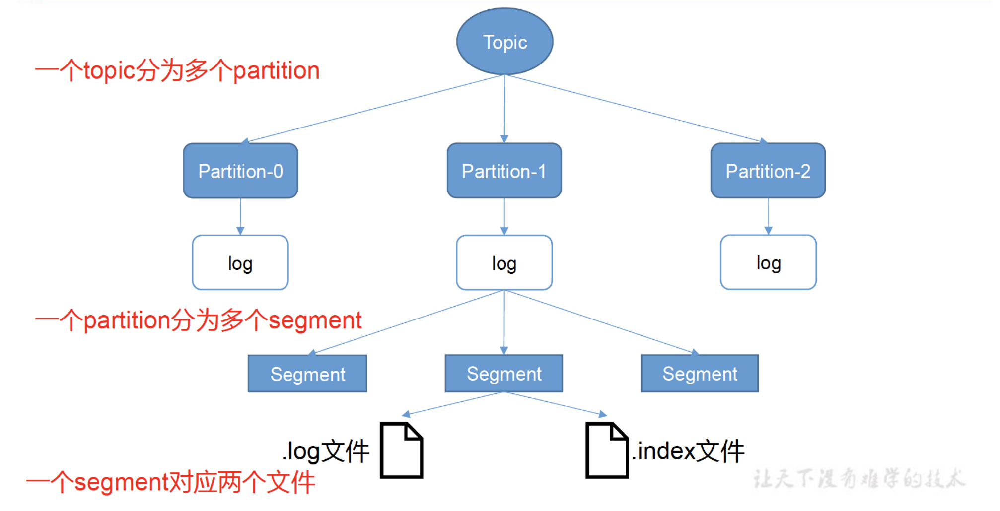
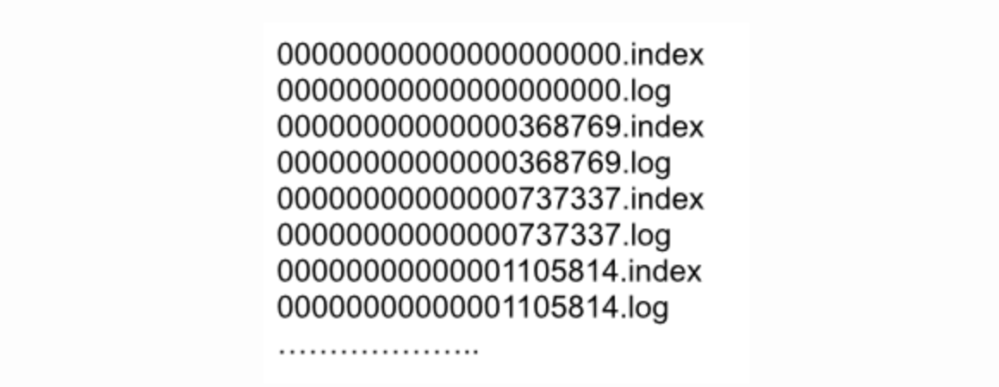
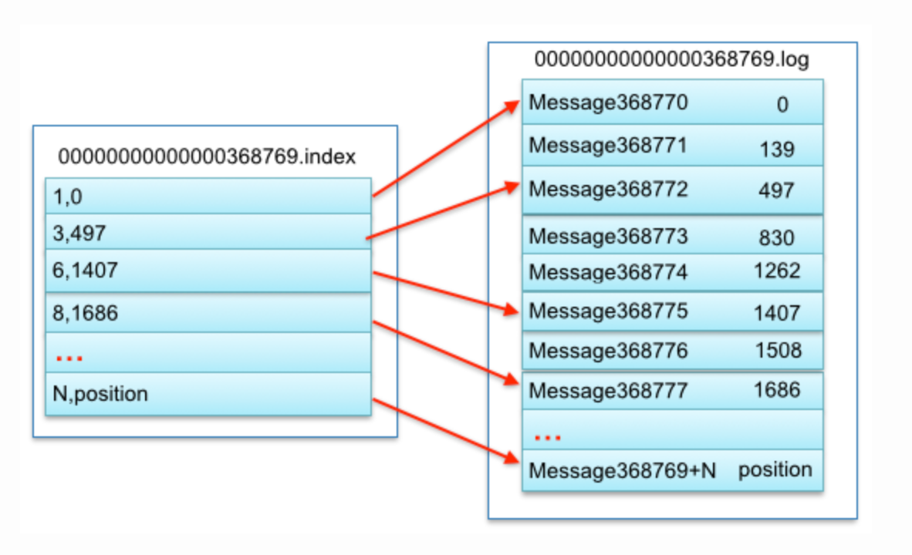
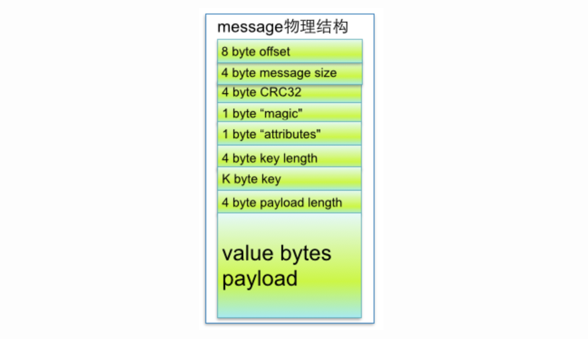

# Kafka

[[toc]]

Kafka 是最初由 Linkedin 公司开发，是一个分布式、分区的、多副本的、多订阅者，基于 zookeeper 协调的分布式日志系统(也可以当做 MQ 系统)，常见可以用于 web/nginx 日志、访问日志，消息服务等等，Linkedin 于2010年贡献给了 Apache 基金会并成为顶级开源项目。

Kafka 采用的消息传递模式是**发布-订阅模式**，消息会被持久化到一个 Topic 中，消息数据不会因被 Consumer 消费后而立马删除，而是通过配置指定消息保存时长。

## 专用术语

- Broker: 消息中间件处理结点，一个 Kafka 节点就是一个 Broker，多个 Broker 可以组成一个 Kafka 集群。
- Topic: 一类消息，例如 page view 日志、click 日志等都可以以 Topic 的形式存在，Kafka 集群能够同时负责多个 Topic 的分发。
- Partition: Topic 物理上的分组，一个 Topic 可以分为多个 Partition，每个 Partition 是一个有序的队列。
- Segment: Partition 物理上由多个 Segment 组成。
- offset: 每个 Partition 都由一系列有序的、不可变的消息组成，这些消息被连续的追加到 Partition 中。Partition 中的每个消息都有一个连续的序列号叫做 offset，用于 Partition 唯一标识一条消息。不同分区的 offset 是相互独立的，不会相互影响。
- Producer: 负责发布消息到 Kafka Broker。
- Consumer: 消息消费者，向 Kafka Broker 读取消息的客户端。
- Consumer Group: 每个 Consumer 属于一个特定的 Consumer Group。
- ZooKeeper: Kafka 通过 Zookeeper 管理级联配置，选举 Leader。

## Partition

- 每个 Topic 下的消息，会分布式地存储在该 Topic 下的不同 Partition 里，同一条消息只会出现在一个 Partition 里。也就是说，每个 Partition 里的数据不存在交集，所有 Partition 里的数据合并在一起构成了该 Topic 下完整的消息数据。
- 每个 Topic 的 Partition 数量可以在创建时配置，也可使通过配置文件生成默认数量。
- 因为是以 Partition 为单位进行读写，因此 Partition 数量决定了并发读写的最大数据量，Partition 数量越多，并发读写的数据量越大。
- Partition 可以按需扩展

### 分区规则

1. 指明 Partition 的情况下，直接将指明的值直接作为 Partiton 值
2. 没有指明 Partition 值但有 key 的情况下，将 key 的 hash 值与 Topic 的 Partition 数进行取余得到 Partition 值
3. 既没有 Partition 值又没有 key 的情况下，第一次调用时随机生成一个整数(后面每次调用在这个整数上自增)，将这个值与 Topic 可用的 Partition 总数取余得到 Partition值，也就是常说的 round-robin 算法。

疑问：

- 若是方式 1，分配给每个 Partiton 的数据大致相等吗？
- 消费者如何知道以什么样的策略来消费各个 Partiton 里的消息数据？

### Replication

Replication （副本）机制主要用于容错。

- Replication 以 Partition 为单位，每个 Partition 都有自己的 Leader Replication（主副本）和多个 Follower Replication（从副本），处于同步状态的 Follower Replication 叫做 In-Sync Replication(ISR)。
- 可以通过配置文件配置 Replication 的个数，也可以在创建分区时指定。Replication 的个数包括 Leader 和 Follower。
- Kafka 集群中，每个 Partition 的 Leader 和 Follower 会分布在不同的 Broker 上。
- Producer 发布消息都是由 Leader 负责写入，并同步到其他的 Follower 中。若 Leader 失效，则某个 Follower 会自动替换成为新的 Leader。此时，Follower 可能落后于 Leader，所以从所有 Follower 中选择一个“up-to-date”的分区。
- Consumer 读消息也是从 Leader 读取，且只有被 commit 过的消息才会暴露给 Consumer。（见后文的“Replication 同步策略”）
- 关于性能方面，Leader 的 Server 承载了全部的客户端连接与消息写入，还负责将消息同步至不同的 Follower 分区上，性能开销较大。因此从集群的整体考虑，Kafka 会将不同 Partition 的 Leader 均衡地分散在不同 Broker 上，以防止某个 Broker 压力过载。
- Follower 通过拉取的方式从 Leader 中同步数据。消费者和生产这都是从 Leader 中读取数据，不与 Follower 交互。

### Partition 与 Replication 放置策略

为了更好的做负载均衡，Kafka 尽量将所有的 Partition 均匀分配到整个集群上。 Kafka 分配 Replication 的算法如下:

- 将所有存活的 n 个 Brokers 和待分配的 Partition 排序
- 将第 i 个 Partition 分配到第 (i mod n) 个 Broker 上，这个 Partition 的第一个 Replication 存在于这个分配的 Broker 上，并且会作为 Leader Replication
- 将第 i 个 Partition 的第 j 个 Replication 分配到第 ((i + j) mod n) 个 Broker 上

假设集群一共有 4 个 Broker，一个 Topic 有 4 个 Partition，每个 Partition 有 3 个 Replication。下图是每个 Broker 上的 Replication 分配情况。

### Replication 同步策略

Producer 在发布消息到某个 Partition 时，先通过 ZooKeeper 找到该 Partition 的 Leader，然后无论该 Topic 的 Replication Factor 为多少，Producer 只将该消息发送到该 Partition 的 Leader。

Leader 会将该消息写入其本地 Log。每个 Follower 都从 Leader pull 数据。这种方式上，Follower 存储的数据顺序与 Leader 保持一致。Follower 在收到该消息并写入其 Log 后，向 Leader 发送 ACK。一旦 Leader 收到了 ISR 中的所有 Replication 的 ACK，该消息就被认为已经 commit 了，Leader 将增加 HW（high watermark，最后commit 的offset）并且向 Producer 发送 ACK。

为了提高性能，每个 Follower 在接收到数据后就立⻢向 Leader 发送 ACK，而非等到数据写入 Log 中。因此，对于已经 commit 的消息，Kafka 只能保证它被存于多个 Replication 的内存中，而不能保证它们被持久化到磁盘中，也就不能完全保证异常发生后该条消息一定能被 Consumer 消费。

Consumer 读消息也是从 Leader 读取，只有被 commit 过的消息才会暴露给 Consumer。

## Broker

### Broker 可用性判断

对于 Kafka 而言，定义一个 Broker 是否“活着”包含两个条件：

一是它必须维护与ZooKeeper的session（这个通过ZooKeeper的Heartbeat机制来实现）。
二是Follower必须能够及时将Leader的消息复制过来，不能“落后太多”。

## Consumer/Consumer Group

- 每个 Consumer 属于一个特定的 Consumer Group
- 同一 Topic 的一条消息只能被同一个 Consumer Group 内的一个 Consumer 消费，但多个 Consumer Group 可同时消费这一消息。

疑问：

- 同一 Consumer Group 内的不同 Consumer 做的是完全一样的事情吗？

## Kafka 生产过程

## Kafka 消费过程

Kafka 的消息消费模型采用拉取模型（pull），Consumer 可自主控制消费消息的速率，同时 Consumer 可以自己控制消费方式（批量消费或逐条消费），同时还能选择不同的提交方式从而实现不同的传输语义。

## Kafka 文件存储机制

在 Kafka 文件存储中，同一个 Topic 下有多个不同 Partition，每个 Partition 为一个目录，Partiton 命名规则为“Topic 名称 + 有序序号”，第一个 Partiton 序号从 0 开始，序号最大值为“Partition 数量 - 1”。

- 由于 Producer 生产的消息会不断追加到 log 文件末尾， 为防止 log 文件过大导致数据定位效率低下，Kafka 采取了分片和索引机制，将每个 Partition 分为多个 Segment（最多 1G，配置文件）。但每个 Segment file 消息数量不一定相等，这种特性方便 old segment file 快速被删除。
- 每个 Partiton 只需要支持顺序读写就行了，Segment 文件生命周期由服务端配置参数决定(默认 7 天)。这样做的好处就是能快速删除无用文件，有效提高磁盘利用率。
- Segment file 组成：由两大部分组成，分别为`.index`索引文件（稀疏索引）和`.log`数据文件，这两个文件一一对应、成对出现。
- Segment 文件命名规则：Partion 全局的第一个 Segment 从 0 开始，后续每个 Segment 文件名为上一个 Segment 文件最后一条消息的 offset 值。数值最大为 64 位 long 大小，19 位数字字符⻓度，没有数字用 0 填充。

Segment 中，数据文件和索引文件对应的物理结构如下图所示。

上图中索引文件存储大量元数据，数据文件存储大量消息，索引文件中元数据指向对应数据文件中 message 的物理偏移地址。

其中以索引文件中元数据 3,497 为例，依次在数据文件中表示第 3 个 message(在全局 Partiton 表示第 368772 个 message)、以及该消息的物理偏移地址为 497。

如果读取 offset 是 368776 的消息，需要通过下面两个步骤查找：

- 第一步，查找 Segment file。其中`00000000000000000000.index`表示最开始的文件，起始偏移量 offset 为 0；第二个文件`00000000000000368769.index`的消息量起始偏移量为 368770 = 368769 + 1；同样，第三个文件`00000000000000737337.index`的起始偏移量为 737338=737337 + 1，其他后续文件依次类推，以起始偏移量命名并排序这些文件，只要根据 offset **二分查找**文件列表就可以快速定位到具体文件。当 offset = 368776 时定位到`00000000000000368769.index|log`
- 第二步，用目标 offset 减去文件名中的 offset 得到消息在这个 Segment 中的元数据偏移量，也就是 368776 - 368769 = 7，偏移量是7。表示目标 offset 消息是该 Segment 文件里的第 7 条消息。
- 第三步，再次用二分法在 index 文件中找到对应的索引，也就是第三行 6,1407。
- 第四步，到 log 文件中，从该 Segment 的物理偏移地址 1407 的位置（对应消息 offset 是 368776）开始，顺序查找，直到找到 offset 为 368776 的消息。查找期间 Kafka 是按照 log 的存储格式来判断一条消息是否结束的。

从上述图中可知这样做的优点，Segment index file 采取稀疏索引存储方式，它减少索引文件大小，通过 map 可以直接内存操作，稀疏索引为数据文件的每个对应 message 设置一个元数据指针,它比稠密索引节省了更多的存储空间，但查找起来需要消耗更多的时间。

### message 物理结构

| 关键字              | 解释说明                                            |
| ------------------- | --------------------------------------------------- |
| 8 byte offset       | 表示该 message 是 Partition 里的第多少条 message    |
| 4 byte message size | message 物理大小                                    |
| 4 byte CRC32        | 用 crc32 校验 message                               |
| 1 byte “magic”      | 表示本次发布 Kafka 服务程序协议版本号               |
| 1 byte “attributes” | 表示为独立版本、或标识压缩类型、或编码类型。        |
| 4 byte key length   | 表示 key 的长度,当 key 为 -1 时，K byte key字段不填 |
| K byte key          | 可选                                                |
| value bytes payload | 表示实际消息数据。                                  |

### 数据删除策略

无论消息是否被消费，Kafka 都会保留所有消息。有两种策略可以删除旧数据：

- 基于时间：log.retention.hours=168
- 基于大小：log.retention.bytes=1073741824

## Reference

- [Kafka文件存储机制那些事](https://tech.meituan.com/2015/01/13/kafka-fs-design-theory.html)
