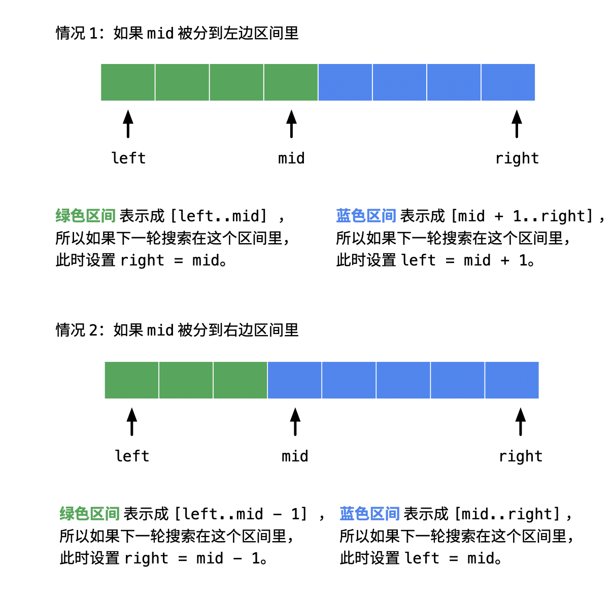

# 二分搜索

[[toc]]

## 关注点

### 搜索区间

明确搜索的区间是左闭右闭区间`[left, right]`，还是左闭右开区间`[left, right)`。

::: tip 强烈推荐
在分析搜索区间时，将搜索区间尽量转变成左闭右闭区间`[left, right]`，这种形式是最直观的。
:::

### 明确新的 left/right

根据中间位置元素的值`nums[mid]`可以把待搜索区间分为两个部分：

- 一定不存在 目标元素的区间：下一轮搜索的时候，不用考虑它；
- 可能存在 目标元素的区间：下一轮搜索的时候，需要考虑它。

### 循环判断条件

明确循环可执行的条件是`while(left < right)`还是`while(left <= right)`，当上一步确定的搜索区间为空时，循环则终止。

| 形式                       | 结论与建议                                                                                                                               |
| -------------------------- | ---------------------------------------------------------------------------------------------------------------------------------------- |
| `while (left <= right)`    | 简单问题用，在循环体里能找到答案以后退出。                                                                                               |
| `while (left < right)`     | 复杂问题用，把答案留到退出循环以后，再判断。是解决二分问题的利器，尤其在边界问题用，这种方式考虑细节最少，但是需要一定练习才能灵活运用。 |
| `while (left + 1 < right)` | 不建议，本质上和 while (left <= right) 写法一样，盲目套这个所谓的最无脑模板，反而学不会二分。                                            |

`while(left <= right)`在退出循环的时候`left = right + 1`，即`right`在左，`left`在右。这种写法用在简单的二分问题中，如果题目要我们找的数的性质很简单，可以用这种写法，在循环体里找到了就退出。

`while(left < right)`写法的好处在于退出循环的时候`left === right`，把要找的数留到最后，在退出循环以后做判断。这种写法在思考复杂问题时，确实可以少考虑很多细节，把思考的精力用于求解问题上。但是尤其要注意死循环的情况。

### 返回 left/right

只把区间分成两个部分，当循环判断条件为`while(left < right)`时，循环终止条件一定是`left === right`，此时返回`left`或`right`都行。

### mid 是上取整还是下取整

- 下取整: `mid = left + Math.floor((right - left / 2))`
- 上取整: `mid = left + Math.ceil((right - left / 2))`

需要根据`left/right`新的取值情况来判断是使用上取整还是下取整，原则是不进入死循环。

比如，当`if`或`else`里有`left = mid`的时候，假设当区间里只剩下两个元素的时候，若`mid`下取整即`mid`还是`left`，且`mid`被划分到右边区间即会执行`left = mid`，导致`left`一直不变，进而进入死循环。针对这种情况，需要将`mid`调整为上取整。

## 参考文档

- [写对二分查找不能靠模板，需要理解加练习](https://leetcode-cn.com/problems/search-insert-position/solution/te-bie-hao-yong-de-er-fen-cha-fa-fa-mo-ban-python-/)，这篇文章非常好，完整理解后，可以完全解决所有二分问题。
- [关于 while (left <= right) 写法返回值的详细讨论](https://leetcode-cn.com/problems/find-first-and-last-position-of-element-in-sorted-array/solution/da-jia-bu-yao-kan-labuladong-de-jie-fa-fei-chang-2/)
