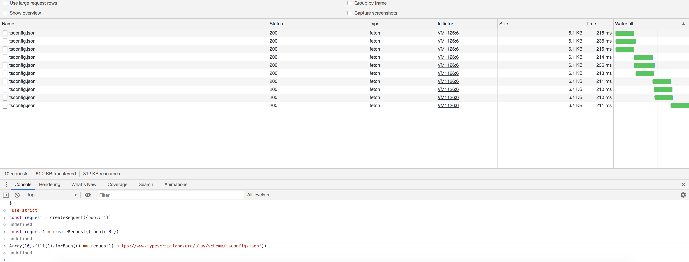

# 【高级】最大并发请求控制

实现一个 `createRequest` 方法（假设浏览器允许无限多的并行请求）实现最大并发请求量控制。调用形式如下图，最后实现效果如图：



其中 `request` 函数的输入输出和 `fetch` 函数保持一致

```js
function createRequest(pool = 6) {
    // 返回的请求函数
    return (url, options) => {};
}

// --- 使用示例 ---
const request = createRequest(6); // 最大并发数为6

// 模拟发起10个请求
const requests = new Array(10).fill(0).map((_, i) => request('http://www.baidu.com'));

// 可选：监听所有请求完成
Promise.allSettled(requests).then(results => console.log('所有请求完成:', results));
```

## 参考答案

```js
function createRequest(pool = 6) {
    // 维护一个任务队列，用于存放等待执行的请求任务
    const queue = [];
    // 记录当前正在执行的请求数量
    let activeCount = 0;

    // 处理队列中的下一个任务
    const next = () => {
        // 如果当前活跃数小于池大小且队列中有任务
        if (activeCount < pool && queue.length > 0) {
            // 取出队首任务
            const { task, resolve, reject } = queue.shift();
            activeCount++; // 增加活跃计数

            // 执行任务
            task()
                .then(resolve)
                .catch(reject)
                .finally(() => {
                    // 任务完成（无论成功或失败），减少活跃计数，并尝试处理下一个
                    activeCount--;
                    next();
                });
        }
    };

    // 返回的请求函数
    return (url, options) => {
        // 返回一个新的 Promise，将请求逻辑包装成一个任务
        return new Promise((resolve, reject) => {
            // 将请求任务推入队列
            queue.push({
                task: () => fetch(url, options),
                resolve,
                reject,
            });
            // 尝试启动队列处理
            next();
        });
    };
}
```
