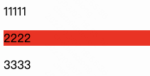
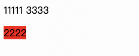

# 【初级】加/不加 position 属性，分别如何显示？

## 题目

如下代码展示的时候在加上`position`属性和未加入`position`属性的时候，分别会怎么显示？

```html
<style>
    p {
        background: red;
        color: #000;

        /* position: absolute; */
    }
</style>

<div>
    <span>11111</span>
    <p>2222</p>
    <span>3333</span>
</div>
```

## 参考答案


不加 position: absolute，或加 position: relative


加 position: absolute/fixed

加分项：能够阐述在`absolute`/`fixed`且未设置`top`/`left`/`bottom`/`right`的时候应该如何表现
