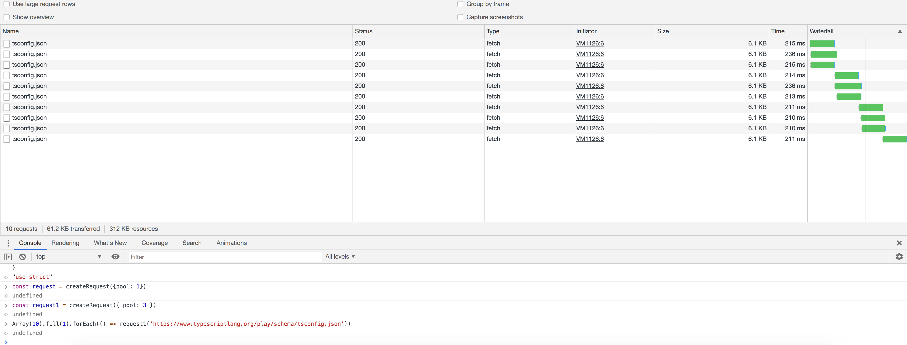

# 【高级】最大并发请求控制

## 实现一个createRequest方法（假设浏览器允许无限多的并行请求）实现最大并发请求量控制。调用形式如下图，最后实现效果如图：



其中request函数的输入输出和fetch函数保持一致

参考答案：

```js
function createRequest({ pool = 6 }) {
    const requestingArray = []; // 请求队列
    const pendingArray = []; // 等待队列

    /**
     * 每个请求完成后，检查是否存在等待的请求
     */
    function checkPending() {
        if (pendingArray.length && requestingArray.length <= pool) {
            const promiseObject = pendingArray.shift();
            requestingArray.push(promiseObject);
            // resolve 等待的请求，触发其调用 wrappedFetch
            promiseObject.resolve();
        }
    }

    /**
     * 封装 fetch 方法，在请求完成后将该请求从 requestingArray 移除，并检查等待队列
     */
    function wrappedFetch({ url, options, promiseObject }) {
        return new Promise((resolve, reject) => {
            fetch(url, options)
                .then((data) => {
                    resolve(data);
                })
                .catch((err) => {
                    reject(err);
                })
                .finally(() => {
                    // 将 promiseObject 从 requestingArray 移除
                    const index = requestingArray.indexOf(promiseObject);
                    if (index >= 0) {
                        requestingArray.splice(index, 1);
                    }
                    checkPending();
                });
        });
    }

    return (url, options) => {
        const promiseObject = {};
        // 存储 resolve 方法，在上一个请求结束后调用
        const promise = new Promise((resolve) => {
            promiseObject.resolve = resolve;
        });

        // 方式一：判断新的请求能否直接发起请求
        if (requestingArray.length >= pool) {
            // 等待
            pendingArray.push(promiseObject);
        } else {
            // 发起请求
            requestingArray.push(promiseObject);
            promiseObject.resolve();
        }

        // 方式二：也可以直接将所有请求放入等待队列，再检查是否可以请求
        // pendingArray.push(promiseObject);
        // checkPending();

        return promise.then(() =>
            wrappedFetch({
                url,
                options,
                promiseObject,
            })
        );
    };
}
```
