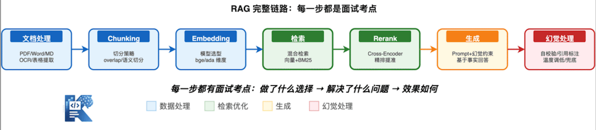
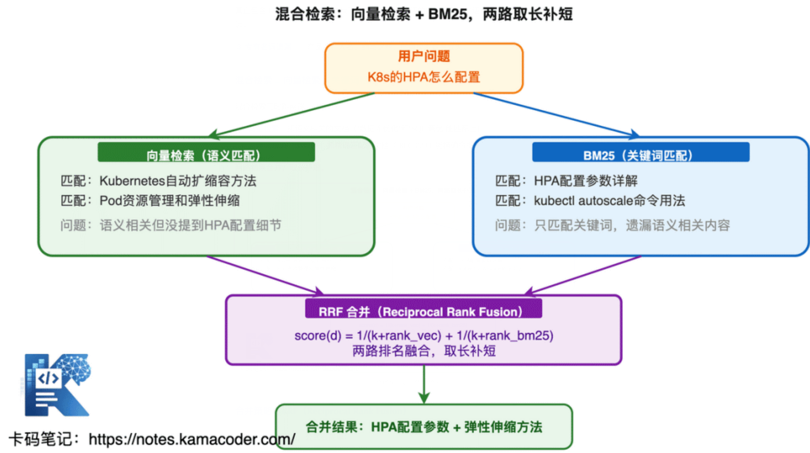
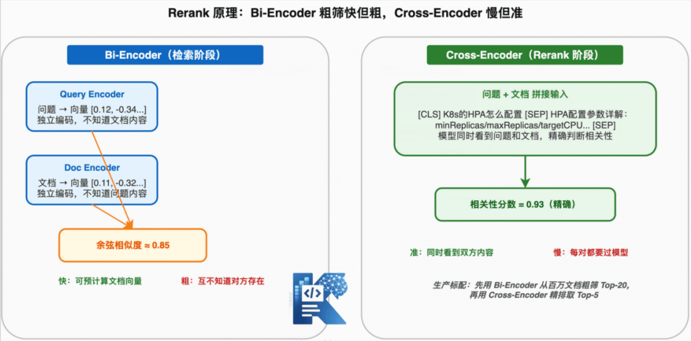

# RAG

参考文档：

[京东面试官问我：“你熟悉RAG？”，我：“是的，我用LangChain跑通了”，那你说说：“检索策略、Chunk切分、Rerank重排序和幻觉处理”](https://mp.weixin.qq.com/s/74EC_fteGzIPS46ohX_ncw)

如下摘抄一些前端需要了解的内容。

## RAG 是什么？为什么需要 RAG？

面试官一般这么问："为什么不让 LLM 直接回答，非要用 RAG？"或者"LLM 的知识截止问题你怎么解决？"

### LLM 的三大知识缺陷

- **知识截止**：训练数据有截止日期，昨天发生的事它不知道。你问它"2026年3月发布的 XX 框架有什么特性"，它要么瞎编要么说不知道。
- **私有数据无法触达**：公司的内部文档、客户数据、业务规则，这些 LLM 从来没见过，直接问就是胡说。
- **容易幻觉**：当 LLM 不确定但又想回答时，它会编造看似合理但完全错误的信息。这个问题在没有外部知识验证时尤其严重。

### RAG 的核心思路

RAG（Retrieval-Augmented Generation，检索增强生成）的本质就一句话：**在 LLM 生成回答之前，先从外部知识库检索相关信息，把检索结果塞进 Prompt，让 LLM 基于事实回答。**

没有 RAG：用户问题 → LLM → 回答（可能幻觉）

有 RAG：用户问题 → 检索相关知识 → [问题 + 检索结果] → LLM → 回答（基于事实）

面试核心点：RAG 不是替代 LLM，是给 LLM 补充外部知识。LLM 负责理解和生成，RAG 负责提供事实依据。

## RAG 的完整链路是怎样的？

面试官会问："你说你做过 RAG 项目，能完整讲一下从用户提问到最终回答的链路吗？"

这是基础中的基础，但很多人讲不清楚。

### RAG 七步链路



Query → 文档处理 → Chunking → Embedding → 检索 → Rerank → 生成

每一步做什么：步骤做什么关键决策文档处理解析 PDF/Word/Markdown，提取文本PDF 表格怎么处理？OCR 要不要？Chunking把长文档切成小块切多大？overlap 多少？按语义切还是固定长度？Embedding把文本块转成向量用什么模型？维度多少？中文还是英文？检索根据用户问题检索最相关的文本块纯向量还是混合检索？Top-K 设多少？Rerank对检索结果重排序用什么 Rerank 模型？重排后再取 Top-N生成把检索结果 + 问题喂给 LLM 生成回答Prompt 怎么写？幻觉怎么约束？

| 步骤      | 做什么                             | 关键决策                                     |
| :-------- | :--------------------------------- | :------------------------------------------- |
| 文档处理  | 解析 PDF/Word/Markdown，提取文本   | PDF 表格怎么处理？OCR 要不要？               |
| Chunking  | 把长文档切成小块                   | 切多大？overlap 多少？按语义切还是固定长度？ |
| Embedding | 把文本块转成向量                   | 用什么模型？维度多少？中文还是英文？         |
| 检索      | 根据用户问题检索最相关的文本块     | 纯向量还是混合检索？Top-K 设多少？           |
| Rerank    | 对检索结果重排序                   | 用什么 Rerank 模型？重排后再取 Top-N         |
| 生成      | 把检索结果 + 问题喂给 LLM 生成回答 | Prompt 怎么写？幻觉怎么约束？                |

面试答法：不要只背这七个步骤，要说清楚每一步的关键决策点。面试官想听的不是"我用了 Milvus"，而是"我为什么选 Milvus 不选 FAISS，检索延迟要求多少，为什么 Top-K 设 5 不是 10"。

## 向量检索的原理是什么？

面试官会问："向量检索和关键词检索有什么区别？"以及"Embedding 的原理是什么？为什么语义相似的文本向量距离近？"

### 向量检索的本质

把文本转换成高维空间中的点，语义相似的文本在这个空间里距离近。检索就是找离问题向量最近的几个文档向量。

举个例子：

```text
"如何优化数据库查询" → [0.12, -0.34, 0.56, ...]
"数据库性能调优方法" → [0.11, -0.32, 0.55, ...]  ← 这个向量在空间中距离上一个向量很近
"今天天气不错"       → [-0.45, 0.78, -0.23, ...]  ← 这个向量在空间中距离第一个向量距离远
```

相似度计算最常用的是余弦相似度（**只关注方向，忽略长度**），计算两个向量的夹角余弦值：cos(A, B) = (A · B) / (|A| × |B|)
值域 [-1, 1]，越大越相似。1 表示方向完全相同，0 表示无关，-1 表示方向相反。为什么不用欧氏距离？ 因为向量的模长受文本长度影响，长文本的向量模长大，但语义不一定更相关。余弦相似度只看方向不看长度，对语义检索更合适。

## 纯向量检索有什么问题？为什么需要混合检索？

面试官会问："你们项目用的纯向量检索还是混合检索？为什么？"这是 RAG 面试的高频考点。

纯向量检索的三个致命问题

- 精确匹配不行：用户搜"RFC 7231"，向量检索可能返回"HTTP 协议规范"这种语义相关但没提到 RFC 7231 的文档。因为它靠语义相似度，不是精确匹配。
- 专业术语召回差："K8s 的 HPA 怎么配置"，向量检索可能找的是"Kubernetes 自动扩缩容"，而真正包含 HPA 配置细节的文档反而排不上。专业术语的向量表示和口语描述的向量表示距离可能很远。
- 专有名词遗漏：产品名、人名、缩写这些，向量检索容易丢失。

混合检索 = 向量检索 + 关键词检索。

混合检索同时跑两路：

- 向量检索：抓语义相关的文档（"数据库优化"和"SQL 调优"能匹配上）
- 关键词检索（BM25）：抓精确匹配的文档（"RFC 7231"能精确命中）两路结果合并，取长补短。



## Rerank 是什么？为什么检索之后还要重排序？

面试官会问："你已经用混合检索了，为什么还要 Rerank？检索结果不够好吗？"

### 检索和 Rerank 的区别

检索是粗筛——从百万文档里快速捞出 Top-20，速度快但精度有限。用向量相似度或 BM25 打分，这种打分是近似的，不一定反映真实相关性。

Rerank 是精排——对 Top-20 重新计算相关性分数，用更精确的模型（通常是 Cross-Encoder）逐个打分，把真正最相关的排到前面。

### 为什么检索的打分不够准？

向量检索用的是 Bi-Encoder：问题和文档分别编码成向量，再算相似度。问题和文档在编码时互不知道对方的存在，所以只能算"大概相关"。

Rerank 用的是 Cross-Encoder：把问题和文档拼在一起送进模型，模型可以同时看到双方内容，做更精确的相关性判断。代价是慢——Cross-Encoder 不能预计算，每个 (问题, 文档) 对都要过一遍模型，所以只能对少量候选做精排。



**面试答法**："检索是粗筛快捞，Rerank 是精排提准。检索用 Bi-Encoder 快但粗，Rerank 用 Cross-Encoder 慢但准。先用检索从百万级捞 Top-20，再用 Rerank 精排取 Top-5，这是生产环境的标配流程。"

## Chunk 怎么切？切大了切小了各有什么问题？

面试官会问："你们 Chunk 策略怎么设计的？chunk size 设的多少？为什么？"

这是面试官判断你"是跑过 Demo 还是真做过 RAG"的关键题。

### 切大了什么问题？

信息稀释——一个 chunk 里塞了太多内容，检索时真正相关的那部分被其他无关内容淹没，导致相似度分数降低，排名靠后。

### 切小了什么问题？

上下文丢失——一个完整的论述被切成碎片，检索出来的是断章取义的片段，LLM 拿到后无法理解完整含义，生成质量下降。

### 三种主流 Chunk 策略

① 固定长度切分——最简单，每 512 token 切一块。优点是简单，缺点是不管语义边界，可能把一句话切两半。

② 递归切分——按段落→句子→字符的优先级递归切分，尽量在自然边界处切断。这是生产环境最常用的方案。

```python
from langchain.text_splitter import RecursiveCharacterTextSplitter

splitter = RecursiveCharacterTextSplitter(
    chunk_size=500,
    chunk_overlap=200,  # 相邻 chunk 重叠 200 字符
    separators=["\n\n", "\n", "。", "！", "？", "；", "，", " ", ""]
)
```

③ 语义切分——用 Embedding 计算相邻句子的语义相似度，在语义断点处切分。理论上最好，但计算量大，生产环境用得少。

### 不同文档类型分别怎么处理？

| 文档类型 | 处理策略                           |
| :------- | :--------------------------------- |
| Markdown | 按标题层级切分，保留标题层级信息   |
| PDF      | 先解析表格和图片，再按段落切分     |
| 代码     | 按函数/类切分，保留完整代码块      |
| FAQ      | 每个问答对作为一个 chunk，不要拆开 |

**面试核心点**：能说清楚 chunk 大小的权衡（大→信息稀释，小→上下文丢失），以及 overlap 的作用。最好能举出你实际调参的经历，比如"chunk_size 从 1000 降到 500，召回率提升了 15%"。

## RAG 的幻觉怎么处理？

面试官会问："RAG 检索到了正确信息，LLM 还是编造了不存在的内容，怎么办？"

幻觉是 RAG 项目最大的工程挑战，面试官必问。

### 幻觉的两种类型

① 内在幻觉——检索结果里有正确信息，但 LLM 生成的内容和检索结果矛盾。比如检索说"准确率 91%"，LLM 说"准确率 95%"。

② 外在幻觉——LLM 生成了检索结果里根本没有的内容。检索只提到了 A，LLM 自己编了 B。

### 六种幻觉处理策略

1、Prompt 约束——在 Prompt 里明确要求"只能基于检索结果回答，检索结果没有的信息不要编造"。

2、输出自校验——LLM 生成回答后，再用一次 LLM 检查：回答的每一条是否都能在检索结果中找到依据？找不到的标注为"未验证"。

```prompt
VERIFICATION_PROMPT = """
请检查以下回答是否每一条都能在参考资料中找到依据。
对于每条声明，标注：✅ 有依据 / ❌ 无依据 / ⚠️ 部分依据

回答：{answer}
参考资料：{context}
"""
```

3、引用标注——要求 LLM 在回答时标注每条信息的来源 chunk，方便人工核查。

4、温度调低——temperature 设 0.1-0.3，降低 LLM 的随机性，减少"编造"的倾向。

5、检索结果和生成结果的对齐——生成回答后，把回答和检索结果做相似度对比，如果回答中有大段内容和所有检索结果都不相关，大概率是幻觉。

6、兜底回答——当检索结果的相似度都低于阈值时，直接回答"未找到相关信息"，而不是让 LLM 硬编。

面试核心点：不要只说"用了 Prompt 约束"，要说出你用了几种策略组合，以及效果如何。比如"Prompt 约束 + 输出自校验 + 温度调低，幻觉率从 30% 降到了 12%"。
