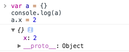
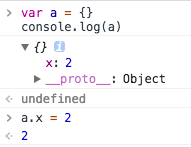
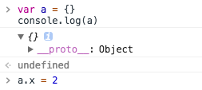

# console.log(event)

[[toc]]

```html
<div class="ctn">
  <span class="inner">请点击这里</span>
</div>
```

```js
var div = document.querySelector('.ctn')
div.onclick = function (evt) {
  console.log(evt)
  console.log(evt.currentTarget)
}
```

运行上述代码，会发现，

`console.log(evt)`打印出来的对象里`currentTarget`为`null`

`console.log(evt.currentTarget)`打印出来的是外层的`div`

这里的疑问是，为什么`console.log(evt)`和`console.log(evt.currentTarget)`的结果不一样？

## event 对象

```js
var div = document.querySelector('.ctn')
var span = document.querySelector('.inner')
var event

span.onclick = function (evt) {
  event = evt
}
div.onclick = function (evt) {
  console.log(event === evt)  // true
}
```

运行以上代码，结果是为`true`，说明随着事件冒泡，`event`对象始终未变，变的是`event`对象里的属性。以`currentTarget`属性为例，在`div`的`click`事件处理函数里，`event.currentTarget`为`div`，在`span`的`click`事件处理函数里，`event.currentTarget`为`span`。

## console.log()

为了解开上面的疑问，先在浏览器控制台连续输入以下代码，最后按下 enter 查看打印出的值。

```js
> var a = {}
  console.log(a)
  a.x = 2
```



结果发现，即使`console.log(a)`在前，`a.x = 2`赋值在后，但是展开打印出来的 Obejct，发现值为`{ x: 2 }`。

这是怎么回事呢？

让我们继续做实验来寻找原因：分别在浏览器控制台里输入以下两组代码，观察结果。

```js
// 第一组
> var a = {}
  console.log(a)  // 输入此行后，按 enter 键（但是不展开打印出的对象），继续进行下面的输入
> a.x = 2  // 输入此行后，展开打印的对象，查看结果
```



```js
// 第二组
> var a = {}
  console.log(a)  // 输入此行后，按 enter 键并且展开打印出的对象后查看结果，最后继续进行下面的输入
> a.x = 2

```



以上两组代码完全相同，只是展开打印对象的时机不同：

- 第一组：在`console.log(a)`输入后按 enter 键，在`a.x = 2`输入后，展开打印出的对象
- 第二组：在`console.log(a)`输入后按 enter 键，并展开打印出的对象，最后输入`a.x = 2`

通过以上两组结果的对比，我们做出猜想：通过`console.log()`打印对象，展开对象时，获取的是该对象在当时的一个快照。

## 解疑

结合以上的基础，就可以解释为什么`console.log(evt)`和`console.log(evt.currentTarget)`的结果不一样了。

首先，事件冒泡到`div`元素时，`click`事件处理函数进行处理，此时`event.currentTarget`的值即为`div`

其次，在`div`元素的`click`事件处理函数里`console.log(evt)`，在我们在控制台展开`event`对象时，冒泡已经结束，此时`event`对象的`currentTarget`为`null`，我们获取的是冒泡结束时的`event`对象的快照，因此`evt`对象里的`currentTarget`为`null`

## 如何隐藏 console.log 打印信息时的源文件名称和行号？

Reference:

- [不打印出 console 信息出现在文件哪一行](https://github.com/justjavac/the-front-end-knowledge-you-may-not-know/issues/37#issuecomment-403216813)
- [Stack Overflow - How to hide source of Log messages in Console?](https://stackoverflow.com/questions/34762774/how-to-hide-source-of-log-messages-in-console)
