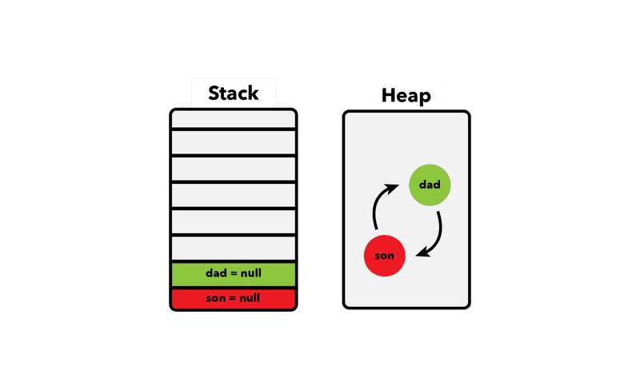

# JavaScript 执行机制

[[toc]]

PS:

- 该文章几乎所有的内容来自于[极客时间-浏览器工作原理与实践](https://time.geekbang.org/column/intro/216)
- 该文章里说的 JavaScript 执行机制指的是浏览器里的 JavaScript 执行机制。

JavaScript 会先编译再执行，经过编译后，会生成两部分内容：执行上下文（Execution context）和可执行代码。

- 函数只有在被调用的时候，才会被编译。

## 动态语言 & 弱类型语言

声明变量时定义其数据类型的语言称为静态语言；与之相反，在运行过程中需要检查数据类型的语言称为动态语言。

支持隐式类型转换的语言称为弱类型语言；不支持隐式类型转换的语言称为强类型语言。

JavaScript 是一种弱类型的、动态的语言。

- 弱类型，意味着你不需要告诉 JavaScript 引擎这个或那个变量是什么数据类型，JavaScript 引擎在运行代码的时候自己会计算出来。
- 动态，意味着你可以使用同一个变量保存不同类型的数据。


## 变量提升

变量提升（`hoisting`），是指在 JavaScript 代码执行过程中，JavaScript 引擎把变量的声明部分和函数的声明部分提升到代码开头的“行为”。变量被提升后，会给变量设置默认值`undefined`。

在变量提升过程中，

- 若声明了两个同名的函数，则最终生效的是最后声明的函数。
- 若声明的变量和函数同名，那么在编译阶段，变量的声明会被忽略。

### 为什么要设计变量提升

ES6 之前是不支持块级作用域的，因为当初设计这门语言的时候，并没有想到 JavaScript 会火起来，所以只是按照最简单的方式来设计。没有了块级作用域，再把作用域内部的变量统一提升无疑是最快速、最简单的设计，不过这也直接导致了函数中的变量无论是在哪里声明的，在编译阶段都会被提取到执行上下文的变量环境中，所以这些变量在整个函数体内部的任何地方都是能被访问的，这也就是 JavaScript 中的变量提升。变量提升所带来的问题

### this

`this`是和执行上下文绑定的，也就是说每个执行上下文中都有一个`this`。

- 全局执行上下文中的`this`指向`window`（浏览器里）
- 函数执行上下文中的`this`
  - （浏览器里）默认情况下调用函数时，函数内的`this`指向全局变量`window`；严格模式下，`this`为`undefined`
  - 调用函数的`call`/`apply`/`bind`方法可改变该函数的`this`指向，其将指向调用函数`call`/`apply`/`bind`方法时传入的第一个参数
  - 使用对象来调用对象上的方法时，该方法的`this`指向该对象
  - 通过`new`操作符调用构造函数时，构造函数内的`this`指向新创建的对象

```js
function foo() {
    var myName = "极客时间"
    let test1 = 1
    const test2 = 2
    var innerBar = {
        getName:function(){
            console.log(test1)
            return myName
        },
        setName:function(newName){
            myName = newName
        }
    }
    return innerBar
}
var bar = foo()
bar.setName("极客邦")
bar.getName()
console.log(bar.getName())
```

在 JavaScript 中，根据词法作用域的规则，内部函数总是可以访问其外部函数中声明的变量，当通过调用一个外部函数返回一个内部函数后，即使该外部函数已经执行结束了（且其执行上下文也已出栈了），但是内部函数引用外部函数的变量依然保存在内存中，我们就把这些变量的集合称为闭包。比如外部函数是`foo`，那么这些变量的集合（这里是`test1`和`myName`）就称为`foo`函数的闭包。

## 垃圾回收

- 标记清除（主流）
- 引用计数

JavaScript 的垃圾回收，指的是回收堆空间里的引用类型，而存储在栈里（调用栈的执行上下文）的原始类型，会在执行上下文销毁时直接回收的。

- [JavaScript's Memory Management Explained](https://felixgerschau.com/javascript-memory-management/)，这篇文章很清楚地说明了引用计数和标记清除。

### 引用计数（旧版 IE 4-6）

引用计数可能会导致内存泄露，比如几个对象间的循环引用，即使最后将这几个对象的引用（位于栈内存）都从执行上下文里的移除，但是这些处于堆内存里的对象仍然相互引用。理论上这时候这几个循环引用的对象都是可以回收的，因为外部已经无法访问到他们。但是用引用计数来做垃圾回收时，这几个对象还被引用着导致不能收回。所以，引用计数可能会导致内存泄露。

```js
let son = {
  name: 'John',
};

let dad = {
  name: 'Johnson',
}

son.dad = dad;
dad.son = son;

son = null;
dad = null;
```



### 标记清除（Mark-and-Sweep）（主流）

> The most popular form of garbage collection for JavaScript is called mark-and-sweep. When a variable comes into context, such as when a variable is declared inside a function, it is flagged as being in context. Variables that are in context, logically, should never have their memory freed, because they may be used as long as execution continues in that context. When a variable goes out of context, it is also flagged as being out of context. Variables can be flagged in any number of ways. There may be a specific bit that is flipped when a variable is in context, or there may be an “in-context” variable list and an “out-of-context” variable list between which variables are moved. The implementation of the flagging is unimportant; it's really the theory that is key.
>
> When the garbage collector runs, it marks all variables stored in memory (once again, in any number of ways). It then clears its mark off of variables that are in context and variables that are referenced by in-context variables. The variables that are marked after that are considered ready for deletion, because they can’t be reached by any in-context variables. The garbage collector then does a memory sweep, destroying each of the marked values and reclaiming the memory associated with them. As of 2008, Internet Explorer, Firefox, Opera, Chrome, and Safari all use mark-and-sweep garbage collection (or variations thereof) in their JavaScript implementations, though the timing of garbage collection differs.
>
> -- JavaScript 高级程序设计 第三版 P78 垃圾收集

标记清除可以解决循环引用的问题，它将检测对象是否可以从根对象（浏览器里是`window`对象，Node.js 里是`global`对象）触达到，以取代引用计数那种仅仅计算对对象的引用次数。

标记清除算法将不可触发的对象标记为垃圾，并在之后回收它们。根对象将永不回收。这种方式将解决循环引用问题。

### 造成内存泄漏的原因

- 全局作用域里定义的全局变量

```js
user = getUser();
var secondUser = getUser();
function getUser() {
  return 'user';
}
```

`user`、`secondUser`和`getUser`都是绑定到全局`window`对象上的全局变量。通过添加严格模式，你可以避免隐式声明`user`这样的全局变量。

- 遗忘的定时器和事件处理函数

```js
const object = {};
const intervalId = setInterval(function() {
  // everything used in here can't be collected
  // until the interval is cleared
  doSomething(object);
}, 2000);

// 当你不再需要定时器时，记得要清理掉
// clearInterval(intervalId);
```

这种情况经常发生的 SPA，尽管你已经导航到 SPA 里的另一个路由，定时器仍然会在后台运行。

```js
const element = document.getElementById('button');
const onClick = () => alert('hi');

element.addEventListener('click', onClick);

// 事件处理函数，也是如此，如果在离开页面时不移除掉，下次进入该页面会新增一个事件处理函数
// element.removeEventListener('click', onClick);
// element.parentNode.removeChild(element);
```

- 遗忘了 JavaScript 对 DOM 的引用

```js
const elements = [];
const element = document.getElementById('button');
elements.push(element);

function removeAllElements() {
  elements.forEach((item, index) => {
    document.body.removeChild(document.getElementById(item.id));
    // 将 DOM 对象从 JavaScript 数组里移除
    elements.splice(index, 1);
  });
  // 或者这样移除
  elements.length = 0;
}
```

若是将 DOM 对象存储在 JavaScript 对象里，当将 DOM 节点移除时，也要将 DOM 对象从 JavaScript 对象里移除。

以下的这些点都是很久以前的内容，可能已经不太实用。

- 循环引用（ IE9 之前的浏览器里 BOM 和 DOM 中的对象是以 COM 对象的形式出现的，而 COM 对象的垃圾收集机制采用的就是引用计数策略，相关知识参见 JavaScript 高级程序设计 第三版 P78 垃圾收集）
- 内部函数引用（闭包）
- 页面交叉泄漏
- 貌似泄漏

## V8 执行 JavaScript 代码的过程

V8 执行 JavaScript 代码的过程:

- 将 JavaScript 源码转换为 AST（抽象语法树）和执行上下文
  - 先生成 AST
    - 词法分析
    - 语法分析
  - 基于 AST，生成执行上下文
- 解释器（Ignition）基于 AST 生成字节码
- 解释器解释执行字节码 & 编译器（TurboFan）编译热点代码
  - 针对常规的字节码，解释器逐条解释执行（其实最终也要编译成机器码执行）
  - 针对活跃的字节码（即重复执行多次的热点代码），编译器会将该段字节码编译为更加高效的机器码，下次就不需要再将该段字节码编译为机器码了

字节码占用内存小，但执行速度慢（因为字节码最终还是要编译成机器码才能执行）；机器码占用内存大，但执行速度快。

若是将 AST 直接全部转换成机器码，则内存占用将过大。因此先将 AST 转换为占用内存更小的字节码，解释执行字节码时，再将字节码逐条编译成机器码执行。且针对活跃的字节码，编译器会将其编译成机器码，加快执行效率（当然也会占用更多内存）。


因此 V8 是综合使用了编译器和解释器来权衡内存占用和执行效率。

- 为什么不在打包时就将 JavaScript 源码转换成字节码，浏览器下载字节码文件后解释执行字节码呢？

转换后的字节码比源码体积大很多，下载字节码文件会增加加载时间，得不偿失。

- 既然字节码最终都会编译成机器码，为什么还要先转换成字节码呢？

个人理解：在逐条解释执行字节码时，仅是针对单条字节码编译成机器码，执行后之后就释放内存，再将下一条字节码编译成机器码执行，因此可以重复使用同一块内存空间。

## 疑问

### 块级作用域里声明函数

```js
debugger;
(function(){
    console.log('g:', g);
    if(true){
        console.log('hello world');
        function g(){ return true; }
    }
})();
```

执行以上代码会发现，`g`打印出来的值是`undefined`。这是为什么呢？

ECMAScript 里规定函数不能在块级作用域中声明。也就是说，下面这段代码执行会报错，但是各大浏览器都没有遵守这个标准。

```js
function foo(){
    if(true){
        console.log('hello world');
        function g(){ return true; }
    }
}
```

接下来到了 ES6 了，ES6 明确支持块级作用域，ES6 规定块级作用域内部声明的函数，和通过`let`声明变量的行为类似。

规定的是理想的，但是还要照顾实现，要是完全按照`let`的方式来修订，会影响到以前老的代码，所以为了向下兼容，各大浏览器基本是按照下面的方式来实现的：

```js
function foo(){
    if(true){
        console.log('hello world');
        var g = function(){return true;}
    }
}
```

这就解释了`g`打印出来的值为什么是`undefined`，不过还是不建议在块级作用域中定义函数，很多时候，简单的才是最好的。
