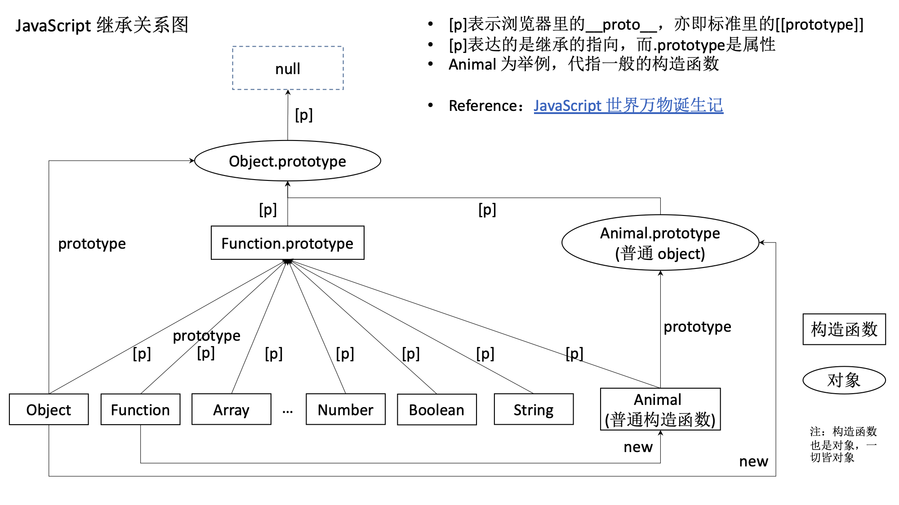

# 原型-prototype

[[toc]]

## 原型关系图



## 关于 instanceof

```js
obj instanceof Fn;
```

> 实际上`instanceof`运算符并不会检查`obj`是否是由`Fn()`构造函数初始化而来，而会检查`obj`是否继承自 Fn.prototype 。
-- 《JavaScript 权威指南 第3版》P205

```js
function FirstSon() {
}
function SecondSon() {
}
function Father () {
}
var father = new Father();
FirstSon.prototype = father;
SecondSon.prototype = father;
var firstSon = new FirstSon();

console.log(firstSon instanceof SecondSon);  // true
console.log(firstSon instanceof Father);     // true
```

这也说明，`instanceof`操作符要检测操作符右边的构造函数是否位于操作符右边对象的原型链上。

## Object.getPrototypeOf() 和 Function.prototype

构造函数`fn`的原型，即构造函数`fn`的`protoype`属性`fn.prototype`，仅当函数`fn`作为构造函数时，`fn.prototype`才有存在的意思，`fn.prototype`存在默认值，但可以被改写。

每个对象都会有个内置的`__proto__`属性（非标准），ES5 提供了`Object.getPrototypeOf()`方法来获取对象上的`__proto__`属性，该属性指向产生该对象的构造函数的`prototype`属性，比如`var obj = new Object()`, 这里`Object.getPrototypeOf(obj)`的值即为`Object.prototype`。

```js
function Super() {}
var superInstance = new Super();
var Sub = new Function();
Sub.prototype = superInstance;
Object.getPrototypeOf(superInstance) === Super.prototype;  // true
Object.getPrototypeOf(Sub) === Function.prototype;             // true
Sub.prototype === superInstance;                           // true
Sub.prototype === Object.getPrototypeOf(Sub);              // false
```

## 继承

### 借用构造函数

### 原型式继承

### 组合继承

```js
function SuperType(name) {
    this.name = name;
    this.colors = ["red", "blue", "green"];
}

SuperType.prototype.sayName = function () {
    alert(this.name);
};

function SubType(name, age) {
    //继承属性 SuperType.call(this, name);
    this.age = age;
}

//继承方法
SubType.prototype = new SuperType();
SubType.prototype.constructor = SubType;
SubType.prototype.sayAge = function () {
    alert(this.age);
};
```

### 寄生式继承

### 寄生组合继承
