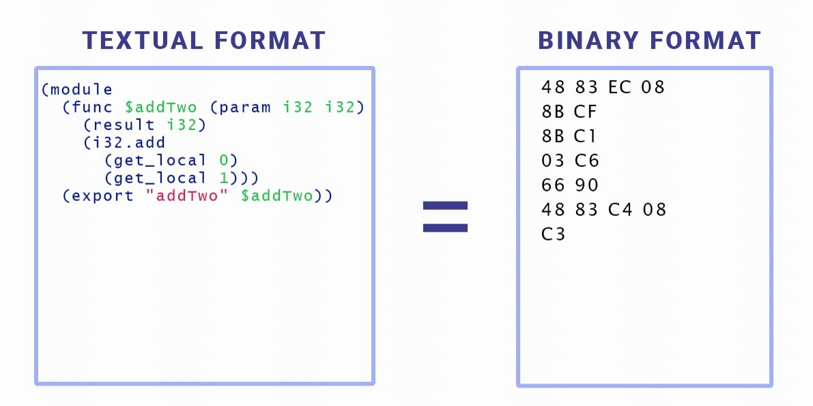
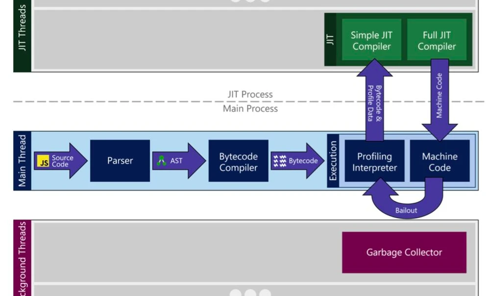

# WebAssemply

## 什么是 WebAssemply？

- WebAssembly 是一种低层的二进制格式代码，体积小，因此加载和执行速度快，可以在网络上获得更好的性能。
- WebAssembly 具有易于阅读的文本格式（`.wat`），但实际提供给浏览器（`.wasm`）的内容是二进制格式。
- 你不需要直接编写 WebAssemply，WebAssembly 允许将 C、C++、Typescript 或 Rust 代码编译成 WebAssembly 模块（WebAssembly 是强制静态类型语言），可以在 Web 应用中加载并通过 JavaScript 调用，因此可以使客户端应用程序能够以接近本地的性能在 Web 上运行。
- WebAssembly 代码驻留在`.wasm`文件中，这个文件应该被编译成特定于它所运行的机器的机器码。
- WebAssembly 文件里的内容类似于字节码，但是 WebAssembly 是跨平台的，最终由浏览器来将其编译为不同处理器架构需要的机器码

## WebAssemply 与汇编语言的关系？

- Assembly（汇编）是一种低级编程语言，它与体系结构的机器级指令有着非常密切的联系。换句话说，它只需一个进程就可以转换为机器可以理解的代码，即机器代码（Machine Code）。此转换过程称为汇编。
- WebAssembly 可以简称为 Web 的汇编。它是一种类似于汇编语言的低级语言。但 WebAssembly 并不完全是一种汇编语言，因为 WebAssembly 并不适配特定机器，只适配浏览器。当浏览器下载 WebAssembly 代码时，可以快速将其转换为任何机器的汇编。

## WebAssemply 与 JavaScript 的关系？

以上是 Microsoft Edge 浏览器的 JavaScript 引擎 ChakraCore 的结构。

- JavaScript 源码会进入 Parser，Parser 会把代码转化成 AST（抽象语法树）
- 根据抽象语法树，Bytecode Compiler 字节码编译器会生成引擎能够直接阅读、执行的字节码
- 字节码进入翻译器，将字节码一行一行的翻译成效率十分高的 Machine Code

在 JavaScript 运行的过程中，JavaScript 引擎会对执行次数较多的 JavaScript 函数进行优化，JavaScript 引擎将其代码编译成 Machine Code 后打包送到顶部的 Just-In-Time(JIT) Compiler，下次再执行这个函数时就会直接执行编译好的 Machine Code。但是由于 JavaScript 的动态变量，上一秒可能是 Array，下一秒就变成了 Object。那么上一次引擎所做的优化，就失去了作用，此时又要再一次进行优化（JavaScript 引擎会根据字节码里的反馈向量来判断类型，进而判断是直接使用 Machine Code 还是再编译成字节码）。

JavaScript 源码要经过 Parser，要经过 ByteCode Compiler，而这两步是 JavaScript 代码在引擎执行过程当中消耗时间最多的两步。而 WebAssembly 不用经过这两步。这就是 WebAssembly 更快的原因。

WebAssembly 是被设计成 JavaScript 的一个完善、补充，而不是一个替代品。WebAssembly 将很多编程语言带到了 Web 中。但是 JavaScript 因其不可思议的能力，仍然将保留现有的地位。

## 字节码

- 字节码是一种运行于某种虚拟机中的，更抽象的汇编
- 字节码是机器代码的抽象
- 不同 JavaScript 引擎有不同的字节码，但某个引擎的字节码是跨平台的

参考：

- [理解 V8 的字节码「译」](https://zhuanlan.zhihu.com/p/28590489)

## 参考

- [WebAssembly 完全入门：了解 wasm 的前世今身](https://www.infoq.cn/article/lwlcldgjyc7lye95ewl8)
- [WebAssembly 简介](https://zhuanlan.zhihu.com/p/42718990)
