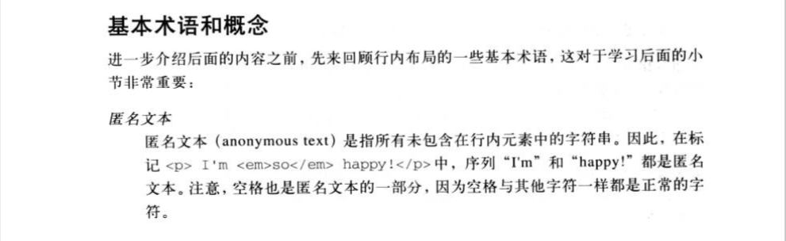
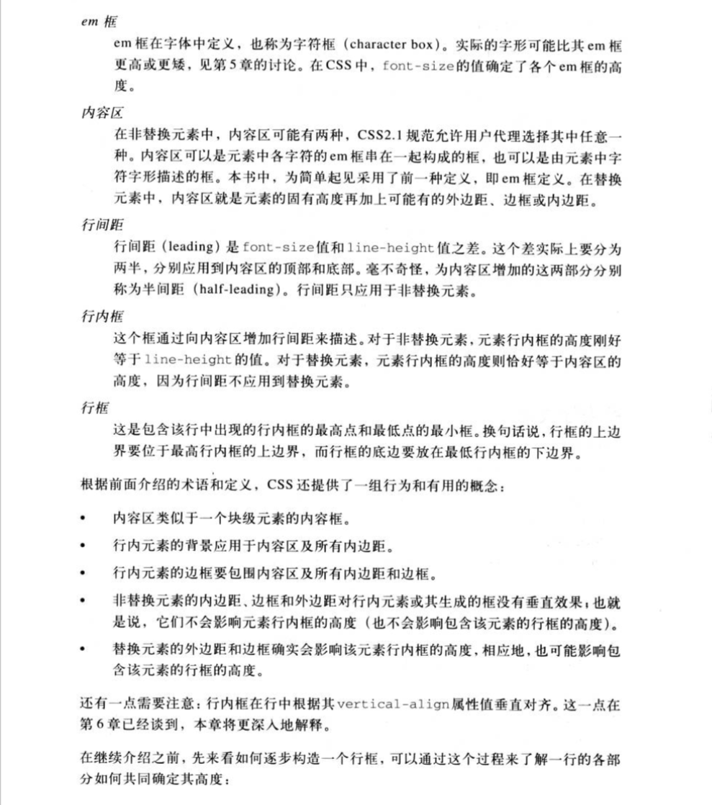
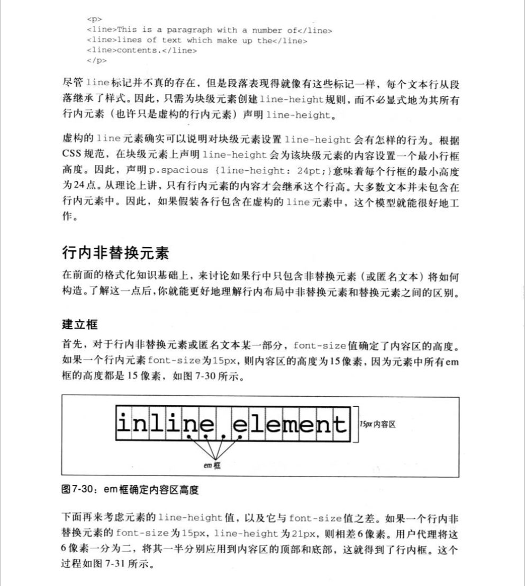
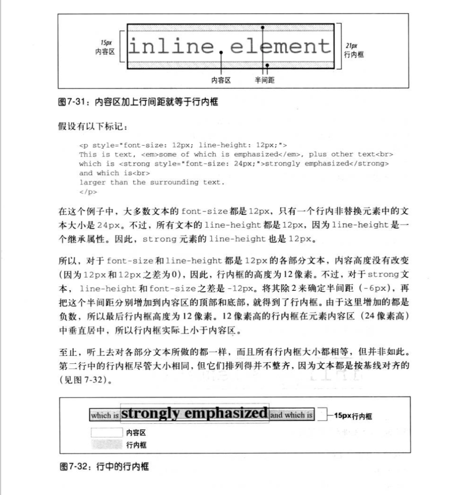
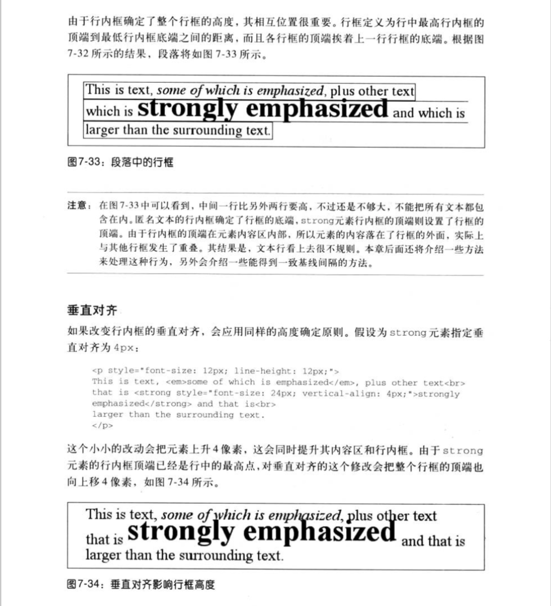
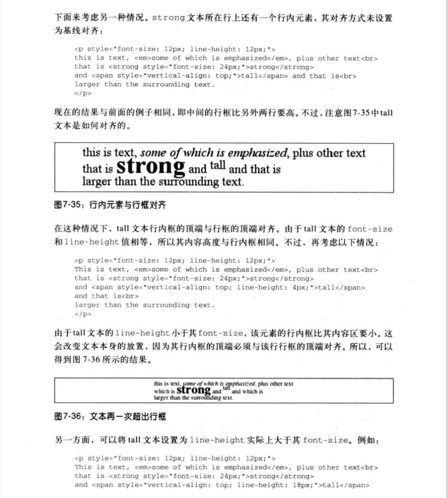

# IFC

[[toc]]

## 行框、行内框

行框：包含该行中出现的行内框的最高点和最低点的最小框。换句话说，行框的上边界要位于最高行内框的上边界，而行框的底边要放在最低行内框的下边界。

需要注意的是，行内元素的`vertical-align`属性会最终影响到行框的高度。

### 非替换元素的行内框

行内非替换元素的高度，由`line-height`确定，元素的背景也是在`line-height`高度的区域内，但是最终的位置将由`line-height`和`font-size`共同确定。

非替换元素行内框高度确定：得到行内非替换元素及不属于后代行内元素的所有文本的`font-size`值和`line-height`值，再将`line-height`将去`font-size`，这就得到了框的行间距。这个间距除以`2`，将其一半分别应用到`em`框的顶部和底部。

### 替换元素的行内框

替换元素的行内框高度包括：内容、内边距、边框、外边距。

替换元素的`line-height`对行内框没有影响，但是可能会影响到替换元素的垂直对齐，因为`vertical-align`的值若是百分比，是相当于`line-height`的。

替换元素没有`baseline`，但是其行内框的下边界即下外边距边界会与行框的基线对齐，因此，可认为替换元素的`baseline`为行内框的下边界即下外边距边界。
