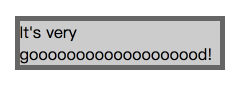
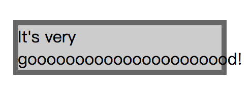
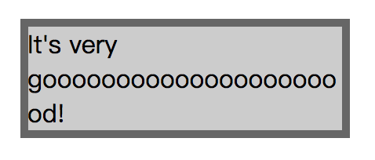
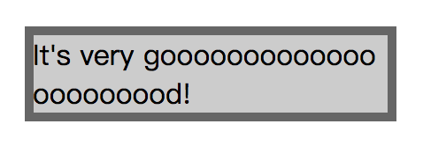
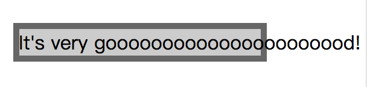

# 文本换行和省略

[[toc]]

## 文本换行

### 单词换行（word-wrap）

`word-wrap`属性用来表明，是否允许浏览器在单词内进行断句，以防止某个字符串太长而找不到它的自然断句点时产生溢出。

/* 关键字值 */
word-wrap: normal;
word-wrap: break-word;

“关键字”值 | 说明
--- | ---
`normal` | 表示在正常的单词结束处换行
`break-word` | 表示如果行内没有多余的地方容纳该单词到结尾，则那些正常的不能被分割的单词会被强制分割换行

此外，`word-wrap`还有几个全局值：

- `inherit`
- `initial`
- `unset`

> 注：`word-wrap`属性原本属于微软的一个私有属性，在 CSS3 现在的文本规范草案中已经被重名为`overflow-wrap`。`word-wrap`现在被当作`overflow-wrap`的 “别名”。 稳定的谷歌 Chrome 和 Opera 浏览器版本支持这种新语法。

### 单词折断（word-break）

`word-break`用来表明，如果一个单词过长而不能在一行剩余的空间完全显示时，是否允许在折断单词来换行，以及如何换行。

其“关键字”值主要有：

“关键字”值 | 说明
--- | ---
`normal` | 使用默认的换行规则，即 CJK 单词换行，非 CJK 单词不换行
`break-all` | 允许任意非 CJK（Chinese/Japanese/Korean）文本间的单词断行，不管 CJK 还是非 CJK 的单词都换行
`keep-all` | 不允许 CJK（Chinese/Japanese/Korean）文本中的单词换行，只能在半角空格或连字符处换行。非 CJK 文本的行为实际上和`normal`一致。即不管 CJK 还是非 CJK 的单词，都不换行

此外，`word-break`还有几个全局值：

- `inherit`
- `initial`
- `unset`

### 示例

#### word-wrap 与 word-break 默认值

```css
{
  word-break: normal;
  word-wrap: normal;
}
```



情况一：新的一行可以容纳单词



情况二：新的一行无法容纳单词

可见，默认行为里，若是单词过长，一行剩余的空间不足以放置该单词时，该单词将不会在单词内折行，且会新启用一行来显示完整的单词。但是当新的一行的长度仍无法容纳该单词时，该单词只能溢出。

#### word-wrap: break-word

在情况二的基础上，我们仅添加`word-wrap: break-word`。



情况三：新的一行无法容纳单词，折行显示

如此可见，`word-wrap: break-word`的作用是：若是单词过长，一行剩余的空间不足以放置该单词时，将先尝试新启用一行来显示完整的单词；若新的一行的长度仍无法容纳该单词时，该单词将在单词内折行。

#### word-break:break-all

在添加了`word-wrap: break-word`之后的情况三里，我们发现第一行`It's very`后面剩余大量的空间闲置着，这种情况有时候并不是我们想要的。

在情况二的基础上，我们仅添加`word-break:break-all`。这时我们发现，相比`word-wrap: break-word`新启用一行显示单词不够显示的话再折断单词换行，`word-break:break-all`直接在原来那一行的基础上直接将单词断行，不留一点儿闲置的空间。



情况四：在原行基础上直接在折断单词换行

#### white-space: nowrap

再来看最后一种情况，`white-space`属性是用来设置如何处理元素中的空白。而`nowrap`的效果是：连续的空白符会被合并，但文本内的换行无效。简单说就是，无论如何都不让你换行。我们继续在情况二基础上，添加`white-space: nowrap`



情况五：只一行显示，不换行

## Reference

- [你真的了解word-wrap和word-break的区别吗？](http://www.cnblogs.com/2050/archive/2012/08/10/2632256.html)
- [word-break - MDN（有清晰易懂的实例哦）](https://developer.mozilla.org/zh-CN/docs/Web/CSS/word-break)
- [张鑫旭 - word-break:break-all和word-wrap:break-word的区别](https://www.zhangxinxu.com/wordpress/2015/11/diff-word-break-break-all-word-wrap-break-word/)
