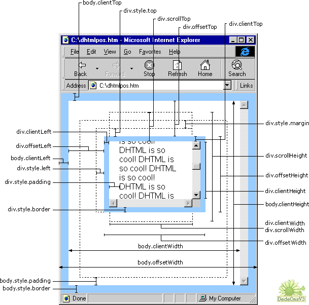

# 元素属性

[[toc]]

## 元素大小

### scrollWidth/scrollHeight

包含滚动内容的元素的大小。

有些元素如`<html>`元素，即使没有执行任何代码也能自动地添加滚动条；但另外一些元素，则需要通过 CSS 的
`overflow`属性进行设置才能滚动。

以下是 4 个与滚动大小相关的属性。

- `scrollWidth`：在没有滚动条的情况下，元素内容的总宽度。
- `scrollHeight`：在没有滚动条的情况下，元素内容的总高度。
- `scrollLeft`：被隐藏在内容区域左侧的像素数。通过设置这个属性可以改变元素的滚动位置。
- `scrollTop`：被隐藏在内容区域上方的像素数。通过设置这个属性可以改变元素的滚动位置。

### clientWidth/clientHeigh

元素内容及其内边距所占据的空间大小，不包括滚动条，不包括隐藏的区域

### offsetWidth/offsetHeight

包括元素在屏幕上占用的所有可见的空间。

元素的可见大小由其高度、宽度决定，包括所有内边距、滚动条和边框大小（注意，不包括外边距）。

通过下列4 个属性可以取得元素的偏移量。

- `offsetWidth`：元素在水平方向上占用的空间大小，包括元素的宽度、（可见的）垂直滚动条的宽度、左边框宽度和右边框宽度。
- `offsetHeight`：元素在垂直方向上占用的空间大小，包括元素的高度、（可见的）水平滚动条的高度、上边框高度和下边框高度。
- `offsetLeft`：元素的左外边框至包含元素的左内边框之间的像素距离。
- `offsetTop`：元素的上外边框至包含元素的上内边框之间的像素距离。

其中，`offsetLeft`和 `offsetTop`属性与包含元素有关，包含元素的引用保存在`offsetParent`属性中。`offsetParent`属性不一定与`parentNode`的值相等。例如`td`元素的`offsetParent`是作为其祖先元素的`table`元素，因为`table`是在DOM层次中距`td`最近的一个具有大小的元素。

### 元素大小和位置

IE、Firefox 3+、Safari 4+、Opera 9.5 及Chrome 为每个元素都提供了一个`getBoundingClientRect()`方法。这个方法返回会一个矩形对象，包含 6 个属性：

- `width`、`height`：元素的高度和宽度
- `left`、`top`、`right`、`bottom`：元素相对于视口左上角的位置

内联元素可能跨越了多行，可能由多个矩形组成。`getClientRects()`方法获得一个只读的类数组对象，它的每一个元素类似于`getBoundingClientRect()`返回的矩形对象。--《JavaScript 权威指南（第6版）》P392

详见：[http://blog.csdn.net/freshlover/article/details/8985887](http://blog.csdn.net/freshlover/article/details/8985887)
