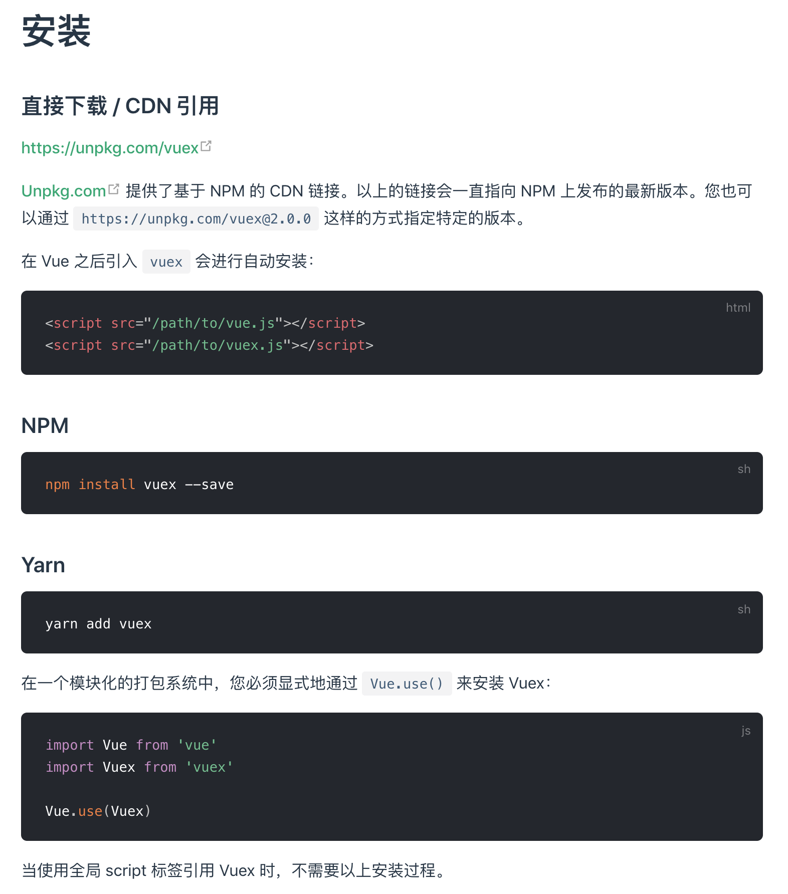

# Vue.use

`Vue.use`全局方法用于安装 Vue.js 插件，调用插件的`install`方法。若插件是个对象，则必须提供`install`方法；若插件是个函数，它会被当做`install`方法。

```js
// src/core/global-api/use.js
/* @flow */

import { toArray } from '../util/index'

export function initUse (Vue: GlobalAPI) {
  Vue.use = function (plugin: Function | Object) {
    const installedPlugins = (this._installedPlugins || (this._installedPlugins = []))
    if (installedPlugins.indexOf(plugin) > -1) {
      // 如果插件已经安装，则直接返回
      return this
    }

    // additional parameters
    const args = toArray(arguments, 1)
    args.unshift(this)
    if (typeof plugin.install === 'function') {
      plugin.install.apply(plugin, args)
    } else if (typeof plugin === 'function') {
      plugin.apply(null, args)
    }
    installedPlugins.push(plugin)
    return this
  }
}
```

## 为什么直接通过 script 标签引用插件就不需要调用 Vue.use

我们在使用 Vue.js 的插件如`vuex`、`vue-router`时，插件的官方文档里都有说到：若在一个模块化的打包系统中，您必须显式地通过`Vue.use()`来安装插件；当使用全局`<script>`标签引用插件时，则不需要通过`Vue.use()`来安装。比如`vuex`官网是这么说的：



那么，为什么在模块化打包系统里需要显式通过`Vue.use()`来安装插件，而使用全局`<script>`标签引用插件时则不需要呢？

原因是，插件内部做了判断：若是通过`<script>`标签引入的 Vue 和插件，则在插件所在的`<script>`执行时自动调用插件的`install`方法来安装插件（而手动调用`Vue.use()`也是为了调用插件的`install`方法来手动安装插件），因此不需要通过`Vue.use()`来安装插件。

这是如何实现的呢？

先看`vuex`里的[相关代码](https://github.com/vuejs/vuex/blob/4ebfaf98d081a4f698dacceb4cc797470e3ca7b9/src/store.js#L14):

```js
// ...
export class Store {
  constructor (options = {}) {
    // Auto install if it is not done yet and `window` has `Vue`.
    // To allow users to avoid auto-installation in some cases,
    // this code should be placed here. See #731
    if (!Vue && typeof window !== 'undefined' && window.Vue) {
      install(window.Vue)
    }
    // ...
  }
}
// ...
export function install (_Vue) {
  if (Vue && _Vue === Vue) {
    if (process.env.NODE_ENV !== 'production') {
      console.error(
        '[vuex] already installed. Vue.use(Vuex) should be called only once.'
      )
    }
    return
  }
  Vue = _Vue
  applyMixin(Vue)
}
```

`vuex`的源码里，当`vuex`未安装过且`window.Vue`存在，就会执行`install(window.Vue)`自动安装`vuex`插件。

而只有用`<script>`标签引入 Vue.js 时，`Vue`才会被注册为全局变量`window.Vue`。

而 Vue.js 源码在最终通过`rollup`构建为单个文件时，会有 Browser 版本、CommonJS 版本和 ES Modules 版本的区别。我们打开 Vue.js 源码里的构建文件并查看其中仅包含运行时的这三个不同版本的配置：

```js
// scripts/config.js
const builds = {
  // Runtime only (CommonJS). Used by bundlers e.g. Webpack & Browserify
  'web-runtime-cjs': {
    entry: resolve('web/entry-runtime.js'),
    dest: resolve('dist/vue.runtime.common.js'),
    format: 'cjs',
    banner
  },
  // Runtime only (ES Modules). Used by bundlers that support ES Modules,
  // e.g. Rollup & Webpack 2
  'web-runtime-esm': {
    entry: resolve('web/entry-runtime.js'),
    dest: resolve('dist/vue.runtime.esm.js'),
    format: 'es',
    banner
  },
  'web-runtime-dev': {
    entry: resolve('web/entry-runtime.js'),
    dest: resolve('dist/vue.runtime.js'),
    format: 'umd',
    env: 'development',
    banner
  }
  // ...
}
```

对于 Browser 版本最终输出的格式是`umd`，我们看下打出的包的内容：

```js
/*!
 * Vue.js v2.5.17-beta.0
 * (c) 2014-2018 Evan You
 * Released under the MIT License.
 */
(function (global, factory) {
  typeof exports === 'object' && typeof module !== 'undefined' ? module.exports = factory() :
  typeof define === 'function' && define.amd ? define(factory) :
  (global = global || self, global.Vue = factory());
}(this, function () { 'use strict';
  // ... Vue.js 源码
  return Vue;
}));
```

ES Modules 版本最终输出的格式是`es`，我们也看下打出的包的内容：

```js
/*!
 * Vue.js v2.5.17-beta.0
 * (c) 2014-2018 Evan You
 * Released under the MIT License.
 */
// ... Vue.js 源码
export default Vue;
```

同样的，CommonJS 版本最终输出的格式是`cjs`，我们也看下打出的包的内容：

```js
/*!
 * Vue.js v2.5.17-beta.0
 * (c) 2014-2018 Evan You
 * Released under the MIT License.
 */
'use strict';
// ... Vue.js 源码
module.exports = Vue;
```

对比下可以发现，只有 Browser 版本打包出的文件最终在浏览器里运行时会注册全局变量`window.Vue`，而 ES Modules 版本和 CommonJS 版本都不会注册。而直接用`<script>`标签引入的文件，就是 Browser 版本打出的包文件！

因此，当直接用`<script>`标签引入 Vue.js 时，会注册全局变量`window.Vue`，插件所在的`<script>`执行时判断到`window.Vue`存在且插件未注册过时，会调用`install(window.Vue)`进而自动注册插件。
