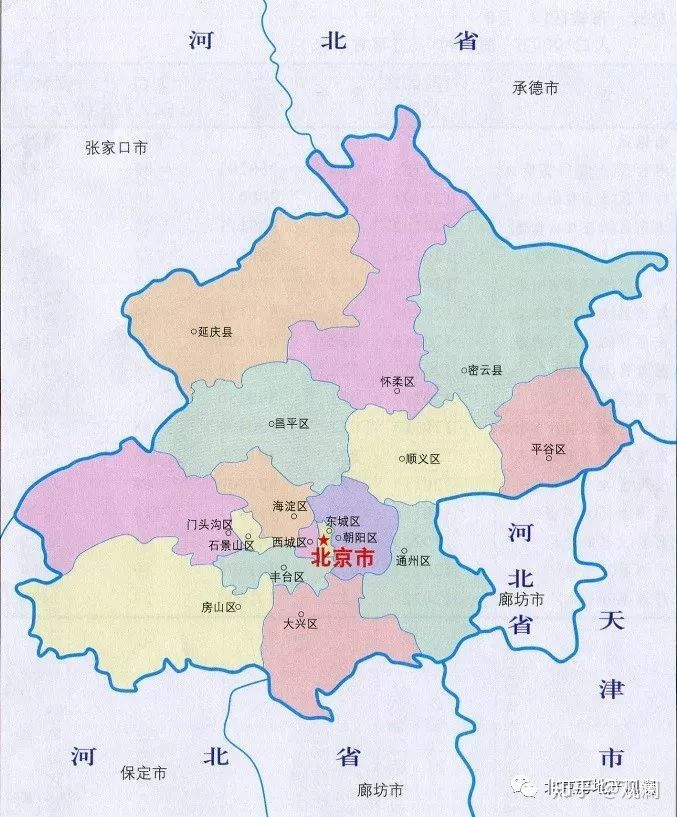
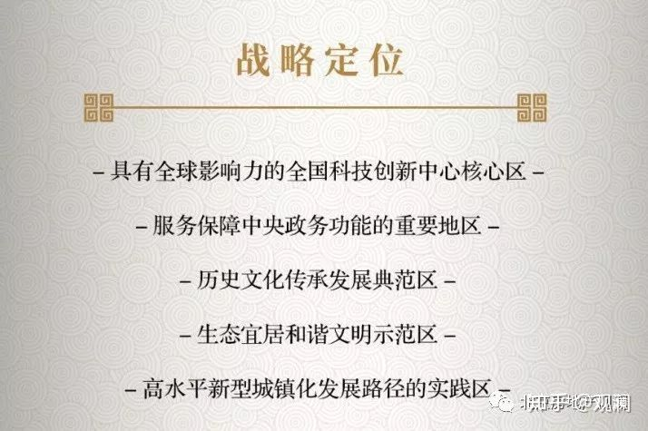
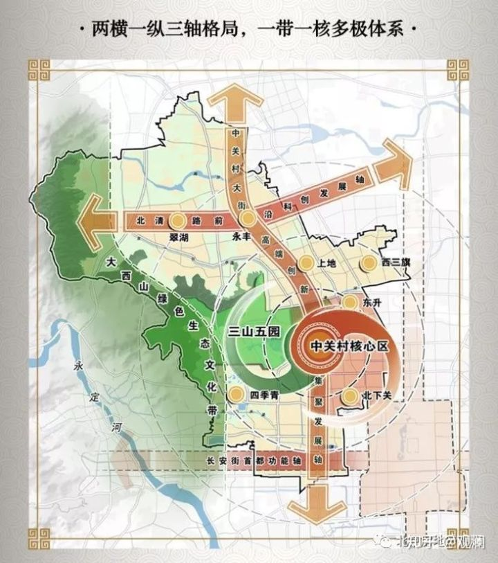
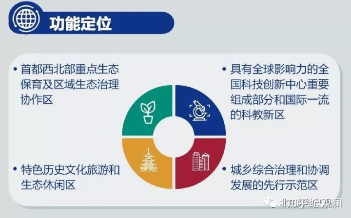
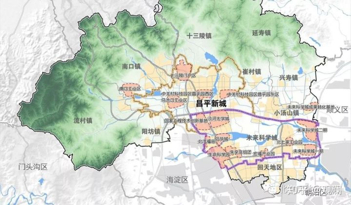

# 北京

[[toc]]

## 可考虑楼盘

- 西山锦绣府
- 萬橡华府/萬橡悦府

## 海淀

### 海淀区规划

发展目标-建设支撑首都中心定位的现代化国际化创新型宜居宜业城区

### 入学政策

#### 多校划片

从2019年1月1日起，在海淀区新登记并取得房屋不动产权证书的住房，用于申请入学的，将不再对应一所学校，实施多校划片。

多校划片就是一个小区对应多个小学初中，让买了学区房的家庭也不确定到底能上哪个学校，目的是通过这种方式为学区房降温，把就近入学落到实处。

#### 小学入学顺序

按照免试就近原则，凡年满6周岁（2012年8月31日以前出生）的适龄儿童，在海淀区申请入学，需满足下列条件之一：

1. 具有海淀区户籍；
2. 具有本市其他区户籍，实际居住在海淀区，其父母或其他法定监护人在海淀区具有本人的合法房产证明；
3. 具有本市其他区户籍的无房家庭，长期在海淀区工作、居住，符合在海淀区连续单独承租住房并实际居住3年以上，在北京市住房租赁监管平台登记备案，夫妻一方在海淀区合法稳定就业3年以上等条件，其适龄子女可在海淀区接受义务教育，根据区政府有关规定，通过居住地所在学区和相关部门的联合审核。
4. 非本市户籍适龄儿童，根据区政府有关规定，其父母或其他法定监护人需提供本人在京务工就业证明、在京实际住所居住证明、全家户口簿、北京市居住证（或有效期内居住登记卡）、户籍所在地街道办事处或乡镇人民政府出具的在当地没有监护条件的证明等相关材料，并通过居住地所在街道办事处或镇人民政府和相关部门的联合审核。

在北京，“人户合一”才能排在入学第一顺位。要想达到人户合一，就要符合：

- 孩子户口和爸爸妈妈在一起，并且户主是爸爸或者妈妈；
- 户口地址上的房产是孩子爸爸或者妈妈的，也就是户主和房产的名字是一样的；
- 从出生一直居住在户口对应的房产那里，可以忽略有的要求房产几年的要求；
- 符合你要上小学对应的片区。

## 昌平

### 昌平区规划

发展目标-建设科教引领、文旅融合、宜业宜居的生态城市。

