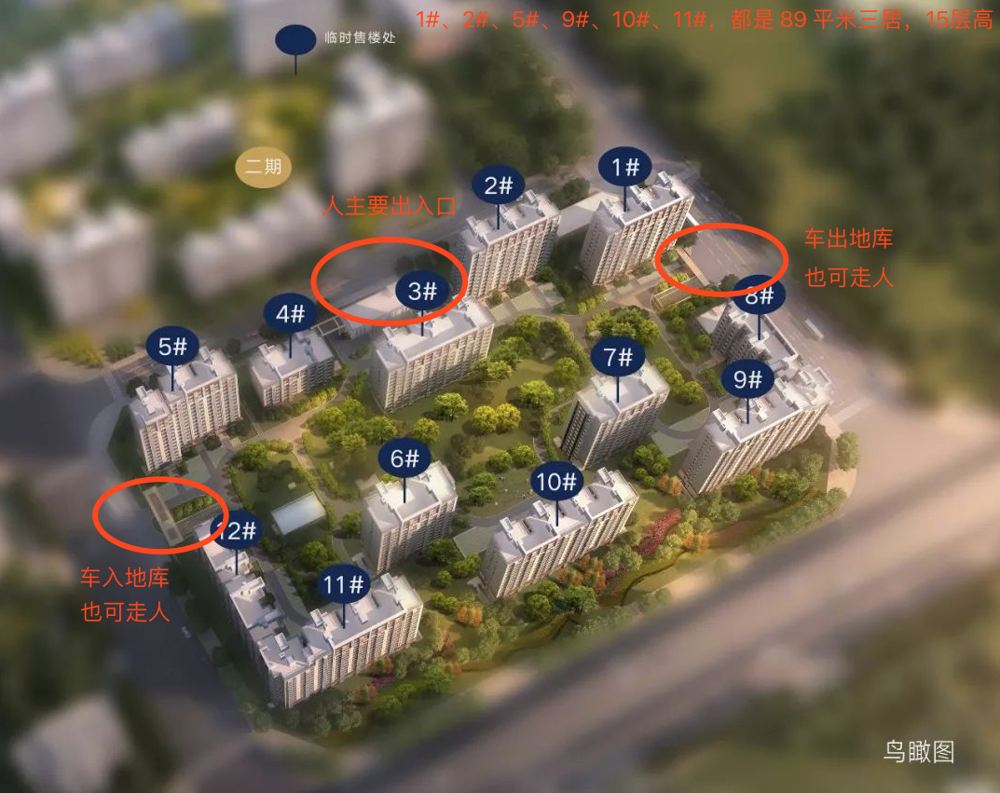
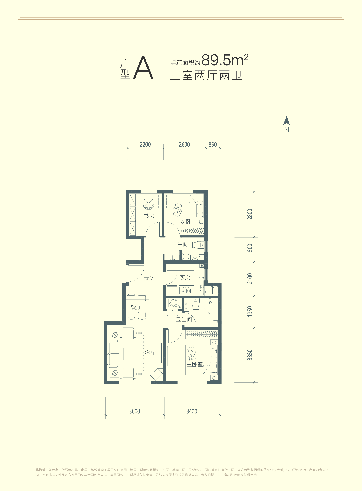
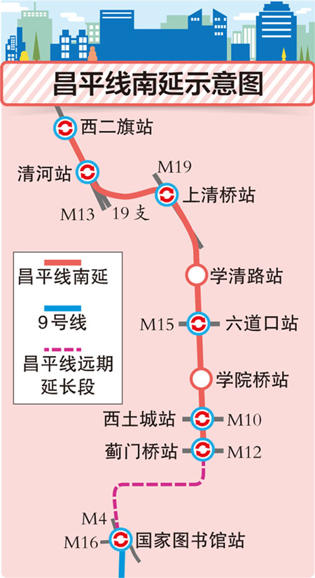
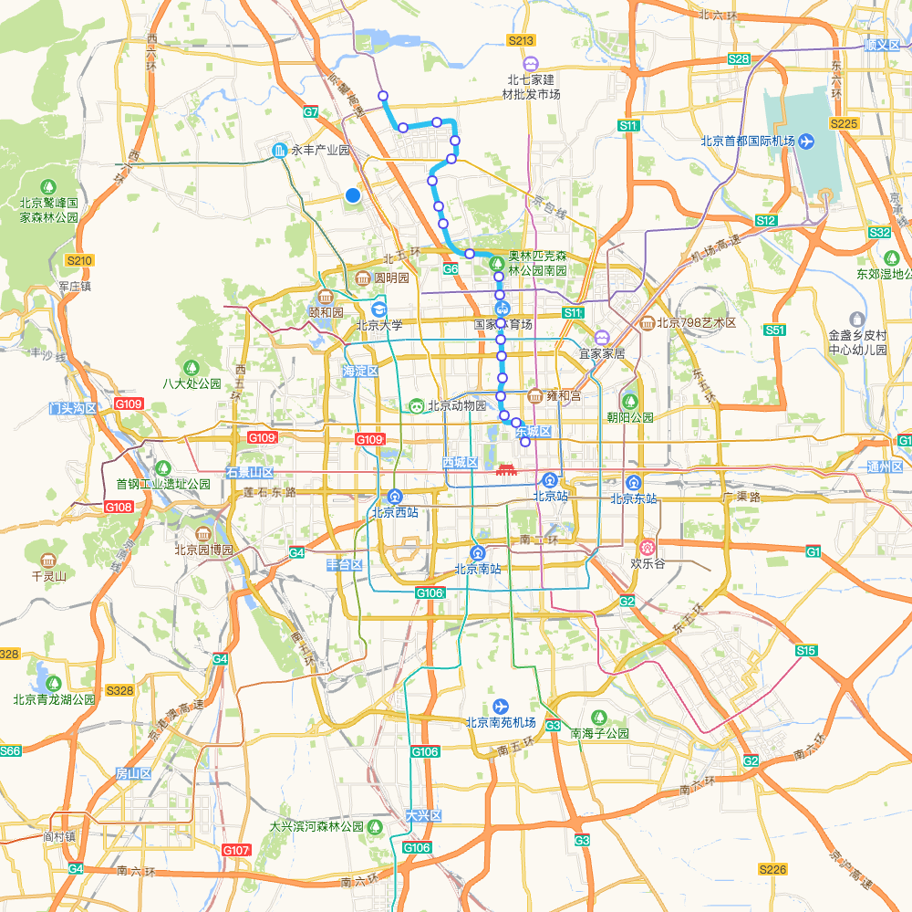
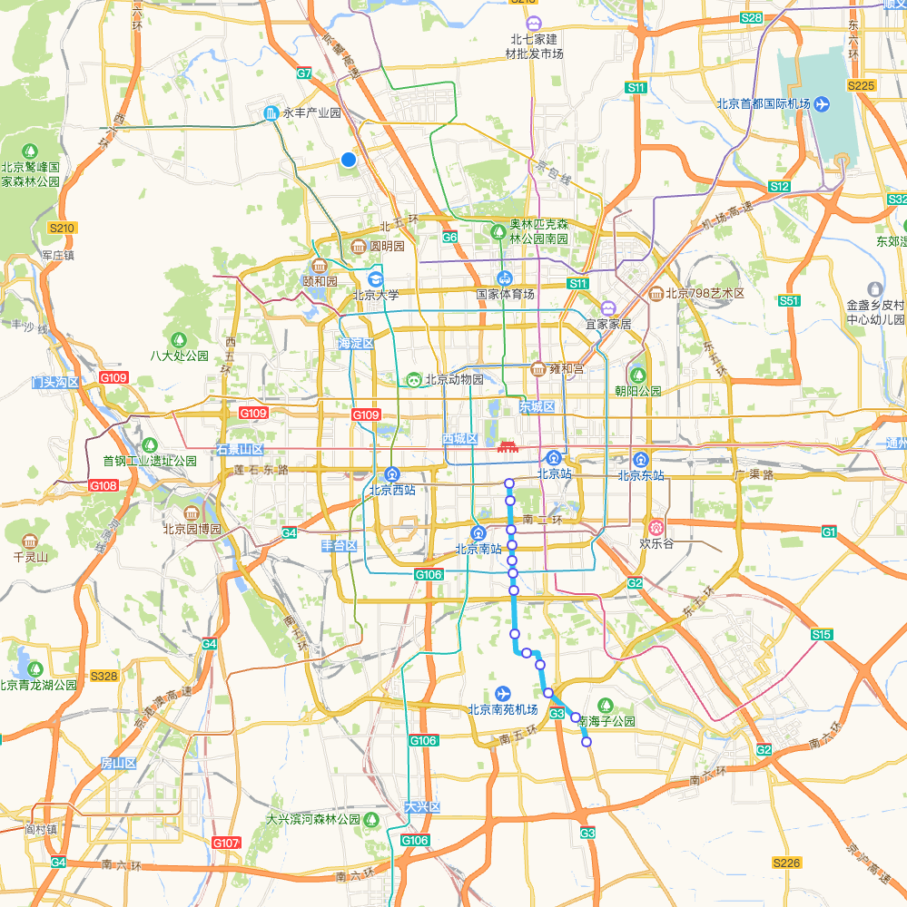

# 万象悦府

## 楼盘 & 户型

### 小区

- 一梯两户，15/18 层
- 容积率 2.5
- 绿化率30%
- 预计 2021 年底或 2022 年 3 月交房
- 物业，还未确定，大概率是华润自己的物业
- 车位配比，1:1

### 户型

- 89.5 米三室两厅两卫
- 南向面宽 7 米，客厅面宽 3.6 米
- 得房率：76~78%
- 精装，包含新风除霾系统
- 均价 5.4 万，约 486 万

## 交通

- 地铁朱辛庄站，500 米
  - 昌平线，现在终点是西二旗，但即将南延至蓟门桥站（北三环），预计 2020 年底竣工。
  - 8 号线
    - 北段：起点站，朱辛庄站 <=> 中国美术馆。
    - 南段：珠市口 <=> 瀛海，后期可能会与北段连通，那时 8 号线将是一条贯穿正南正北的地铁线。
  - 31 号线（规划中）

## 教育配套

- 北边 2.2 公里七里渠中心小学、2.5 公里豆各庄小学
- 南边 3 公里左右，华北电力附小、附中
- 东边 1.4 公里，西城区育华中学
- 最重要的是，万橡悦府二期东侧规划有幼儿园，项目北侧规划有教育用地将建 12 年制学校。据说，当地政府目前已开始接洽中关村三小、清华附中、101 等一流一类的学校，但最终确定什么学校、什么时候开建都是未知数。
  - 小学可能是中关村三小（全新师资，非挂名）
  - 中学可能是 101 中学（全新师资，非挂名）

## 商业配套

- 地铁旁 4 万平米的 TBD 住总万科天地

## 医疗配套

- 北大国际医院
- 积水潭医院

## 缺点

- 昌平区，非城六区
- 北清路噪音
- 得房率低
- 商业配套弱