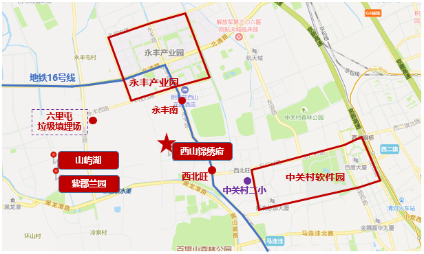
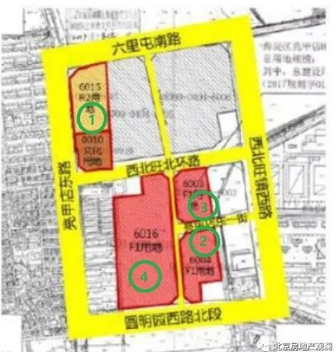
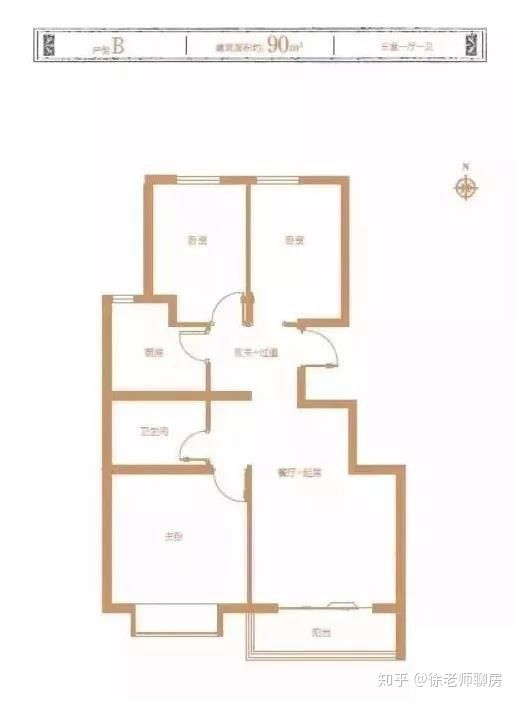
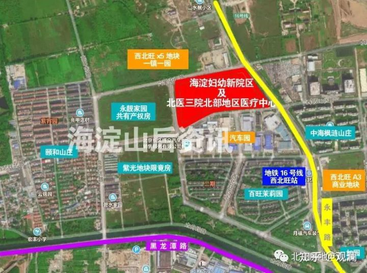

# 西山锦绣府

## 楼盘基本信息

- 限竞房，限价 58622 元/平米，最高销售单价不得超过 61554 元/平米
- 容积率 1.9
- 绿化率 30%
- 项目预计将分5期开发。交付日期预计从2021年底到2023年6月份。其中一期二期建设时间较早，体量也是最大的，预计有700余套。

### 进度

紫光的《建设方案》已经透露了一些信息，我们一起来看一看。

整个地块将分成5期建设，其中有4期是包含了住宅，交付日期从2021年底到2023年6月份。

一期建设住宅建筑面积34706.48平方米，建设位置为6015地块，计划建设时间2019年03月01日至2021年12月20日；

二期建设住宅建筑面积30524.10平方米，建设位置为6004地块，计划建设时间2019年03月15日至2021年12月20日；

三期建设住宅建筑面积13783.42平方米，建设位置为6003地块，计划建设时间2021年12月21日至2022年08月31日。

四期建设没有住宅，主要是文化设施和车库，略过。

五期建设住宅建筑面积60658.76平方米，建设位置为6016地块，计划建设时间2022年09月01日至2023年06月30日。这也住宅面积最大的一期，也会卖得比较晚。

预计一期和二期建设的住宅部分会先期开售，由于地块是要执行70/90要求的，如果平均按照90平米/每套来计算，一期二期建设的住宅应该有700余套。当然，预计是紫光内部优先选购。

## 优势

### 区域

- 位于海淀区，教育天然优势
- 中关村软件园近，距离百度/腾讯/网易/新浪仅 3.7 公里

### 交通

- 地铁: 距离 16 号线西北旺站 1 公里内
- 公交
  - 站点: 颐和山庄南口、颐和山庄
    - 449 路: 地铁上地站 <==> 永丰公交场站
    - 584 路: 颐和山庄 <==> 地铁北宫门站（4号线） <==> 颐和园 <==> 西苑（4、16号线） <==> 北大西门 <==> 中关村西、南 <==> 人大 <==> 大钟寺
    - 908 路: 土井村西口 <==> 百旺新城 <==> 屯佃大桥 <==> 苏家坨公交场站
    - 963 路: 龙域北街东口 <==> 地铁西二旗站（13号线、昌平线） <==> 中海枫涟山庄东门（西北旺站） <==> 龙泉驾校
  - 站点: 百旺新城
    - 333 路: 安宁庄东路南口 <==> 地铁西二旗站（13号线、昌平线） <==> 后厂村路 <==> 圆明园西路北口（16号线） <==> 农大西校区（16号线） <==> 西苑（4、16号线）
    - 等等

### 户型

90平米主力户型:

### 周边配套

#### 教育

#### 医院

小区旁边有:

- 北医三院北部医疗中心，三甲
- 是海淀妇幼新院区，三甲

#### 商业

- 西北旺地铁站的东侧A3地块（中海枫涟山庄对面），即将建设一个大型的商业综合体
- 中关村壹号，距离 3.7 公里

#### 环境绿化

- 南临百望山森林公园
- 北靠千亩翠湖湿地公园
- 京密引水渠

### 周边二手房价格

- （小区对面）百旺茉莉园，7.78万
- （1公里）中海枫涟山庄 8.5万/平米
- （1公里）万科如园 8.9万/平米
- （3公里）西山壹号院 10.3万/平米
- （2公里）保利西山林语 5.94万/平米

## 劣势

- 六里屯垃圾场
  - 运行了18年，已经基本饱和，2019年1月4日起六里屯垃圾场已不再填埋原生垃圾，只填埋炉渣。原生垃圾有臭味，炉渣没有臭味。
  - 以前填埋的原生垃圾如果发酵，仍会散发臭味，尤其是夏天高温或者雨后的情况下，会比较明显。海淀区已经在六里屯垃圾填埋场架设喷雾除臭墙，2019年初可以完工。
  - 垃圾填埋场的臭味从西北吹向东南，正好影响到西山锦绣府
  - 海淀区的垃圾现在全部在位于门头沟和海淀交界处的大工村垃圾焚烧发电厂集中焚烧处理，烧完的炉渣被运送回六里屯垃圾填埋场进行填埋处理。
  - 垃圾场对京密引水渠影响极小，海淀区定期检测水质表明水质都是合格的，而且，市政用水（自来水）现在也不是地下水。
  - 所以，综合来看，海淀区正在治理六里屯垃圾填埋场，封场+除臭同时进行，未来几年肯定是逐渐好转的。
- 限竞房：拿房本后五年内不得交易（即从现在起7年内不得交易）
