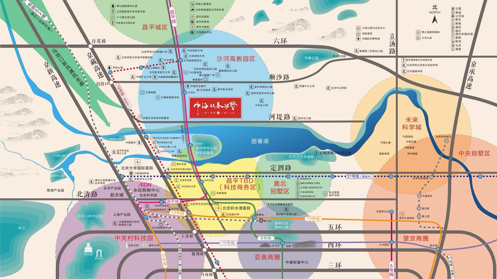

# 中海丽春湖墅

[[toc]]

## 优势

### 楼盘

- 户型
  - 六层洋房，一梯两户
  - 南北通透，明厨明卫，卫生间干湿分离
  - 主卧飘窗（赠送）、客厅内置阳台（算一半面积）、空调机位（赠送）
  - 客厅面宽 3.8 米
- 人车分流
- 容积率低：1.25
- 得房率高：不算赠送面积是 80%、算上赠送面积 86%
- 位于别墅区，左右两侧都是千万级别别墅
- 开发商、物业：中海

### 交通

- 地铁房
  - 昌平线：距离沙河站 600米，昌平线将南延（西二旗->清河->上清桥->学清路->六道口->学院桥->西土城）
  - 19号线（规划中）：（经沙河一站到沙河高教园站）沿着西二环内侧，贯穿南北、
  - 31号线（规划中）：（经沙河三站到生命科学园站）北部连接线，连通永丰科技园、回龙观、天通苑、未来科技城
- 公路
  - 南丰路：紧挨着，2020年完工，可达定泗路
  - 京藏高速：距离四五公里，可直达北三环

### 教育

大学云集，之后小学初中都会同步跟上吧？

小区自建幼儿园，北师附属幼儿园、小学、中学

- 外交学校（驾车 3.4 公里，步行 2.6 公里）
- 北京邮电大学沙河校区（驾车 3.4 公里，步行 2.7 公里）
- 北京航空航天大学沙河校区（驾车 3.5 公里，步行 3.2 公里）
- 北京师范大学新校区（驾车 5 公里，步行 4 公里）
- 中央财经大学沙河校区（驾车 5.2 公里，步行 4.4 公里）
- 中国矿业大学（北京）沙河校区（驾车、步行 4.8 公里）

### 自然环境

- 丽春湖（沙河水库）：紧邻，3500亩，丽春湖是该楼盘最大的卖点之一
- 滨河森林公园：隔河相望，走南丰路直达

### 配套商业

## 劣势

- 昌平区，比不上海淀区
- 限竞房：拿房本后五年内不得交易（即从现在起7年内不得交易）
- 地铁昌平线沙河站每天上下班极度拥挤
- 地铁噪声：紧挨着地铁，多少有些噪音（尽管有隔离）
- 现在周边管理混乱、城中村既视感
- 处于西北五六环之间，距离市区较远