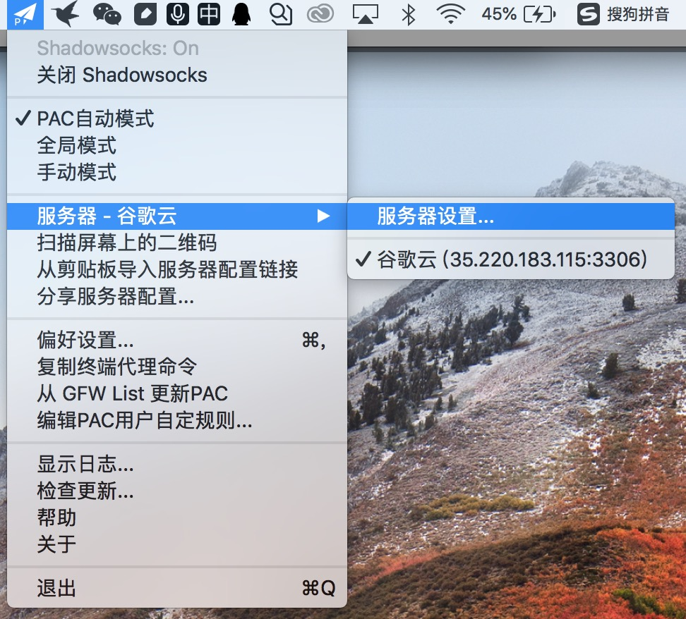
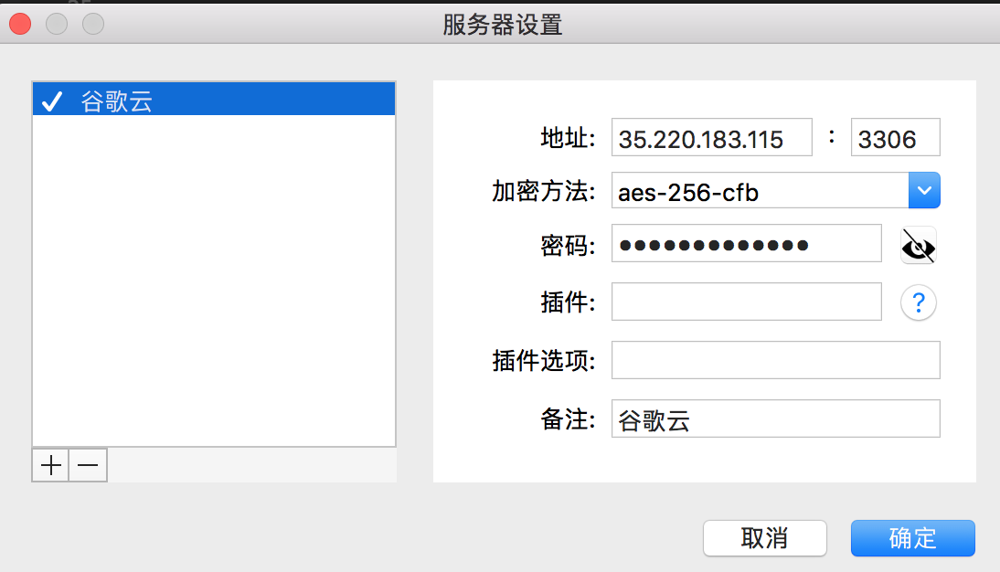

# 科学上网

[[toc]]

## 谷歌云 SSR

前提：

- 需要有短暂翻墙的网络环境，观看 Youtube 视频
- 需要有一张 VISA 或 万事达的信用卡

### 第一步，注册谷歌云账号

https://www.youtube.com/watch?v=xrbviAfagrU

从头开始观看该视频，大概看到 5'33’‘就可以结束了，需要并跟着后面操作，注册谷歌云账号。

注意点：

- 关于“选择地区”
  - 可以选择美国，此时对信用卡的预付款会用美元结算，信用卡要支持美元付款
  - 也可以选择香港，但是信用卡要支持港币付款
  - 大概会对信用卡进行 1 美元左右的预付款，之后交易会撤销，实际上不会花一分钱
- 关于“选择操作系统”
  - 在选择操作系统磁盘时，选择“Debian GNU/Linux 9 (stretch)”

谷歌云仅在首年赠送 300 美元，以后的每年想要再次赠送，可以参考：[重置300美金教程](https://www.youtube.com/watch?v=7zz1tuohVtI)

### 第二步，配置谷歌云代理服务器

https://www.youtube.com/watch?v=_cO9USrLFY0

跟随着视频里面一步一步做：

1. 配置好谷歌云上虚拟机实例
2. 在虚拟机上安装 shadowsocksR
3. 记录下 shadowsocksR 的相关结果（视频 6’50‘’ 显示的红色部分），这些信息在电脑上或手机上配置时需要使用到。
4. 配置端口号的防火墙规则

谷歌云搭建 SSR 命令：

1. 取得root权限，输入：sudo -i
2. 下载和设置SSR服务器端，输入：wget --no-check-certificate https://raw.githubusercontent.com/teddysun/shadowsocks_install/master/shadowsocksR.sh && chmod +x shadowsocksR.sh && ./shadowsocksR.sh

### 第三步，配置电脑/手机

#### 电脑

mac 上下载 ShadowsocksX-NG 软件，配置服务器信息

配置好在第二步的第 3 点保存的服务器信息，就可以科学上网啦！

##### iPhone

iPhone 上也要下载相关的 SSR 客户端，配置服务器信息。

但是，APP store 上的 SSR 客户端，能下载的需要收费；免费的客户端，大陆区域都被下架了，但是大陆之外的区域，可以下载。

可申请一个美国区域的 Apple ID，下载 FastSocks，再配置服务器信息，就可以科学上网啦~

## 美国区域的 Apple ID

大陆区域的 Apple ID，只能下载大陆区域的 APP，有时候想要下载一些美国区域的 APP，就没办法了。因此，我特地按教程[5分钟注册美国区Apple ID（18年亲测有效）](https://zhuanlan.zhihu.com/p/36574047)，申请了一个美国区域的 Apple ID。
